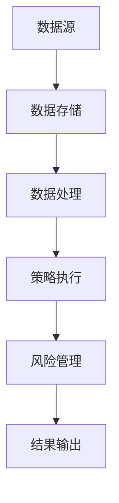
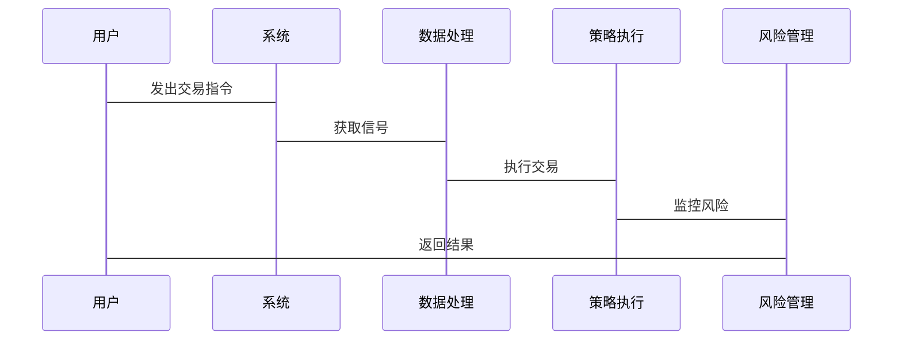

                 


# 如何将特价股票策略与另类投资结合

> 关键词：特价股票策略、另类投资、量化分析、风险管理、资产配置

> 摘要：本文详细探讨了如何将特价股票策略与另类投资相结合，通过量化分析和系统设计，构建高效的资产配置策略。文章从背景介绍、核心概念、算法原理、系统架构到实战案例，全面解析了这一结合的实现方法和优化路径。

---

## 第一部分：特价股票策略与另类投资的背景与基础

### 第1章：特价股票策略与另类投资概述

#### 1.1 特价股票策略的基本概念
##### 1.1.1 特价股票的定义与特征
特价股票是指在股票市场中价格相对较低的股票，通常具有较高的市净率（P/B）或市盈率（P/E）比值。这类股票往往被市场低估，可能由于公司业绩不佳、行业低迷或其他外部因素导致价格波动。

##### 1.1.2 特价股票策略的核心要素
- **市场时机**：寻找市场低估阶段，利用短期波动进行套利。
- **价值发现**：通过基本面分析识别被低估的股票。
- **风险管理**：控制投资组合的波动性和潜在风险。

##### 1.1.3 特价股票策略的市场定位
特价股票策略主要适用于短期投资者或交易者，适合在市场波动较大或经济下行周期中使用。

#### 1.2 另类投资的基本概念
##### 1.2.1 另类投资的定义与分类
另类投资是指传统股票、债券之外的其他资产，包括对冲基金、私募股权、房地产投资信托（REITs）、大宗商品等。

##### 1.2.2 另类投资的主要形式
- 对冲基金：通过做空和做多操作，追求绝对收益。
- 私募股权：投资于未上市公司股权，获取高成长收益。
- 大宗商品：投资于黄金、石油等实物资产，分散通货膨胀风险。

##### 1.2.3 另类投资的优劣势分析
**优势**：高收益潜力、分散风险、对冲市场波动。  
**劣势**：高门槛、高风险、低流动性。

#### 1.3 特价股票策略与另类投资的结合意义
##### 1.3.1 结合的背景与动机
- 特价股票策略适合短期套利，但风险较高。
- 另类投资适合长期价值挖掘，但市场波动较大。
- 结合两者，可以在风险可控的前提下，实现收益最大化。

##### 1.3.2 结合的核心优势
- 利用特价股票的短期波动性，增强投资组合的流动性。
- 通过另类投资的多样性，分散单一市场的风险。

##### 1.3.3 结合的潜在风险
- 市场波动可能导致策略失效。
- 另类投资的高门槛和复杂性增加操作难度。

---

## 第二部分：特价股票策略与另类投资的核心概念

### 第2章：特价股票策略与另类投资的核心模型

#### 2.1 特价股票策略的数学模型
##### 2.1.1 特价股票的定价模型
$$ P = \text{内在价值} = \frac{\text{现金流}}{\text{折现率}} $$

##### 2.1.2 市场情绪对特价股票的影响
$$ \text{市场情绪} = \sum (\text{投资者情绪} \times \text{权重}) $$

##### 2.1.3 特价股票的波动性分析
$$ \sigma = \sqrt{\sum ( (r_i - \mu)^2 \times P_i ) } $$

#### 2.2 另类投资的数学模型
##### 2.2.1 另类资产的定价模型
$$ \text{资产价格} = \text{市场预期} + \text{风险溢价} $$

##### 2.2.2 另类投资的风险评估
$$ \text{风险} = \sqrt{\text{VaR}^2 + \text{CVaR}^2} $$

##### 2.2.3 另类投资的收益预测
$$ R = \alpha + \beta \times \text{市场收益} + \epsilon $$

#### 2.3 特价股票与另类投资的结合模型
##### 2.3.1 组合优化模型
$$ \text{优化目标} = \max (\text{收益}) - \min (\text{风险}) $$

##### 2.3.2 风险对冲模型
$$ \text{对冲比例} = \frac{\text{投资组合风险}}{\text{对冲工具风险}} $$

##### 2.3.3 绩效评估模型
$$ \text{绩效指标} = \text{夏普比率} \times \text{信息比率} $$

---

## 第三部分：特价股票策略与另类投资的策略框架

### 第3章：特价股票策略的实施框架

#### 3.1 策略目标设定
- 短期套利：抓住市场波动，快速盈利。
- 长期价值投资：寻找被低估的优质股票。

#### 3.2 数据收集与处理
- 数据源：历史价格、财务报表、市场情绪数据。
- 数据清洗：去除缺失值、异常值。

#### 3.3 信号生成与筛选
- 信号生成：基于技术指标（如RSI、MACD）和基本面指标（如PE、PB）。
- 信号筛选：通过多因子模型进行过滤。

### 第4章：另类投资策略的实施框架

#### 4.1 投资目标设定
- 收益目标：追求绝对收益。
- 风险目标：控制波动性。

#### 4.2 资产配置策略
- 多元化配置：分散投资于不同资产类别。
- 动态调整：根据市场变化及时调整配置比例。

#### 4.3 风险管理策略
- 利用对冲工具（如期货、期权）进行风险对冲。
- 设置止损和止盈点，控制回撤幅度。

---

## 第四部分：特价股票策略与另类投资的量化分析

### 第5章：量化分析与算法实现

#### 5.1 数据预处理与特征提取
- 数据清洗：去除缺失值、异常值。
- 特征提取：提取关键指标（如市盈率、市净率、ROE等）。

#### 5.2 信号生成算法
##### 5.2.1 基于机器学习的信号生成
```python
from sklearn.linear_model import LogisticRegression
import pandas as pd

# 假设data是数据框，包含历史价格和财务指标
model = LogisticRegression()
model.fit(data[['PE', 'PB', 'ROE']], data['Target'])
```

##### 5.2.2 基于技术分析的信号生成
```python
import talib as ta

# 计算MACD指标
macd, signal, hist = ta.MACD(data['Close'], data['Close'], data['Close'])
```

#### 5.3 回测与优化
##### 5.3.1 回测框架
```python
from backtrader import Strategy, indicators

class MyStrategy(Strategy):
    def __init__(self):
        self.add_indicator(indicators.MACD)
```

##### 5.3.2 参数优化
```python
from itertools import product

# 参数组合
params = product([0.1, 0.2], [0.5, 0.6])
for rsi_period, rsi_overbought in params:
    # 执行回测
```

---

## 第五部分：系统分析与架构设计

### 第6章：系统架构与实现

#### 6.1 系统功能设计
- 数据采集模块：收集股票价格、财务数据。
- 策略执行模块：生成信号，执行交易。
- 风险管理模块：监控风险，调整策略。

#### 6.2 系统架构设计


#### 6.3 接口设计
- 数据接口：与数据源对接，获取实时数据。
- 策略接口：与其他策略模块交互，共享信号。

#### 6.4 交互流程


---

## 第六部分：项目实战与案例分析

### 第7章：项目实战

#### 7.1 环境安装
```bash
pip install pandas numpy scikit-learn backtrader
```

#### 7.2 核心代码实现
```python
import backtrader as bt

class MyStrategy(bt.Strategy):
    def __init__(self):
        self.add_indicator(bt.indicators.MACD)

    def next(self):
        # 执行交易逻辑
        pass

# 回测设置
cerebro = bt.Cerebro()
cerebro.addstrategy(MyStrategy)
cerebro.run()
```

#### 7.3 案例分析
- 数据来源：某段时间内的历史数据。
- 策略表现：回测结果，包括收益率、最大回撤等指标。
- 结果分析：策略的有效性和优化空间。

---

## 第七部分：总结与展望

### 第8章：总结与展望

#### 8.1 最佳实践 tips
- 定期回顾策略表现，及时调整参数。
- 结合市场变化，优化投资组合。

#### 8.2 小结
将特价股票策略与另类投资结合，不仅能够提高收益，还能有效分散风险。通过量化分析和系统设计，可以实现策略的自动化和高效执行。

#### 8.3 注意事项
- 风险管理是关键，必须时刻关注市场变化。
- 数据质量直接影响策略效果，需确保数据准确。

#### 8.4 拓展阅读
建议阅读相关书籍，深入了解量化交易和另类投资的理论与实践。

---

通过以上内容，我们可以看到，将特价股票策略与另类投资结合，是一个复杂但潜力巨大的领域。通过系统的分析和实践，投资者可以在风险可控的前提下，实现更高的收益。

