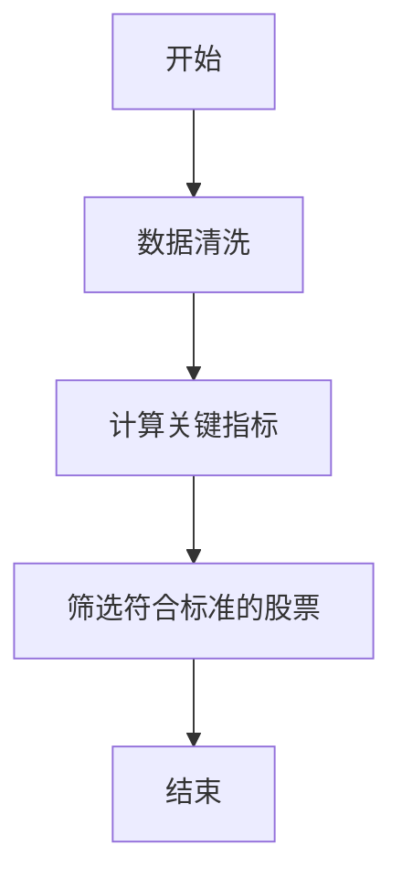
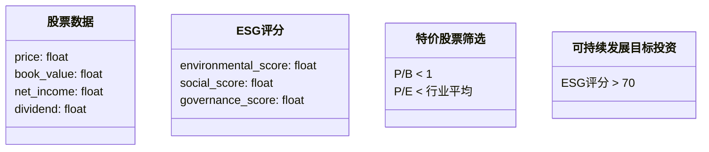
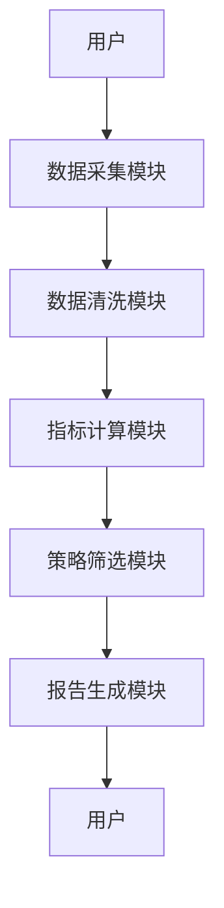

                 


# 如何将特价股票策略与可持续发展目标投资结合

## 关键词：特价股票策略、可持续投资、ESG、量化分析、投资组合优化

## 摘要：本文详细探讨如何将特价股票策略与可持续发展目标投资结合，通过量化分析和系统设计，提供一种新的投资策略。文章从背景、原理、算法、系统架构到项目实战，全面解析如何在追求超额收益的同时，实现可持续发展目标。

---

## 第一部分：背景介绍

### 第1章：特价股票策略与可持续投资的结合背景

#### 1.1 特价股票策略的基本概念

##### 1.1.1 什么是特价股票策略
特价股票策略是一种基于价值投资的策略，旨在通过寻找市场价格低于其内在价值的股票，从而在长期获得超额收益。该策略的核心在于识别市场低估的公司，并在市场反转时获利。

##### 1.1.2 特价股票策略的核心目标
- 发现市场低估的股票
- 在市场反转时获得超额收益
- 通过长期持有实现资产增值

##### 1.1.3 特价股票策略的适用场景
- 市场低迷或震荡时
- 部分行业或公司的短期困境导致股价被低估
- 投资者具备长期持有股票的耐心

#### 1.2 可持续发展目标投资的基本概念

##### 1.2.1 可持续发展目标投资的定义
可持续发展目标投资（Sustainable Investment, SI）是一种关注环境（Environmental）、社会（Social）和治理（Governance）因素的投资策略，旨在在追求财务回报的同时，推动社会和环境的可持续发展。

##### 1.2.2 可持续发展目标投资的核心要素
- 环境（E）：关注企业的碳排放、资源利用效率等
- 社会（S）：关注员工权益、社会责任、产品安全性等
- 治理（G）：关注公司治理结构、管理层透明度等

##### 1.2.3 可持续发展目标投资的全球趋势
随着全球气候变化加剧、社会不平等扩大以及企业治理问题频发，可持续发展目标投资越来越受到投资者的关注。全球多地已经出台相关政策，推动ESG投资的发展。

#### 1.3 特价股票策略与可持续投资的结合背景

##### 1.3.1 当前金融市场的发展趋势
- 投资者对超额收益的需求日益增长
- 可持续发展目标投资逐渐成为主流
- 传统价值投资策略面临新的挑战

##### 1.3.2 可持续投资的市场需求
- 投资者越来越关注企业的社会责任
- 法律法规对ESG信息披露的要求增加
- 社会舆论对企业可持续发展能力的关注提高

##### 1.3.3 特价股票策略在可持续投资中的潜力
- 结合价值投资和ESG因素，可以在追求超额收益的同时，推动社会可持续发展
- 特价股票策略可以帮助投资者发现具有长期价值的公司，这些公司在ESG方面表现优异
- 可持续发展目标投资可以为特价股票策略提供新的维度，避免单纯依赖财务指标带来的偏差

---

## 第二部分：核心概念与联系

### 第2章：特价股票策略的核心原理

#### 2.1 特价股票策略的理论基础

##### 2.1.1 价值投资理论
价值投资理论认为，市场价格会在短期内偏离其内在价值，但长期会回归。投资者可以通过识别市场价格低于内在价值的股票，实现超额收益。

##### 2.1.2 市场有效性的分析
- 如果市场是完全有效的，价值投资策略可能失效
- 实际市场中，由于信息不对称、市场参与者情绪波动等因素，价值投资策略仍然有效

##### 2.1.3 特价股票策略的数学模型
$$ P < V $$
其中，P为市场价格，V为股票的内在价值。

#### 2.2 特价股票策略的关键指标

##### 2.2.1 市净率（P/B）
$$ P/B = \frac{\text{股价}}{\text{每股净资产}} $$
市净率低于1通常被认为是潜在的特价股票。

##### 2.2.2 市盈率（P/E）
$$ P/E = \frac{\text{股价}}{\text{每股净利润}} $$
市盈率低于行业平均水平可能意味着股票被低估。

##### 2.2.3 股息率
$$ \text{股息率} = \frac{\text{每股股息}}{\text{股价}} \times 100\% $$
高股息率的股票可能具有吸引力。

#### 2.3 特价股票策略的风险与挑战

##### 2.3.1 市场波动对策略的影响
- 市场波动可能导致股价短期内继续低于内在价值
- 震荡市场中，价值投资策略可能需要更长的时间才能见效

##### 2.3.2 信息不对称的问题
- 由于信息不对称，市场价格可能无法准确反映内在价值
- 需要通过深入研究和分析来降低信息不对称带来的风险

##### 2.3.3 行业周期性的影响
- 行业周期性波动可能导致某些行业的股票出现低估
- 需要结合行业周期分析，选择周期性底部的股票

### 第3章：可持续发展目标投资的核心原理

#### 3.1 可持续发展目标投资的理论基础

##### 3.1.1 ESG投资理念
ESG投资理念认为，企业对环境、社会和治理的重视程度，会影响其长期价值和风险。

##### 3.1.2 ESG评分的计算
$$ ESG\ \text{评分} = \text{环境评分} \times 0.4 + \text{社会评分} \times 0.3 + \text{治理评分} \times 0.3 $$
- 环境评分：评估企业的碳排放、资源利用效率等
- 社会评分：评估企业的员工权益、社会责任等
- 治理评分：评估企业的董事会结构、管理层透明度等

##### 3.1.3 可持续发展目标投资的数学模型
$$ \text{ESG评分} = \sum_{i=1}^{n} w_i \times \text{指标}_i $$
其中，\( w_i \) 为指标 \( i \) 的权重，\( \text{指标}_i \) 为具体指标的评分。

#### 3.2 可持续发展目标投资的关键指标

##### 3.2.1 环境指标
- 碳排放强度
- 可再生能源使用比例
- 环境违法行为次数

##### 3.2.2 社会指标
- 员工满意度
- 社会责任报告发布情况
- 产品安全性

##### 3.2.3 治理指标
- 董事会多样性
- 高管薪酬与绩效的关系
- 信息披露透明度

#### 3.3 可持续发展目标投资的风险与挑战

##### 3.3.1 数据获取的难度
- 不同机构对ESG指标的定义和评分标准不统一
- 数据来源分散，获取成本高

##### 3.3.2 ESG评分的主观性
- 不同机构对同一公司的ESG评分可能差异较大
- 评分标准的主观性可能导致评分偏差

##### 3.3.3 行业差异的影响
- 不同行业的ESG评分标准和权重不同
- 行业特性可能影响ESG评分的适用性

---

## 第三部分：算法原理讲解

### 第4章：特价股票策略的算法实现

#### 4.1 特价股票筛选算法

##### 4.1.1 算法流程图（Mermaid）


##### 4.1.2 算法实现步骤
1. 数据清洗：去除无效数据，填充缺失值
2. 计算关键指标：市净率、市盈率、股息率
3. 筛选股票：根据设定的阈值，筛选出符合条件的股票

##### 4.1.3 Python代码示例
```python
import pandas as pd

# 假设df为股票数据，包含'price', 'book_value', 'net_income', 'dividend'四列
# 计算市净率
df['P/B'] = df['price'] / df['book_value']
# 计算市盈率
df['P/E'] = df['price'] / df['net_income']
# 计算股息率
df['dividend_ratio'] = df['dividend'] / df['price'] * 100

# 筛选P/B < 1且P/E < 行业平均P/E的股票
# 假设行业平均P/E为15
selected_stocks = df[(df['P/B'] < 1) & (df['P/E'] < 15)]
```

---

## 第五部分：系统分析与架构设计方案

### 第5章：系统功能设计

#### 5.1 项目介绍
- 项目名称：特价股票策略与可持续发展目标投资结合系统
- 项目目标：开发一个能够结合特价股票策略和ESG投资的量化分析系统
- 项目范围：涵盖数据采集、策略筛选、报告生成等功能

#### 5.2 系统功能设计

##### 5.2.1 领域模型（Mermaid类图）


##### 5.2.2 系统架构设计（Mermaid架构图）


---

## 第六部分：项目实战

### 第6章：项目实现

#### 6.1 环境安装
- 安装Python和必要的库（pandas、numpy、matplotlib）
- 数据源：从Yahoo Finance获取股票数据和ESG评分

#### 6.2 系统核心实现源代码
```python
import pandas as pd
import numpy as np

# 数据采集模块
def get_stock_data(tickers):
    # 假设tickers为股票代码列表
    data = pd.DataFrame()
    for ticker in tickers:
        # 获取股票数据
        stock_data = pd.read_csv(f'data/{ticker}.csv')
        data[ticker] = stock_data['price']
    return data

# 数据清洗模块
def clean_data(data):
    # 去除缺失值
    data.dropna(inplace=True)
    return data

# 指标计算模块
def calculate_indicators(data):
    # 计算市净率
    data['P/B'] = data['price'] / data['book_value']
    # 计算市盈率
    data['P/E'] = data['price'] / data['net_income']
    # 计算股息率
    data['dividend_ratio'] = data['dividend'] / data['price'] * 100
    return data

# 策略筛选模块
def screen_stocks(data, industry_pe):
    # 筛选P/B < 1且P/E < 行业平均P/E的股票
    selected = data[(data['P/B'] < 1) & (data['P/E'] < industry_pe)]
    return selected

# 报告生成模块
def generate_report(selected_stocks):
    # 生成报告
    report = pd.DataFrame(selected_stocks)
    report.to_csv('selected_stocks.csv', index=False)
    return report
```

---

## 第七部分：最佳实践

### 第7章：小结

- 特价股票策略与可持续发展目标投资的结合，可以在追求超额收益的同时，推动社会可持续发展
- 通过量化分析和系统设计，可以有效实现这两种策略的结合

### 第8章：注意事项

- 数据来源的可靠性至关重要
- 需要定期更新ESG评分和市场数据
- 投资者需具备长期持有的耐心

### 第9章：拓展阅读

- 建议阅读相关书籍和文献，深入了解价值投资和ESG投资的理论与实践
- 关注行业动态，了解可持续发展目标投资的最新发展趋势

