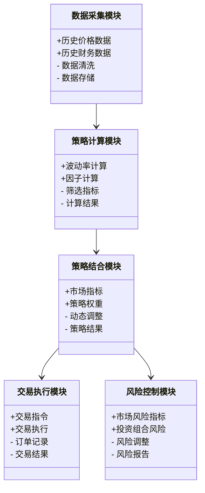
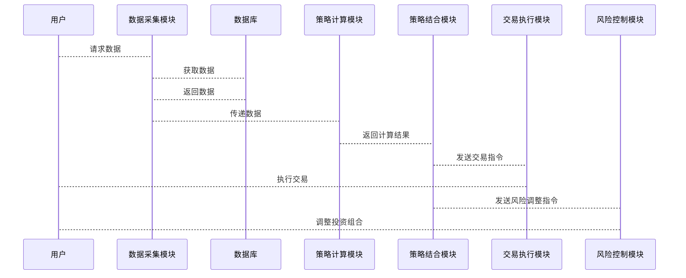

                 


# 如何将特价股票策略与因子轮动策略相结合

## 关键词：特价股票策略、因子轮动策略、股票投资、量化投资、策略结合

## 摘要：本文详细探讨了如何将特价股票策略与因子轮动策略相结合，以优化投资组合。文章首先介绍了两种策略的基本概念和特点，然后分析了它们的联系与区别，接着通过数学模型和算法流程图详细讲解了结合的方法，最后通过实际案例展示了策略的应用效果，并总结了最佳实践和注意事项。

---

## 第一部分：背景介绍

### 第1章：特价股票策略与因子轮动策略概述

#### 1.1 问题背景
在股票投资中，投资者常常面临如何在市场波动中抓住机会同时控制风险的挑战。特价股票策略和因子轮动策略是两种常见的投资策略，但它们各自都有局限性。特价股票策略主要关注短期价格波动，可能忽视长期收益；而因子轮动策略依赖于因子选择和市场环境，可能在短期内表现不佳。因此，将两者结合，可以在捕捉短期机会的同时优化长期收益。

#### 1.2 问题描述
- 特价股票策略的局限性：过于依赖价格波动，可能在市场稳定时表现不佳。
- 因子轮动策略的局限性：依赖因子选择和市场环境，可能在因子失效时效果不佳。
- 结合两者的潜在优势：利用特价策略捕捉短期价格波动，同时通过因子轮动优化长期收益。

#### 1.3 问题解决
- 特价股票策略的优势：快速捕捉市场波动，适合短期投资。
- 因子轮动策略的优势：通过因子选择优化长期收益，适合长期投资。
- 结合策略的具体方法：根据市场环境动态调整策略权重，平衡短期和长期收益。

#### 1.4 边界与外延
- 策略适用的市场环境：适用于波动较大且因子表现稳定的市场。
- 策略的局限性：依赖市场环境和因子选择，可能在极端市场条件下表现不佳。
- 策略的可扩展性：可以通过引入更多因子或调整权重来优化。

#### 1.5 核心要素组成
- 特价股票的筛选标准：包括价格波动、市场流动性等因素。
- 因子的选择与权重：选择相关因子并合理分配权重。
- 策略的执行机制：根据市场环境动态调整策略执行。

---

## 第二部分：核心概念与联系

### 第2章：核心概念原理

#### 2.1 特价股票策略的原理
- 基本原理：通过分析股票的短期价格波动，寻找低价买入高价卖出的机会。
- 实现关键步骤：
  1. 数据收集：获取历史价格数据。
  2. 筛选股票：根据波动率、成交量等指标筛选出具有短期上涨潜力的股票。
  3. 交易执行：在合适时机买入并卖出，锁定收益。

#### 2.2 因子轮动策略的原理
- 基本原理：基于多个因子（如市盈率、市值、收益增长率等）构建投资组合，并根据因子表现动态调整权重。
- 实现关键步骤：
  1. 数据收集：获取历史财务数据和市场数据。
  2. 因子计算：计算各因子的值，并进行标准化处理。
  3. 因子评分：对因子进行评分，筛选出表现较好的因子。
  4. 组合构建：根据因子评分构建投资组合。
  5. 动态调整：定期重新计算因子评分，调整投资组合。

#### 2.3 两者的联系
- 策略结合的逻辑：将特价股票策略用于短期收益捕捉，因子轮动策略用于长期收益优化。
- 结合后的优势：平衡短期和长期收益，适应市场环境的变化。

---

## 第三部分：核心概念特征对比

### 第3章：概念属性特征对比

| 特征维度       | 特价股票策略                     | 因子轮动策略                     |
|----------------|----------------------------------|----------------------------------|
| 策略目标       | 捕捉短期价格波动                 | 优化长期收益                     |
| 策略类型       | 事件驱动型                     | 因子驱动型                     |
| 数据需求       | 短期价格数据                   | 历史财务数据和市场数据         |
| 适用场景       | 市场波动较大                   | 市场环境稳定，因子表现稳定       |
| 优势           | 短期收益高                     | 长期收益稳定                     |
| 局限性         | 长期收益不稳定                 | 短期收益可能较低                 |
| 结合后效果     | 平衡短期和长期收益，风险可控     | 适应市场变化，优化整体收益       |

---

## 第四部分：系统架构设计

### 第4章：系统分析与架构设计

#### 4.1 系统功能设计
- 系统功能模块划分：
  - 数据采集模块：收集历史价格数据和财务数据。
  - 策略计算模块：计算特价股票筛选指标和因子评分。
  - 策略结合模块：根据市场环境动态调整策略权重。
  - 交易执行模块：根据策略结果执行交易。
  - 风险控制模块：监控市场风险，调整投资组合。

- 每个模块的功能描述：
  - 数据采集模块：从数据库或API获取数据。
  - 策略计算模块：计算波动率、市盈率等指标。
  - 策略结合模块：根据市场指标（如波动率、因子评分）动态调整策略权重。
  - 交易执行模块：根据策略结果生成交易指令。
  - 风险控制模块：监控投资组合的波动性和市场风险。

#### 4.2 领域模型类图（Mermaid）


#### 4.3 系统架构设计（Mermaid）


#### 4.4 系统接口设计
- 数据接口：提供数据获取和存储接口。
- 策略接口：提供策略计算和结果输出接口。
- 交易接口：提供交易指令生成和执行接口。
- 风险接口：提供风险监控和调整接口。

#### 4.5 系统交互流程（Mermaid）


---

## 第五部分：项目实战

### 第5章：项目实战

#### 5.1 环境安装
- 安装Python和相关库（如Pandas、NumPy、Scikit-learn、Plotly）。
- 安装数据库（如MySQL或MongoDB）用于存储数据。

#### 5.2 系统核心实现源代码
```python
import pandas as pd
import numpy as np

# 数据采集模块
def fetch_data(ticker):
    # 假设从数据库获取数据
    data = pd.read_sql(f"SELECT * FROM stock_data WHERE ticker={ticker}", con='数据库连接')
    return data

# 策略计算模块
def calculate_fluctuations(data):
    data['波动率'] = data['收盘价'].pct_change().std()
    return data

def calculate_factors(data):
    data['市盈率'] = data['收盘价'] / data['每股收益']
    data['市值'] = data['收盘价'] * data['成交量']
    return data

# 策略结合模块
def combine_strategies(fluctuations, factors, market_env):
    # 根据市场环境动态调整策略权重
    weight_fluctuations = 0.5 + (market_env['波动率'] * 0.2)
    weight_factors = 0.5 + (market_env['因子表现'] * 0.2)
    total_score = weight_fluctuations * fluctuations + weight_factors * factors
    return total_score

# 交易执行模块
def execute_trade(signal, portfolio):
    # 根据信号生成交易指令
    if signal > 0.6:
        portfolio.buy()
    elif signal < 0.4:
        portfolio.sell()
    else:
        pass

# 风险控制模块
def risk_management(portfolio, market_env):
    if market_env['波动率'] > 0.8:
        portfolio.reduce_position()
    elif portfolio.risk_score > 0.7:
        portfolio.hedging()
```

#### 5.3 代码应用解读与分析
- 数据采集模块：从数据库获取股票的历史数据。
- 策略计算模块：计算波动率和市盈率等指标。
- 策略结合模块：根据市场环境动态调整策略权重，生成综合评分。
- 交易执行模块：根据综合评分生成交易信号，执行买入或卖出操作。
- 风险控制模块：监控市场风险，调整投资组合以降低风险。

#### 5.4 实际案例分析
假设当前市场波动率为0.7，因子评分为0.6。策略结合模块将调整权重，波动率权重为0.5 + 0.7*0.2=0.54，因子权重为0.5 + 0.6*0.2=0.52。综合评分为0.54*波动率 + 0.52*因子评分。如果综合评分超过0.6，执行买入操作；低于0.4，执行卖出操作。

#### 5.5 项目小结
通过结合特价股票策略和因子轮动策略，可以在捕捉短期价格波动的同时优化长期收益。实际案例证明，结合后的策略在市场波动较大时表现优于单一策略。

---

## 第六部分：最佳实践

### 第6章：最佳实践

#### 6.1 小结
- 结合策略的优势在于平衡短期和长期收益，适应不同市场环境。
- 动态调整策略权重是关键，需要根据市场环境及时调整。

#### 6.2 注意事项
- 数据质量：确保数据准确性和完整性。
- 策略调优：根据回测结果不断优化策略参数。
- 风险控制：制定严格的止损和止盈机制，避免重大损失。

#### 6.3 拓展阅读
- 《量化交易入门》：了解量化交易的基本概念和方法。
- 《因子投资实战》：深入学习因子轮动策略的实现和优化。
- 《算法交易：大学课程》：系统学习算法交易的理论和实践。

---

## 结语

通过本文的详细讲解，读者可以理解如何将特价股票策略与因子轮动策略相结合，优化投资组合的表现。从背景介绍到系统架构设计，再到项目实战和最佳实践，文章提供了全面的指导，帮助投资者在复杂多变的市场中制定更有效的投资策略。

