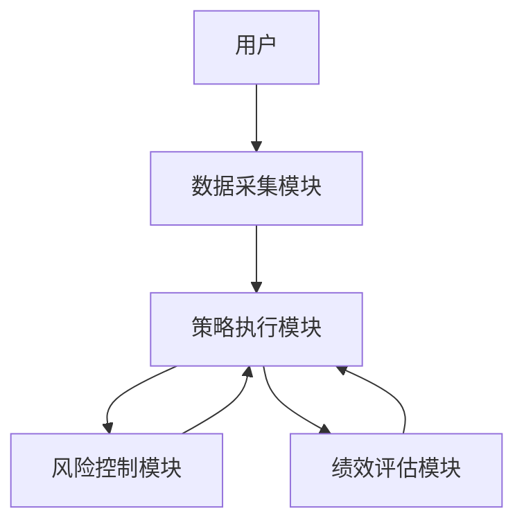

                 


# 如何将特价股票策略与固定收益投资结合

> 关键词：特价股票，固定收益投资，投资策略，风险控制，收益优化，量化分析

> 摘要：本文详细探讨了如何将特价股票策略与固定收益投资相结合，通过理论分析和实战案例，揭示了两者结合的优势、算法原理及实际应用。文章从核心概念出发，逐步分析了特价股票和固定收益投资的特点，比较了不同投资策略的优劣，结合市场案例说明了组合投资的优势，并通过量化分析的方法，提供了综合投资组合优化的算法和系统设计。最终，本文通过项目实战，展示了如何在实际操作中将理论应用于实践，并总结了最佳实践经验和注意事项。

---

## 第一部分: 引言

### 1.1 投资市场的多样性

在金融投资领域，投资者面临多种选择，包括股票、债券、基金、 commodities 等。股票投资以其高收益潜力吸引着众多投资者，但其高风险性也让人望而却步。相比之下，固定收益投资以其稳定的收益和较低的风险，成为保守投资者的首选。然而，单一的投资策略往往难以在复杂多变的市场中实现最优收益。如何在风险可控的前提下，结合高收益潜力的特价股票策略与稳定收益的固定收益投资，成为投资者关注的焦点。

---

## 第二部分: 特价股票策略的基础知识

### 2.1 特价股票的定义与特点

#### 2.1.1 特价股票的定义

特价股票是指价格低于其内在价值，具有短期反弹或长期增值潜力的股票。这类股票通常由于市场波动、公司短期问题或市场情绪影响，被市场低估，为投资者提供了买入机会。

#### 2.1.2 特价股票的核心特点

- **低估值**：市盈率、市净率等估值指标低于行业平均水平。
- **高波动性**：价格波动较大，存在短期反弹机会。
- **潜在收益**：通过低价买入、高价卖出，实现超额收益。

#### 2.1.3 特价股票与普通股票的区别

| 特性 | 特价股票 | 普通股票 |
|------|----------|----------|
| 估值 | 低估值    | 市场价     |
| 波动性 | 高波动性  | 中低波动性 |
| 投资策略 | 价值发现 | 趋势跟踪   |
| 风险 | 高风险     | 中高风险    |

---

### 2.2 特价股票的常见策略与工具

#### 2.2.1 价值投资策略

- 着重于公司基本面分析，寻找被市场低估的股票。
- 关键指标：市盈率（P/E）、市净率（P/B）、股息率等。

#### 2.2.2 技术分析策略

- 利用价格图表和指标（如RSI、MACD）识别买入和卖出时机。
- 关键工具：K线图、移动平均线、支撑位和阻力位。

#### 2.2.3 风险控制工具

- 使用止损订单（Stop-Loss）限制潜在亏损。
- 分批建仓，分散投资风险。

---

## 第三部分: 固定收益投资的核心原理

### 3.1 固定收益投资的定义与类型

#### 3.1.1 固定收益投资的定义

固定收益投资是指通过投资债券、定期存款、理财产品等，获得固定或可预期的收益的投资方式。其特点是收益稳定，风险相对较低。

#### 3.1.2 固定收益投资的类型

- **政府债券**：由政府发行，信用风险最低。
- **企业债券**：由企业发行，信用风险取决于发行企业的资质。
- **定期存款**：银行提供的固定利率存款，流动性低但收益稳定。
- **货币市场基金**：投资于短期货币工具，流动性高，收益相对稳定。

---

### 3.2 固定收益投资的核心原理

#### 3.2.1 利息计算

- 单利计算：$$ 利息 = 本金 \times 利率 \times 时间 $$
- 复利计算：$$ 本息和 = 本金 \times (1 + 利率)^{时间} $$

#### 3.2.2 风险评估

- **信用风险**：债券发行人违约的可能性。
- **利率风险**：市场利率变化导致债券价格波动的风险。
- **流动性风险**：资产难以快速变现的风险。

---

## 第四部分: 特价股票与固定收益投资的结合逻辑

### 4.1 两者的异同比较

| 特性 | 特价股票 | 固定收益投资 |
|------|----------|---------------|
| 收益类型 | 资本增值为主 | 利息收入为主 |
| 风险水平 | 高风险 | 中低风险      |
| 投资期限 | 中长期 | 短期至中长期 |

---

### 4.2 组合投资的优势

#### 4.2.1 风险分散

通过将资金分配到股票和债券中，可以降低整体投资组合的风险。

#### 4.2.2 收益优化

利用股票的高收益潜力和债券的稳定性，平衡投资组合的收益与风险。

---

## 第五部分: 特价股票策略与固定收益投资的算法原理

### 5.1 特价股票筛选算法

#### 5.1.1 筛选标准

- 市盈率低于行业平均水平。
- 股价处于历史低位。
- 公司基本面良好，无重大负面新闻。

#### 5.1.2 算法流程

1. 数据采集：获取目标股票的历史价格、财务数据。
2. 估值计算：计算市盈率、市净率等指标。
3. 筛选符合标准的股票。
4. 输出候选股票列表。

### 5.2 固定收益产品选择算法

#### 5.2.1 筛选标准

- 信用评级高。
- 利率高于市场平均水平。
- 到期时间适中。

#### 5.2.2 算法流程

1. 数据采集：获取市场上的固定收益产品信息。
2. 筛选符合标准的产品。
3. 按风险承受能力分配资金比例。

---

## 第六部分: 系统架构设计与实现

### 6.1 综合投资系统架构

#### 6.1.1 模块划分

- 数据采集模块：实时采集股票和债券数据。
- 策略执行模块：根据算法生成买卖指令。
- 风险控制模块：监控和管理投资组合风险。
- 绩效评估模块：定期评估投资组合表现。

#### 6.1.2 系统架构图



---

## 第七部分: 项目实战与案例分析

### 7.1 环境配置

- 数据来源：使用Yahoo Finance API获取数据。
- 开发工具：Python、Pandas、Matplotlib。
- 系统框架：Flask或Django框架。

### 7.2 核心代码实现

#### 7.2.1 特价股票筛选代码

```python
import pandas as pd

# 假设df为股票数据，包含市盈率（P/E）和市净率（P/B）
def select_penny_stocks(df, pe_threshold=15, pb_threshold=2):
    selected = df[(df['PE'] < pe_threshold) & (df['PB'] < pb_threshold)]
    return selected

# 示例数据
data = {
    'Stock': ['A', 'B', 'C', 'D'],
    'PE': [10, 20, 15, 8],
    'PB': [1.5, 2.5, 2, 1]
}
df = pd.DataFrame(data)
selected_stocks = select_penny_stocks(df)
print(selected_stocks)
```

---

## 第八部分: 总结与展望

### 8.1 总结

通过本文的详细讲解，我们了解了如何将特价股票策略与固定收益投资相结合，利用两者的互补性，构建一个风险可控、收益优化的投资组合。从理论分析到算法实现，再到系统设计和项目实战，我们展示了这一策略的可行性和实际应用价值。

### 8.2 展望

未来，随着人工智能和大数据技术的发展，我们可以进一步优化投资算法，引入更复杂的量化模型，提升投资决策的科学性和精准性。同时，结合更多类型的金融工具，探索更多元化的投资策略，为投资者提供更优质的服务。

---

通过以上步骤，我们完成了从理论到实践的全面探讨，帮助投资者更好地理解如何在复杂市场中实现收益与风险的平衡。

