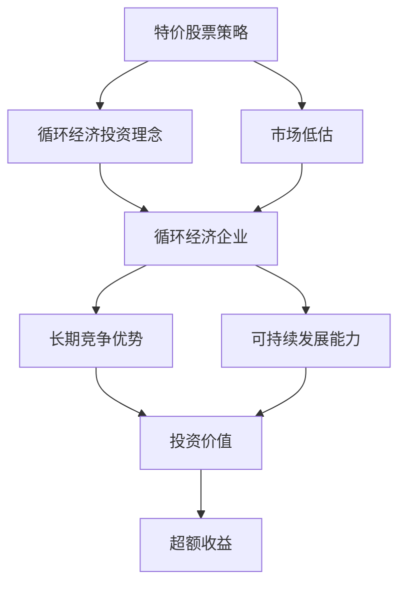

                 


# 如何将特价股票策略与循环经济投资理念结合

> 关键词：特价股票策略、循环经济投资、投资组合优化、价值投资、可持续发展

> 摘要：本文将探讨如何将特价股票策略与循环经济投资理念相结合，分析其核心概念、联系与区别，建立数学模型，并通过实际案例进行分析，为投资者提供优化的投资策略。

---

## 第一部分: 特价股票策略与循环经济投资理念的背景与核心概念

### 第1章: 特价股票策略与循环经济投资理念概述

#### 1.1 特价股票策略的基本概念
- **1.1.1 什么是特价股票策略**
  - 特价股票策略是指寻找市场价格低于其内在价值的股票进行投资的策略。
  - 核心目标是通过识别市场低估的股票，获得超额收益。

- **1.1.2 特价股票策略的核心目标**
  - 确保投资标的具有安全边际。
  - 在市场波动中，抓住低估值的机会。

- **1.1.3 特价股票策略的适用场景**
  - 市场低迷或熊市阶段。
  - 行业周期性低谷时。
  - 个股基本面良好，但市场情绪消极时。

#### 1.2 循环经济投资理念的基本概念
- **1.2.1 什么是循环经济**
  - 循环经济是指在资源循环利用的基础上，减少资源消耗和环境污染的经济模式。
  - 核心理念是“从摇篮到摇篮”，即资源的闭环利用。

- **1.2.2 循环经济的核心特征**
  - 资源高效利用。
  - 废物减量化和再利用。
  - 低碳排放。

- **1.2.3 循环经济与传统经济的区别**
  - 传统经济是“从摇篮到坟墓”的线性模式。
  - 循环经济是“从摇篮到摇篮”的闭环模式。

#### 1.3 特价股票策略与循环经济投资理念的结合背景
- **1.3.1 当前经济环境的变化**
  - 环境问题日益严重，可持续发展成为全球共识。
  - 投资者越来越关注企业的社会责任和可持续发展能力。

- **1.3.2 可持续投资的趋势**
  - ESG（环境、社会、治理）投资兴起。
  - 循环经济企业因其可持续性，成为投资者关注的焦点。

- **1.3.3 特价股票策略与循环经济的契合点**
  - 循环经济企业具有长期竞争优势。
  - 特价股票策略能够捕捉到被市场低估的循环经济企业。

---

### 第2章: 特价股票策略与循环经济投资理念的核心概念与联系

#### 2.1 特价股票策略的核心概念
- **2.1.1 价值投资的基本原理**
  - 投资的本质是购买企业的一部分。
  - 通过分析企业的内在价值，寻找价格低于价值的股票。

- **2.1.2 市场情绪与股价波动的关系**
  - 市场情绪影响股价短期波动。
  - 理性分析是克服情绪影响的关键。

- **2.1.3 特价股票的识别方法**
  - 市盈率（P/E）低于行业平均水平。
  - 市净率（P/B）低于行业平均水平。
  - 企业盈利能力稳定，具备成长性。

#### 2.2 循环经济投资理念的核心概念
- **2.2.1 循环经济的产业链分析**
  - 上游：资源回收与再利用。
  - 中游：绿色生产与制造。
  - 下游：产品再利用与废弃物处理。

- **2.2.2 循环经济企业的竞争优势**
  - 资源成本优势。
  - 环保政策支持。
  - 社会责任形象。

- **2.2.3 循环经济与企业可持续发展的关系**
  - 循环经济模式能够降低企业运营风险。
  - 可持续发展能力强的企业更具长期投资价值。

#### 2.3 特价股票策略与循环经济投资理念的联系
- **2.3.1 循环经济企业作为特价股票的投资标的**
  - 循环经济企业具有长期竞争优势。
  - 在市场低估时，具备特价股票的投资价值。

- **2.3.2 循环经济模式对股价的影响**
  - 循环经济企业具有较高的成长性和稳定性。
  - 在市场波动中，循环经济企业的股价波动较小，具备防御性。

- **2.3.3 特价股票策略在循环经济领域的应用前景**
  - 特价股票策略可以帮助投资者在循环经济领域中发现被低估的投资机会。
  - 循环经济企业因其可持续性，具备长期的投资价值。

---

### 第3章: 特价股票策略与循环经济投资理念的核心概念对比与联系

#### 3.1 特价股票策略与循环经济投资理念的对比分析
- **3.1.1 战略目标对比**
  - 特价股票策略：追求短期安全边际和超额收益。
  - 循环经济投资理念：追求长期可持续发展和企业价值。

- **3.1.2 投资逻辑对比**
  - 特价股票策略：基于企业内在价值和市场情绪。
  - 循环经济投资理念：基于企业的可持续发展能力和循环经济模式。

- **3.1.3 风险特征对比**
  - 特价股票策略：短期市场波动风险较高。
  - 循环经济投资理念：长期风险较低，具备防御性。

#### 3.2 特价股票策略与循环经济投资理念的联系
- **3.2.1 循环经济企业作为特价股票的潜在投资机会**
  - 循环经济企业在市场低估时，具备特价股票的投资价值。
  - 循环经济模式能够降低企业的运营风险。

- **3.2.2 循环经济模式对股价的影响**
  - 循环经济模式能够提升企业的市场竞争力。
  - 在市场波动中，循环经济企业的股价波动较小。

- **3.2.3 特价股票策略在循环经济领域的应用优势**
  - 特价股票策略可以帮助投资者在循环经济领域中发现被低估的投资机会。
  - 循环经济企业因其可持续性，具备长期的投资价值。

---

### 第4章: 特价股票策略与循环经济投资理念的实体关系图



---

## 第二部分: 特价股票策略与循环经济投资理念的结合与应用

### 第5章: 特价股票策略与循环经济投资理念的结合与应用

#### 5.1 特价股票策略与循环经济投资理念的结合
- **5.1.1 循环经济企业的价值评估**
  - 基于循环经济模式的企业价值评估。
  - 考虑企业的资源利用效率和可持续发展能力。

- **5.1.2 特价股票策略在循环经济领域的应用**
  - 寻找市场低估的循环经济企业。
  - 通过价值分析和市场情绪分析，确定投资机会。

#### 5.2 特价股票策略与循环经济投资理念的数学模型

##### 5.2.1 循环经济企业价值评估模型
$$ V = \text{现金流} \times (1 + r)^{-n} $$

##### 5.2.2 特价股票策略的安全边际率
$$ \text{安全边际率} = \frac{\text{内在价值} - \text{市场价格}}{\text{内在价值}} $$

#### 5.3 特价股票策略与循环经济投资理念的系统分析
- **5.3.1 系统功能设计**
  - 数据采集与处理：市场数据、企业基本面数据。
  - 循环经济评估模块：评估企业的循环经济模式。
  - 特价股票筛选模块：基于价值和市场情绪筛选股票。
  - 投资组合优化模块：优化投资组合。

- **5.3.2 系统架构设计**
  ```mermaid
  graph TD
      A[系统功能] --> B[数据采集]
      A --> C[数据处理]
      A --> D[循环经济评估]
      A --> E[特价股票筛选]
      A --> F[投资组合优化]
  ```

- **5.3.3 系统交互设计**
  ```mermaid
  graph TD
      A[用户] --> B[输入市场数据]
      B --> C[数据处理]
      C --> D[循环经济评估]
      D --> E[特价股票筛选]
      E --> F[投资组合优化]
      F --> G[输出结果]
  ```

---

## 第三部分: 实际案例分析与总结

### 第6章: 特价股票策略与循环经济投资理念的实际案例分析

#### 6.1 实际案例分析
- **案例1: 某循环经济企业**
  - 企业基本面分析。
  - 市场情绪分析。
  - 循环经济模式评估。
  - 投资价值分析。

#### 6.2 投资组合优化分析
- **6.2.1 投资组合的构建**
  - 基于特价股票策略筛选循环经济企业。
  - 组合权重分配。
  - 风险控制。

- **6.2.2 投资组合的优化**
  - 动态调整投资组合。
  - 风险与收益的平衡。

---

### 第7章: 总结与展望

#### 7.1 总结
- 特价股票策略与循环经济投资理念的结合，能够帮助投资者在市场低估时，发现具有长期竞争优势的投资机会。
- 循环经济企业的可持续发展能力，能够降低投资风险，提升投资收益。

#### 7.2 展望
- 随着全球可持续发展意识的提升，循环经济投资理念将越来越受到重视。
- 特价股票策略与循环经济投资理念的结合，将成为未来投资的重要方向。

---

通过以上分析，我们可以看到，将特价股票策略与循环经济投资理念相结合，不仅能够帮助投资者在市场中找到被低估的投资机会，还能够提升投资的可持续性和长期收益能力。

