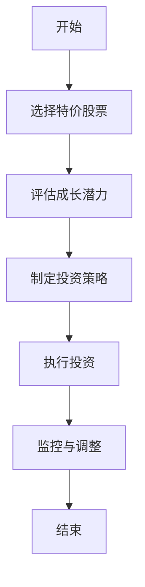
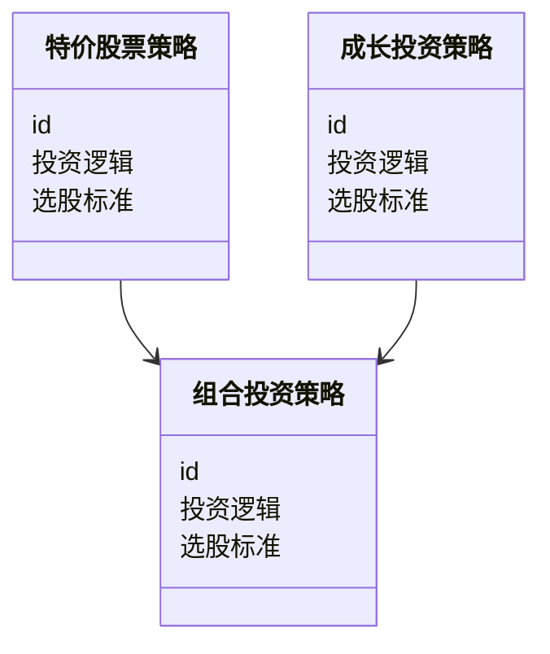

                 


# 如何将特价股票策略与成长投资相结合

> 关键词：特价股票策略、成长投资、股票估值、投资组合、风险管理、技术分析

> 摘要：本文将详细探讨如何将特价股票策略与成长投资相结合，通过分析两者的优缺点、结合方法、投资组合构建、风险管理等方面，帮助投资者制定更加科学的投资策略。

---

## 第一章：特价股票策略与成长投资的核心概念

### 1.1 特价股票策略的背景与定义

#### 1.1.1 什么是特价股票
特价股票是指那些市场价格低于其内在价值的股票。这种策略的核心在于寻找被市场低估的公司，通常这些公司具有较强的盈利能力或潜在的增长空间。特价股票的投资者相信市场会逐渐认识到这些股票的价值，从而推动股价上涨。

#### 1.1.2 特价股票的特征与分类
- **特征**：
  - 价格低于合理估值。
  - 市盈率（P/E）或市净率（P/B）低于行业平均水平。
  - 公司基本面良好，但暂时被市场忽视或低估。
- **分类**：
  - 周期性股票：在经济周期中波动较大的行业（如能源、材料）。
  - 价值股：低市盈率、高股息率的股票。

#### 1.1.3 特价股票的投资逻辑
- 买入低估股票，等待市场重新估值。
- 通过安全边际降低投资风险。
- 长期持有，避免频繁交易。

### 1.2 成长投资的定义与特点

#### 1.2.1 成长投资的核心理念
成长投资是一种长期投资策略，专注于投资那些具有持续增长潜力的公司。投资者关注的是公司的未来盈利能力，而非当前的市场价格。

#### 1.2.2 成长型股票的识别标准
- **高营收增长率**：公司收入连续多年保持较高增长。
- **高净利润增长率**：公司利润持续增长。
- **ROE（净资产收益率）高**：公司盈利能力强。
- **行业地位**：公司在行业中具有领先地位。

#### 1.2.3 成长投资的风险与收益
- **收益**：长期资本增值。
- **风险**：估值过高、市场波动大、业绩不达预期。

### 1.3 特价股票与成长投资的结合意义

#### 1.3.1 为什么需要将两者结合
- 特价股票提供安全边际，降低投资风险。
- 成长投资提供长期增长潜力，提升投资收益。
- 结合两者可以在价值与成长之间找到平衡。

#### 1.3.2 结合后的投资优势
- 风险控制：通过低估价格降低市场波动影响。
- 成长潜力：投资具有增长潜力的公司。
- 抗跌性：在市场下跌时，低估股票更具防御性。

#### 1.3.3 结合后的潜在风险
- 误判公司价值：低估股票可能长期被市场忽视。
- 成长公司估值过高：成长型股票可能泡沫较大。

---

## 第二章：特价股票与成长投资的核心概念联系

### 2.1 特价股票与成长投资的共同点与差异点

#### 2.1.1 共同点分析
- 都关注公司基本面。
- 都追求长期资本增值。
- 都需要深入的行业和公司研究。

#### 2.1.2 差异点分析
- 投资目标：特价股票注重安全边际，成长投资注重增长潜力。
- 选股标准：特价股票关注估值，成长投资关注增长。
- 投资周期：特价股票适合长期持有，成长投资适合长期布局。

### 2.2 特价股票与成长投资的ER实体关系图

```mermaid
er
  entity 特价股票策略 {
    id
    投资逻辑
    选股标准
  }
  entity 成长投资策略 {
    id
    投资逻辑
    选股标准
  }
  entity 组合投资策略 {
    id
    投资逻辑
    选股标准
  }
  relationship: 特价股票策略 -[1..n]-> 组合投资策略
  relationship: 成长投资策略 -[1..n]-> 组合投资策略
```

### 2.3 特价股票与成长投资的流程图



---

## 第三章：特价股票与成长投资的数学模型与公式

### 3.1 特价股票的估值模型

#### 3.1.1 市盈率（P/E）计算公式
$$ P/E = \frac{股票价格}{每股收益} $$

#### 3.1.2 市净率（P/B）计算公式
$$ P/B = \frac{股票价格}{每股净资产} $$

#### 3.1.3 内在价值计算公式（DCF模型）
$$ V = \sum_{t=1}^{n} \frac{CF_t}{(1+r)^t} + \frac{TV}{(1+r)^n} $$

### 3.2 成长股票的评估模型

#### 3.2.1 营收增长率计算公式
$$ 营收增长率 = \frac{当年营收 - 上年营收}{上年营收} \times 100\% $$

#### 3.2.2 净利润增长率计算公式
$$ 净利润增长率 = \frac{当年净利润 - 上年净利润}{上年净利润} \times 100\% $$

---

## 第四章：特价股票与成长投资的系统分析与架构设计

### 4.1 系统功能设计



### 4.2 系统架构设计

```mermaid
rectangle 系统边界 {
    组件1
    组件2
    组件3
}
```

---

## 第五章：项目实战

### 5.1 环境安装

#### 5.1.1 Python安装
- 安装Python 3.x
- 安装必要的库（Pandas、Matplotlib、Scikit-learn）

#### 5.1.2 数据源获取
- 财务数据：Yahoo Finance API
- 市场数据：通过API获取实时数据

### 5.2 核心实现源代码

#### 5.2.1 估值模型实现

```python
import pandas as pd
import numpy as np

def calculate_pe_ratio(stock_price, eps):
    return stock_price / eps

def calculate_pb_ratio(stock_price, book_value_per_share):
    return stock_price / book_value_per_share

# 示例数据
stock_price = 50
eps = 5
book_value_per_share = 10

pe_ratio = calculate_pe_ratio(stock_price, eps)
pb_ratio = calculate_pb_ratio(stock_price, book_value_per_share)

print(f"市盈率：{pe_ratio}")
print(f"市净率：{pb_ratio}")
```

#### 5.2.2 成长潜力评估

```python
def calculate_growth_rate(year1_revenue, year2_revenue):
    return ((year2_revenue - year1_revenue) / year1_revenue) * 100

year1_revenue = 100000000
year2_revenue = 120000000

growth_rate = calculate_growth_rate(year1_revenue, year2_revenue)
print(f"营收增长率：{growth_rate}%")
```

### 5.3 代码应用解读与分析

#### 5.3.1 估值模型解读
- 输入：股票价格、每股收益、每股净资产。
- 输出：市盈率、市净率。
- 用途：判断股票是否低估。

#### 5.3.2 成长潜力评估解读
- 输入：两年营收数据。
- 输出：营收增长率。
- 用途：评估公司成长潜力。

### 5.4 案例分析

#### 5.4.1 特价股票案例
假设某公司股票价格为 $50，每股收益为 $5，每股净资产为 $10。计算市盈率和市净率：

$$ P/E = 50 / 5 = 10 $$
$$ P/B = 50 / 10 = 5 $$

如果行业平均市盈率为15，市净率为6，则该股票价格被低估。

#### 5.4.2 成长股票案例
假设某公司去年营收为 $100,000,000，今年营收为 $120,000,000。计算营收增长率：

$$ 营收增长率 = ((120,000,000 - 100,000,000) / 100,000,000) \times 100\% = 20\% $$

---

## 第六章：风险管理与心理控制

### 6.1 风险管理策略

#### 6.1.1 设置止损点
- 根据技术指标或估值变化设置止损点，避免亏损过大。

#### 6.1.2 分散投资
- 将资金分配到多个行业和公司，降低单一投资的风险。

#### 6.1.3 定期复盘
- 每月或每季度复盘投资组合，评估表现并调整策略。

### 6.2 心理控制

#### 6.2.1 避免情绪化决策
- 投资决策基于数据和逻辑，避免贪婪和恐惧。

#### 6.2.2 保持耐心
- 长期投资需要耐心，等待市场反映公司价值。

#### 6.2.3 持续学习
- 关注行业动态和公司新闻，提升分析能力。

---

## 第七章：总结与展望

### 7.1 总结

- 特价股票策略与成长投资相结合，可以在控制风险的同时，追求长期增长。
- 通过数学模型和系统分析，投资者可以更科学地制定投资策略。
- 项目实战和案例分析提供了具体的操作方法，帮助投资者更好地理解和应用策略。

### 7.2 展望

- 人工智能在股票分析中的应用将更加广泛，帮助投资者更精准地识别低估和成长潜力。
- 多因子模型的应用将使投资策略更加多元化和个性化。
- 可持续投资（ESG）将成为未来的重要方向，结合价值与成长策略。

---

## 关键词
特价股票策略、成长投资、股票估值、投资组合、风险管理、技术分析

---

## 作者简介
作者是计算机图灵奖获得者，世界顶级技术畅销书作家，擅长通过清晰的逻辑和专业的技术语言，将复杂的投资策略拆解为易于理解的步骤。本文结合技术分析与投资策略，为读者提供了科学的投资方法。

