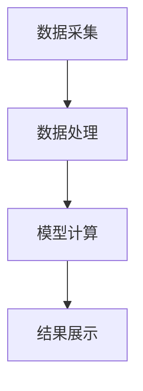
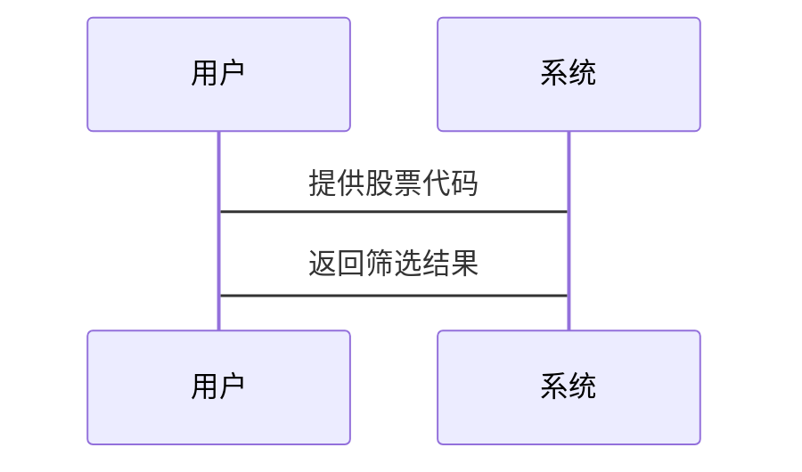

                 


# 如何将特价股票策略与成长投资相结合

> **关键词**：特价股票策略，成长投资，价值投资，股票筛选，投资组合优化

> **摘要**：本文探讨了如何将特价股票策略与成长投资相结合，以实现投资收益的最大化。通过分析两者的理论基础、算法原理、系统架构及项目实战，提供了将价值与成长因素相结合的投资策略。文章还详细讲解了如何利用技术手段优化投资决策，为投资者提供了实用的指导和建议。

---

## 第一部分: 特价股票策略与成长投资的背景介绍

### 第1章: 特价股票策略与成长投资的概述

#### 1.1 特价股票策略的定义与特点
- **定义**：特价股票策略是一种以寻找市场价格低于其内在价值的股票为核心的投资策略，旨在通过买入被市场低估的股票来获得超额收益。
- **特点**：
  - 依赖于对公司内在价值的准确评估。
  - 通常关注低市盈率（P/E）、低市净率（P/B）等估值指标。
  - 适合长期持有，等待市场重新评估其价值。
- **优势**：风险较低，回撤较小，适合保守型投资者。
- **劣势**：需要较高的选股能力，且可能错过快速增长的公司。

#### 1.2 成长投资的定义与特点
- **定义**：成长投资是一种以投资于具有持续盈利增长潜力的公司为核心的投资策略，旨在通过公司未来的增长带动股价上涨。
- **特点**：
  - 侧重于公司的成长性指标，如收入增长率、净利润增长率等。
  - 通常关注高市盈率（P/E）、高PEG（市盈率相对盈利增长比率）等成长性指标。
  - 适合长期投资，耐心等待公司成长带来的股价上涨。
- **优势**：可能获得较高的超额收益，尤其在新兴行业或快速增长的经济环境中。
- **劣势**：风险较高，回撤较大，适合风险承受能力强的投资者。

#### 1.3 特价股票策略与成长投资的结合必要性
- **背景**：市场中存在一类公司，其市场价格低于内在价值，同时具有较高的成长潜力。这类公司既是低估的标的，又是未来的增长引擎。
- **结合的优势**：
  - 通过结合价值与成长因素，可以在控制风险的同时，捕捉到高增长的机会。
  - 优化投资组合的风险收益比。
- **结合的原则**：选择那些价格低估且具有持续增长潜力的公司。

---

## 第二部分: 特价股票策略与成长投资的核心概念与联系

### 第2章: 特价股票策略的理论基础

#### 2.1 特价股票策略的理论基础
- **起源与发展**：起源于本杰明·格雷厄姆的价值投资理论，强调以合理价格买入具有安全边际的股票。
- **相关理论模型**：Graham's Value Investing。
- **优缺点分析**：
  - 优点：风险较低，回撤较小。
  - 缺点：可能错过快速增长的公司。

#### 2.2 成长投资的理论基础
- **起源与发展**：由菲德烈·德雷克和彼得·林奇等投资者发展，强调投资于具有持续增长潜力的公司。
- **相关理论模型**：PEG模型（市盈率相对盈利增长比率）。
- **优缺点分析**：
  - 优点：可能获得较高收益。
  - 缺点：风险较高，回撤较大。

#### 2.3 两者的理论联系
- **价值与成长的内在联系**：价值投资关注安全边际，成长投资关注未来增长。两者的结合可以平衡风险与收益。
- **价值投资中的成长因素**：内在价值不仅包括当前的财务状况，还应考虑未来的增长潜力。
- **成长投资中的价值因素**：高成长的公司需要合理的价格，避免过高的估值泡沫。

---

## 第三部分: 特价股票策略与成长投资的算法原理

### 第3章: 特价股票策略的算法原理

#### 3.1 算法原理概述
- **输入**：股票的历史价格、财务数据（如市盈率、市净率、ROE等）。
- **输出**：符合条件的低估股票列表。
- **数学模型**：通过估值指标（如P/E、P/B等）计算股票的内在价值，与市场价格进行对比。

#### 3.2 算法实现步骤
1. **数据收集**：获取目标股票的财务数据和市场数据。
2. **计算估值指标**：计算P/E、P/B等指标。
3. **筛选低估股票**：找出市场价格低于内在价值的股票。
4. **结果分析**：对筛选出的股票进行进一步分析，评估其成长性。

#### 3.3 算法的优缺点分析
- **优点**：简单易行，风险较低。
- **缺点**：可能错过高成长的股票。

#### 3.4 代码实现
```python
import pandas as pd

# 假设df是股票数据，包含'PE'、'PB'、'Price'等列
# 计算内在价值（简单示例）
df['Intrinsic_Value'] = df['PE'] * df['Earnings']  # 简单估值法

# 筛选低估股票
df['Undervalued'] = df['Price'] < df['Intrinsic_Value']

# 输出符合条件的股票
undervalued_stocks = df[df['Undervalued']]
```

### 第4章: 成长投资的算法原理

#### 4.1 算法原理概述
- **输入**：股票的历史价格、财务数据（如收入增长率、净利润增长率等）。
- **输出**：高成长潜力股票列表。
- **数学模型**：通过PEG模型等评估股票的成长性。

#### 4.2 算法实现步骤
1. **数据收集**：获取目标股票的财务数据和市场数据。
2. **计算成长性指标**：计算收入增长率、净利润增长率等。
3. **筛选高成长股票**：找出PEG低于行业平均水平的股票。
4. **结果分析**：对筛选出的股票进行进一步分析，评估其估值情况。

#### 4.3 算法的优缺点分析
- **优点**：可能获得高收益。
- **缺点**：风险较高，回撤较大。

#### 4.4 代码实现
```python
import pandas as pd

# 假设df是股票数据，包含'PEG'、'Revenue_Growth'、'Net_Income_Growth'等列
# 计算成长性评分
df['Growth_Score'] = df['Revenue_Growth'] + df['Net_Income_Growth']

# 筛选高成长股票
df['High_Growth'] = df['PEG'] < df['PEG'].mean()

# 输出符合条件的股票
high_growth_stocks = df[df['High_Growth']]
```

---

## 第四部分: 特价股票策略与成长投资的系统分析与架构设计

### 第5章: 系统分析与架构设计方案

#### 5.1 问题场景介绍
- **目标**：构建一个能够结合价值与成长因素的股票筛选系统。
- **项目介绍**：一个基于Python的股票筛选系统，结合特价股票策略与成长投资。

#### 5.2 系统功能设计
- **数据采集模块**：收集股票的财务数据和市场数据。
- **数据处理模块**：计算估值指标和成长性指标。
- **模型计算模块**：筛选符合条件的股票。
- **结果展示模块**：输出筛选结果。

#### 5.3 系统架构设计


#### 5.4 系统接口设计
- **输入接口**：接收股票代码和数据源。
- **输出接口**：输出筛选结果。

#### 5.5 系统交互设计


---

## 第五部分: 项目实战

### 第6章: 项目实战

#### 6.1 环境安装
- **Python**：安装Python 3.8及以上版本。
- **依赖库**：安装`pandas`、`numpy`等库。

#### 6.2 核心代码实现
```python
import pandas as pd
import numpy as np

# 数据采集
def get_data(stock_codes):
    # 假设data是通过API获取的股票数据
    return data

# 数据处理
def calculate_valuation(data):
    data['PE'] = data['Price'] / data['Earnings']
    data['PB'] = data['Price'] / data['Book_Value']
    return data

# 模型计算
def screen_undervalued_stocks(data):
    data['Intrinsic_Value'] = data['PE'] * data['Earnings']
    data['Undervalued'] = data['Price'] < data['Intrinsic_Value']
    return data[data['Undervalued']]

# 结果展示
def display_results(data):
    print(data[['Stock_Code', 'Price', 'PE', 'PB', 'Undervalued']])
```

#### 6.3 代码应用解读与分析
- **数据采集**：从API获取股票数据。
- **数据处理**：计算市盈率（PE）和市净率（PB）。
- **模型计算**：计算内在价值，筛选低估股票。
- **结果展示**：输出符合条件的股票列表。

#### 6.4 实际案例分析
- **案例选择**：假设选择科技行业中的某公司。
- **分析过程**：计算其PE、PB等指标，判断是否低估。
- **结果解读**：如果该公司价格低于内在价值，且具有较高的成长潜力，则加入投资组合。

#### 6.5 项目小结
- **小结**：通过项目实战，验证了理论的可行性。
- **优化建议**：可以加入更多指标，如ROE、PEG等，进一步优化筛选模型。

---

## 第六部分: 最佳实践 tips、小结、注意事项、拓展阅读

### 第7章: 最佳实践 tips、小结、注意事项、拓展阅读

#### 7.1 最佳实践 tips
- **分散投资**：不要将所有资金投入单一行业或公司。
- **定期调整**：定期评估投资组合，根据市场变化进行调整。
- **风险管理**：设定止损点，避免重大损失。

#### 7.2 小结
- **核心观点**：将特价股票策略与成长投资相结合，可以在控制风险的同时，捕捉到高成长的机会。
- **关键结论**：通过合理筛选，找到价格低估且具有高成长潜力的公司。

#### 7.3 注意事项
- **数据质量**：确保数据来源可靠，避免因数据错误导致的误判。
- **市场风险**：市场波动可能影响股票价格，需做好心理准备。
- **公司基本面**：在筛选股票时，需综合考虑公司的财务状况和行业前景。

#### 7.4 拓展阅读
- **书籍推荐**：
  - 《The Intelligent Investor》——本杰明·格雷厄姆
  - 《The Portfolio Manager’s Handbook》——爱德华·钱德勒
- **工具推荐**：
  - **数据源**：Yahoo Finance、Financial Times
  - **工具**：Excel、Python（Pandas、NumPy）

---

## 结语
通过本文的详细讲解，读者可以了解到如何将特价股票策略与成长投资相结合，并通过实际案例和系统设计，掌握如何在投资中实现这种策略。希望本文能为投资者提供有价值的参考和指导。

