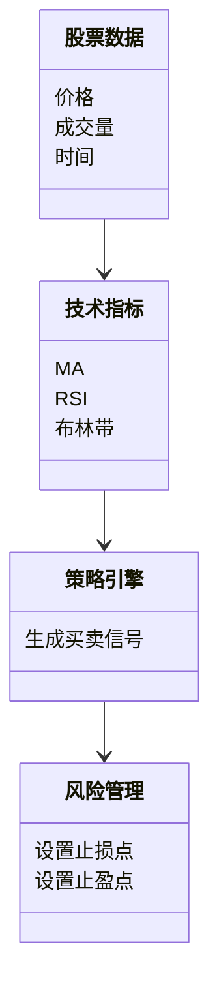
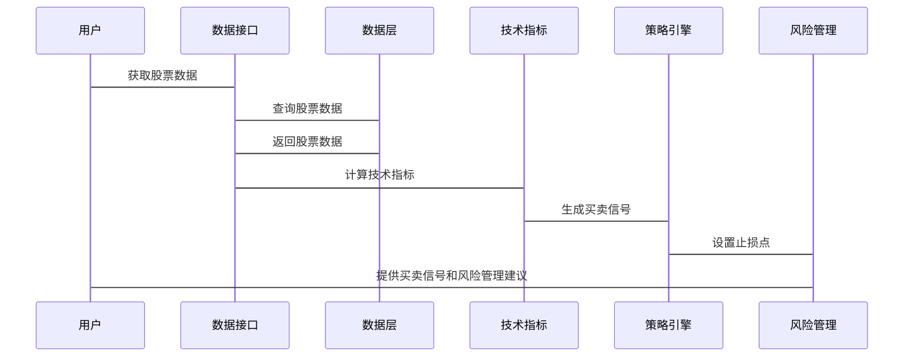

                 


# 如何将特价股票策略与技术分析相结合

## 关键词：特价股票策略、技术分析、投资策略、股票投资、技术指标、风险管理、市场分析

## 摘要：  
本文详细探讨了如何将特价股票策略与技术分析相结合，帮助投资者制定更有效的股票投资策略。文章从背景介绍、技术分析的原理与应用、特价股票策略的原理与应用入手，深入分析了两者结合的必要性、具体方法及实际案例。通过数学模型、系统架构设计和项目实战，本文为投资者提供了从理论到实践的完整指南，帮助其在股票市场中做出更明智的投资决策。

---

# 目录

1. [背景介绍](#背景介绍)
   - 1.1 特价股票策略与技术分析概述
   - 1.2 技术分析的基本概念
   - 1.3 特价股票策略与技术分析的结合

2. [技术分析的原理与应用](#技术分析的原理与应用)
   - 2.1 技术分析的核心原理
   - 2.2 技术分析的实战应用

3. [特价股票策略的原理与应用](#特价股票策略的原理与应用)
   - 3.1 特价股票策略的核心原理
   - 3.2 特价股票策略的实战应用

4. [技术分析与特价股票策略的结合](#技术分析与特价股票策略的结合)
   - 4.1 结合的必要性
   - 4.2 结合的具体方法
   - 4.3 实际案例分析

5. [数学模型与公式](#数学模型与公式)
   - 5.1 技术指标的数学模型
   - 5.2 特价股票策略的数学模型
   - 5.3 算法实现与代码示例

6. [系统分析与架构设计](#系统分析与架构设计)
   - 6.1 系统功能设计
   - 6.2 系统架构设计
   - 6.3 系统接口设计

7. [项目实战](#项目实战)
   - 7.1 项目背景与目标
   - 7.2 数据收集与预处理
   - 7.3 系统实现与测试
   - 7.4 项目总结与优化

8. [总结与最佳实践](#总结与最佳实践)
   - 8.1 全文总结
   - 8.2 投资策略建议
   - 8.3 风险管理注意事项
   - 8.4 拓展阅读与学习资源

---

## 背景介绍

### 1.1 特价股票策略与技术分析概述

#### 1.1.1 特价股票的定义  
特价股票通常指市盈率（P/E）或市净率（P/B）低于行业平均水平的股票。这些股票可能因为市场情绪不佳或暂时的负面新闻被低估，但具备长期投资价值。

#### 1.1.2 特价股票的分类  
- **周期性股票**：如制造业、能源行业的股票，价格波动较大，但在行业低谷时可能被低估。
- **成长型股票**：市盈率较高，但未来增长潜力大。
- **价值型股票**：市盈率和市净率均低于市场平均水平，通常属于成熟行业。

#### 1.1.3 特价股票的市场特点  
- **低估值**：市盈率和市净率低于市场平均水平。
- **高分红**：部分特价股票公司倾向于高分红，吸引价值投资者。
- **波动性**：价格波动较大，容易被市场忽视或低估。

---

### 1.2 技术分析的基本概念

#### 1.2.1 技术分析的定义  
技术分析是一种通过分析历史价格数据，预测未来价格走势的方法。它假设市场价格反映所有信息，并通过图表和指标来识别买卖信号。

#### 1.2.2 技术分析的核心假设  
1. **市场行为反映所有信息**：价格走势已经反映了所有相关信息，包括基本面和技术面。
2. **价格走势具有趋势性**：价格走势会形成趋势，并保持一段时间。
3. **历史价格具有重复性**：历史价格形态和模式会重复出现。

#### 1.2.3 技术分析与基本面分析的区别  
- **基本面分析**：侧重于公司财务状况、行业地位和盈利能力，预测股票的内在价值。
- **技术分析**：侧重于价格走势、交易量和市场情绪，预测短期价格波动。

---

### 1.3 特价股票策略与技术分析的结合

#### 1.3.1 结合的必要性  
- **捕捉低估机会**：通过技术分析识别被低估的股票。
- **降低风险**：结合技术分析和基本面分析，降低投资风险。
- **提升收益**：利用技术分析捕捉短期价格波动，提升投资收益。

#### 1.3.2 结合的优势  
- **双重验证**：通过基本面和技术面双重分析，提高选股的准确性。
- **动态调整**：根据技术指标变化，动态调整投资策略。

---

## 技术分析的原理与应用

### 2.1 技术分析的核心原理

#### 2.1.1 技术分析的基本假设  
- **价格反映所有信息**：技术分析假设市场价格已经反映了所有相关信息，包括基本面和技术面。
- **趋势的持续性**：价格走势会形成趋势，并在没有外部干预的情况下继续保持。
- **历史重复性**：历史价格形态和模式会重复出现。

#### 2.1.2 技术分析的核心工具  
- **K线图**：显示股票价格在某一时间段内的开盘价、收盘价、最高价和最低价。
- **移动平均线（MA）**：通过计算一定时间内价格的平均值，平滑价格波动，识别趋势。
- **相对强弱指数（RSI）**：衡量股票价格的超买或超卖状态，通常用于判断买卖信号。
- **布林带（Bollinger Bands）**：用于衡量价格的波动范围，判断价格的高低位。

---

### 2.2 技术分析的实战应用

#### 2.2.1 技术指标的综合运用  
- **移动平均线（MA）的交叉应用**：短期移动平均线（如5日MA）上穿长期移动平均线（如20日MA）通常被视为买入信号。
- **RSI与价格形态的结合**：当RSI显示超卖（低于30）且价格处于低位，可能是买入信号。
- **布林带与趋势的判断**：价格突破布林带上轨可能表示超买，价格突破布林带下轨可能表示超卖。

#### 2.2.2 技术分析在股票选择中的应用  
- **确定买入点**：通过技术指标和图表形态，寻找价格突破阻力位或形成买入信号。
- **确定卖出点**：当价格跌破支撑位或技术指标显示超买，可能是卖出信号。
- **确定止损点**：根据技术分析，设置止损点以控制风险。

---

## 特价股票策略的原理与应用

### 3.1 特价股票策略的核心原理

#### 3.1.1 低价股的投资逻辑  
- **价值低估**：部分股票由于市场情绪或短期因素被低估，具备长期投资价值。
- **周期性反弹**：周期性股票在行业低谷时被低估，具备反弹潜力。

#### 3.1.2 市盈率与市净率的分析  
- **市盈率（P/E）**：股价除以每股收益（EPS）的比率。低P/E比率通常意味着股票被低估。
- **市净率（P/B）**：股价除以每股净资产（BPS）的比率。低P/B比率通常意味着股票被低估。

#### 3.1.3 特价股票的套利机会  
- **跨市场套利**：同一股票在不同市场（如A股和港股）的价格差异，提供套利机会。
- **事件驱动套利**：公司并购、重组等事件可能导致股价短期波动，提供套利机会。

---

### 3.2 特价股票策略的实战应用

#### 3.2.1 特价股票的选择标准  
- **低市盈率股票**：选择P/E低于行业平均水平的股票。
- **低市净率股票**：选择P/B低于行业平均水平的股票。
- **股价低于净资产的股票**：选择股价低于每股净资产（BPS）的股票。

#### 3.2.2 特价股票策略的风险控制  
- **分散投资**：避免将所有资金投入到单一股票或行业，降低风险。
- **设置止损点**：根据技术分析，设置止损点以控制亏损。
- **定期复检**：定期检查投资组合，根据市场变化调整持仓。

---

## 技术分析与特价股票策略的结合

### 4.1 结合的必要性

#### 4.1.1 技术分析与基本面分析的结合  
- **双重验证**：通过技术分析和基本面分析双重验证，提高选股准确性。
- **动态调整**：根据技术指标变化，动态调整投资策略。

#### 4.1.2 技术分析在特价股票策略中的作用  
- **筛选低估股票**：通过技术分析识别价格低于内在价值的股票。
- **判断买卖时机**：通过技术指标确定买入和卖出时机。

### 4.2 结合的具体方法

#### 4.2.1 通过技术分析筛选  
- **价格形态**：选择价格形态如双底、头肩形等，表示股价可能反转。
- **技术指标**：选择RSI低于30、股价突破布林带下轨等，表示股价可能超卖。

#### 4.2.2 通过基本面分析验证  
- **行业分析**：选择行业处于低谷，具备反弹潜力的股票。
- **财务分析**：选择财务状况健康，具备长期投资价值的股票。

### 4.3 实际案例分析

#### 4.3.1 案例背景  
假设某股票A，市盈率10，市净率2，股价低于净资产，技术指标显示RSI为20，股价处于低位。

#### 4.3.2 技术分析信号  
- RSI显示超卖，股价可能反转。
- 布林带显示股价接近下轨，可能反弹。

#### 4.3.3 投资决策  
- 根据技术分析，判断股价可能反转，选择买入。

---

## 数学模型与公式

### 5.1 技术指标的数学模型

#### 5.1.1 移动平均线（MA）  
$$ MA_n = \frac{1}{n} \sum_{i=1}^{n} P_i $$
其中，\( P_i \) 是第 \( i \) 天的价格，\( n \) 是计算天数。

#### 5.1.2 相对强弱指数（RSI）  
$$ RSI = \frac{100}{1 + \frac{A}{B}} $$
其中，\( A \) 是上涨幅度的平均值，\( B \) 是下跌幅度的平均值。

#### 5.1.3 布林带  
$$ BB_{upper} = MA + z \times \sigma $$
$$ BB_{lower} = MA - z \times \sigma $$
其中，\( MA \) 是移动平均线，\( \sigma \) 是标准差，\( z \) 是系数（通常为2）。

### 5.2 特价股票策略的数学模型

#### 5.2.1 市盈率（P/E）  
$$ P/E = \frac{P}{EPS} $$
其中，\( P \) 是股价，\( EPS \) 是每股收益。

#### 5.2.2 市净率（P/B）  
$$ P/B = \frac{P}{BPS} $$
其中，\( P \) 是股价，\( BPS \) 是每股净资产。

### 5.3 算法实现与代码示例

#### 5.3.1 移动平均线计算  
```python
import pandas as pd

# 假设data是一个包含股票价格的DataFrame
n = 20
data['MA'] = data['Price'].rolling(n).mean()
```

#### 5.3.2 RSI计算  
```python
def calculate_rsi(data, period=14):
    # 计算上涨幅度和下跌幅度
    up = data['Price'].diff().fillna(0)
    down = -up
    up[up < 0] = 0
    down[down > 0] = 0
    
    # 计算平均上涨幅度和平均下跌幅度
    up_avg = up.rolling(period).mean()
    down_avg = down.rolling(period).mean()
    
    # 计算RSI
    rsi = 100 * (1 - (down_avg / (up_avg + down_avg)))
    return rsi

data['RSI'] = calculate_rsi(data)
```

---

## 系统分析与架构设计

### 6.1 系统功能设计

#### 6.1.1 系统功能模块  
- 数据采集模块：采集股票数据，包括价格、成交量等。
- 数据分析模块：计算技术指标，如MA、RSI、布林带。
- 策略执行模块：根据策略生成买卖信号。
- 风险管理模块：设置止损点和止盈点。

#### 6.1.2 领域模型（Mermaid 类图）  


### 6.2 系统架构设计

#### 6.2.1 系统架构（Mermaid 架构图）  
```mermaid
container 系统架构 {
    接口层
    服务层
    数据层
}
```

#### 6.2.2 系统接口设计  
- 数据接口：与数据源（如Yahoo Finance）对接，获取股票数据。
- 策略接口：与策略引擎对接，生成买卖信号。
- 风险管理接口：与风险管理模块对接，设置止损和止盈点。

### 6.3 系统交互设计

#### 6.3.1 交互流程（Mermaid 序列图）  


---

## 项目实战

### 7.1 项目背景与目标

#### 7.1.1 项目背景  
假设我们希望开发一个股票投资系统，结合特价股票策略与技术分析，帮助投资者制定投资策略。

#### 7.1.2 项目目标  
- 开发一个自动化股票投资系统。
- 实现技术分析和特价股票策略的结合。
- 提供买卖信号和风险管理建议。

### 7.2 数据收集与预处理

#### 7.2.1 数据来源  
- 数据来源：Yahoo Finance、Alpha Vantage等。
- 数据类型：历史价格、成交量、财务数据。

#### 7.2.2 数据预处理  
- 数据清洗：处理缺失值、异常值。
- 数据转换：将数据转换为易于分析的格式。

### 7.3 系统实现与测试

#### 7.3.1 系统实现  
```python
import pandas as pd
import numpy as np

# 数据采集
data = pd.read_csv('stock_data.csv')

# 数据预处理
data.dropna(inplace=True)

# 技术指标计算
def calculate_ma(data, n=20):
    return data['Price'].rolling(n).mean()

def calculate_rsi(data, period=14):
    up = data['Price'].diff().fillna(0)
    up[up < 0] = 0
    down = -up
    down[down > 0] = 0
    up_avg = up.rolling(period).mean()
    down_avg = down.rolling(period).mean()
    rsi = 100 * (1 - (down_avg / (up_avg + down_avg)))
    return rsi

data['MA'] = calculate_ma(data)
data['RSI'] = calculate_rsi(data)

# 生成买卖信号
buy_signals = data[data['RSI'] < 30]['Price'].index
sell_signals = data[data['RSI'] > 70]['Price'].index

# 风险管理
stop_loss = 0.05
take_profit = 0.10
```

#### 7.3.2 系统测试  
- 单元测试：测试技术指标计算是否正确。
- 集成测试：测试系统整体流程是否顺畅。

### 7.4 项目总结与优化

#### 7.4.1 项目总结  
- 成功开发了一个自动化股票投资系统。
- 系统结合了技术分析和特价股票策略。

#### 7.4.2 项目优化  
- 增加更多的技术指标，如MACD。
- 增加更多的风险管理策略，如凯利公式。

---

## 总结与最佳实践

### 8.1 全文总结

本文详细探讨了如何将特价股票策略与技术分析相结合，帮助投资者制定更有效的股票投资策略。通过技术分析和基本面分析的结合，投资者可以更准确地识别投资机会，降低投资风险，提升投资收益。

---

### 8.2 投资策略建议

1. **技术分析与基本面分析结合**：通过技术分析筛选股票，再通过基本面分析验证。
2. **分散投资**：避免将所有资金投入到单一股票或行业。
3. **动态调整**：根据市场变化和技术指标变化，动态调整投资组合。

---

### 8.3 风险管理注意事项

1. **设置止损点**：根据技术分析，设置止损点以控制亏损。
2. **控制仓位**：避免重仓操作，分散投资风险。
3. **关注市场情绪**：通过技术分析关注市场情绪变化，避免盲目投资。

---

### 8.4 拓展阅读与学习资源

1. **技术分析经典书籍**：《股票作手回忆录》、《技术分析的ABC》。
2. **投资策略书籍**：《巴菲特投资哲学》、《价值投资实战》。
3. **技术分析工具**：学习使用TradingView、MetaTrader等工具。

---

通过本文的学习，投资者可以更好地理解如何将特价股票策略与技术分析相结合，制定更有效的投资策略，实现长期稳定的收益。

