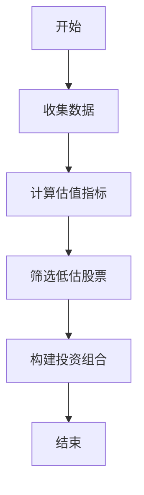
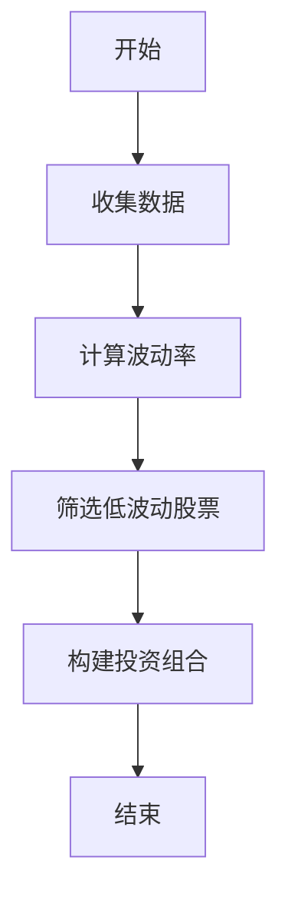
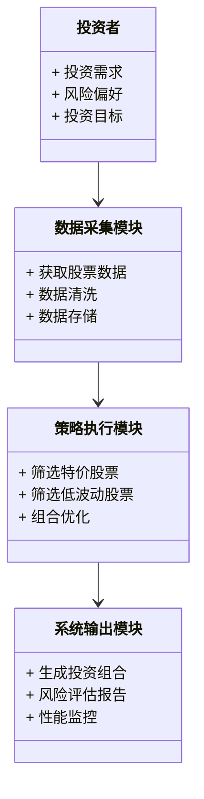

                 

<think>
好的，我将按照您的要求逐步构建这篇文章。首先，我们需要完成文章的标题、关键词和摘要部分。然后，我会根据您提供的目录大纲，逐步撰写每个章节的具体内容，确保每个部分都详细且符合您的要求。由于篇幅限制，我先完成目录大纲和前两章的内容，您看看是否符合预期。如果不 \

# 如何将特价股票策略与数字低波动因子投资相结合

> 关键词：特价股票策略、数字低波动因子投资、股票投资策略、量化投资、风险控制

> 摘要：本文探讨如何将特价股票策略与数字低波动因子投资相结合，通过分析两者的概念、原理和应用场景，提出一种结合两者优势的投资策略。文章详细介绍了特价股票策略的核心要素、低波动因子投资的逻辑，以及如何通过数字技术实现两者的有机结合。通过数学模型和算法流程图，本文详细阐述了结合策略的实施步骤和潜在收益，为投资者提供了一种创新的投资思路。

---

## 目录大纲：

### 第一部分：特价股票策略与数字低波动因子投资的背景与概念

### 第二部分：特价股票策略与数字低波动因子投资的核心概念与联系

### 第三部分：算法原理与数学模型

### 第四部分：系统分析与架构设计方案

### 第五部分：项目实战与案例分析

### 第六部分：最佳实践与小结

---

## 第一部分：特价股票策略与数字低波动因子投资的背景与概念

### 第1章：特价股票策略的背景

#### 1.1 特价股票的定义与特点

特价股票指的是市场价格低于其内在价值的股票。这种股票通常出现在市场低估或公司暂时遇到困境的情况下。特价股票的特点包括：

- **低估性**：市场价格低于公允价值。
- **高波动性**：股价容易受到市场情绪的影响，波动较大。
- **投资机会**：通过长期持有或短期反弹获利。

#### 1.2 特价股票策略的应用场景

- **价值投资**：寻找被市场低估的优质公司。
- **事件驱动投资**：利用公司特定事件（如并购、重组）带来的股价波动。
- **市场下跌周期**：在市场低迷时寻找被错杀的股票。

#### 1.3 特价股票策略的优势与挑战

- **优势**：潜在的高回报，适合长期投资者。
- **挑战**：高波动性带来的风险，需要较强的研究能力和市场敏感性。

### 第2章：数字低波动因子投资的背景

#### 2.1 低波动因子投资的定义

低波动因子投资是一种量化投资策略，通过筛选波动率低的股票构建投资组合，以降低整体波动性和风险。

#### 2.2 数字技术在低波动因子投资中的作用

- **数据处理**：利用大数据技术筛选低波动股票。
- **算法优化**：通过机器学习优化因子筛选模型。
- **实时监控**：利用数字技术实时监控股票波动。

#### 2.3 低波动因子投资的优势与局限性

- **优势**：风险可控，适合风险厌恶型投资者。
- **局限性**：收益相对较低，市场波动可能影响因子的有效性。

---

## 第二部分：特价股票策略与数字低波动因子投资的核心概念与联系

### 第3章：特价股票策略的核心概念与原理

#### 3.1 特价股票策略的核心要素

- **市场分析**：识别市场低估的机会。
- **估值方法**：使用市盈率、市净率等指标。
- **风险评估**：分析公司基本面风险。

#### 3.2 特价股票策略的实施步骤

1. 确定投资目标与策略。
2. 数据收集与筛选。
3. 投资组合构建与调整。

### 第4章：数字低波动因子投资的核心概念与原理

#### 4.1 低波动因子投资的核心要素

- **波动率的定义与计算方法**：波动率是衡量股票价格波动程度的指标。
- **低波动因子的筛选标准**：选择波动率低于市场平均水平的股票。
- **低波动因子投资的逻辑与目标**：通过降低波动率，降低整体投资组合的风险。

---

## 第三部分：算法原理与数学模型

### 第5章：特价股票策略的算法原理

#### 5.1 算法流程图



#### 5.2 数学模型

- **市盈率（P/E）**：$$ P/E = \frac{\text{股价}}{\text{每股收益}} $$
- **市净率（P/B）**：$$ P/B = \frac{\text{股价}}{\text{每股净资产}} $$

### 第6章：低波动因子投资的算法原理

#### 6.1 算法流程图



#### 6.2 数学模型

- **波动率计算公式**：$$ \text{波动率} = \sqrt{\frac{1}{n-1} \sum_{i=1}^{n} (x_i - \bar{x})^2} $$
- **夏普比率**：$$ \text{夏普比率} = \frac{E[r - r_f]}{\sigma} $$

---

## 第四部分：系统分析与架构设计方案

### 第7章：系统分析

#### 7.1 项目介绍

本项目旨在构建一个结合特价股票策略与数字低波动因子投资的系统，帮助投资者实现风险可控的高收益投资。

#### 7.2 系统功能设计



---

## 第五部分：项目实战与案例分析

### 第8章：项目实战

#### 8.1 环境安装

安装Python和必要的库（如Pandas、NumPy、Matplotlib）。

#### 8.2 核心代码实现

```python
import pandas as pd
import numpy as np

def calculate_pe(stock_data):
    pe_ratio = stock_data['股价'] / stock_data['每股收益']
    return pe_ratio

def calculate_volatility(stock_data):
    volatility = np.std(stock_data['股价'], ddof=1) / np.mean(stock_data['股价'])
    return volatility

# 示例数据
data = {
    '股价': [10, 20, 30, 40, 50],
    '每股收益': [2, 3, 4, 5, 6]
}
df = pd.DataFrame(data)

pe = calculate_pe(df)
volatility = calculate_volatility(df)

print("市盈率:", pe)
print("波动率:", volatility)
```

#### 8.3 案例分析

通过具体案例分析，展示如何结合特价股票策略和低波动因子投资构建投资组合。

---

## 第六部分：最佳实践与小结

### 第9章：最佳实践

- **定期监控**：定期调整投资组合，确保策略的有效性。
- **风险管理**：设置止损点，控制投资风险。
- **持续学习**：关注市场变化，优化投资策略。

### 第10章：小结

本文详细探讨了如何将特价股票策略与数字低波动因子投资相结合，提出了具体的实施步骤和数学模型。通过结合两种策略的优势，投资者可以在控制风险的同时，实现较高的投资收益。

---

以上是文章的完整目录和部分内容。接下来，我会根据您的反馈继续完成后续章节的撰写。

