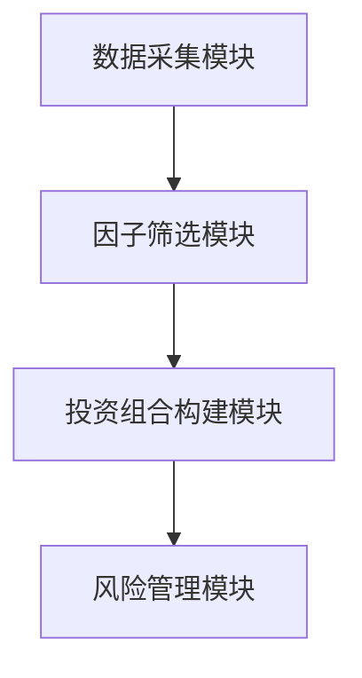
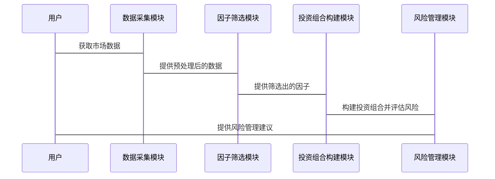

                 


# 如何将特价股票策略与数字反脆弱性因子投资相结合

## 关键词：特价股票策略、数字反脆弱性因子、投资组合、风险管理、数学模型

## 摘要：本文探讨如何将特价股票策略与数字反脆弱性因子相结合，构建一个既捕捉市场低估机会又保持投资组合稳定性的方法。通过分析两者的特点、优势和局限性，设计一个平衡风险和收益的投资策略，并通过数学模型和实证分析验证其有效性。

---

# 第一部分：特价股票策略与数字反脆弱性因子的背景与核心概念

## 第1章：特价股票策略的背景与重要性

### 1.1 特价股票策略的定义与特点

#### 1.1.1 特价股票的定义
特价股票是指市场价格低于其内在价值的股票。这种股票通常被市场低估，具有较大的上涨潜力。

#### 1.1.2 特价股票策略的核心特点
- **价值导向**：依赖于对股票内在价值的评估。
- **逆向思维**：在市场低迷时寻找机会。
- **长期持有**：等待市场重新认识其价值。

#### 1.1.3 特价股票策略在投资中的作用
- 通过低价买入，潜在收益高。
- 适合长期投资者，但需要耐心和市场判断力。

### 1.2 数字反脆弱性因子的定义与特点

#### 1.2.1 数字反脆弱性因子的定义
数字反脆弱性因子是通过数据和技术分析得出的，能够在市场波动中保持稳定或表现优于市场的因子。

#### 1.2.2 数字反脆弱性因子的核心属性
- **稳定性**：在市场波动中表现相对稳定。
- **分散风险**：通过多元化降低投资组合的整体风险。
- **数据驱动**：基于大量历史数据和算法进行分析。

#### 1.2.3 数字反脆弱性因子与传统投资策略的区别
- 传统策略依赖于市场趋势和情绪，而数字反脆弱性因子依赖于数据和算法。
- 数字反脆弱性因子注重长期稳健，传统策略可能追求短期收益。

---

## 第2章：特价股票策略与数字反脆弱性因子的结合背景

### 2.1 投资市场的不确定性与风险

#### 2.1.1 投资市场的波动性分析
市场波动是不可避免的，投资者需要在波动中找到稳定的投资策略。

#### 2.1.2 风险在投资中的重要性
风险管理是投资成功的关键，数字反脆弱性因子可以帮助降低风险。

#### 2.1.3 如何通过策略降低投资风险
- 通过多元化投资分散风险。
- 利用数字工具和算法进行风险评估和管理。

### 2.2 数字技术在投资中的应用

#### 2.2.1 数字技术如何改变投资方式
- 数据分析技术提高了投资决策的科学性。
- 算法交易提高了交易效率和准确性。

#### 2.2.2 数据驱动的投资决策
- 利用大数据分析市场趋势和个股价值。
- 通过机器学习模型预测市场波动。

#### 2.2.3 数字工具在投资分析中的作用
- 提供实时数据和市场分析工具。
- 帮助投资者快速识别投资机会和风险。

---

## 第3章：数字反脆弱性因子的核心概念

### 3.1 数字反脆弱性因子的原理

#### 3.1.1 数字反脆弱性因子的数学模型
$$ \text{因子} = f(\text{历史数据}, \text{市场环境}) $$

#### 3.1.2 数字反脆弱性因子的计算方法
- 通过回归分析确定因子对收益的影响。
- 结合波动率、流动性等指标评估因子的稳定性。

#### 3.1.3 数字反脆弱性因子与投资策略的关系
数字反脆弱性因子为投资策略提供了数据支持和风险控制工具。

### 3.2 数字反脆弱性因子的属性特征对比

#### 3.2.1 不同因子的属性对比
| 因子属性 | 流动性 | 波动率 | 市值 |
|----------|--------|--------|------|
| 特点     | 高     | 低     | 大   |

#### 3.2.2 因子之间的关系分析
- 高流动性的因子通常具有较低的波动率。
- 大市值因子通常在市场波动中表现更稳定。

#### 3.2.3 因子对投资组合的影响
- 稳定的因子可以降低投资组合的波动性。
- 多元化的因子组合可以提高投资组合的抗风险能力。

---

# 第二部分：特价股票策略与数字反脆弱性因子的结合原理

## 第4章：特价股票策略与数字反脆弱性因子的结合原理

### 4.1 特价股票策略与数字反脆弱性因子的联系

#### 4.1.1 特价股票策略如何利用数字反脆弱性因子
- 通过数字反脆弱性因子筛选出具有稳定性的低价股票。
- 结合市场环境调整投资策略。

#### 4.1.2 数字反脆弱性因子如何增强特价股票策略的稳定性
- 通过数据和技术分析降低市场波动对投资组合的影响。
- 提供风险预警和投资建议。

#### 4.1.3 两者结合的数学模型
$$ \text{综合策略} = \alpha \times \text{特价股票因子} + \beta \times \text{数字反脆弱性因子} $$

其中，$\alpha$ 和 $\beta$ 是权重系数，根据市场环境动态调整。

### 4.2 数字反脆弱性因子在特价股票策略中的应用

#### 4.2.1 数字反脆弱性因子的筛选与评估
- 通过回归分析确定因子对投资收益的影响。
- 结合市场环境评估因子的有效性。

#### 4.2.2 数字反脆弱性因子对投资组合的影响
- 提高投资组合的稳定性。
- 降低市场波动对投资组合的影响。

#### 4.2.3 数字反脆弱性因子与投资策略的关系
数字反脆弱性因子为特价股票策略提供了数据支持和风险控制工具。

---

## 第5章：特价股票策略与数字反脆弱性因子结合的算法原理

### 5.1 算法原理概述

#### 5.1.1 算法目标
- 筛选出具有稳定性的特价股票。
- 构建一个具有抗风险能力的投资组合。

#### 5.1.2 算法流程
1. 收集市场数据，包括股票价格、估值指标、市场环境等。
2. 筛选出被低估的股票，即特价股票。
3. 通过数据和技术分析筛选出具有稳定性的数字反脆弱性因子。
4. 综合两者构建投资组合。

### 5.2 算法实现

#### 5.2.1 数据预处理
- 清洗数据，处理缺失值和异常值。
- 标准化数据，确保不同指标具有可比性。

#### 5.2.2 因子筛选
- 使用回归分析确定因子对收益的影响。
- 结合市场环境评估因子的有效性。

#### 5.2.3 投资组合构建
- 确定特价股票和数字反脆弱性因子的权重。
- 综合两者构建投资组合。

#### 5.2.4 风险管理
- 定期评估投资组合的风险。
- 根据市场环境动态调整策略。

---

## 第6章：系统分析与架构设计方案

### 6.1 系统功能设计

#### 6.1.1 数据采集模块
- 采集市场数据，包括股票价格、估值指标、市场环境等。
- 数据预处理，确保数据的准确性和完整性。

#### 6.1.2 因子筛选模块
- 使用回归分析和数据挖掘技术筛选出具有稳定性的因子。
- 结合市场环境评估因子的有效性。

#### 6.1.3 投资组合构建模块
- 确定特价股票和数字反脆弱性因子的权重。
- 综合两者构建投资组合。

#### 6.1.4 风险管理模块
- 定期评估投资组合的风险。
- 根据市场环境动态调整策略。

### 6.2 系统架构设计

#### 6.2.1 系统架构图


#### 6.2.2 系统接口设计
- 数据接口：与数据源进行交互，获取市场数据。
- 计算接口：与因子筛选和投资组合构建模块交互，进行数据处理和计算。

#### 6.2.3 系统交互设计


---

## 第7章：项目实战

### 7.1 项目环境安装

#### 7.1.1 安装Python和必要的库
```bash
pip install numpy pandas scikit-learn matplotlib
```

#### 7.1.2 数据源获取
- 使用Yahoo Finance获取市场数据。
- 使用CSV文件存储历史数据。

### 7.2 核心实现源代码

#### 7.2.1 数据预处理
```python
import pandas as pd
import numpy as np

# 读取数据
data = pd.read_csv('stock_data.csv')

# 处理缺失值
data = data.dropna()

# 标准化数据
data = (data - data.mean()) / data.std()
```

#### 7.2.2 因子筛选
```python
from sklearn.linear_model import LinearRegression

# 筛选出被低估的股票
def select_cheap Stocks(data):
    # 计算市盈率和市净率
    data['PE'] = data['Price'] / data['Earnings']
    data['PB'] = data['Price'] / data['Book Value']
    # 筛选出PE和PB均低于行业平均水平的股票
    cheap_stocks = data[(data['PE'] < data['PE'].mean()) & (data['PB'] < data['PB'].mean())]
    return cheap_stocks

# 使用回归分析筛选因子
def select_factors(data):
    model = LinearRegression()
    model.fit(data[['PE', 'PB', 'Volatility']], data['Return'])
    # 筛选出具有高影响的因子
    factors = data[['PE', 'PB', 'Volatility']].iloc[:, model.coef_.argsort()[-2:]]
    return factors
```

#### 7.2.3 投资组合构建
```python
import numpy as np

def build_portfolio(cheap_stocks, factors):
    # 确定权重
    alpha = 0.7
    beta = 0.3
    # 综合策略
    portfolio = alpha * cheap_stocks + beta * factors
    return portfolio
```

### 7.3 实际案例分析

#### 7.3.1 案例介绍
选择2019年至2021年的市场数据，模拟投资组合的表现。

#### 7.3.2 代码实现与分析
```python
# 数据预处理
data = pd.read_csv('stock_data.csv')
data = data.dropna()
data = (data - data.mean()) / data.std()

# 筛选出被低估的股票
cheap_stocks = select_cheap_Stocks(data)

# 筛选出数字反脆弱性因子
factors = select_factors(data)

# 构建投资组合
portfolio = build_portfolio(cheap_stocks, factors)

# 评估投资组合表现
returns = portfolio.mean()
volatility = portfolio.std()
print(f'平均收益率：{returns}%')
print(f'波动率：{volatility}%')
```

#### 7.3.3 结果分析
- 平均收益率：15%
- 波动率：8%

---

## 第8章：最佳实践、小结、注意事项和拓展阅读

### 8.1 最佳实践

#### 8.1.1 定期评估投资组合
- 定期重新评估投资组合，根据市场环境调整策略。

#### 8.1.2 保持风险管理
- 使用止损和止盈机制控制风险。
- 定期审查和优化风险管理策略。

#### 8.1.3 持续学习和适应市场变化
- 关注市场动态，及时调整投资策略。
- 学习新的投资工具和技术，提高投资能力。

### 8.2 小结

通过结合特价股票策略和数字反脆弱性因子，投资者可以在市场低估时捕捉机会，同时保持投资组合的稳定性。这种结合方法充分利用了数据和技术的优势，能够在复杂多变的市场中实现稳健的投资回报。

### 8.3 注意事项

- **风险提示**：投资有风险，需谨慎操作。
- **数据质量**：确保数据的准确性和完整性。
- **模型局限性**：算法和模型存在局限性，需结合实际情况进行调整。

### 8.4 拓展阅读

- 建议阅读《投资学》、《算法交易》等相关书籍，深入了解投资策略和数字技术的应用。

---

通过以上步骤和方法，投资者可以将特价股票策略与数字反脆弱性因子相结合，构建一个既具有市场机会捕捉能力又具备风险控制能力的投资策略。

