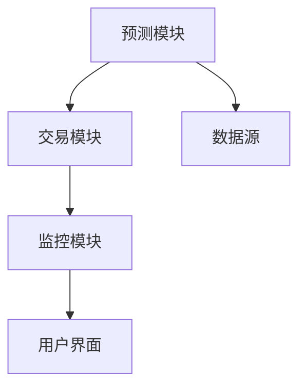

                 


# 如何将特价股票策略与数字资产合成代币投资结合

## 关键词：特价股票策略，数字资产合成代币，投资策略，量化交易，系统架构

## 摘要：本文探讨如何将特价股票策略与数字资产合成代币投资结合，分析其核心概念、算法原理、系统架构，并通过实际案例展示其应用。文章详细阐述了两者的结合背景、市场现状、数学模型、代码实现及最佳实践。

---

# 第1章 特价股票策略与数字资产合成代币概述

## 1.1 特价股票策略的基本概念

### 1.1.1 特价股票的定义与特点
特价股票是指价格波动较大、交易量较小的股票，通常用于高频交易或短期投资。其特点包括高波动性、低流动性、高风险和高回报。

### 1.1.2 特价股票交易的基本原理
特价股票交易通过高频算法分析市场数据，寻找短期价格波动机会。常用策略包括套利、趋势跟踪和均值回归。

### 1.1.3 特价股票与传统股票投资的区别
特价股票交易注重短期价格波动，而传统股票投资注重长期价值。前者风险高、回报快，后者风险较低、回报周期长。

## 1.2 数字资产合成代币的基本概念

### 1.2.1 数字资产合成代币的定义
合成代币是将多种资产（如股票、加密货币、指数）结合的数字资产，通常通过智能合约发行。

### 1.2.2 合成代币的类型与特点
合成代币分为挂钩型（如USD Coin）、资产型（如黄金代币）和算法型（如稳定币）。其特点包括高流动性、透明性和可编程性。

### 1.2.3 合成代币与传统金融工具的对比
合成代币具有更高的透明度和可编程性，而传统金融工具如ETF需要通过中间机构发行。

## 1.3 特价股票策略与数字资产合成代币的结合

### 1.3.1 两者的结合背景
数字资产的兴起和区块链技术的发展为金融创新提供了新机遇，特价股票策略与合成代币的结合成为可能。

### 1.3.2 结合的潜在优势
结合两者可实现资产多样化、降低风险、提高流动性，同时利用智能合约实现自动化投资。

### 1.3.3 结合的可能风险与挑战
价格波动风险、智能合约漏洞、监管不确定性等是主要风险。

## 1.4 本章小结

---

# 第2章 特价股票策略与数字资产合成代币的市场现状

## 2.1 特价股票市场的现状分析

### 2.1.1 特价股票市场的规模与发展趋势
全球特价股票市场规模庞大，随着算法交易的普及，市场进一步扩大。

### 2.1.2 特价股票市场的参与者分析
参与者包括高频交易机构、算法交易员和散户投资者。

### 2.1.3 特价股票市场的监管现状
各国监管力度不一，部分国家已出台严格法规。

## 2.2 数字资产合成代币的市场现状

### 2.2.1 数字资产合成代币的市场规模
合成代币市场规模增长迅速，尤其在DeFi领域应用广泛。

### 2.2.2 数字资产合成代币的主要平台与项目
主要平台包括Uniswap、Compound等，知名项目有DAI、WBTC等。

### 2.2.3 数字资产合成代币的监管与法律问题
监管不确定性是合成代币发展面临的最大挑战。

## 2.3 两者的结合对市场的影响

### 2.3.1 对传统金融市场的潜在影响
可能改变传统金融市场的交易方式和资产配置。

### 2.3.2 对数字资产市场的潜在影响
推动数字资产的机构化和合规化发展。

### 2.3.3 对投资者行为的影响
投资者将有更多选择，但也面临更高的风险。

## 2.4 本章小结

---

# 第3章 特价股票策略与数字资产合成代币的核心概念与联系

## 3.1 特价股票策略的核心原理

### 3.1.1 特价股票的定价机制
基于市场供需、算法模型和交易数据。

### 3.1.2 特价股票的交易策略
包括高频交易、套利和统计套利。

### 3.1.3 特价股票的风险管理
通过动态调整头寸和风险对冲工具进行管理。

## 3.2 数字资产合成代币的核心原理

### 3.2.1 合成代币的生成与发行机制
通过智能合约生成，需 collateral 支持。

### 3.2.2 合成代币的流动性管理
依赖去中心化交易所和流动性提供者。

### 3.2.3 合成代币的价值评估
基于锚定资产的市场价值和智能合约的透明度。

## 3.3 两者的结合原理

### 3.3.1 特价股票与合成代币的关联性分析
合成代币可作为特价股票的替代投资工具。

### 3.3.2 合成代币在特价股票投资中的应用
通过合成代币实现资产的分散化和风险管理。

### 3.3.3 两者的结合对投资策略的影响
投资者可利用合成代币进行跨市场套利和风险对冲。

## 3.4 本章小结

---

# 第4章 特价股票策略与数字资产合成代币的算法原理

## 4.1 算法原理概述

### 4.1.1 特价股票预测模型
基于LSTM的算法，用于预测股票价格波动。

### 4.1.2 合成代币生成算法
通过智能合约生成合成代币，并进行流动性挖矿。

## 4.2 数学模型与公式

### 4.2.1 特价股票价格预测模型
$$ P(t) = \alpha P(t-1) + \beta \epsilon(t) $$

### 4.2.2 合成代币的价值计算
$$ V = \frac{P}{L} $$
其中，P为锚定资产价格，L为流动性深度。

## 4.3 算法实现

### 4.3.1 特价股票预测代码
```python
import numpy as np
from sklearn.metrics import mean_squared_error

# 示例代码：使用LSTM预测股票价格
def predict_stock_price(data, model):
    predictions = []
    for i in range(len(data)):
        pred = model.predict(data[i])
        predictions.append(pred)
    return predictions

# 计算均方误差
def evaluate_model(actual, predicted):
    return mean_squared_error(actual, predicted)
```

### 4.3.2 合成代币生成代码
```python
from web3 import Web3

# 示例代码：通过智能合约生成合成代币
def create_synthetic_token(web3_provider, token_name, token_symbol):
    contract = web3_provider.eth.contract(address=contract_address, abi=abi)
    tx = contract.functions.issue(token_name, token_symbol).transact()
    receipt = web3_provider.eth.waitForTransactionReceipt(tx)
    return receipt
```

## 4.4 本章小结

---

# 第5章 特价股票策略与数字资产合成代币的系统架构设计

## 5.1 系统功能设计

### 5.1.1 预测模块
负责特价股票价格预测和合成代币价值评估。

### 5.1.2 交易模块
实现自动化的交易执行和风险管理。

### 5.1.3 监控模块
实时监控市场数据和系统状态。

## 5.2 系统架构图


## 5.3 接口设计

### 5.3.1 预测模块接口
```json
{
    "type": "预测模块",
    "input": {
        "stock_data": "数组"
    },
    "output": {
        "prediction": "数组"
    }
}
```

### 5.3.2 交易模块接口
```json
{
    "type": "交易模块",
    "input": {
        "order": "订单对象"
    },
    "output": {
        "tx_hash": "字符串"
    }
}
```

## 5.4 本章小结

---

# 第6章 特价股票策略与数字资产合成代币的项目实战

## 6.1 环境安装

### 6.1.1 安装Python环境
使用Anaconda安装Python 3.8以上版本。

### 6.1.2 安装区块链开发工具
安装Web3.py和Solidity编译器。

## 6.2 核心代码实现

### 6.2.1 预测模块代码
```python
import pandas as pd
import numpy as np
from sklearn.model_selection import train_test_split

# 示例代码：股票价格预测
data = pd.read_csv('stock_data.csv')
X_train, X_test, y_train, y_test = train_test_split(data['close'], data['close'].shift(1))
model = LinearRegression()
model.fit(X_train.reshape(-1, 1), y_train)
预测结果 = model.predict(X_test.reshape(-1, 1))
```

### 6.2.2 合成代币生成代码
```python
from web3 import Web3
from brownie import Contract

# 示例代码：生成合成代币
web3 = Web3(Web3.HTTPProvider('http://localhost:8545'))
contract = Contract.from_abi('SyntheticToken', '0x...', abi)
tx = contract.mint('MyToken', 'MT', 1000)
```

## 6.3 案例分析

### 6.3.1 案例背景
假设某公司股价波动剧烈，适合合成代币投资。

### 6.3.2 实施步骤
1. 数据收集与清洗
2. 模型训练与预测
3. 合成代币生成与交易
4. 监控与调整

## 6.4 项目小结

---

# 第7章 特价股票策略与数字资产合成代币的投资策略与最佳实践

## 7.1 投资策略

### 7.1.1 风险管理
设定止损和止盈点，分散投资。

### 7.1.2 资产配置
根据市场情况调整股票和合成代币的比例。

## 7.2 最佳实践

### 7.2.1 定期复盘
分析交易结果，优化模型和策略。

### 7.2.2 注意监管变化
及时了解相关法律法规，避免合规风险。

## 7.3 注意事项

### 7.3.1 避免过度杠杆
防止因价格波动导致的巨额亏损。

### 7.3.2 确保代码安全
防范智能合约漏洞和攻击。

## 7.4 拓展阅读

### 7.4.1 推荐书籍
- 《算法交易：取胜华尔街的另类投资方法》
- 《区块链：数字革命的下一个十年》

### 7.4.2 推荐博客
- QuantInst.blog
- CryptoPanic.com

## 7.5 本章小结

---

# 第8章 总结与展望

## 8.1 总结
本文详细探讨了特价股票策略与数字资产合成代币的结合，分析了其核心概念、算法原理和系统架构，并通过案例展示了实际应用。

## 8.2 展望
未来随着技术进步和市场发展，两者结合将更加紧密，可能催生新的投资模式和工具。

## 8.3 结束语
投资者需谨慎对待，结合自身风险承受能力制定合理的投资策略。

--- 

**摘要：**本文系统分析了如何将特价股票策略与数字资产合成代币投资结合，涵盖了背景、核心概念、算法原理、系统架构、项目实战和最佳实践等方面，为投资者和开发者提供了深入的指导和参考。

