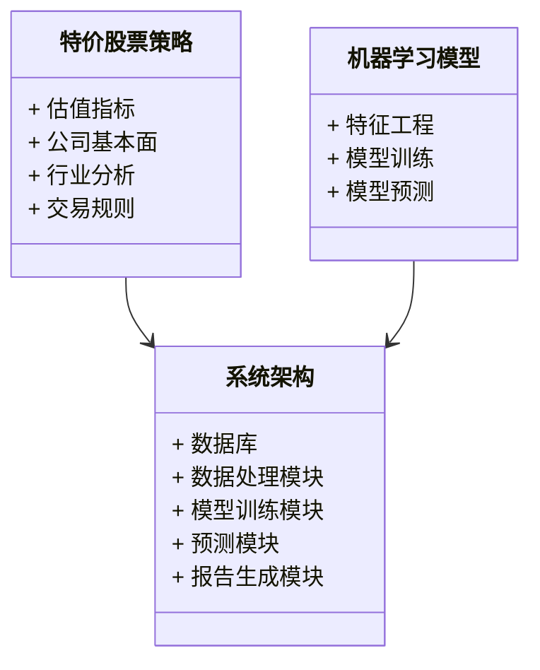

                 


# 如何将特价股票策略与机器学习优化策略相结合

> 关键词：特价股票，机器学习，股票策略，优化策略，金融分析

> 摘要：本文将详细介绍如何将特价股票策略与机器学习优化策略相结合，通过系统地分析和优化，提升股票投资的效率和收益。文章从背景、理论、算法、系统设计到项目实战，全面覆盖相关知识点，帮助读者掌握结合两种策略的核心方法。

---

# 第一部分: 特价股票策略与机器学习优化策略概述

## 第1章: 特价股票策略的核心概念

### 1.1 什么是特价股票策略

#### 1.1.1 特价股票的定义与特征

特价股票指的是市场价格低于其内在价值的股票。其核心特征包括：

- **低估值**：市场价格低于账面价值、现金流价值或行业平均水平。
- **高安全边际**：价格下跌空间有限，风险较小。
- **长期潜力**：具备持续增长的潜力，能够在未来释放价值。

#### 1.1.2 价值投资的基本原理

价值投资强调购买被市场低估的资产，核心理念是寻找市场先生的错误定价。主要原则包括：

1. **安全边际**：买入价格低于内在价值。
2. **长期视角**：关注企业的长期盈利能力。
3. **分散投资**：降低风险，避免过度集中。

#### 1.1.3 特价股票策略的核心要素

- **估值方法**：如市盈率、市净率、股息率等。
- **行业分析**：选择具有增长潜力的行业。
- **公司基本面**：关注财务状况、管理团队、竞争优势等。

### 1.2 机器学习的基本原理

#### 1.2.1 机器学习的定义与特点

机器学习是通过数据训练模型，使其能够进行预测或决策的技术。其特点包括：

- **数据驱动**：依赖大量数据进行训练。
- **自动化学习**：模型能够自动调整参数以优化性能。
- **泛化能力**：能够处理未见过的数据。

#### 1.2.2 机器学习在金融领域的应用

- **股票预测**：利用历史数据预测股价走势。
- **风险评估**：评估投资组合的风险。
- **交易策略优化**：通过算法优化交易决策。

#### 1.2.3 机器学习与股票策略的结合点

- **数据处理**：处理大量非结构化数据，如新闻、社交媒体。
- **模式识别**：识别市场中的隐藏模式和趋势。
- **预测与优化**：预测股价走势并优化投资组合。

---

## 第2章: 机器学习在股票分析中的应用

### 2.1 特征工程在股票分析中的作用

#### 2.1.1 特征选择的基本原理

特征选择是通过筛选重要特征来提高模型性能的过程。常用方法包括：

- **过滤法**：基于统计指标（如卡方检验）筛选特征。
- **包裹法**：通过训练模型评估特征的重要性。
- **嵌入法**：利用模型本身的权重评估特征重要性。

#### 2.1.2 时间序列数据的特征提取

时间序列数据的特征包括：

- **均值与方差**：衡量数据的集中趋势和离散程度。
- **趋势与周期性**：提取数据中的趋势和周期性成分。
- **波动率**：衡量数据的波动程度。

#### 2.1.3 文本数据的特征提取

文本数据的特征提取方法包括：

- **词袋模型**：将文本转化为词袋表示。
- **TF-IDF**：计算词的重要性。
- **词嵌入**：如Word2Vec，将词转化为向量表示。

### 2.2 机器学习模型在股票预测中的应用

#### 2.2.1 监督学习模型

- **线性回归**：用于预测连续型目标变量。
- **支持向量机（SVM）**：用于分类和回归任务。
- **随机森林**：用于分类和回归，具有高准确性。

#### 2.2.2 非监督学习模型

- **聚类分析**：将股票按相似性分组。
- **主成分分析（PCA）**：降低数据维度。

#### 2.2.3 强化学习模型

- **策略网络**：通过强化学习优化交易策略。
- **深度强化学习**：使用深度神经网络进行复杂决策。

---

## 第3章: 特价股票策略与机器学习优化策略的结合

### 3.1 特价股票策略的优化需求

#### 3.1.1 传统特价股票策略的局限性

- **主观性**：依赖个人判断，可能存在偏差。
- **数据量有限**：难以覆盖全市场。
- **效率低下**：手动筛选耗时耗力。

#### 3.1.2 机器学习优化的必要性

- **数据驱动**：利用大数据提高筛选效率。
- **自动化**：减少人为干预，降低错误率。
- **动态调整**：根据市场变化实时优化策略。

#### 3.1.3 组合策略的优势

- **多样性**：结合多个模型和策略，降低风险。
- **适应性**：能够快速响应市场变化。

### 3.2 机器学习优化策略的核心思路

#### 3.2.1 数据驱动的优化方法

- **数据清洗**：处理缺失值、异常值。
- **特征工程**：提取关键特征，如技术指标、财务指标。
- **模型训练**：训练分类或回归模型，预测股票表现。

#### 3.2.2 模型驱动的优化方法

- **模型融合**：结合多个模型的预测结果，提高准确性。
- **超参数优化**：通过网格搜索或随机搜索优化模型参数。

#### 3.2.3 多目标优化的实现

- **目标函数设计**：定义多个优化目标，如收益最大化、风险最小化。
- **优化算法选择**：使用遗传算法、粒子群优化等方法。

---

## 第4章: 机器学习优化策略的实现步骤

### 4.1 数据收集与预处理

#### 4.1.1 数据来源的选择

- **公开数据**：如Yahoo Finance、Google Finance。
- **内部数据**：公司内部数据库。
- **第三方API**：如Alpha Vantage、Quandl。

#### 4.1.2 数据清洗与标准化

- **处理缺失值**：删除或插值处理。
- **标准化**：将数据标准化到相同范围。
- **去重**：去除重复数据。

#### 4.1.3 数据特征的选择与工程化

- **特征选择**：基于统计指标或模型重要性选择特征。
- **特征工程**：创建新特征，如移动平均线、相对强弱指数。

### 4.2 模型训练与优化

#### 4.2.1 模型选择与调参

- **选择模型**：根据数据类型和任务选择合适模型。
- **调整参数**：通过网格搜索或随机搜索优化模型参数。

#### 4.2.2 模型评估与验证

- **划分数据集**：训练集、验证集、测试集。
- **评估指标**：准确率、召回率、F1分数、ROC曲线等。

#### 4.2.3 模型部署与监控

- **部署模型**：将模型部署到生产环境。
- **监控性能**：定期评估模型性能，更新模型。

---

## 第5章: 特价股票策略与机器学习优化策略的系统架构

### 5.1 系统功能设计

#### 5.1.1 领域模型（Mermaid 类图）



#### 5.1.2 系统架构设计（Mermaid 架构图）


---

## 第6章: 项目实战

### 6.1 环境安装与配置

- **Python安装**：安装Python 3.x。
- **库安装**：使用pip安装numpy、pandas、scikit-learn、xgboost等库。
- **数据获取**：获取股票数据，如使用Yahoo Finance API。

### 6.2 核心代码实现

#### 6.2.1 数据预处理

```python
import pandas as pd
import numpy as np

# 加载数据
df = pd.read_csv('stock_data.csv')

# 处理缺失值
df = df.dropna()

# 标准化
from sklearn.preprocessing import StandardScaler
scaler = StandardScaler()
df_scaled = pd.DataFrame(scaler.fit_transform(df))
```

#### 6.2.2 特征工程

```python
# 特征选择
from sklearn.feature_selection import SelectKBest, chi2

selector = SelectKBest(score_func=chi2, k=5)
selected_features = selector.fit_transform(df_scaled)
```

#### 6.2.3 模型训练与优化

```python
from sklearn.ensemble import RandomForestClassifier
from sklearn.model_selection import GridSearchCV

# 超参数优化
param_grid = {
    'n_estimators': [100, 200],
    'max_depth': [None, 10, 20],
}

grid_search = GridSearchCV(RandomForestClassifier(), param_grid, cv=5)
grid_search.fit(X_train, y_train)
best_model = grid_search.best_estimator_
```

#### 6.2.4 模型部署与监控

```python
# 部署模型
import joblib

joblib.dump(best_model, 'model.pkl')

# 监控性能
from sklearn.metrics import accuracy_score

y_pred = best_model.predict(X_test)
print(f'Accuracy: {accuracy_score(y_test, y_pred)}')
```

### 6.3 案例分析与结果解读

通过实际案例分析，展示如何利用机器学习优化特价股票策略，包括数据收集、特征工程、模型训练、结果分析等步骤。结合实际结果，解读模型的表现和优化方向。

---

## 第7章: 最佳实践与小结

### 7.1 最佳实践

- **数据质量**：确保数据准确、完整。
- **模型选择**：根据任务选择合适模型。
- **持续优化**：定期更新模型和策略。

### 7.2 小结

本文详细介绍了如何将特价股票策略与机器学习优化策略相结合，从理论到实践，帮助读者掌握结合两种策略的核心方法。通过实际案例和系统架构设计，展示了如何利用机器学习提升股票投资的效率和收益。

### 7.3 注意事项

- **数据隐私**：确保数据来源合法，保护隐私。
- **风险控制**：合理分散投资，避免过度集中。
- **模型局限性**：认识到模型的局限性，结合人工判断。

### 7.4 拓展阅读

- **书籍**：《Python机器学习》、《股票技术分析实战》。
- **网站**：Kaggle、Towards Data Science。
- **工具**：Python、Jupyter Notebook、TensorFlow。

---

通过以上目录和内容安排，读者可以系统地学习如何将特价股票策略与机器学习优化策略相结合，提升股票投资的效率和收益。

