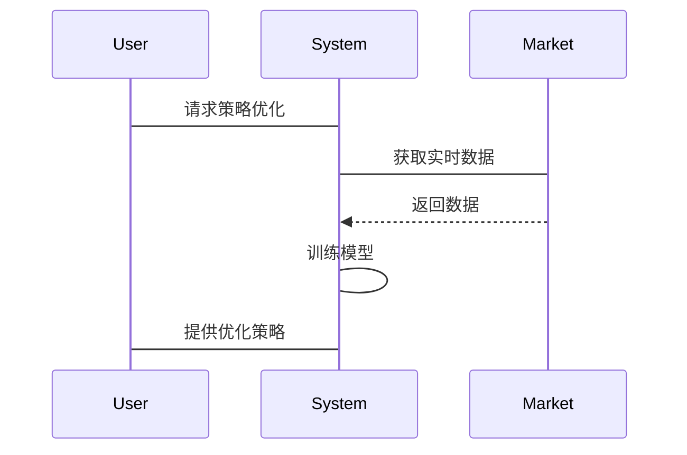

                 


# 如何将特价股票策略与深度强化学习资产配置相结合

## 关键词：特价股票策略，深度强化学习，资产配置，金融投资，机器学习

## 摘要：本文探讨了如何将特价股票策略与深度强化学习相结合，用于优化资产配置。通过分析特价股票的特性，结合深度强化学习的算法优势，提出了一种创新的投资策略，旨在提升投资回报率和风险控制能力。

---

## 第1章：背景与目标

### 1.1 问题背景

#### 1.1.1 特价股票策略的定义与挑战
- **特价股票**：指市场价格低于其内在价值的股票，常见于低市盈率或低市净率的公司。
- **挑战**：市场波动、信息不全、时机选择等都影响策略效果。

#### 1.1.2 深度强化学习在金融领域的应用潜力
- **深度强化学习**：通过智能体与环境互动，学习最优策略。
- **优势**：适用于动态环境，适合复杂决策问题。

### 1.2 问题描述
- **传统资产配置的局限性**：依赖经验，难以应对市场变化。
- **强化学习的应用目标**：优化投资决策，提高收益，降低风险。

### 1.3 问题解决
- **解决方案**：结合特价股票策略与深度强化学习，构建智能投资系统。
- **创新点**：利用机器学习提升策略的适应性和决策效率。

### 1.4 边界与外延
- **适用场景**：适用于中长期投资，不适用于高频交易。
- **对比分析**：与传统投资策略和纯量化模型的优缺点对比。

### 1.5 概念结构与核心要素
- **层次结构**：从市场数据到策略执行的层次化结构。
- **要素关系**：数据、模型、策略三者相互作用。

---

## 第2章：特价股票策略

### 2.1 核心原理
- **筛选方法**：基于市盈率、市净率等指标筛选股票。
- **投资组合管理**：定期调整持仓，分散风险。

### 2.2 核心概念属性对比
- **表格对比**：比较价值投资、成长投资等策略的优缺点。

### 2.3 ER实体关系图
- **Mermaid图**：展示策略、股票、市场之间的关系。

---

## 第3章：深度强化学习

### 3.1 原理与模型
- **基本概念**：状态、动作、奖励、策略函数。
- **常用模型**：DQN、PPO、A2C等。

### 3.2 核心概念属性对比
- **表格对比**：不同模型的优缺点。

### 3.3 ER实体关系图
- **Mermaid图**：展示模型、环境、智能体的关系。

---

## 第4章：深度强化学习算法

### 4.1 算法流程
- **Mermaid流程图**：展示训练过程。

### 4.2 核心代码实现
```python
import gym
import numpy as np

class DQN:
    def __init__(self, state_space, action_space):
        self.state_space = state_space
        self.action_space = action_space
        self.gamma = 0.95
        self.epsilon = 1.0
        self.model = self.build_model()
    
    def build_model(self):
        # 构建神经网络模型
        pass
    
    def remember(self, state, action, reward, next_state):
        # 记忆单元
        pass
    
    def act(self, state):
        # 选择动作
        pass
    
    def replay(self, batch_size):
        # 重放记忆
        pass
```

### 4.3 数学模型与公式
- **状态值函数**：$$ V(s) = \max_a Q(s,a) $$
- **策略梯度**：$$ \nabla \theta \leftarrow \sum \pi_\theta(a|s) \nabla \log \pi_\theta(a|s) Q(s,a) $$

### 4.4 通俗易懂的举例说明
- **案例分析**：通过小案例解释策略优化的过程。

---

## 第5章：系统架构设计

### 5.1 问题场景介绍
- **投资者需求**：优化资产配置，提高收益，控制风险。

### 5.2 系统功能设计
- **领域模型**：Mermaid类图展示各模块关系。

### 5.3 系统架构设计
- **Mermaid架构图**：展示系统分层结构。

### 5.4 系统接口设计
- **API定义**：RESTful接口，如`/train`, `/predict`.

### 5.5 系统交互流程
- **Mermaid序列图**：展示用户与系统的交互流程。

---

## 第6章：项目实战

### 6.1 环境安装
- **Python库**：TensorFlow、Keras、OpenAI Gym.
- **数据源**：Yahoo Finance API.

### 6.2 核心实现
- **数据预处理**：清洗和特征提取。
- **模型训练**：使用历史数据训练深度强化学习模型。

### 6.3 代码实现
```python
import gym
import numpy as np

# 定义股票交易环境
class StockEnv(gym.Env):
    def __init__(self, data):
        self.data = data
        self.current_step = 0
        # 定义状态和动作空间
        self.observation_space = gym.spaces.Box(low=0, high=1, shape=(4,))
        self.action_space = gym.spaces.Discrete(3)  # 0: 卖出，1: 持有，2: 买入

    def step(self, action):
        # 执行动作并返回新状态、奖励、终止标志
        pass

    def reset(self):
        # 初始化环境
        pass
```

### 6.4 案例分析
- **实证分析**：展示模型在实际数据上的表现。

### 6.5 代码解读与分析
- **模块功能**：数据处理、模型训练、策略执行。

---

## 第7章：数学模型与公式

### 7.1 强化学习数学模型
- **状态值函数**：$$ V(s) = \max_a Q(s,a) $$
- **策略优化**：$$ \theta \leftarrow \theta + \alpha \nabla J(\theta) $$

### 7.2 公式推导
- **Q-learning更新**：$$ Q(s,a) = Q(s,a) + \alpha (r + \gamma \max Q(s',a') - Q(s,a)) $$

---

## 第8章：系统交互流程

### 8.1 Mermaid序列图


---

## 第9章：项目小结与展望

### 9.1 项目小结
- **实现成果**：成功构建智能投资系统，验证了模型的有效性。
- **经验总结**：数据质量、模型调优对结果影响重大。

### 9.2 未来展望
- **优化方向**：引入更复杂的模型，如Transformer。
- **应用拓展**：扩展到更多金融产品，如ETF、期货。

---

## 第10章：最佳实践与注意事项

### 10.1 小结
- **核心观点**：深度强化学习为资产配置提供新思路。
- **主要收获**：理论与实践的结合提升投资效率。

### 10.2 注意事项
- **数据风险**：依赖历史数据，未来不可预测。
- **模型风险**：过拟合和市场变化带来的不确定性。

### 10.3 拓展阅读
- **推荐书籍**：《强化学习》、《算法交易》。
- **在线资源**：建议学习相关课程和参加讨论组。

---

## 第11章：未来工作方向

### 11.1 研究方向
- **模型优化**：探索更高效的学习算法。
- **多目标优化**：平衡收益与风险。

### 11.2 技术路线
- **结合NLP**：利用文本数据辅助决策。
- **分布式计算**：提升处理能力。

### 11.3 应用场景
- **个性化投资**：根据用户风险偏好定制策略。
- **智能投顾**：提供自动化投资建议。

---

## 结语

通过本文的详细探讨，我们展示了如何将特价股票策略与深度强化学习相结合，构建智能资产配置系统。这一创新方法不仅提升了投资效率，还为金融领域带来了新的可能性。未来，随着技术的进步，这类结合将更加广泛和深入。

