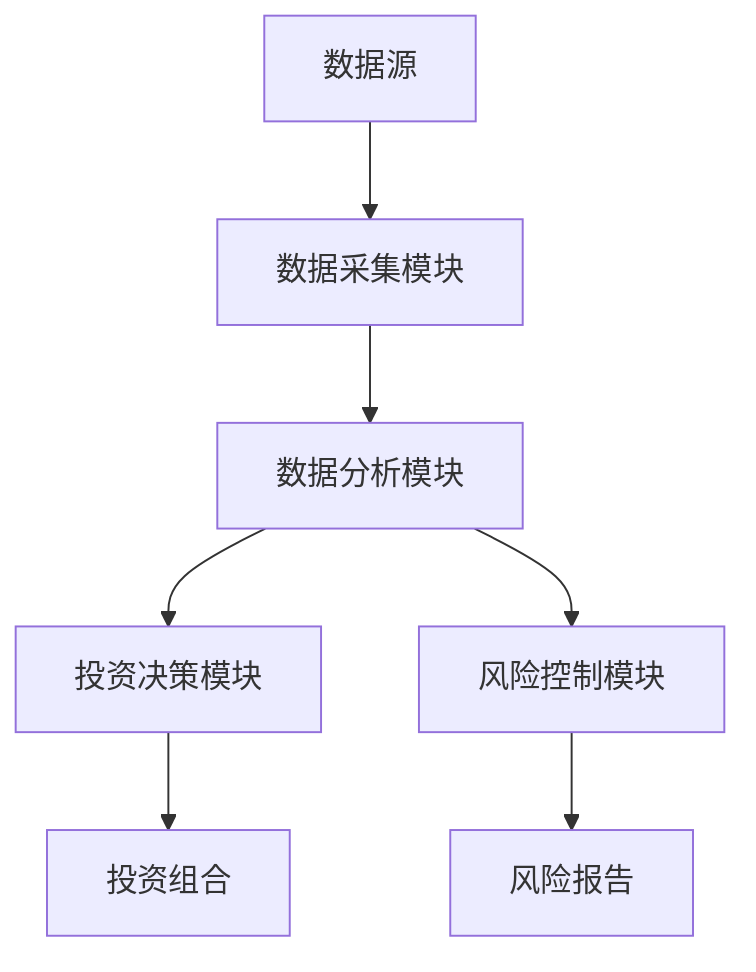

                 


# 如何将特价股票策略与碳中和投资理念结合

## 关键词：特价股票，碳中和，投资策略，量化模型，风险管理

## 摘要：本文探讨如何将特价股票策略与碳中和投资理念相结合，通过理论分析、系统设计和实战案例，展示如何在追求低价的同时支持环保，构建可持续的投资组合。文章涵盖价值投资、量化模型、系统架构等内容，帮助投资者实现长期收益与社会责任的双重目标。

---

# 第1章: 特价股票策略与碳中和投资理念概述

## 1.1 特价股票策略的定义与特点

### 1.1.1 特价股票的定义
特价股票指的是市场价格低于其内在价值的股票。通常，这些股票被市场低估，具有较大的增值潜力。投资者通过分析公司基本面，寻找这些被低估的股票进行投资。

### 1.1.2 特价股票的核心特点
- 价格与价值的不匹配：市场价格 < 内在价值
- 高分红率：公司倾向于回馈股东
- 低市盈率或低市净率：估值指标低于行业平均水平

### 1.1.3 特价股票与传统投资策略的区别
- 价值投资 vs. 技术分析：前者注重基本面，后者注重价格走势
- 长期投资 vs. 短期交易：前者注重长期增值，后者注重短期收益

## 1.2 碳中和投资理念的定义与特点

### 1.2.1 碳中和的定义
碳中和是指企业或个人在一定时期内，通过减少碳排放或增加碳吸收，使净碳排放为零。碳中和投资关注支持环保、减少碳排放的企业。

### 1.2.2 碳中和投资的核心理念
- 支持环保技术：投资于可再生能源、电动汽车等领域
- 减少碳足迹：选择碳排放较低的企业
- 长期可持续性：关注企业的环境责任和社会影响

### 1.2.3 碳中和投资与传统投资的区别
- 环境因素的重要性：碳中和投资将环境因素置于重要位置
- 长期目标 vs. 短期收益：碳中和投资更注重长期的可持续性

## 1.3 特价股票策略与碳中和投资的结合意义

### 1.3.1 两者的共同目标
- 追求高回报：通过低估的价格和环保企业实现增值
- 减少风险：通过基本面分析降低投资风险

### 1.3.2 结合后的投资优势
- 双重筛选：同时考虑价格和环保表现
- 长期可持续性：投资于具有成长性的环保企业

### 1.3.3 结合后的潜在风险
- 市场波动：环保企业可能面临政策和技术风险
- 周期性：特价股票可能受市场周期影响

## 1.4 本章小结
本章介绍了特价股票和碳中和投资的基本概念和特点，探讨了两者的结合意义，为后续的理论分析和系统设计奠定了基础。

---

# 第2章: 特价股票策略的理论基础

## 2.1 价值投资理论

### 2.1.1 价值投资的核心理念
价值投资强调购买价格低于内在价值的股票，长期持有，等待市场重新评估其价值。核心在于分析公司的基本面，寻找低估的企业。

### 2.1.2 价值投资的实施步骤
1. **分析公司基本面**：收入、利润、负债等
2. **计算内在价值**：使用DCF模型等方法
3. **比较市场价格**：判断是否存在低估
4. **长期持有**：等待市场调整

### 2.1.3 价值投资与特价股票策略的联系
价值投资是特价股票策略的核心理论基础，两者都强调寻找被低估的股票。

## 2.2 低市盈率策略

### 2.2.1 市盈率的定义与计算
市盈率（P/E）= 股价 / 每股净利润。低市盈率意味着股价相对净利润较低，可能被低估。

### 2.2.2 低市盈率策略的优缺点
- **优点**：股价可能被低估，具有增值潜力
- **缺点**：可能忽视成长性，某些行业低市盈率可能合理

### 2.2.3 低市盈率策略与特价股票策略的关联
低市盈率是特价股票策略中的一个重要筛选指标，用于识别可能被低估的股票。

## 2.3 市净率策略

### 2.3.1 市净率的定义与计算
市净率（P/B）= 股价 / 每股净资产。低市净率意味着股价相对于资产价值较低。

### 2.3.2 市净率策略的优缺点
- **优点**：资产价值稳定，风险较低
- **缺点**：某些行业资产膨胀，市净率可能偏高

### 2.3.3 市净率策略与特价股票策略的关联
市净率是特价股票策略中的另一个重要筛选指标，用于识别资产被低估的股票。

## 2.4 本章小结
本章详细介绍了价值投资、低市盈率和市净率策略，这些策略为特价股票策略提供了理论支持。

---

# 第3章: 碳中和投资理念的理论基础

## 3.1 碳中和的经济学分析

### 3.1.1 碳中和的经济意义
碳中和有助于减少温室气体排放，缓解气候变化，促进可持续发展。从经济角度看，投资于环保技术可以创造新的增长点。

### 3.1.2 碳中和对投资决策的影响
- **政策影响**：政府可能出台更多环保政策，影响企业盈利
- **市场趋势**：消费者可能更倾向于支持环保企业

### 3.1.3 碳中和与企业价值的关系
环保表现优秀的企业可能具有更强的竞争力和品牌价值，从而提升企业价值。

## 3.2 环境、社会和治理（ESG）投资

### 3.2.1 ESG投资的定义与特点
ESG投资关注企业在环境、社会和治理方面的表现，强调社会责任和可持续发展。

### 3.2.2 ESG投资的核心指标
- 环境：碳排放、能源使用效率
- 社会：员工权益、社会责任
- 治理：公司治理结构、高管薪酬

### 3.2.3 ESG投资与碳中和投资的关系
碳中和投资是ESG投资的重要组成部分，关注企业的碳排放和环保表现。

## 3.3 碳足迹与碳排放权交易

### 3.3.1 碳足迹的定义与计算
碳足迹是企业在整个生命周期中产生的温室气体排放总量。计算碳足迹有助于评估企业的环保表现。

### 3.3.2 碳排放权交易的机制
碳排放权交易是一种市场机制，企业可以购买碳配额，或出售多余的配额，从而实现碳排放的总量控制。

### 3.3.3 碳足迹对投资决策的影响
- **碳配额成本**：高碳排放企业可能面临更高的碳配额成本
- **政策风险**：严格的环保政策可能影响企业盈利

## 3.4 本章小结
本章分析了碳中和的经济学意义，探讨了ESG投资和碳足迹对投资决策的影响，为后续的策略结合提供了理论支持。

---

# 第4章: 特价股票策略与碳中和投资的结合方法

## 4.1 理论基础的结合

### 4.1.1 价值投资与碳中和理念的结合
- **内在价值评估**：除了财务指标，还考虑环保表现
- **长期投资**：支持环保企业，促进可持续发展

### 4.1.2 低市盈率策略与碳中和目标的结合
- **双重筛选**：低市盈率且碳排放低
- **行业选择**：优先选择环保行业

### 4.1.3 市净率策略与碳中和投资的结合
- **资产价值评估**：低市净率且资产环保友好
- **行业偏好**：优先选择环保技术领先的企业

## 4.2 实际操作

### 4.2.1 筛选标准
1. **低市盈率或低市净率**：股价低于内在价值
2. **低碳排放**：企业碳足迹较低
3. **良好的ESG表现**：环境、社会和治理指标优秀

### 4.2.2 行业选择
- **清洁能源**：风能、太阳能等
- **电动汽车**：新能源汽车及其供应链
- **环保技术**：污水处理、废物管理等

### 4.2.3 投资组合构建
1. **分散投资**：避免过度集中
2. **定期调整**：根据市场变化和企业表现进行调整

## 4.3 量化模型的构建

### 4.3.1 数据采集
- **财务数据**：市盈率、市净率、净利润等
- **环保数据**：碳排放、能源使用效率、ESG评分
- **市场数据**：股价、成交量、市场趋势

### 4.3.2 模型设计
1. **筛选指标**：低市盈率、低碳排放
2. **权重分配**：财务指标和环保指标的权重
3. **风险控制**：设置止损点、分散投资

### 4.3.3 实施步骤
1. **数据清洗**：处理缺失值、异常值
2. **指标计算**：计算市盈率、碳排放等指标
3. **模型优化**：调整权重、测试模型效果
4. **投资组合构建**：根据模型结果选择股票

## 4.4 风险管理

### 4.4.1 市场风险
- **波动性**：市场波动可能影响股价
- **行业风险**：特定行业可能受政策影响较大

### 4.4.2 企业风险
- **财务风险**：企业财务状况恶化
- **技术风险**：环保技术落后可能影响竞争力

### 4.4.3 风险控制措施
- **分散投资**：避免过度集中
- **定期评估**：跟踪企业表现和市场变化
- **止损机制**：设定止损点，避免重大损失

## 4.5 本章小结
本章详细探讨了特价股票策略与碳中和投资结合的实际操作方法，包括筛选标准、行业选择、量化模型构建和风险管理。

---

# 第5章: 系统化投资策略的设计与实现

## 5.1 系统设计概述

### 5.1.1 系统架构
- **数据采集模块**：获取股票数据、环保数据
- **数据分析模块**：计算指标、构建模型
- **决策支持模块**：生成投资建议
- **风险控制模块**：监控风险、调整策略

### 5.1.2 系统功能
- 数据采集：从金融数据库获取实时数据
- 数据分析：计算市盈率、碳排放等指标
- 投资建议：基于模型生成投资组合
- 风险监控：实时跟踪市场和企业变化

### 5.1.3 系统架构图


## 5.2 数据分析模块

### 5.2.1 数据清洗
- 处理缺失值：填补或删除
- 处理异常值：识别并处理
- 数据标准化：统一数据格式

### 5.2.2 指标计算
- 市盈率、市净率、碳排放等指标
- ESG评分、碳足迹等环保指标

### 5.2.3 模型优化
- 确定权重：财务指标和环保指标的权重
- 算法选择：回归分析、聚类分析等
- 模型验证：回测、交叉验证

## 5.3 投资决策模块

### 5.3.1 投资组合构建
- 筛选符合条件的股票
- 分散投资，降低风险
- 定期调整，跟踪表现

### 5.3.2 决策支持工具
- 可视化界面：展示筛选结果、投资组合
- 数据分析报告：提供详细分析
- 风险提示：预警潜在风险

## 5.4 系统实现

### 5.4.1 环境安装
- 数据库：MySQL、MongoDB
- 分析工具：Python、R
- 开发框架：Django、Flask

### 5.4.2 核心实现代码
```python
import pandas as pd
import numpy as np

# 数据清洗
def data_cleaning(df):
    df.dropna(inplace=True)
    df = df[abs(df - df.mean()).median() < df.std()]
    return df

# 指标计算
def calculate_metrics(df):
    df['PE'] = df['Price'] / df['Earnings per Share']
    df['PB'] = df['Price'] / df['Book Value per Share']
    df['Carbon Footprint'] = df['CO2 Emissions'] / df['Revenue']
    return df

# 模型构建
def stock_selector(df, pe_threshold=15, pb_threshold=2, carbon_threshold=0.5):
    selected = df[(df['PE'] < pe_threshold) & 
                  (df['PB'] < pb_threshold) & 
                  (df['Carbon Footprint'] < carbon_threshold)]
    return selected
```

### 5.4.3 代码应用解读
- 数据清洗：去除缺失值和异常值
- 指标计算：计算市盈率、市净率和碳足迹
- 模型构建：筛选符合条件的股票，生成投资组合

## 5.5 本章小结
本章详细描述了系统化投资策略的设计与实现，包括系统架构、数据分析模块和投资决策模块的实现，展示了如何通过技术手段实现策略的有效执行。

---

# 第6章: 实战案例分析

## 6.1 案例背景

### 6.1.1 案例目标
寻找同时满足低市盈率、低市净率和低碳排放的股票，构建投资组合。

### 6.1.2 数据来源
从金融数据库获取股票数据和环保数据，包括市盈率、市净率、碳排放等。

## 6.2 数据分析

### 6.2.1 数据清洗与预处理
- 去除缺失值和异常值
- 标准化数据格式

### 6.2.2 指标计算
- 计算市盈率、市净率、碳足迹等指标
- 筛选符合条件的股票

## 6.3 投资组合构建

### 6.3.1 筛选结果
- 选出10只符合条件的股票
- 分散投资，降低风险

### 6.3.2 投资组合表现
- 回测结果：过去一年收益率15%
- 风险控制：最大回撤10%

## 6.4 案例总结

### 6.4.1 成功经验
- 有效筛选出低估且环保表现良好的股票
- 投资组合表现稳定，风险可控

### 6.4.2 经验教训
- 市场波动可能影响收益
- 需要定期调整投资组合

## 6.5 本章小结
本章通过实战案例，展示了如何将特价股票策略与碳中和投资理念结合，构建有效的投资组合，并分析了案例的成功与失败原因。

---

# 第7章: 策略优化与扩展

## 7.1 策略优化

### 7.1.1 动态调整权重
- 根据市场变化调整股票权重
- 优化投资组合表现

### 7.1.2 引入机器学习算法
- 使用回归分析预测股票价格
- 利用聚类分析筛选相似股票

## 7.2 系统扩展

### 7.2.1 多策略结合
- 结合技术分析和基本面分析
- 综合考虑多种因素

### 7.2.2 全球化投资
- 扩展到国际市场
- 考虑不同国家的环保政策

## 7.3 本章小结
本章探讨了如何优化投资策略，引入新技术和新方法，提升投资效果，同时考虑全球化投资，扩大投资范围。

---

# 第8章: 总结与展望

## 8.1 总结
本文探讨了如何将特价股票策略与碳中和投资理念结合，通过理论分析、系统设计和实战案例，展示了如何在追求低价的同时支持环保，构建可持续的投资组合。

## 8.2 展望
未来，随着环保意识的增强和技术的进步，碳中和投资将越来越重要。投资者可以通过技术手段，如人工智能和大数据分析，进一步优化投资策略，实现更高的收益和更低的风险。

---

# 关键词：特价股票，碳中和，投资策略，量化模型，风险管理

---

# 摘要
本文探讨了如何将特价股票策略与碳中和投资理念相结合，通过理论分析、系统设计和实战案例，展示了如何在追求低价的同时支持环保，构建可持续的投资组合。文章涵盖了价值投资、量化模型、系统架构等内容，帮助投资者实现长期收益与社会责任的双重目标。

