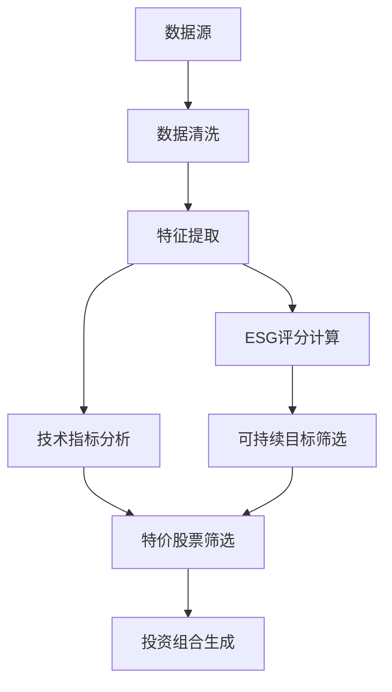
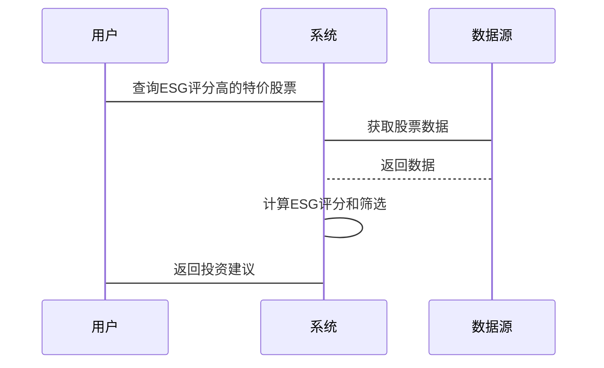

                 


# 如何将特价股票策略与联合国可持续发展目标对接

> 关键词：特价股票策略、联合国可持续发展目标、ESG评分、可持续投资、股票市场分析

> 摘要：本文探讨如何将特价股票策略与联合国可持续发展目标相结合，通过分析股票市场的波动和企业可持续发展表现，提出优化投资策略的方法。文章从背景介绍、核心概念、算法原理、系统架构到项目实战，全面阐述对接的策略和实现路径。

---

## 第一部分：背景介绍

### 第1章：特价股票策略与可持续发展目标的背景

#### 1.1 特价股票策略的背景
- **定义与特点**：特价股票策略是指在市场波动中寻找价格被低估的股票进行投资，通常关注短期价格波动和市场异动。
- **核心要素**：包括市场分析、基本面研究、技术分析和风险管理。
- **边界与外延**：涉及短期投资、市场波动，但需注意避免过度投机。

#### 1.2 可持续发展目标的核心概念
- **定义与框架**：联合国可持续发展目标（SDGs）涵盖经济、社会和环境三个方面，旨在2030年前实现全球可持续发展。
- **维度分析**：包括消除贫困、保护地球、促进繁荣等目标。
- **实现路径**：通过政策、企业责任和技术创新推动可持续发展。

#### 1.3 对接的意义
- **契合点**：可持续发展目标强调企业的长期价值，而特价股票策略关注短期价格波动，两者结合可优化投资决策。
- **趋势分析**：全球范围内可持续投资增长迅速，企业ESG表现成为投资者关注焦点。

---

## 第二部分：核心概念与联系

### 第2章：核心概念的原理与联系

#### 2.1 特价股票策略的原理
- **市场波动利用**：通过技术分析识别超跌股票。
- **基本面分析**：关注公司盈利能力和财务健康。
- **风险管理**：设置止损点和仓位控制。

#### 2.2 可持续发展目标的实现机制
- **ESG评分体系**：环境、社会和治理因素评估企业可持续性。
- **项目评估**：筛选符合SDGs的项目和企业。
- **量化考核**：将ESG表现纳入投资决策。

#### 2.3 关联性分析
- **企业价值影响**：ESG表现优秀的公司在长期更具竞争力。
- **股价波动影响**：可持续因素可能影响市场对公司的估值。
- **投资策略优化**：将ESG因素融入特价股票策略，提升投资组合的长期稳定性。

---

## 第三部分：算法与数学模型

### 第3章：算法原理

#### 3.1 特价股票策略算法
- **输入**：历史股价数据、市场指标、公司基本面数据。
- **步骤**：
  1. 数据清洗与特征提取。
  2. 使用技术指标（如RSI、MACD）识别超跌股票。
  3. 结合基本面分析筛选潜在投资标的。
  4. 计算风险调整后的预期收益。
  5. 生成投资组合并监控风险。

#### 3.2 可持续发展目标评估算法
- **输入**：公司ESG评分、行业基准。
- **步骤**：
  1. 收集企业ESG数据。
  2. 评估企业对SDGs的贡献。
  3. 计算ESG评分。
  4. 筛选符合可持续目标的企业。

#### 3.3 对接算法
- **输入**：特价股票候选池、企业ESG评分。
- **步骤**：
  1. 在特价股票池中筛选ESG评分高的企业。
  2. 评估其可持续投资潜力。
  3. 调整投资组合以平衡短期收益与长期可持续性。

#### 3.4 数学模型
- **ESG评分回归模型**：
  $$ R^2 = \beta_0 + \beta_1 \times ESG + \epsilon $$
  其中，$R^2$为股价收益率，$\beta_1$衡量ESG对收益的影响。

- **投资组合优化模型**：
  $$ \text{最大化 } \mu - \lambda \sigma $$
  其中，$\mu$为期望收益，$\sigma$为风险，$\lambda$为风险厌恶系数。

---

## 第四部分：系统分析与架构设计

### 第4章：系统架构

#### 4.1 问题场景介绍
- **目标**：构建一个结合特价股票策略和可持续发展目标的投资系统。
- **用户需求**：投资者希望在追求短期收益的同时，支持可持续发展目标。

#### 4.2 系统功能设计
- **数据获取模块**：实时采集股票价格、公司ESG数据。
- **ESG评分模块**：计算并评估企业的ESG表现。
- **策略分析模块**：筛选符合策略的股票并生成投资建议。

#### 4.3 系统架构图（Mermaid）



#### 4.4 系统接口设计
- **数据接口**：与金融数据供应商API对接。
- **用户接口**：提供可视化界面供投资者查询和下单。

#### 4.5 系统交互序列图（Mermaid）



---

## 第五部分：项目实战

### 第5章：项目实战

#### 5.1 环境安装
- **工具**：Python、Pandas、Matplotlib、金融数据API。
- **安装依赖**：
  ```bash
  pip install pandas numpy matplotlib requests
  ```

#### 5.2 核心实现代码
```python
import pandas as pd
import numpy as np

# 数据获取模块
def get_stock_data(api_key, tickers):
    # 使用API获取数据
    pass

# ESG评分模块
def calculate_esg_score(data):
    # 计算ESG评分
    pass

# 策略分析模块
def stock_selection(data, esg_scores):
    # 筛选特价股票
    pass

# 投资组合生成
def generate_portfolio(stocks, esg_scores):
    # 优化投资组合
    pass
```

#### 5.3 实例分析
- **行业选择**：选择绿色能源行业。
- **数据处理**：收集相关企业的股价和ESG评分。
- **策略实施**：筛选符合特价股票条件且ESG评分高的企业，进行投资组合优化。

#### 5.4 代码应用解读
- **数据清洗**：处理缺失值和异常值。
- **特征提取**：使用技术指标和ESG因素作为特征。
- **模型训练**：建立回归模型预测股价受ESG影响的程度。

#### 5.5 实证分析
- **结果展示**：比较传统策略与对接策略的收益和风险。
- **案例小结**：对接策略在长期表现出更高的稳定性。

---

## 第六部分：总结与展望

### 第6章：总结与展望

#### 6.1 总结
- **核心观点**：将特价股票策略与可持续发展目标对接，既能追求短期收益，又能支持长期可持续发展。
- **经验与教训**：模型需动态调整，数据质量和模型准确性是关键。

#### 6.2 展望
- **未来研究**：动态权重调整、扩展至更多市场、引入机器学习优化模型。
- **可持续投资建议**：关注ESG评分，长期投资优质企业。

#### 6.3 最佳实践 Tips
- 定期评估投资组合的ESG表现。
- 结合市场环境动态调整策略。
- 长期关注企业的可持续发展表现。

---

## 结语

通过将特价股票策略与联合国可持续发展目标对接，投资者可以在追求收益的同时，为全球可持续发展贡献力量。本文提供了理论支持和实践指导，未来的研究将进一步优化模型和扩展应用范围。

