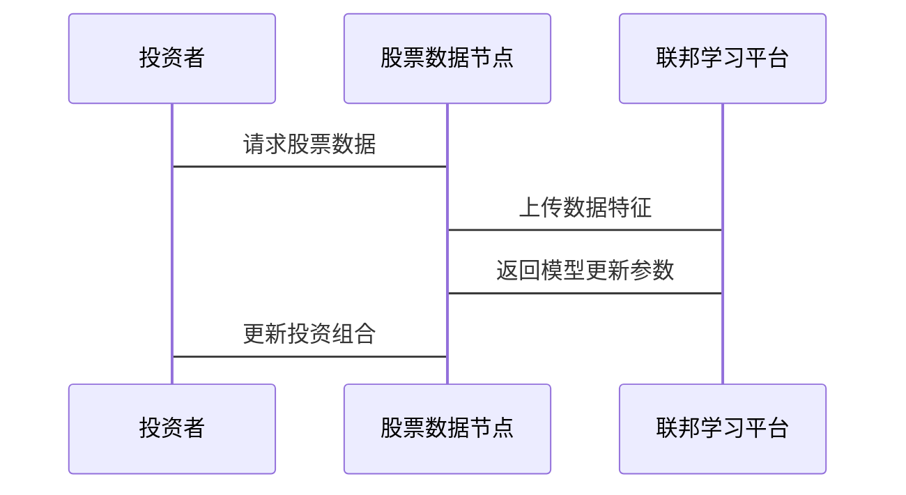

                 


# 如何将特价股票策略与联邦学习资产配置相结合

> 关键词：联邦学习，资产配置，特价股票策略，分布式计算，隐私保护

> 摘要：本文探讨了如何将特价股票策略与联邦学习资产配置相结合，通过分析特价股票策略的核心原理和联邦学习的算法机制，提出了结合两者的方法，并通过实际案例展示了如何利用联邦学习优化资产配置。

---

# 第1章: 特价股票策略与联邦学习概述

## 1.1 特价股票策略的定义与特点
### 1.1.1 特价股票的定义
特价股票是指在特定时间段内价格低于市场平均价格或历史价格的股票。这类股票通常具有较高的投资潜力，因为它们可能被市场低估或暂时被忽视。

### 1.1.2 特价股票策略的核心要素
- **技术分析**：通过K线图、MACD、RSI等指标预测股票价格走势。
- **基本面分析**：分析公司的财务状况、行业地位、盈利能力等。
- **市场情绪分析**：利用自然语言处理技术分析新闻、社交媒体等信息，判断市场情绪对股票价格的影响。

### 1.1.3 特价股票策略的优势与局限性
- **优势**：能够发现被市场低估的投资机会，提高投资回报率。
- **局限性**：市场波动较大，策略的有效性可能受到短期市场变化的影响。

## 1.2 联邦学习的基本概念
### 1.2.1 联邦学习的定义
联邦学习是一种分布式机器学习技术，允许多个机构在不共享原始数据的前提下，协作训练模型。其核心思想是通过局部模型的更新和同步，实现全局模型的优化。

### 1.2.2 联邦学习的核心特点
- **数据隐私保护**：数据不出域，仅传输模型更新参数。
- **分布式计算**：多个节点协作完成模型训练，降低单点依赖风险。
- **灵活性与可扩展性**：适用于不同规模和类型的数据源。

### 1.2.3 联邦学习与传统机器学习的对比
| 对比维度 | 联邦学习 | 传统机器学习 |
|----------|----------|---------------|
| 数据使用 | 分散在各节点，不共享 | 集中在单个节点 | |
| 模型训练 | 分布式训练，同步更新 | 集中式训练 | |
| 隐私保护 | 高 | 低 | |

## 1.3 特价股票策略与联邦学习的结合意义
### 1.3.1 资产配置中的数据隐私问题
在资产配置中，投资者通常需要使用大量的市场数据和交易数据，这些数据可能涉及敏感信息，直接共享存在隐私泄露风险。

### 1.3.2 联邦学习在资产配置中的优势
- **隐私保护**：联邦学习可以在不共享原始数据的前提下，完成模型训练和优化。
- **分布式计算**：适用于多机构协作的场景，提升模型的泛化能力。
- **高效性**：通过分布式计算，减少单点计算压力，提升计算效率。

### 1.3.3 特价股票策略与联邦学习结合的前景
将特价股票策略与联邦学习相结合，可以实现以下目标：
- **优化投资决策**：利用联邦学习的分布式计算能力，提升特价股票预测的准确性。
- **降低数据隐私风险**：在保护数据隐私的前提下，充分利用市场数据进行资产配置。

## 1.4 本章小结
本章介绍了特价股票策略和联邦学习的基本概念，分析了两者结合的背景和意义，为后续章节奠定了基础。

---

# 第2章: 特价股票策略的核心原理

## 2.1 特价股票的市场分析
### 2.1.1 市场波动与价格预测
市场波动是影响股票价格的主要因素之一。通过技术分析和基本面分析，可以预测股票价格的短期波动趋势。

### 2.1.2 技术分析与基本面分析
- **技术分析**：基于历史价格数据，通过K线图、均线、MACD等指标预测未来价格走势。
- **基本面分析**：分析公司的财务状况、行业地位、盈利能力等，评估股票的内在价值。

### 2.1.3 特价股票的交易策略
- **短线交易策略**：利用市场波动，短时间内买卖股票，追求短期收益。
- **长线投资策略**：基于公司基本面分析，长期持有被低估的股票，等待其价值回归。

## 2.2 联邦学习的数学模型
### 2.2.1 联邦学习的核心算法
- **联邦平均算法（FedAvg）**：通过各节点的局部模型更新，计算全局模型的参数更新。
- **联邦同步算法（FedSync）**：通过同步各节点的模型参数，实现全局模型的优化。

### 2.2.2 联邦学习的通信机制
- **安全通信协议**：通过加密技术保护模型更新的传输过程，防止数据泄露。
- **数据加密与解密**：在通信过程中，对数据进行加密处理，确保数据的安全性。

### 2.2.3 联邦学习的隐私保护
- **数据匿名化**：通过对数据进行匿名化处理，降低隐私泄露风险。
- **差分隐私**：通过在数据中添加噪声，保护个体数据的隐私。

## 2.3 特价股票策略与联邦学习的结合点
### 2.3.1 数据特征的提取
- **技术指标提取**：从历史价格数据中提取K线图、均线、MACD等技术指标。
- **基本面指标提取**：从公司财务报表中提取收入、利润、负债等基本面指标。

### 2.3.2 模型的分布式训练
- **局部模型训练**：每个节点基于本地数据，训练局部模型。
- **全局模型更新**：通过联邦学习的通信机制，将各节点的局部模型更新参数汇总，更新全局模型。

### 2.3.3 资产配置的优化
- **风险分散**：通过联邦学习的分布式计算能力，优化资产配置，降低投资风险。
- **收益最大化**：通过联邦学习的协作训练，提升模型的预测准确性，提高投资收益。

## 2.4 本章小结
本章详细讲解了特价股票策略的核心原理，分析了联邦学习在资产配置中的应用，为后续章节提供了理论基础。

---

# 第3章: 联邦学习的算法原理

## 3.1 联邦学习的核心算法
### 3.1.1 分布式模型训练
- **局部模型训练**：每个节点基于本地数据，训练局部模型。
- **全局模型更新**：通过通信机制，将各节点的局部模型参数汇总，更新全局模型。

### 3.1.2 联邦平均算法
- **算法步骤**：
  1. 初始化全局模型参数。
  2. 各节点基于本地数据，训练局部模型，计算局部模型参数的更新量。
  3. 将各节点的局部更新量汇总，计算全局模型参数的更新量。
  4. 更新全局模型参数，重复上述步骤，直到模型收敛。

- **数学公式**：
  $$ \theta_{new} = \frac{1}{n}\sum_{i=1}^{n}\theta_i $$

### 3.1.3 联邦同步算法
- **算法步骤**：
  1. 初始化全局模型参数。
  2. 各节点基于本地数据，训练局部模型，同步全局模型参数。
  3. 更新全局模型参数，重复上述步骤，直到模型收敛。

- **数学公式**：
  $$ \theta_{new} = \theta_{global} + \Delta\theta_{local} $$

## 3.2 联邦学习的通信机制
### 3.2.1 安全通信协议
- **加密通信**：通过SSL/TLS等加密协议，确保数据传输的安全性。
- **数字签名**：通过数字签名技术，验证数据来源的合法性。

### 3.2.2 数据加密与解密
- **加密算法**：使用AES、RSA等加密算法，对数据进行加密处理。
- **解密算法**：通过密钥解密数据，恢复原始数据。

### 3.2.3 联邦通信的优化
- **压缩技术**：通过对模型更新参数进行压缩，减少数据传输量。
- **差分更新**：仅传输模型参数的更新部分，减少数据传输量。

## 3.3 联邦学习的数学模型
### 3.3.1 联邦平均的数学公式
$$ \theta_{new} = \frac{1}{n}\sum_{i=1}^{n}\theta_i $$

### 3.3.2 联邦同步的数学公式
$$ \theta_{new} = \theta_{global} + \Delta\theta_{local} $$

## 3.4 本章小结
本章详细讲解了联邦学习的核心算法和通信机制，为后续章节提供了算法基础。

---

# 第4章: 资产配置的系统分析与设计

## 4.1 系统功能设计
### 4.1.1 领域模型（类图）
```mermaid
classDiagram
    class 股票数据节点 {
        +股票代码: string
        +股票名称: string
        +历史价格数据: array
        +技术指标数据: array
        +基本面数据: array
        -训练模型: function
    }
    class 联邦学习平台 {
        +全局模型参数: array
        +通信机制: function
        +隐私保护机制: function
    }
    class 投资者 {
        +投资组合: array
        +风险偏好: string
        +收益目标: string
    }
    stock_node --|> 股票数据节点
    联邦学习平台 <--|-> 股票数据节点
    联邦学习平台 <--|-> 投资者
```

### 4.1.2 系统架构设计


### 4.1.3 系统接口设计
- **接口1**：数据获取接口
  - 输入：股票代码、时间范围
  - 输出：历史价格数据、技术指标数据、基本面数据
- **接口2**：模型训练接口
  - 输入：模型参数、训练数据
  - 输出：更新后的模型参数

### 4.1.4 系统交互设计


## 4.2 项目实战
### 4.2.1 环境安装
- **编程语言**：Python 3.8+
- **框架**：TensorFlow Federated (TFF)
- **依赖库**：安装TFF、Keras、numpy、pandas

### 4.2.2 核心实现代码
```python
import tensorflow as tf
import tensorflow_federated as tff

# 数据预处理
def preprocess_data(stock_data):
    # 提取技术指标和基本面数据
    features = stock_data[['close', 'volume', 'rsi', 'macd']]
    labels = stock_data['next_day_price']
    return features, labels

# 联邦学习模型定义
def create_model(input_shape):
    model = tf.keras.Sequential([
        tf.keras.layers.Dense(64, activation='relu', input_shape=input_shape),
        tf.keras.layers.Dense(1, activation='linear')
    ])
    return model

# 联邦学习训练过程
def train_federated_model(stock_data):
    # 数据预处理
    features, labels = preprocess_data(stock_data)
    
    # 创建联邦学习模型
    model = create_model((features.shape[1],))
    model.compile(optimizer='adam', loss='mse')
    
    # 联邦学习训练
    tff_model = tff.federated_model(model)
    tff_strategy = tff.strategy.default()
    tff_losses = tff.federated_loss(model, loss_fn=tf.keras.losses.mse)
    
    # 训练过程
    tff_training_process = tff.FederatedTrainingProcess(
        tff_model,
        tff_strategy,
        tff_losses
    )
    
    # 开始训练
    tff_training_process.run()

# 应用案例分析
def main():
    # 获取股票数据
    stock_data = get_stock_data('AAPL')
    # 训练联邦学习模型
    train_federated_model(stock_data)
    # 更新投资组合
    update_portfolio(stock_data)

if __name__ == '__main__':
    main()
```

### 4.2.3 代码解读与分析
- **数据预处理**：提取股票的历史价格数据、技术指标数据和基本面数据，作为模型的输入特征。
- **模型定义**：定义一个简单的神经网络模型，用于预测股票的未来价格。
- **联邦学习训练**：使用TensorFlow Federated框架，定义联邦学习模型、训练策略和损失函数，完成模型的分布式训练。
- **投资组合更新**：根据训练好的模型，更新投资者的投资组合，优化资产配置。

### 4.2.4 案例分析
假设我们有一个包含多只股票的资产组合，每只股票的历史价格数据、技术指标数据和基本面数据都存储在不同的节点上。通过联邦学习，我们可以协作训练一个全局模型，预测每只股票的未来价格走势，从而优化资产配置，降低投资风险。

## 4.3 本章小结
本章通过系统设计和项目实战，展示了如何将特价股票策略与联邦学习资产配置相结合，为投资者提供了一种高效、安全的投资决策支持工具。

---

# 第5章: 总结与展望

## 5.1 本章总结
本文详细探讨了如何将特价股票策略与联邦学习资产配置相结合，通过分析特价股票策略的核心原理和联邦学习的算法机制，提出了结合两者的方法，并通过实际案例展示了如何利用联邦学习优化资产配置。

## 5.2 未来展望
- **技术优化**：进一步优化联邦学习的算法，提高模型的预测准确性和计算效率。
- **应用拓展**：将联邦学习技术应用到更多领域，如金融、医疗、能源等，推动分布式计算的发展。
- **隐私保护**：加强数据隐私保护技术的研究，确保联邦学习在实际应用中的安全性。

## 5.3 最佳实践 Tips
- 在实际应用中，建议结合具体业务需求，选择合适的联邦学习算法和数据处理方法。
- 定期监控模型的性能，及时调整模型参数，确保模型的有效性。
- 注意数据的多样性和代表性，避免模型过拟合或欠拟合。

## 5.4 本章小结
本章总结了全文的主要内容，并对未来的研究方向和应用前景进行了展望，为读者提供了进一步研究和实践的参考。

---

# 参考文献

（此处列出相关文献和资料，如学术论文、技术报告等）

---

# 附录

（此处可以放置一些补充材料，如代码示例、数据表格等）

