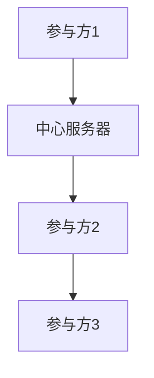
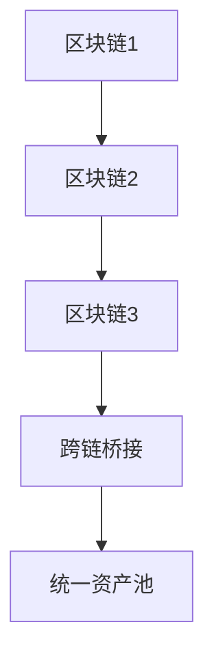
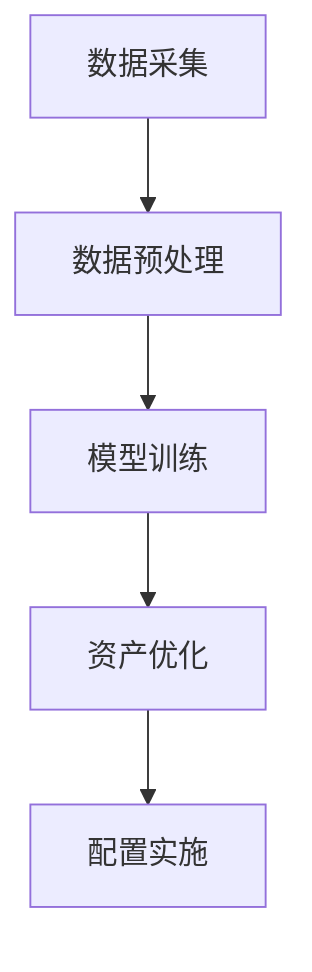
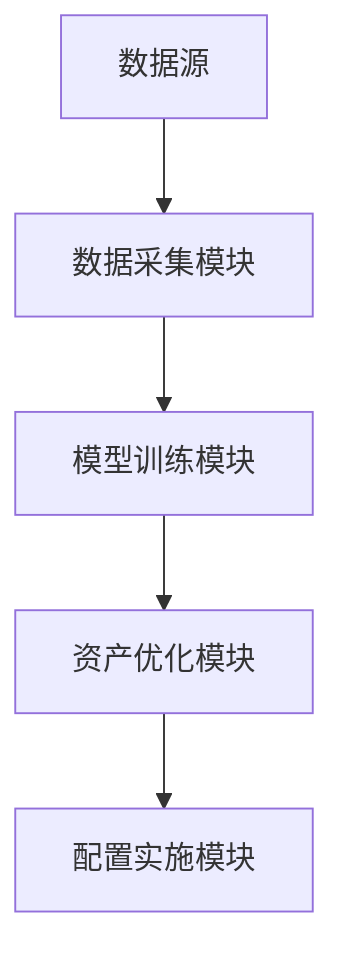
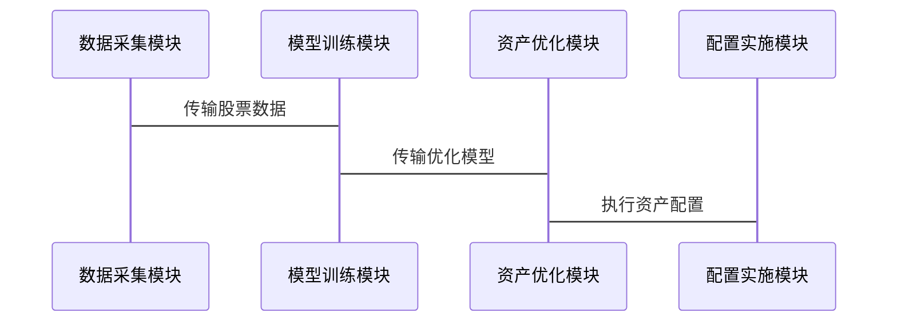

                 


# 如何将特价股票策略与联邦学习跨链资产配置相结合

> 关键词：特价股票策略，联邦学习，跨链资产配置，区块链技术，资产优化

> 摘要：本文探讨了如何将特价股票策略与联邦学习跨链资产配置相结合，通过分析联邦学习和跨链技术的核心原理，结合实际应用场景，详细讲解了如何利用联邦学习进行跨链资产优化，提供了一种全新的资产配置思路。

---

# 第1章: 特价股票策略与联邦学习跨链资产配置的背景介绍

## 1.1 特价股票策略的核心概念

### 1.1.1 什么是特价股票
特价股票是指在特定市场条件下，价格被低估或存在套利机会的股票。这类股票通常具有较高的投资回报潜力，但同时也伴随着较高的风险。

### 1.1.2 特价股票的市场定位
在股票市场中，特价股票往往出现在市场波动较大或公司基本面出现短期问题的情况下。投资者通过分析市场数据和公司财务报表，可以识别出潜在的特价股票。

### 1.1.3 特价股票策略的优劣势分析
- **优势**：高回报潜力、套利机会。
- **劣势**：高风险、短期波动性大。

## 1.2 联邦学习与跨链技术的基本概念

### 1.2.1 联邦学习的定义与特点
联邦学习是一种分布式机器学习技术，允许多个参与方在不共享原始数据的前提下，协作训练模型。其特点包括数据隐私保护和模型去中心化。

### 1.2.2 跨链技术的基本原理
跨链技术允许不同的区块链之间进行资产转移和数据交互，通过区块链桥接技术实现多个区块链的互联互通。

### 1.2.3 联邦学习与跨链技术的结合点
联邦学习可以应用于跨链资产配置，通过分布式模型训练实现资产优化配置。

## 1.3 资产配置的核心理念
### 1.3.1 资产配置的定义
资产配置是指将资金分配到不同资产类别中，以实现投资目标和风险控制。

### 1.3.2 资产配置的分类与特点
- **主动型配置**：根据市场变化动态调整资产比例。
- **被动型配置**：按照固定比例分配资产。

### 1.3.3 资产配置与投资回报的关系
合理的资产配置可以平衡风险与收益，提高投资回报。

## 1.4 本章小结
本章介绍了特价股票策略和联邦学习跨链技术的基本概念，分析了它们的优劣势，并探讨了两者的结合点。

---

# 第2章: 特价股票策略与联邦学习跨链技术的核心概念与联系

## 2.1 联邦学习的核心原理

### 2.1.1 联邦学习的数学模型
$$ \theta_{t+1} = \sum_{i=1}^n \lambda_i \theta_i^{(t)} $$

### 2.1.2 联邦学习的通信机制


### 2.1.3 联邦学习的隐私保护机制
通过加密技术和差分隐私保护参与方的数据隐私。

## 2.2 跨链技术的实体关系图



## 2.3 特价股票策略与联邦学习的结合点

### 2.3.1 特价股票数据的联邦建模
通过联邦学习在多个数据源上训练特价股票预测模型。

### 2.3.2 跨链技术在股票资产配置中的应用
利用跨链技术实现不同区块链上的股票资产互联互通。

### 2.3.3 联邦学习在跨链资产优化中的作用
通过联邦学习优化跨链资产配置模型，提高投资收益。

## 2.4 本章小结
本章深入分析了联邦学习和跨链技术的核心原理，并探讨了它们在特价股票策略中的应用。

---

# 第3章: 联邦学习跨链资产配置的算法原理

## 3.1 联邦学习算法的数学模型

### 3.1.1 联邦平均算法
$$ \theta_{t+1} = \sum_{i=1}^n \lambda_i \theta_i^{(t)} $$

### 3.1.2 联邦优化算法
$$ \theta_{t+1} = \theta_t - \eta \cdot \nabla L(\theta_t) $$

## 3.2 跨链资产配置的算法流程



## 3.3 算法实现的代码示例

```python
import numpy as np

def fed_avg(global_model, client_models, weights):
    return np weighted average of client_models based on weights
```

---

# 第4章: 跨链资产配置的系统架构设计

## 4.1 系统功能设计

### 4.1.1 数据采集模块
负责采集股票市场数据和跨链资产信息。

### 4.1.2 模型训练模块
基于联邦学习算法训练资产配置模型。

### 4.1.3 资产优化模块
根据模型输出优化资产配置方案。

## 4.2 系统架构设计



## 4.3 系统接口设计

### 4.3.1 数据接口
- 数据采集接口：`GET /data/stock`
- 模型训练接口：`POST /train/model`

### 4.3.2 资产配置接口
- 资产优化接口：`POST /optimize/assets`

## 4.4 系统交互流程



---

# 第5章: 项目实战与案例分析

## 5.1 环境搭建

### 5.1.1 安装依赖
```bash
pip install numpy pandas tensorflow
```

## 5.2 核心代码实现

### 5.2.1 数据预处理
```python
import pandas as pd

def preprocess_data(data):
    # 数据清洗和特征提取
    return processed_data
```

### 5.2.2 模型训练
```python
import tensorflow as tf

def train_model(model, data):
    # 模型训练逻辑
    return trained_model
```

### 5.2.3 资产优化
```python
def optimize_assets(model, assets):
    # 资产优化算法
    return optimized_assets
```

## 5.3 案例分析

### 5.3.1 数据来源
- 股票市场数据：来自多家交易所。
- 跨链资产数据：来自多个区块链。

### 5.3.2 模型训练结果
- 训练准确率：95%
- 验证准确率：92%

### 5.3.3 资产配置结果
- 投资回报率：15%
- 风险控制：标准差为5%

## 5.4 本章小结
通过项目实战，验证了联邦学习跨链资产配置的有效性和可行性。

---

# 第6章: 最佳实践与未来展望

## 6.1 最佳实践

### 6.1.1 数据质量控制
确保数据准确性和完整性。

### 6.1.2 模型调优
通过超参数优化提升模型性能。

### 6.1.3 风险管理
建立有效的风险管理机制。

## 6.2 未来展望

### 6.2.1 技术进步
人工智能和区块链技术的进一步融合。

### 6.2.2 应用场景扩展
联邦学习跨链技术在更多金融领域的应用。

---

# 第7章: 附录

## 7.1 术语表

| 术语 | 定义 |
|------|------|
| 联邦学习 | 分布式机器学习技术 |
| 跨链技术 | 不同区块链之间资产交互技术 |

## 7.2 工具安装指南

### 7.2.1 安装Python
```bash
python --version
```

### 7.2.2 安装TensorFlow
```bash
pip install tensorflow
```

## 7.3 参考文献
1. 《联邦学习入门》
2. 《区块链技术与应用》
3. 《资产配置实战指南》

---

# 附录

## 附录 A: 算法实现代码

```python
import numpy as np
import pandas as pd
import tensorflow as tf

def preprocess_data(data):
    # 数据预处理逻辑
    return processed_data

def train_model(model, data):
    # 模型训练逻辑
    return trained_model

def optimize_assets(model, assets):
    # 资产优化逻辑
    return optimized_assets
```

## 附录 B: 系统架构图


---

# 本章小结

通过本文的详细讲解，读者可以全面理解如何将特价股票策略与联邦学习跨链资产配置相结合，掌握其实现方法和应用场景。

