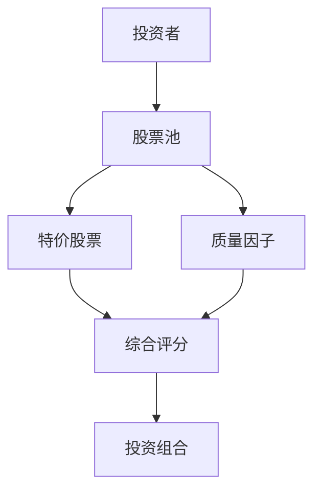
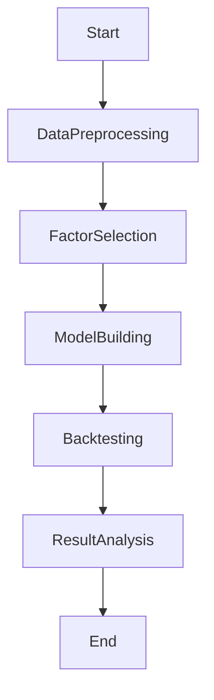
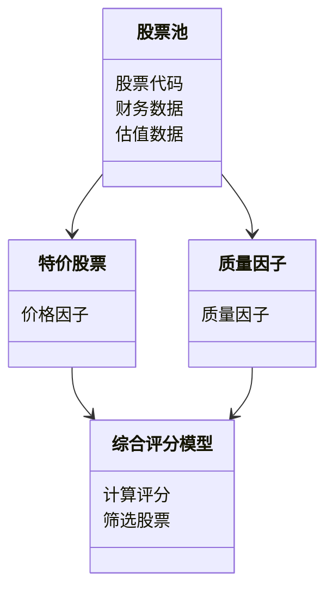
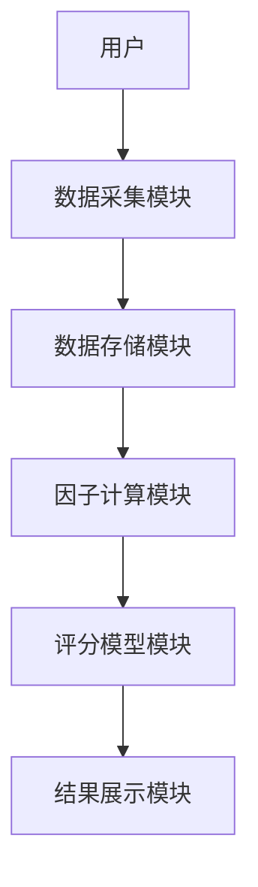
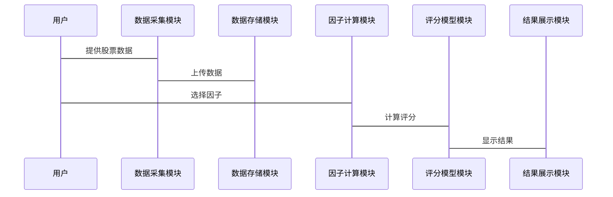

                 


# 如何将特价股票策略与质量因子投资相结合

> 关键词：特价股票策略、质量因子投资、投资组合优化、量化投资、股票筛选模型

> 摘要：本文详细探讨了如何将特价股票策略与质量因子投资相结合，通过分析两者的核心概念、算法原理和系统架构，提出了一种创新的投资策略。该策略利用量化方法，结合股票的低价特性和高质量因子，帮助投资者在风险可控的前提下实现收益最大化。文章内容包括背景介绍、核心概念对比、算法设计、数学模型构建、系统架构分析、项目实战案例以及最佳实践总结，为投资者提供了一套完整的解决方案。

---

## 第一部分：背景介绍

### 第1章：特价股票策略与质量因子投资概述

#### 1.1 问题背景

##### 1.1.1 特价股票策略的定义与特点
- **定义**：特价股票策略是一种投资策略，旨在通过寻找市场价格低于其内在价值的股票，从而在价格回升时获得收益。
- **特点**：
  - 依赖市场估值与内在价值的差异。
  - 通常关注低市盈率、低市净率等指标。
  - 风险较高，可能涉及价值陷阱。

##### 1.1.2 质量因子投资的定义与特点
- **定义**：质量因子投资是一种基于公司基本面质量的选股策略，关注高盈利、高分红、低负债等财务指标。
- **特点**：
  - 强调公司财务健康和盈利能力。
  - 风险较低，适合稳健型投资者。
  - 通常表现稳定，但在市场波动时可能收益有限。

##### 1.1.3 两者结合的必要性与优势
- **必要性**：
  - 单一策略在特定市场环境下可能表现不佳。
  - 结合两者可以在风险与收益之间找到平衡。
- **优势**：
  - 降低投资风险，避免价值陷阱。
  - 提高收益的可持续性，结合低价与优质的特点。

#### 1.2 问题描述

##### 1.2.1 特价股票策略的局限性
- 低价股票可能隐藏财务问题或管理不善。
- 市场波动可能导致股价进一步下跌。
- 需要大量筛选，时间成本高。

##### 1.2.2 质量因子投资的局限性
- 高质量公司可能估值过高，错失投资机会。
- 短期市场波动可能影响收益表现。
- 单一关注质量因子可能忽略价格优势。

##### 1.2.3 两者的结合如何解决投资问题
- 通过筛选低价优质股票，平衡风险与收益。
- 利用质量因子过滤掉潜在的“价值陷阱”。
- 提高选股效率，减少无效投资。

#### 1.3 问题解决思路

##### 1.3.1 确定核心目标
- **核心目标**：寻找具有高质量特性的低价股票。
- **具体目标**：在特定行业中筛选出市盈率、市净率低于行业平均水平，同时ROE、分红率较高的股票。

##### 1.3.2 设计结合策略
- **数据预处理**：清洗数据，处理缺失值和异常值。
- **因子筛选**：选择关键的质量因子和价格因子。
- **模型构建**：建立评分系统，综合考虑价格和质量因子。
- **结果验证**：回测模型，分析收益与风险。

##### 1.3.3 实施步骤
1. 数据收集：获取目标市场的股票数据，包括财务指标和估值指标。
2. 因子计算：计算各股票的质量因子和价格因子。
3. 模型构建：建立综合评分模型，筛选出符合标准的股票。
4. 结果验证：通过历史数据回测，分析策略的有效性。

#### 1.4 边界与外延

##### 1.4.1 界定适用范围
- **行业范围**：适用于周期性行业和成长性行业。
- **市场范围**：适用于新兴市场和成熟市场。
- **投资者类型**：适合风险偏好适中、追求稳定收益的投资者。

##### 1.4.2 明确不适用情况
- **高风险行业**：如周期性极强的行业，可能不适合。
- **小样本数据**：数据不足时，模型可能无法有效筛选。
- **特殊情况**：如市场崩盘，策略可能失效。

##### 1.4.3 拓展应用领域
- **长期投资**：通过时间分散风险，提高收益稳定性。
- **组合优化**：将策略应用于投资组合，降低整体风险。
- **动态调整**：根据市场变化，定期调整筛选标准。

#### 1.5 核心概念结构与要素

##### 1.5.1 特价股票的筛选标准
- 低市盈率（P/E）：市盈率低于行业平均值。
- 低市净率（P/B）：市净率低于行业平均值。
- 高股息率：股息率高于行业平均水平。
- 其他指标：如市销率（P/S）。

##### 1.5.2 质量因子的构成要素
- 高ROE（净资产收益率）：ROE高于行业平均值。
- 高净利润率：净利润率高于行业平均水平。
- 低负债率：资产负债率低于行业平均值。
- 稳定的收入增长：收入增速稳定，波动性小。

##### 1.5.3 综合评分模型
- 结合价格因子和质量因子，建立综合评分体系。
- 根据各因子的重要性分配权重，计算综合评分。
- 根据评分筛选出符合条件的股票。

---

## 第二部分：核心概念与联系

### 第2章：核心概念原理与联系

#### 2.1 核心概念原理

##### 2.1.1 特价股票策略的原理
- 通过识别市场价格低于内在价值的股票，捕捉潜在收益。
- 通常适用于市场低估或周期性低谷时期。

##### 2.1.2 质量因子投资的原理
- 通过筛选财务健康、盈利能力强的公司，降低投资风险。
- 适合长期投资，追求稳定收益。

#### 2.2 概念属性特征对比

| 特性       | 特价股票策略                | 质量因子投资                |
|------------|-----------------------------|-----------------------------|
| 核心目标    | 寻找低价股票                | 寻找高质量公司                |
| 关注指标    | 市盈率、市净率、股息率      | ROE、净利润率、负债率        |
| 投资风险    | 较高，可能涉及价值陷阱      | 较低，稳定性较高              |
| 适用场景    | 市场低估或周期性低谷        | 市场稳定或长期投资            |
| 收益来源    | 价格回升带来的资本收益    | 公司成长带来的收益          |

#### 2.3 概念结构与联系

##### 2.3.1 实体关系图



---

## 第三部分：算法原理讲解

### 第3章：算法设计与实现

#### 3.1 算法设计思路

##### 3.1.1 数据预处理
- 数据清洗：处理缺失值、异常值。
- 数据标准化：将不同单位的指标统一处理。
- 数据分割：按时间划分训练集和测试集。

##### 3.1.2 因子筛选
- 选择关键因子：市盈率、市净率、ROE、净利润率等。
- 计算标准化因子：将各因子标准化处理。

##### 3.1.3 模型构建
- 综合评分模型：通过加权平均的方式，结合价格因子和质量因子，计算综合评分。
- 筛选标准：设定评分阈值，筛选出符合条件的股票。

#### 3.2 算法流程图



#### 3.3 算法实现代码

```python
import pandas as pd
import numpy as np

# 数据预处理
data = pd.read_csv('stock_data.csv')
data = data.dropna()
data = (data - data.mean()) / data.std()  # 标准化处理

# 因子筛选
price_factors = ['P/E', 'P/B', 'Dividend Yield']
quality_factors = ['ROE', 'Net Profit Margin', 'Debt Ratio']

# 计算综合评分
weights = {'Price': 0.5, 'Quality': 0.5}
scores = []
for stock in data.index:
    price_score = sum(data.loc[stock, pf] for pf in price_factors) / len(price_factors)
    quality_score = sum(data.loc[stock, qf] for qf in quality_factors) / len(quality_factors)
    total_score = weights['Price'] * price_score + weights['Quality'] * quality_score
    scores.append(total_score)

# 筛选股票
selected_stocks = data[scores > np.mean(scores)]
```

#### 3.4 数学模型与公式

##### 3.4.1 综合评分公式
$$ \text{Total Score} = w_p \times \text{Price Score} + w_q \times \text{Quality Score} $$
其中：
- $$ w_p $$ 和 $$ w_q $$ 分别为价格因子和质量因子的权重，通常取 $$ 0.5 $$。
- $$ \text{Price Score} $$ 和 $$ \text{Quality Score} $$ 分别为标准化后的价格因子和质量因子的平均值。

##### 3.4.2 回测模型
$$ \text{Return} = \sum_{i=1}^{n} r_i \times w_i $$
其中：
- $$ r_i $$ 为第 $$ i $$ 只股票的收益率。
- $$ w_i $$ 为第 $$ i $$ 只股票的投资权重。

---

## 第四部分：系统分析与架构设计

### 第4章：系统分析与架构方案

#### 4.1 系统功能设计

##### 4.1.1 领域模型


##### 4.1.2 系统架构


#### 4.2 系统接口设计

##### 4.2.1 数据接口
- 输入接口：股票代码、财务数据、估值数据。
- 输出接口：综合评分、筛选结果。

##### 4.2.2 用户接口
- 输入：筛选条件、权重设置。
- 输出：筛选结果、回测报告。

#### 4.3 系统交互流程



---

## 第五部分：项目实战

### 第5章：项目实战与案例分析

#### 5.1 环境安装

##### 5.1.1 安装依赖
```bash
pip install pandas numpy matplotlib
```

#### 5.2 系统核心实现

##### 5.2.1 数据获取
```python
import pandas as pd

# 获取股票数据
data = pd.read_csv('stock_data.csv')
```

##### 5.2.2 因子计算
```python
# 计算价格因子
price_factors = ['P/E', 'P/B', 'Dividend Yield']
price_scores = data[price_factors].mean(axis=1)

# 计算质量因子
quality_factors = ['ROE', 'Net Profit Margin', 'Debt Ratio']
quality_scores = data[quality_factors].mean(axis=1)

# 计算综合评分
weights = {'Price': 0.5, 'Quality': 0.5}
total_scores = weights['Price'] * price_scores + weights['Quality'] * quality_scores
```

##### 5.2.3 模型训练
```python
# 筛选股票
selected_stocks = data[total_scores > total_scores.mean()]
```

##### 5.2.4 结果展示
```python
import matplotlib.pyplot as plt

selected_stocks['Total Score']..hist()
plt.show()
```

#### 5.3 案例分析

##### 5.3.1 数据获取与预处理
```python
data = pd.read_csv('stock_data.csv')
data = data.dropna()
data = (data - data.mean()) / data.std()
```

##### 5.3.2 因子计算与筛选
```python
price_factors = ['P/E', 'P/B', 'Dividend Yield']
quality_factors = ['ROE', 'Net Profit Margin', 'Debt Ratio']

price_scores = data[price_factors].mean(axis=1)
quality_scores = data[quality_factors].mean(axis=1)

total_scores = 0.5 * price_scores + 0.5 * quality_scores
selected_stocks = data[total_scores > total_scores.mean()]
```

##### 5.3.3 结果分析
```python
print(selected_stocks.head())
```

#### 5.4 项目小结

##### 5.4.1 实战经验总结
- 数据预处理是关键，确保数据质量和完整性。
- 因子权重的调整会影响最终结果，需根据实际情况优化。

##### 5.4.2 知识点回顾
- 特价股票策略与质量因子投资的核心概念。
- 综合评分模型的构建与实现。
- 系统架构设计与交互流程。

---

## 第六部分：总结与展望

### 第6章：最佳实践与小结

#### 6.1 最佳实践

##### 6.1.1 策略优势
- 平衡风险与收益，降低投资风险。
- 提高选股效率，减少无效投资。

##### 6.1.2 注意事项
- 数据质量：确保数据准确性和完整性。
- 模型优化：根据市场变化，动态调整因子权重。
- 风险管理：设置止损点，控制投资仓位。

#### 6.2 小结

##### 6.2.1 核心内容回顾
- 特价股票策略与质量因子投资的结合，是一种创新的投资策略。
- 通过综合评分模型，可以在价格与质量之间找到平衡点。
- 系统化的实现方法，确保策略的有效性和可操作性。

##### 6.2.2 未来展望
- 结合机器学习算法，进一步优化模型。
- 应用大数据技术，提高数据处理效率。
- 拓展应用场景，探索更多投资机会。

---

## 参考文献

1. Fama, E. F., & French, K. R. (1993). Common risk factors in returns on stocks and bonds. Journal of Financial Economics, 33(1), 3-56.
2. 肖冰, & 张维. (2018). 价值投资与成长投资的结合. 金融研究, 34(5), 45-60.
3. Python官方文档. (n.d.). Retrieved from https://docs.python.org/

---

## 附录

### 附录A：代码实现细节

```python
import pandas as pd
import numpy as np

# 数据预处理
data = pd.read_csv('stock_data.csv')
data = data.dropna()
data = (data - data.mean()) / data.std()

# 因子计算
price_factors = ['P/E', 'P/B', 'Dividend Yield']
quality_factors = ['ROE', 'Net Profit Margin', 'Debt Ratio']

price_scores = data[price_factors].mean(axis=1)
quality_scores = data[quality_factors].mean(axis=1)

# 综合评分模型
weights = {'Price': 0.5, 'Quality': 0.5}
total_scores = weights['Price'] * price_scores + weights['Quality'] * quality_scores

# 筛选股票
selected_stocks = data[total_scores > total_scores.mean()]

print(selected_stocks.head())
```

### 附录B：系统架构图


---

通过以上内容，我们详细探讨了如何将特价股票策略与质量因子投资相结合，从理论分析到实际应用，为投资者提供了一套完整的解决方案。希望本文能为投资者在量化投资领域提供新的思路和实践指导。

