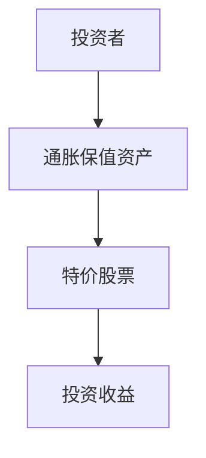
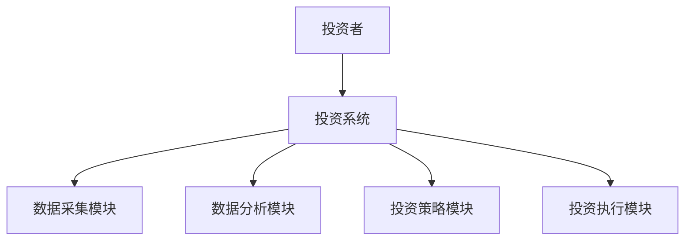
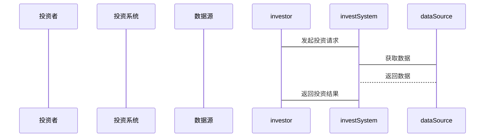

                 

# 目录大纲：如何将特价股票策略与通胀保值资产投资结合

## 第一部分：背景与核心概念

### 第1章：通货膨胀与资产保值概述
#### 1.1 通货膨胀的基本概念
- 1.1.1 通货膨胀的定义与表现形式
- 1.1.2 通货膨胀对资产价值的影响
- 1.1.3 通货膨胀对投资决策的影响

#### 1.2 资产保值的必要性
- 1.2.1 资产保值的定义与目标
- 1.2.2 不同经济周期下的资产保值策略
- 1.2.3 资产保值与风险控制的关系

### 第2章：特价股票策略的定义与优势
#### 2.1 特价股票的定义与特点
- 2.1.1 特价股票的定义
- 2.1.2 特价股票的特点：低估值、高分红、行业龙头等
- 2.1.3 特价股票的投资机会与风险

#### 2.2 特价股票策略的优势
- 2.2.1 在通货膨胀环境下的优势
- 2.2.2 特价股票策略的长期收益潜力
- 2.2.3 特价股票策略与其他投资策略的对比

## 第二部分：通胀保值资产与特价股票策略的核心联系

### 第3章：通胀保值资产的核心原理
#### 3.1 通胀保值资产的属性特征对比
- 3.1.1 不同资产类别在通胀环境下的表现对比
- 3.1.2 股票、债券、黄金等资产的通胀对冲能力分析
- 3.1.3 特价股票在通胀环境下的表现特点

#### 3.2 特价股票策略与通胀保值的ER实体关系图
- 3.2.1 实体关系图（Mermaid流程图）

## 第三部分：数学模型与算法原理

### 第4章：通胀影响的数学模型
#### 4.1 通货膨胀率计算公式
- 4.1.1 通货膨胀率的计算公式：$$ \text{通货膨胀率} = \frac{\text{当前物价指数} - \text{基期物价指数}}{\text{基期物价指数}} \times 100\% $$
- 4.1.2 实际案例分析：计算某年通胀率

#### 4.2 股票估值模型
- 4.2.1 股票估值的数学公式：$$ \text{内在价值} = \frac{\text{预期现金流}}{\text{折现率}} $$
- 4.2.2 通货膨胀对股票估值的影响分析
- 4.2.3 实际案例：如何计算某只股票的内在价值

## 第四部分：系统分析与架构设计

### 第5章：投资系统架构设计
#### 5.1 投资系统功能设计
- 5.1.1 领域模型类图（Mermaid）

#### 5.2 系统架构设计
- 5.2.1 系统架构图（Mermaid）

#### 5.3 系统接口设计
- 5.3.1 数据接口：如何获取通胀数据、股票价格数据
- 5.3.2 投资策略接口：如何调用特价股票策略
- 5.3.3 投资执行接口：如何下单和跟踪收益

#### 5.4 系统交互流程图
- 5.4.1 投资流程（Mermaid）

## 第五部分：项目实战与案例分析

### 第6章：项目实战
#### 6.1 环境配置与工具安装
- 6.1.1 系统运行环境要求
- 6.1.2 工具安装与配置：Python、Pandas、Matplotlib等

#### 6.2 系统核心实现
- 6.2.1 数据采集模块实现：如何获取通胀数据和股票数据
- 6.2.2 数据分析模块实现：如何计算通货膨胀率、股票估值
- 6.2.3 投资策略模块实现：如何筛选特价股票
- 6.2.4 投资执行模块实现：如何下单和跟踪收益

#### 6.3 代码实现与解读
- 6.3.1 数据采集代码示例
- 6.3.2 数据分析代码示例
- 6.3.3 投资策略代码示例
- 6.3.4 投资执行代码示例

#### 6.4 案例分析
- 6.4.1 实际案例：如何在通胀环境下选择特价股票
- 6.4.2 投资结果分析与总结
- 6.4.3 经验教训与优化建议

## 第六部分：总结与展望

### 第7章：总结与展望
#### 7.1 投资策略总结
- 7.1.1 特价股票策略与通胀保值结合的优势
- 7.1.2 投资过程中需要注意的风险与挑战
- 7.1.3 投资策略的持续优化与调整

#### 7.2 未来展望
- 7.2.1 新技术在投资策略中的应用：AI、大数据等
- 7.2.2 通胀保值资产投资的未来趋势
- 7.2.3 投资者教育与风险管理的重要性

## 第七部分：附录与参考文献

### 附录A：常用工具与资源
- A.1 数据获取工具
- A.2 数据分析工具
- A.3 投资执行平台

### 附录B：术语表
- B.1 通胀相关术语
- B.2 股票投资术语
- B.3 保值资产术语

### 参考文献
- C.1 经济学与投资学经典文献
- C.2 通胀与资产保值相关研究
- C.3 特价股票策略的经典书籍与文章

---

**关键词：特价股票策略、通胀保值、资产投资、数学模型、系统架构设计**

**摘要：本文系统地探讨了如何将特价股票策略与通胀保值资产投资相结合，通过数学模型、系统架构设计和实际案例分析，深入剖析了在通货膨胀环境下利用特价股票策略进行资产保值的有效方法。文章从理论基础、实践操作到系统实现，全面解读了这一投资策略的核心要素与实施步骤，为投资者提供了科学的投资决策参考。**

