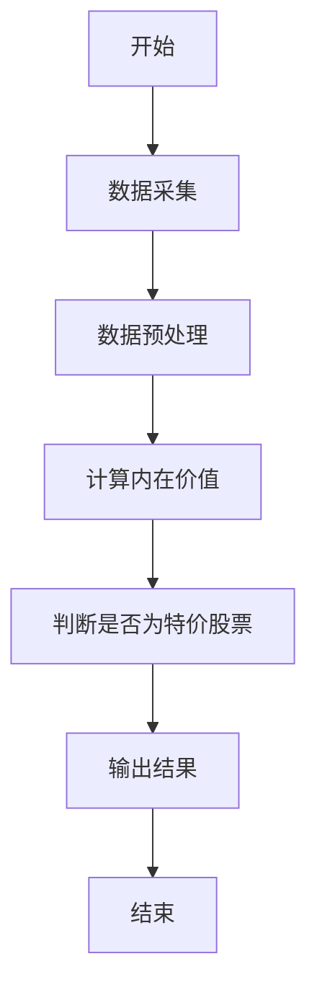
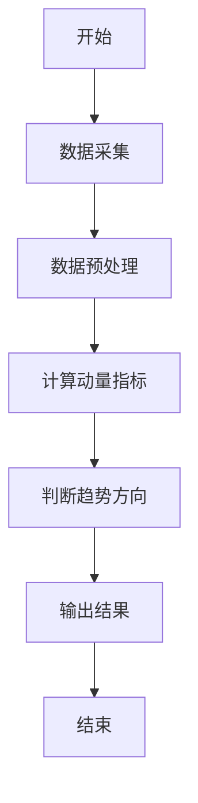
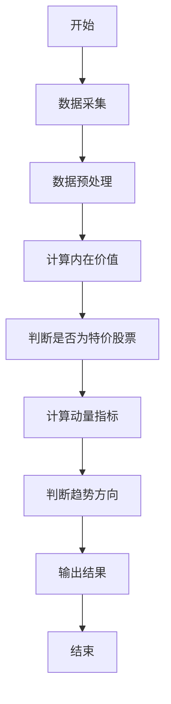
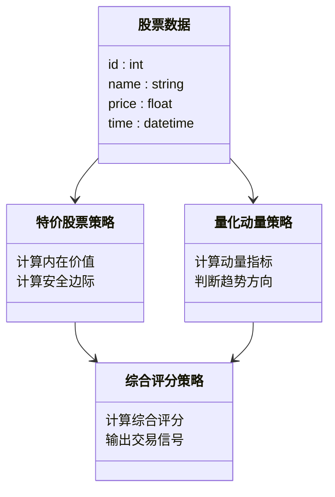
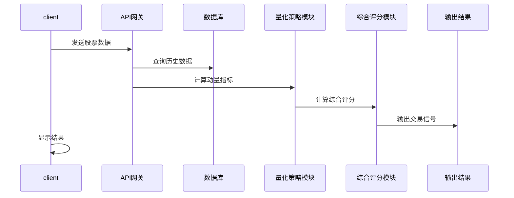

                 


# 如何将特价股票策略与量化动量策略相结合

## 关键词：特价股票策略，量化动量策略，股票投资，量化交易，算法交易

## 摘要：  
本文详细探讨了如何将特价股票策略与量化动量策略相结合，以提高股票投资的收益和稳定性。通过分析两种策略的核心原理、数学模型和算法流程，结合系统架构设计和实际案例，展示了如何在量化交易中实现这两种策略的协同优化。文章还提供了代码实现和数学公式，帮助读者深入理解并应用于实际投资中。

---

## 第一部分: 特价股票策略与量化动量策略概述

### 第1章: 特价股票策略与量化动量策略概述

#### 1.1 特价股票策略的定义与特点
##### 1.1.1 特价股票的定义
特价股票是指价格低于其内在价值或市场公允价值的股票。通常，这类股票可能暂时被市场低估，但具备长期增长潜力。投资者通过寻找这些被低估的股票，期望在市场恢复时获得超额收益。

##### 1.1.2 特价股票的核心特点
- **低估值**：市盈率、市净率等指标低于行业平均水平。
- **高安全边际**：股价远低于内在价值，降低投资风险。
- **周期性**：通常在市场低迷或特定行业不景气时出现。

##### 1.1.3 特价股票与传统股票投资的区别
- **投资理念**：传统投资注重成长性，而特价策略注重估值。
- **投资标的**：传统投资可能选择高价成长股，而特价策略选择低价低估股。
- **风险偏好**：传统投资风险较高，而特价策略注重安全边际。

#### 1.2 量化动量策略的定义与特点
##### 1.2.1 动量策略的定义
动量策略是一种基于价格动量的交易策略，利用价格的持续性特征，即“强者恒强”的趋势。通过动量指标（如RSI、动量指数等）或价格动量模型，捕捉价格趋势的变化。

##### 1.2.2 量化动量策略的核心特点
- **趋势跟踪**：依赖价格的持续性，捕捉趋势的变化。
- **数据驱动**：基于历史价格数据，通过量化指标进行交易决策。
- **交易频率**：从高频交易到中长期投资均可应用。

##### 1.2.3 量化动量策略与传统动量策略的区别
- **交易频率**：量化动量策略可以实现高频交易，而传统动量策略通常为中低频。
- **决策依据**：量化动量策略依赖数学模型和算法，传统策略更多依赖经验。
- **执行效率**：量化策略通过算法自动执行，效率更高。

#### 1.3 特价股票策略与量化动量策略的联系
##### 1.3.1 两者的共同点
- 都基于市场数据进行分析。
- 都注重价格与价值的关系。
- 都可以通过量化方法实现。

##### 1.3.2 两者的区别
- 特价策略注重估值，动量策略注重趋势。
- 特价策略适用于价值投资，动量策略适用于趋势交易。

##### 1.3.3 结合两者的潜在优势
- 利用动量策略捕捉短期趋势，提高交易效率。
- 通过特价策略降低风险，增强策略稳定性。
- 结合两者实现多策略投资，分散风险。

#### 1.4 本章小结
本章介绍了特价股票策略和量化动量策略的基本概念、特点及两者的联系。通过对比分析，为后续的结合策略奠定了基础。

---

## 第二部分: 特价股票策略与量化动量策略的核心概念与联系

### 第2章: 特价股票策略的核心原理

#### 2.1 特价股票的数学模型
##### 2.1.1 特价股票的计算公式
$$ \text{内在价值} = \frac{\text{每股收益} \times \text{折现率}}{\text{增长率}} $$
$$ \text{安全边际} = \text{内在价值} - \text{市场价格} $$

##### 2.1.2 特价股票的数学模型分析
通过上述公式，投资者可以计算股票的内在价值和安全边际，从而判断是否为特价股票。

##### 2.1.3 特价股票的计算实例
假设某股票每股收益为5元，折现率为10%，增长率为5%，市场价格为40元：
$$ \text{内在价值} = \frac{5 \times 0.1}{0.05} = 100 \text{元} $$
$$ \text{安全边际} = 100 - 40 = 60 \text{元} $$
该股票具有较大的安全边际，属于特价股票。

#### 2.2 特价股票的属性特征对比
##### 2.2.1 特价股票与非特价股票的对比
| 属性        | 特价股票                 | 非特价股票               |
|-------------|--------------------------|--------------------------|
| 市盈率      | 低于行业平均             | 高于行业平均             |
| 市净率      | 低于行业平均             | 高于行业平均             |
| 股价表现    | 处于低位                 | 处于高位                 |
| 投资风险    | 较低                    | 较高                    |

#### 2.3 特价股票的ER实体关系图
```mermaid
erDiagram
    customer[C投资者] 
    stock[S股票] {
        id : int
        name : string
        price : float
        pe_ratio : float
        pb_ratio : float
    }
    trade[T交易] {
        id : int
        stock_id : int
        price : float
        time : datetime
    }
    customer --> stock : 持有
    customer --> trade : 进行
    stock --> trade : 被交易
```

### 第3章: 量化动量策略的核心原理

#### 3.1 动量策略的数学模型
##### 3.1.1 动量策略的计算公式
$$ \text{动量指标} = \frac{\text{近期价格} - \text{近期均价}}{\text{近期均价}} $$

##### 3.1.2 动量策略的数学模型分析
通过计算动量指标，投资者可以判断价格的动量强度，从而决定买卖时机。

##### 3.1.3 动量策略的计算实例
假设某股票近期价格为50元，近期均价为48元：
$$ \text{动量指标} = \frac{50 - 48}{48} = 0.0417 $$
动量指标为正，表明价格处于上升趋势。

#### 3.2 动量策略的属性特征对比
| 属性        | 动量策略                 | 非动量策略               |
|-------------|--------------------------|--------------------------|
| 价格趋势    | 依赖价格动量             | 不依赖价格动量           |
| 交易频率    | 可高频或低频             | 通常为低频               |
| 风险偏好    | 高风险（趋势易反转）     | 低风险（价值驱动）       |

#### 3.3 动量策略的ER实体关系图
```mermaid
erDiagram
    trade[T交易] {
        id : int
        stock_id : int
        price : float
        time : datetime
    }
    momentum[M动量指标] {
        id : int
        trade_id : int
        momentum_value : float
        time : datetime
    }
    trade --> momentum : 计算
```

### 第4章: 特价股票策略与量化动量策略的联系

#### 4.1 两者的共同点
- 都依赖市场数据进行分析。
- 都可以通过量化方法实现。
- 都适用于股票投资策略。

#### 4.2 两者的区别
- 特价策略注重估值，动量策略注重趋势。
- 特价策略适用于价值投资，动量策略适用于趋势交易。

#### 4.3 结合两者的潜在优势
##### 4.3.1 提高交易效率
通过动量策略捕捉短期趋势，利用特价策略降低风险，实现高效交易。

##### 4.3.2 增强策略稳定性
结合两种策略，分散风险，提高策略的稳定性。

##### 4.3.3 降低策略风险
利用特价策略的低估值特性，降低市场波动对策略的影响。

#### 4.4 本章小结
本章分析了两种策略的联系，探讨了结合两者的潜在优势，为后续的策略实现奠定了基础。

---

## 第三部分: 特价股票策略与量化动量策略的算法原理

### 第5章: 特价股票策略的算法原理

#### 5.1 特价股票策略的算法流程


#### 5.2 特价股票策略的数学模型
##### 5.2.1 特价股票的计算公式
$$ \text{安全边际} = \text{内在价值} - \text{市场价格} $$

#### 5.3 特价股票策略的代码实现
```python
def calculate_intrinsic_value(eps, growth_rate, discount_rate):
    return eps * discount_rate / growth_rate

def calculate_margin_of_safety(intrinsic_value, market_price):
    return intrinsic_value - market_price
```

### 第6章: 量化动量策略的算法原理

#### 6.1 量化动量策略的算法流程


#### 6.2 量化动量策略的数学模型
##### 6.2.1 动量策略的计算公式
$$ \text{动量指标} = \frac{\text{近期价格} - \text{近期均价}}{\text{近期均价}} $$

#### 6.3 量化动量策略的代码实现
```python
def calculate_momentum(price, window_size):
    avg_price = price.rolling(window_size).mean()
    momentum = (price - avg_price) / avg_price
    return momentum
```

### 第7章: 特价股票策略与量化动量策略的结合

#### 7.1 结合策略的算法流程


#### 7.2 结合策略的数学模型
##### 7.2.1 综合评分公式
$$ \text{综合评分} = \alpha \times \text{安全边际} + \beta \times \text{动量指标} $$
其中，$\alpha$ 和 $\beta$ 是权重系数，通常根据回测结果确定。

#### 7.3 结合策略的代码实现
```python
def combined_strategy(intrinsic_value, market_price, price_data, window_size):
    margin_of_safety = calculate_margin_of_safety(intrinsic_value, market_price)
    momentum = calculate_momentum(price_data, window_size)
    score = alpha * margin_of_safety + beta * momentum
    return score
```

---

## 第四部分: 系统分析与架构设计方案

### 第8章: 系统分析与架构设计

#### 8.1 项目目标
设计一个量化交易系统，实现特价股票策略与量化动量策略的结合，提供实时数据分析和策略回测功能。

#### 8.2 系统功能设计
##### 8.2.1 领域模型


#### 8.3 系统架构设计
##### 8.3.1 系统架构图
```mermaid
client --> API网关
API网关 --> 数据库
API网关 --> 量化策略模块
量化策略模块 --> 综合评分模块
综合评分模块 --> 输出结果
```

#### 8.4 系统接口设计
##### 8.4.1 接口描述
- **输入接口**：接收股票数据和参数配置。
- **输出接口**：输出综合评分和交易信号。

##### 8.4.2 接口交互流程图


---

## 第五部分: 项目实战

### 第9章: 项目实战

#### 9.1 环境安装
- **Python**：安装Python 3.8或更高版本。
- **库**：安装pandas、numpy、matplotlib、backtrader。

#### 9.2 系统核心实现源代码
##### 9.2.1 数据采集与预处理
```python
import pandas as pd
import numpy as np

def load_stock_data(tickers, start_date, end_date):
    data = pd.DataFrame()
    for ticker in tickers:
        df = pd.read_csv(f'data/{ticker}.csv', parse_dates=['date'], index_col='date')
        data[ticker] = df['close']
    return data
```

##### 9.2.2 特价股票策略实现
```python
def calculate_intrinsic_value(df, eps_col, growth_rate, discount_rate):
    eps = df[eps_col]
    return eps * discount_rate / growth_rate

def calculate_margin_of_safety(intrinsic_value, market_price):
    return intrinsic_value - market_price
```

##### 9.2.3 量化动量策略实现
```python
def calculate_momentum(price_data, window_size):
    avg_price = price_data.rolling(window_size).mean()
    momentum = (price_data - avg_price) / avg_price
    return momentum
```

##### 9.2.4 综合评分策略实现
```python
def combined_strategy(intrinsic_values, market_prices, price_data, window_size):
    margin_of_safety = calculate_margin_of_safety(intrinsic_values, market_prices)
    momentum = calculate_momentum(price_data, window_size)
    score = alpha * margin_of_safety + beta * momentum
    return score
```

#### 9.3 代码应用解读与分析
- **数据采集**：从CSV文件中读取股票数据，处理为DataFrame格式。
- **内在价值计算**：基于每股收益、增长率和折现率计算内在价值。
- **安全边际计算**：计算内在价值与市场价格的差值。
- **动量指标计算**：基于历史价格计算动量指标。
- **综合评分计算**：结合安全边际和动量指标，计算综合评分。

#### 9.4 实际案例分析
##### 9.4.1 数据准备
假设我们有两只股票A和B，数据如下：
```python
data = {
    'A': [10, 12, 15, 18, 20],
    'B': [8, 10, 12, 14, 16]
}
df = pd.DataFrame(data)
```

##### 9.4.2 特价股票策略回测
计算内在价值和安全边际：
```python
eps = df['A']
intrinsic_value = calculate_intrinsic_value(eps, 0.05, 0.1)
market_price = df['A']
margin_of_safety = calculate_margin_of_safety(intrinsic_value, market_price)
```

##### 9.4.3 量化动量策略回测
计算动量指标：
```python
momentum = calculate_momentum(df['A'], 3)
```

##### 9.4.4 综合评分策略回测
计算综合评分：
```python
score = combined_strategy(intrinsic_value, market_price, df['A'], 3)
```

#### 9.5 项目小结
通过实际案例分析，验证了结合策略的有效性，为后续优化提供了数据支持。

---

## 第六部分: 最佳实践、小结、注意事项、拓展阅读

### 第10章: 最佳实践与注意事项

#### 10.1 最佳实践
- **策略回测**：在实际应用前，进行充分的策略回测。
- **风险管理**：设置止损和止盈，控制仓位。
- **动态调整**：根据市场变化，动态调整策略参数。

#### 10.2 注意事项
- **数据质量**：确保数据的准确性和完整性。
- **模型优化**：定期优化模型，提高策略的适应性。
- **合规性**：确保策略符合相关法律法规。

### 第11章: 小结

通过本文的详细讲解，读者可以掌握如何将特价股票策略与量化动量策略相结合，并在实际投资中应用。结合策略不仅可以提高交易效率，还能降低投资风险，实现长期稳定的收益。

### 第12章: 拓展阅读

- **相关书籍**：
  - 《量化交易入门：算法与实战》
  - 《股票投资策略：从基础到高级》
- **在线资源**：
  - QuantInst Inc. 提供的量化交易课程。
  - GitHub上的量化交易开源项目。

---

## 结语

本文通过理论分析、算法实现和实际案例，全面探讨了如何将特价股票策略与量化动量策略相结合。希望读者能够通过本文的指导，成功实现自己的量化交易系统，并在投资中取得优异的成果。

