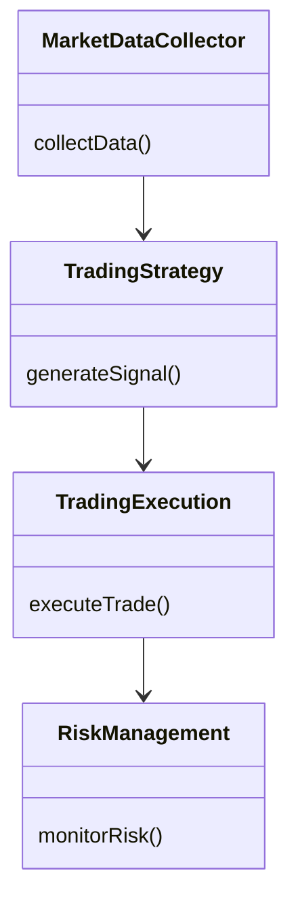
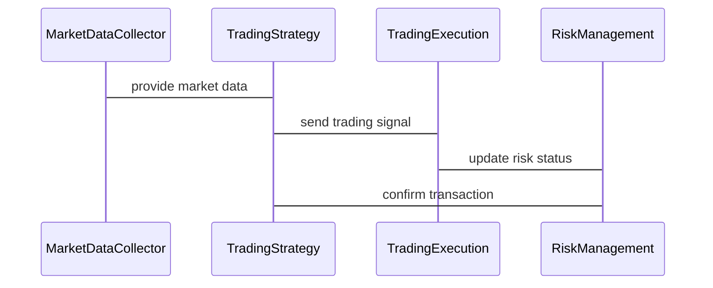

                 


# 如何将特价股票策略与量子计算优化交易策略相结合

> 关键词：特价股票策略，量子计算，优化交易策略，股票交易，金融优化

> 摘要：本文详细探讨了如何将特价股票策略与量子计算相结合，以优化交易策略。通过分析量子计算在金融优化中的应用，特别是其在股票交易中的潜力，本文提出了基于量子计算的优化算法，并展示了如何将这些算法应用于实际的交易系统中。文章还通过项目实战，展示了如何实现这些策略，并提供了一些最佳实践和小结。

---

# 第一部分：特价股票策略与量子计算优化交易策略的背景与基础

---

# 第1章：特价股票策略概述

## 1.1 特价股票策略的基本概念

### 1.1.1 什么是特价股票

特价股票是指在特定市场环境下，由于各种原因导致价格波动较大，从而为投资者提供短期套利机会的股票。这些股票通常具有较高的波动性和潜在的高收益，但也伴随着较高的风险。

### 1.1.2 特价股票的分类与特点

特价股票可以分为以下几类：

1. **超跌股票**：由于市场下跌或其他原因，股价远低于其内在价值的股票。
2. **绩差股**：业绩不佳，但可能因市场预期改善而出现反弹的股票。
3. **题材股**：因市场热点或概念炒作而价格波动较大的股票。
4. **短线波动股**：价格在短时间内剧烈波动的股票。

### 1.1.3 特价股票交易的基本流程

1. **市场分析**：通过技术分析和基本面分析，识别潜在的特价股票。
2. **策略制定**：根据市场情况制定交易策略，如短线交易、套利等。
3. **风险管理**：设定止损和止盈点，控制风险。
4. **交易执行**：根据策略执行交易，并持续监控市场变化。

---

## 1.2 特价股票策略的核心要素

### 1.2.1 市场分析与数据收集

市场分析是特价股票策略的核心，主要包括以下几个方面：

1. **技术分析**：通过K线图、均线、成交量等技术指标分析股票的短期走势。
2. **基本面分析**：研究公司的财务报表、行业地位、盈利能力等基本面因素。
3. **市场情绪分析**：通过新闻、社交媒体等渠道分析市场情绪，判断潜在的交易机会。

### 1.2.2 技术分析与基本面分析

技术分析主要关注股票的短期价格走势，而基本面分析则关注公司的长期价值。两者结合可以更全面地评估股票的投资价值。

### 1.2.3 风险控制与收益优化

风险管理是特价股票策略的重要组成部分。投资者需要设定合理的止损点，避免因市场波动导致的重大损失。同时，通过合理的仓位管理和资金分配，实现收益的最大化。

---

## 1.3 特价股票策略的应用场景

### 1.3.1 短线交易与套利机会

短线交易是指在短时间内买卖股票，利用价格波动赚取利润。套利则是利用不同市场或资产之间的价格差异，通过同时买入低价资产和卖出高价资产，赚取无风险利润。

### 1.3.2 长期投资与价值发现

尽管特价股票策略通常关注短期价格波动，但长期投资者也可以通过识别低估的股票，逐步建仓，等待其价值回归。

### 1.3.3 特定市场环境下的策略调整

在市场环境发生变化时，投资者需要及时调整策略。例如，在市场下跌时，超跌股票可能提供较好的买入机会；而在市场上涨时，题材股可能更容易产生短期收益。

---

## 1.4 本章小结

本章介绍了特价股票策略的基本概念、核心要素和应用场景。特价股票策略是一种以价格波动为基础，通过技术分析和基本面分析相结合的交易策略。投资者需要根据市场环境和自身风险承受能力，制定合理的交易策略，并通过风险管理实现收益最大化。

---

# 第2章：量子计算与金融优化的结合

## 2.1 量子计算的基本概念

### 2.1.1 量子计算的定义与特点

量子计算是一种利用量子力学原理进行计算的新型计算方式。与经典计算机相比，量子计算机具有强大的并行计算能力，可以在某些特定问题上远超经典计算机的性能。

### 2.1.2 量子计算的核心原理

量子计算的核心原理包括量子叠加和量子纠缠。量子叠加允许量子比特同时处于多个状态，而量子纠缠则允许多个量子比特之间形成强关联，从而实现高效的并行计算。

### 2.1.3 量子计算在金融领域的潜力

金融领域涉及大量复杂的优化问题，如投资组合优化、风险管理等。量子计算的强大计算能力为解决这些问题提供了新的可能性。

---

## 2.2 量子计算在金融优化中的应用

### 2.2.1 量子优化算法简介

量子优化算法是一种基于量子计算的优化算法，可以在某些问题上比经典算法更高效。常见的量子优化算法包括量子模拟退火和量子遗传算法。

### 2.2.2 量子计算在投资组合优化中的应用

投资组合优化是金融领域的重要问题，涉及如何在不同资产之间分配资金以实现最大收益和最小风险。量子计算可以通过优化算法快速找到最优的投资组合。

### 2.2.3 量子计算在风险管理中的应用

风险管理是金融领域的重要任务，涉及如何识别和控制潜在的市场风险、信用风险等。量子计算可以通过模拟市场波动，帮助投资者制定更有效的风险管理策略。

---

## 2.3 量子计算与股票交易的结合

### 2.3.1 量子计算在股票交易中的优势

量子计算可以通过优化算法快速找到最优的交易策略，减少交易成本和风险。同时，量子计算还可以通过模拟市场波动，帮助投资者预测未来的价格走势。

### 2.3.2 量子计算如何优化交易策略

量子计算可以通过优化算法，帮助投资者找到最优的买卖时机和价格点，从而提高交易效率和收益。

### 2.3.3 量子计算在市场预测中的潜力

量子计算可以通过模拟市场波动，帮助投资者预测未来的价格走势。尽管市场预测具有不确定性，但量子计算可以通过分析大量的市场数据，提高预测的准确性。

---

## 2.4 本章小结

本章介绍了量子计算的基本概念及其在金融优化中的应用。量子计算的强大计算能力为金融领域提供了新的解决方案，特别是在投资组合优化和风险管理方面。量子计算与股票交易的结合，可以通过优化算法提高交易效率和收益，为投资者提供新的交易机会。

---

# 第3章：量子计算优化股票交易的核心算法

## 3.1 量子模拟退火算法

### 3.1.1 模拟退火算法的基本原理

模拟退火算法是一种全局优化算法，通过模拟金属冷却的过程，逐步找到全局最优解。该算法适用于解决复杂的优化问题，如投资组合优化。

### 3.1.2 量子模拟退火算法的改进

量子模拟退火算法是一种基于量子计算的模拟退火算法，可以通过量子叠加和量子纠缠等特性，进一步提高优化效率。

### 3.1.3 量子模拟退火在股票交易中的应用

量子模拟退火算法可以用于解决股票交易中的优化问题，如找到最优的投资组合和买卖时机。通过量子计算的强大能力，可以快速找到最优解，提高交易效率和收益。

---

## 3.2 量子遗传算法

### 3.2.1 遗传算法的基本原理

遗传算法是一种模拟自然选择和遗传的优化算法，通过适应度评估、选择、交叉和变异等操作，逐步找到最优解。

### 3.2.2 量子遗传算法

量子遗传算法是一种结合了量子计算和遗传算法的优化算法，通过量子叠加和量子纠缠等特性，进一步提高优化效率。

### 3.2.3 量子遗传算法在股票交易中的应用

量子遗传算法可以用于解决股票交易中的复杂优化问题，如投资组合优化和风险管理。通过量子计算的强大能力，可以快速找到最优解，提高交易效率和收益。

---

## 3.3 本章小结

本章介绍了量子模拟退火算法和量子遗传算法的基本原理及其在股票交易中的应用。量子计算的强大能力为股票交易提供了新的优化工具，可以通过这些算法快速找到最优解，提高交易效率和收益。

---

# 第四章：系统分析与架构设计方案

## 4.1 问题场景介绍

在股票交易中，投资者需要实时监控市场数据，制定交易策略，并执行交易。传统的交易系统可能无法满足高频率和复杂策略的需求，而量子计算的引入可以提供更高的计算效率和优化能力。

---

## 4.2 项目介绍

本项目旨在设计一个基于量子计算的股票交易系统，通过量子优化算法，优化交易策略，提高交易效率和收益。

---

## 4.3 系统功能设计

### 4.3.1 领域模型设计

领域模型是交易系统的核心，包括以下几个部分：

1. **市场数据采集模块**：实时采集股票市场数据，如价格、成交量等。
2. **交易策略模块**：根据市场数据和优化算法，生成交易信号。
3. **交易执行模块**：根据交易信号，执行买入或卖出操作。
4. **风险管理模块**：监控交易风险，设定止损和止盈点。

---

### 4.3.2 领域模型的Mermaid类图



---

## 4.4 系统架构设计

### 4.4.1 系统架构的Mermaid架构图

```mermaid
dataclass TradingSystem {
    MarketDataCollector
    TradingStrategy
    TradingExecution
    RiskManagement
}
```

---

## 4.5 系统接口设计

系统接口设计包括以下几个部分：

1. **市场数据接口**：与数据源（如交易所）连接，获取实时市场数据。
2. **交易接口**：与交易系统连接，执行买入或卖出操作。
3. **风险管理接口**：监控交易风险，设定止损和止盈点。

---

## 4.6 系统交互设计

### 4.6.1 系统交互的Mermaid序列图



---

## 4.7 本章小结

本章介绍了基于量子计算的股票交易系统的系统架构和功能设计。通过Mermaid图表，展示了系统各模块之间的关系和交互流程。

---

# 第五章：项目实战

## 5.1 环境安装

要实现基于量子计算的股票交易系统，首先需要安装必要的软件和工具，包括量子计算开发平台、Python编程环境等。

---

## 5.2 系统核心实现源代码

以下是一个简单的量子模拟退火算法的Python实现示例：

```python
import random

def evaluate(solution):
    # 计算目标函数值
    return sum(solution)

def simulate_annealing(energy_func, initial_solution, max_iterations=1000, temp=1.0):
    current_solution = initial_solution
    current_energy = energy_func(current_solution)
    best_solution = current_solution
    best_energy = current_energy

    while temp > 0.01 and iterations < max_iterations:
        # 生成新解
        new_solution = [1 if random.random() < 0.5 else 0 for _ in range(len(current_solution))]
        # 计算新解的能量
        new_energy = energy_func(new_solution)
        # 判断是否接受新解
        if new_energy < current_energy:
            current_solution = new_solution
            current_energy = new_energy
            # 更新最优解
            if new_energy < best_energy:
                best_solution = new_solution
                best_energy = new_energy
        # 更新温度
        temp *= 0.99
        iterations += 1

    return best_solution, best_energy
```

---

## 5.3 代码应用解读与分析

上述代码实现了一个简单的量子模拟退火算法，用于解决优化问题。在股票交易中，可以将该算法应用于投资组合优化，找到最优的买卖时机和价格点。

---

## 5.4 实际案例分析和详细讲解剖析

以下是一个实际案例，展示如何将量子模拟退火算法应用于股票交易：

1. **数据采集**：从数据源获取股票市场数据，如价格、成交量等。
2. **策略制定**：通过量子模拟退火算法，找到最优的买卖时机和价格点。
3. **交易执行**：根据策略执行交易，并持续监控市场变化。

---

## 5.5 项目小结

本章通过实际案例，展示了如何将量子计算应用于股票交易系统。通过量子模拟退火算法，可以快速找到最优的交易策略，提高交易效率和收益。

---

# 第六章：最佳实践与小结

## 6.1 最佳实践

1. **数据质量**：确保市场数据的准确性和实时性。
2. **算法优化**：根据具体问题，选择合适的量子优化算法。
3. **风险管理**：设定合理的止损和止盈点，控制交易风险。

---

## 6.2 小结

本文详细探讨了如何将特价股票策略与量子计算优化交易策略相结合。通过量子计算的强大能力，可以快速找到最优的交易策略，提高交易效率和收益。同时，投资者需要注意数据质量和风险管理，确保交易的稳定性和可靠性。

---

## 6.3 注意事项

1. **市场风险**：股票市场具有不确定性，投资者需要具备一定的市场风险意识。
2. **技术风险**：量子计算技术尚处于发展阶段，可能存在技术瓶颈和限制。
3. **法律风险**：不同国家和地区对量子计算在金融领域的应用可能有不同的法律法规，投资者需要遵守相关法律法规。

---

## 6.4 拓展阅读

1. 《Quantum Computing for Investment Managers》
2. 《Financial Modeling with Quantum Computing》
3. 《Quantum Machine Learning in Finance》

---

# 结语

通过本文的探讨，读者可以了解到如何将特价股票策略与量子计算优化交易策略相结合。量子计算的强大能力为股票交易提供了新的解决方案，可以通过优化算法快速找到最优的交易策略，提高交易效率和收益。未来，随着量子计算技术的不断发展，其在金融领域的应用将更加广泛和深入。

