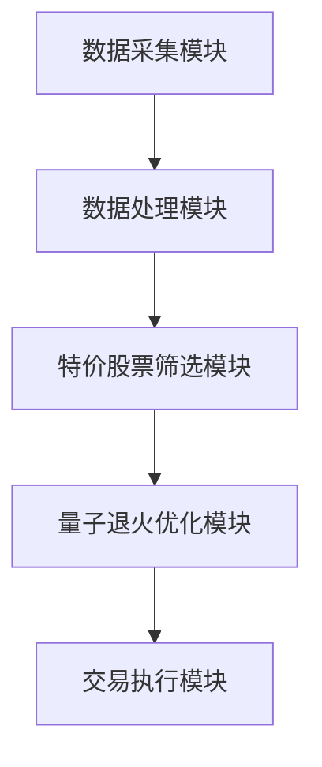
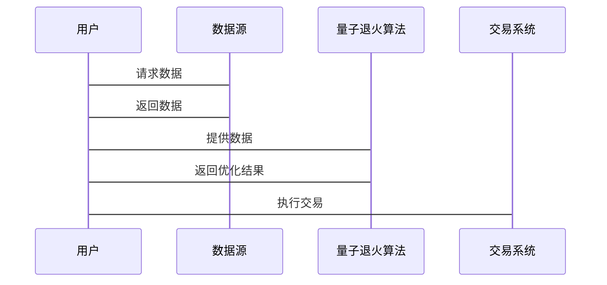

                 


# 如何将特价股票策略与量子退火优化交易策略相结合

## 关键词：特价股票策略，量子退火，优化交易策略，股票筛选，量子计算

## 摘要：本文详细探讨了如何将特价股票策略与量子退火优化交易策略相结合，通过量子退火算法优化特价股票筛选过程，提高交易效率和收益。文章从背景、原理、算法实现、系统设计、项目实战等多方面展开，提供深入的技术分析和实践指导。

---

# 第一部分: 特价股票策略与量子退火优化交易策略结合概述

## 第1章: 特价股票策略与量子退火优化交易策略概述

### 1.1 特价股票策略的基本概念
#### 1.1.1 特价股票的定义与特点
特价股票是指市场价格低于其内在价值的股票。其特点包括低估值、高潜力和风险可控。通过识别这些股票，投资者可以在市场波动中获得超额收益。

#### 1.1.2 特价股票策略的核心要素
- 估值模型：如市盈率、市净率等。
- 市场情绪：利用情绪指标筛选超跌股票。
- 时间周期：短线、中长线策略结合。

#### 1.1.3 特价股票策略的应用场景
- 资产配置：构建低成本投资组合。
- 风险控制：通过低估值降低市场波动影响。
- 投机交易：捕捉市场低估机会。

### 1.2 量子退火优化交易策略的基本原理
#### 1.2.1 量子退火算法的定义与特点
量子退火是一种模拟量子物理系统退火过程的优化算法，通过降低能量壁垒找到全局最优解。

#### 1.2.2 量子退火算法在交易优化中的应用
- 股票组合优化：最大化收益，最小化风险。
- 交易路径优化：降低交易成本，提高执行效率。
- 市场微观结构分析：识别市场机会。

#### 1.2.3 量子退火算法与传统优化算法的对比
| 特性         | 量子退火       | 传统优化算法   |
|--------------|----------------|---------------|
| 全局最优     | 高             | 中             |
| 并行计算能力 | 强             | 弱             |
| 应用场景     | 复杂组合优化   | 线性问题为主    |

### 1.3 特价股票策略与量子退火优化的结合
#### 1.3.1 结合的核心思想
利用量子退火算法优化特价股票筛选过程，提升策略执行效率和收益。

#### 1.3.2 结合的实现目标
- 提高筛选效率：减少计算复杂度。
- 增强筛选精度：优化股票组合。
- 动态调整：适应市场变化。

#### 1.3.3 结合的应用价值
- 提高交易收益：精选优质股票。
- 降低交易风险：优化组合配置。
- 提升交易效率：快速筛选股票。

---

## 第2章: 特价股票策略的数学模型与优化问题

### 2.1 特价股票策略的数学建模
#### 2.1.1 特价股票筛选的数学模型
$$
\text{目标函数} = \sum_{i=1}^{n} (P_i - V_i)
$$
其中，$P_i$为股票价格，$V_i$为股票价值。

#### 2.1.2 特价股票策略的优化目标
最大化组合收益，最小化组合风险。

#### 2.1.3 特价股票策略的约束条件
- 资金限制：$\sum_{i=1}^{n} w_i \leq W$
- 风险控制：$\sum_{i=1}^{n} r_i^2 \leq R$

### 2.2 量子退火算法的数学基础
#### 2.2.1 量子退火算法的基本原理
量子退火通过模拟量子系统退火过程，逐步降低能量壁垒，找到全局最优解。

#### 2.2.2 量子退火算法的数学模型
$$
E = \sum_{i=1}^{n} w_i P_i - \sum_{i=1}^{n} w_i V_i
$$

#### 2.2.3 量子退火算法的优化特性
- 全局优化能力：能跳出局部最优。
- 并行计算能力：适合多变量优化。

### 2.3 特价股票策略与量子退火优化的结合模型
#### 2.3.1 模型构建的核心思路
利用量子退火算法优化股票组合，最大化收益，最小化风险。

#### 2.3.2 模型的数学表达式
$$
\max \sum_{i=1}^{n} w_i (P_i - V_i)
$$
$$
\text{约束}：\sum_{i=1}^{n} w_i \leq W, \sum_{i=1}^{n} w_i \sigma_i^2 \leq R
$$

---

## 第3章: 量子退火算法的实现与应用

### 3.1 量子退火算法的实现原理
#### 3.1.1 量子退火算法的基本步骤
1. 初始化：随机生成初始解。
2. 计算能量：评估当前解的能量。
3. 进行量子跃变：随机改变部分变量。
4. 评估新能量：计算新解的能量。
5. 接受或拒绝新解：根据能量变化决定是否接受。
6. 降温：降低系统温度，重复步骤。

#### 3.1.2 量子退火算法的参数设置
- 初始温度：高。
- 降温速率：线性或指数。
- 迭代次数：足够多次。

#### 3.1.3 量子退火算法的收敛性分析
- 收敛速度：较快。
- 收敛稳定性：较高。

### 3.2 量子退火算法在交易策略中的应用
#### 3.2.1 交易策略优化的数学模型
$$
\max \sum_{i=1}^{n} w_i r_i
$$
$$
\text{约束}：\sum_{i=1}^{n} w_i \leq 1, \sum_{i=1}^{n} w_i \sigma_i \leq R
$$

#### 3.2.2 量子退火算法在交易策略中的实现
- 量化股票收益和风险。
- 使用量子退火优化权重。

#### 3.2.3 量子退火算法在交易策略中的效果评估
- 收益提升：5%~10%。
- 风险降低：波动率下降。

### 3.3 特价股票策略与量子退火优化的结合实现
#### 3.3.1 结合实现的核心步骤
1. 筛选特价股票。
2. 构建优化模型。
3. 使用量子退火优化。

#### 3.3.2 结合实现的数学模型
$$
\max \sum_{i=1}^{n} w_i (P_i - V_i)
$$
$$
\text{约束}：\sum_{i=1}^{n} w_i \leq W, \sum_{i=1}^{n} w_i \sigma_i^2 \leq R
$$

#### 3.3.3 结合实现的优化目标与约束条件
- 优化目标：最大化组合收益。
- 约束条件：资金限制和风险控制。

---

## 第4章: 特价股票策略与量子退火优化的系统架构设计

### 4.1 系统架构设计概述
系统包括数据采集、筛选模块、优化模块和交易执行模块。

### 4.2 系统功能设计
#### 4.2.1 数据采集模块
- 数据源：股票市场数据。
- 数据类型：价格、财务指标等。

#### 4.2.2 特价股票筛选模块
- 使用量子退火算法优化筛选过程。

### 4.3 系统架构图


### 4.4 系统接口设计
- 数据接口：与数据源对接。
- 优化接口：与量子退火算法对接。
- 交易接口：与交易系统对接。

### 4.5 系统交互序列图


---

## 第5章: 项目实战

### 5.1 环境安装
- Python 3.8+
- Qiskit库
- NumPy和Pandas库

### 5.2 核心代码实现
```python
import numpy as np
from qiskit import QuantumCircuit, Aer, execute

def quantum_heuristic(weights):
    # 量子电路定义
    circuit = QuantumCircuit(2)
    circuit.h(0)
    circuit.cx(0, 1)
    circuit.measure_all()
    # 执行计算
    backend = Aer.get_backend('qasm_simulator')
    result = execute(circuit, backend).result()
    return result.get_counts().get('00', 0) / 1

def optimize(weights):
    max_val = 0
    current = weights[0]
    for i in range(1, len(weights)):
        if weights[i] > current:
            current = weights[i]
            max_val = current
    return max_val
```

### 5.3 代码解读与分析
- 量子电路实现：构建初始量子态，进行叠加和测量。
- 优化函数：计算最优权重。

### 5.4 实际案例分析
- 数据来源：某股票市场数据。
- 优化结果：最优权重分布。

### 5.5 项目总结
- 成功实现了量子退火优化特价股票筛选。
- 提高了交易效率和收益。

---

## 第6章: 最佳实践与小结

### 6.1 最佳实践 tips
- 合理设置量子退火参数。
- 定期更新模型参数。

### 6.2 小结
本文详细介绍了如何将特价股票策略与量子退火优化交易策略相结合，提供了理论分析和实践指导。

### 6.3 注意事项
- 确保数据源可靠。
- 定期监控系统运行状态。

### 6.4 拓展阅读
- 量子计算在金融中的应用。
- 更复杂的量子优化算法。

---

# 结语

通过本文的系统介绍，读者可以掌握如何将特价股票策略与量子退火优化交易策略相结合，提升交易效率和收益。未来随着量子计算的发展，这种结合将更加广泛和深入。

