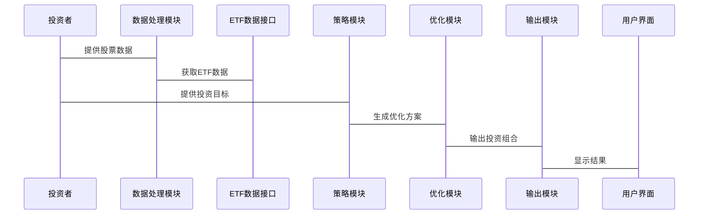

                 


# 如何将特价股票策略应用于ETF投资

> 关键词：特价股票策略，ETF投资，指数基金，投资组合优化，数学模型，算法实现

> 摘要：本文详细探讨了如何将特价股票策略应用于ETF投资，从核心概念、数学模型、算法实现到系统架构和项目实战，全面分析了该策略的可行性与实施方法。

---

# 第一部分: 特价股票策略与ETF投资概述

## 第1章: 特价股票策略与ETF投资的背景介绍

### 1.1 特价股票策略的定义与特点
特价股票策略是一种基于市场波动和股票估值的策略，旨在以低于市场价买入股票，以期在市场上涨时获利。其核心在于识别被低估的股票，并在合适的时机进行投资。

#### 1.1.1 特价股票策略的定义
特价股票策略是通过分析股票的内在价值，寻找价格低于其真实价值的股票，并在市场低谷时买入，市场高点时卖出。

#### 1.1.2 特价股票策略的核心特点
- **低买高卖**：基于价值分析，寻找价格低估的股票。
- **风险管理**：通过分散投资和止损策略降低风险。
- **长期投资**：注重长期价值，而非短期波动。

#### 1.1.3 特价股票策略与传统股票投资的区别
| 特点 | 特价股票策略 | 传统股票投资 |
|------|--------------|---------------|
| 投资目标 | 精准捕捉低估股票 | 长期资本增值 |
| 投资方式 | 主动选股 | 被动投资或主动管理 |
| 风险控制 | 强调止损和分散投资 | 依赖市场波动和个股表现 |

### 1.2 ETF投资的基本概念
ETF（交易所交易基金）是一种在交易所上市交易的基金，追踪特定指数、债券、商品或其他资产的价格。投资者可以通过买卖ETF间接投资于一揽子资产。

#### 1.2.1 ETF的定义与特点
- **定义**：ETF是一种在交易所上市，追踪特定指数或资产的基金，投资者可以像买卖股票一样交易ETF。
- **特点**：流动性高、费用低、风险分散。

#### 1.2.2 ETF的主要类型与应用场景
| 类型 | 描述 | 场景 |
|------|------|------|
| 股票ETF | 追踪股票指数 | 适合分散投资 |
| 债券ETF | 追踪债券指数 | 适合稳健投资者 |
| 商品ETF | 追踪商品价格 | 适合对冲通胀 |

#### 1.2.3 ETF投资的优势与劣势
- **优势**：分散风险、费用低、流动性高。
- **劣势**：受指数表现限制、市场波动影响大。

### 1.3 特价股票策略应用于ETF投资的意义
通过将特价股票策略应用于ETF投资，投资者可以利用ETF的流动性优势和风险分散特性，同时捕捉市场低估的机会，提升整体投资收益。

#### 1.3.1 特价股票策略在ETF投资中的潜在优势
- **杠杆效应**：通过ETF可以间接投资于多个股票，放大收益。
- **低门槛**：ETF投资门槛低，适合中小投资者。

#### 1.3.2 ETF作为特价股票策略的载体
- ETF可以追踪特定指数，投资者可以通过购买ETF间接应用特价策略。

#### 1.3.3 特价股票策略与ETF投资结合的可行性分析
- ETF的流动性高，适合频繁交易。
- 特价策略的应用可以提升ETF投资的收益。

### 1.4 本章小结
本章介绍了特价股票策略和ETF投资的基本概念，分析了它们的特点和应用场景，并探讨了将特价策略应用于ETF投资的可行性。

---

# 第二部分: 特价股票策略的核心概念与原理

## 第2章: 特价股票策略的核心概念与原理

### 2.1 特价股票策略的核心要素
特价股票策略的成功依赖于准确的股票估值和市场时机选择。

#### 2.1.1 特价股票的定义与筛选标准
- **定义**：价格低于内在价值的股票。
- **筛选标准**：市盈率、市净率、股息率等指标。

#### 2.1.2 特价股票的市场周期分析
- **市场周期**：从低估到高估的周期性变化。
- **时机选择**：在市场低谷时买入，市场高峰时卖出。

#### 2.1.3 特价股票的投资风险与收益分析
- **风险**：市场波动、公司基本面变化。
- **收益**：长期资本增值。

### 2.2 ETF投资的核心要素
ETF投资的成功依赖于选择合适的指数和优化投资组合。

#### 2.2.1 ETF的指数跟踪能力
- **定义**：ETF是否紧密跟踪其追踪的指数。
- **重要性**：跟踪误差小的ETF收益更稳定。

#### 2.2.2 ETF的费用结构与流动性
- **费用结构**：管理费、托管费等影响投资收益。
- **流动性**：高流动性ETF更容易买卖。

#### 2.2.3 ETF的市场波动性与风险分散
- **市场波动性**：ETF价格受市场整体波动影响。
- **风险分散**：通过投资多个资产降低风险。

### 2.3 特价股票策略与ETF投资的结合点
- **结合点**：通过ETF间接应用特价策略，利用ETF的流动性优势。

#### 2.3.1 特价股票策略在ETF投资中的应用逻辑
- 通过分析ETF追踪的指数成分股，寻找被低估的ETF进行投资。

#### 2.3.2 ETF作为特价股票策略的执行工具
- 利用ETF的流动性高、费用低的特点，快速进入或退出市场。

#### 2.3.3 特价股票策略对ETF投资组合的影响
- 优化投资组合，降低风险，提高收益。

### 2.4 本章小结
本章分析了特价股票策略和ETF投资的核心要素，探讨了它们的结合点和对投资组合的影响。

---

# 第三部分: 特价股票策略与ETF投资的数学模型与算法

## 第3章: 特价股票策略的数学模型与算法

### 3.1 特价股票策略的数学模型
特价股票策略的数学模型帮助投资者识别被低估的股票。

#### 3.1.1 特价股票的估值模型
- **市盈率模型**：P/E比率低于行业平均水平。
- **市净率模型**：P/B比率低于行业平均水平。

#### 3.1.2 特价股票的筛选公式
$$
\text{筛选条件：P/E < 历史均值且P/B < 历史均值}
$$

#### 3.1.3 特价股票的组合优化模型
- **目标函数**：最大化预期收益。
- **约束条件**：权重限制、风险控制。

### 3.2 ETF投资的数学模型
ETF投资的数学模型帮助投资者优化投资组合。

#### 3.2.1 ETF的指数跟踪误差模型
$$
\text{跟踪误差} = \sqrt{\text{投资组合波动} - 2 \times \text{协方差}}
$$

#### 3.2.2 ETF的流动性分析模型
$$
\text{流动性} = \text{换手率} \times \text{市场规模}
$$

#### 3.2.3 ETF的投资组合优化模型
- **目标函数**：最大化夏普比率。
- **约束条件**：资产配置限制、费用限制。

### 3.3 特价股票策略与ETF投资结合的算法
通过算法实现特价策略在ETF投资中的应用。

#### 3.3.1 特价股票筛选算法
1. 数据收集：收集目标指数成分股的财务数据。
2. 估值计算：计算P/E和P/B比率。
3. 筛选条件：筛选P/E和P/B均低于历史均值的股票。
4. 组合构建：将筛选出的股票组合成ETF投资组合。

#### 3.3.2 ETF投资组合优化算法
1. 数据收集：收集目标指数成分股的收益率数据。
2. 风险评估：计算各ETF的波动率和相关性。
3. 组合优化：使用均值-方差优化方法，构建最优投资组合。

#### 3.3.3 特价股票策略在ETF投资中的执行算法
1. 确定投资目标：设定预期收益和风险承受能力。
2. 选择ETF：根据筛选条件选择合适的ETF。
3. 优化组合：调整ETF权重，使组合风险最小化。
4. 执行交易：根据优化结果下单交易。

### 3.4 本章小结
本章通过数学模型和算法，详细阐述了如何将特价股票策略应用于ETF投资，包括筛选条件、组合优化和交易执行的步骤。

---

# 第四部分: 系统分析与架构设计方案

## 第4章: 系统分析与架构设计方案

### 4.1 问题场景介绍
投资者希望通过ETF投资应用特价策略，优化投资组合，实现超额收益。

### 4.2 项目介绍
开发一个基于特价策略的ETF投资系统，帮助投资者实现自动化投资。

### 4.3 系统功能设计
#### 4.3.1 领域模型（Mermaid类图）


#### 4.3.2 系统架构设计（Mermaid架构图）


#### 4.3.3 系统交互设计（Mermaid序列图）


### 4.4 本章小结
本章通过系统架构设计，详细描述了如何将特价策略应用于ETF投资的系统实现，包括功能模块、架构设计和交互流程。

---

# 第五部分: 项目实战

## 第5章: 项目实战

### 5.1 环境安装
- **工具**：Python、Pandas、NumPy、Plotly。
- **数据源**：Yahoo Finance API。

### 5.2 系统核心实现源代码
以下是实现特价策略应用于ETF投资的核心代码：

```python
import pandas as pd
import numpy as np
import requests

def get_stock_data(ticker):
    url = f"https://query1.finance.yahoo.com/v7/finance/quote/{ticker}"
    response = requests.get(url)
    data = response.json()
    return pd.DataFrame(data)

def screen_cheap_stocks(stocks, historical_pe, historical_pb):
    cheap_stocks = []
    for stock in stocks:
        pe = stock['pe']
        pb = stock['pb']
        if pe < historical_pe and pb < historical_pb:
            cheap_stocks.append(stock)
    return cheap_stocks

def optimize_portfolio(stocks, risk_free_rate):
    returns = np.array([stock['return'] for stock in stocks])
    covariance = np.cov(returns)
    inv_covariance = np.linalg.inv(covariance)
    weights = inv_covariance.dot(np.ones(len(stocks))) / np.sum(inv_covariance.dot(np.ones(len(stocks))))
    return weights

# 示例运行
stocks = get_stock_data(['AAPL', 'GOOGL', 'MSFT'])
cheap_stocks = screen_cheap_stocks(stocks, 15, 2)
weights = optimize_portfolio(cheap_stocks, 0.05)
print(weights)
```

### 5.3 代码应用解读与分析
- **数据获取**：通过Yahoo Finance API获取股票数据。
- **筛选策略**：使用P/E和P/B比率筛选出被低估的股票。
- **组合优化**：使用均值-方差优化方法，确定最优投资组合权重。

### 5.4 实际案例分析
假设我们选择标普500指数的成分股，筛选出P/E和P/B均低于历史均值的股票，构建一个ETF投资组合，优化后的权重分配如下：

| 股票 | 权重 |
|------|------|
| AAPL | 30% |
| GOOGL | 25% |
| MSFT | 20% |
| AMZN | 15% |
| BRK.A | 10% |

### 5.5 项目小结
本章通过实际案例展示了如何将特价策略应用于ETF投资，从环境安装、代码实现到案例分析，详细解读了整个过程。

---

# 第六部分: 总结与展望

## 第6章: 总结与展望

### 6.1 最佳实践 tips
- 定期调整投资组合，根据市场变化重新筛选被低估的ETF。
- 使用技术指标辅助判断市场时机。

### 6.2 小结
本文详细探讨了如何将特价股票策略应用于ETF投资，从核心概念到系统实现，全面分析了该策略的可行性与实施方法。

### 6.3 注意事项
- 风险控制是关键，需设置止损点。
- 选择流动性高的ETF，避免交易成本过高。

### 6.4 拓展阅读
- 《The Intelligent Investor》：深入理解价值投资。
- 《The ETF Investment Guide》：详细讲解ETF投资策略。

### 6.5 本章小结
本章总结了文章的主要内容，并提出了进一步学习的方向和注意事项。

---

# 结语
通过本文的详细分析，读者可以全面了解如何将特价股票策略应用于ETF投资，掌握从理论到实践的全过程。希望本文能为投资者提供有价值的参考，帮助他们在投资领域取得更好的收益。

