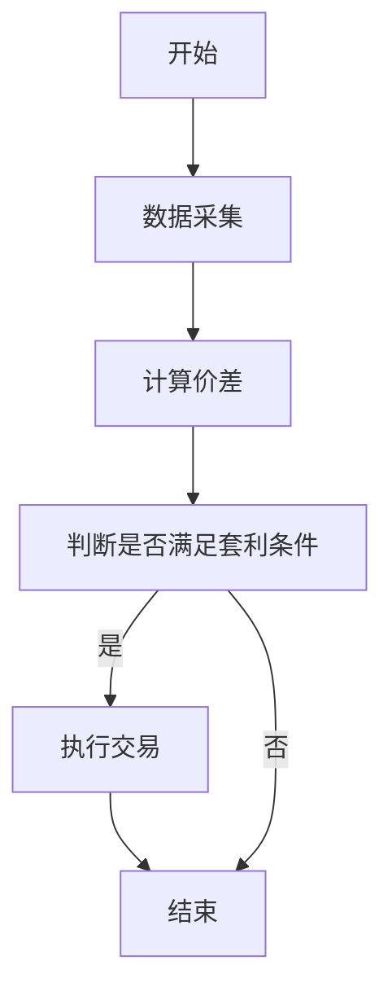

                 


# 如何将特价股票策略应用于代币化资产投资

> **关键词**：特价股票策略、代币化资产、投资策略、区块链技术、套利机会  
> **摘要**：本文探讨如何将特价股票策略应用于代币化资产投资中，分析其背景、核心概念、算法原理，并通过案例分析和系统设计提供实践指导，最后总结最佳实践和未来方向。

---

## 第一部分：背景介绍

### 第1章：特价股票策略概述

#### 1.1 特价股票策略的定义与核心概念
##### 1.1.1 背景与问题背景
特价股票策略是一种基于市场价差的交易策略，常见于传统股票市场，利用短期价格波动在低价买入、高价卖出。其核心在于捕捉市场中的套利机会，通过技术分析或基本面分析寻找价格洼地。

##### 1.1.2 核心问题与解决方法
特价股票策略的核心问题是如何快速识别价差并执行交易。解决方案包括技术指标分析、市场深度分析和算法交易等，旨在提高交易效率和准确性。

##### 1.1.3 概念结构与核心要素
特价股票策略涉及的核心要素包括价格数据、交易信号、交易执行和风险管理。概念结构围绕这些要素展开，形成完整的交易流程。

### 第2章：代币化资产投资概述
#### 2.1 代币化资产的定义与特点
代币化资产是将传统资产转化为数字代币，具有高流动性和透明性。其特点包括分割性、可编程性和去中心化，使得交易更加便捷。

#### 2.2 代币化资产的优势
代币化资产通过区块链技术实现透明和不可篡改的交易记录，降低了交易成本并提高了效率。

### 第3章：特价股票策略与代币化资产投资的结合
#### 3.1 结合的背景与机会
代币化资产的出现为特价股票策略提供了新的应用场景，尤其是在数字资产交易中，价格波动频繁，套利机会增多。

#### 3.2 结合的挑战与解决方案
主要挑战包括价格波动剧烈、交易技术要求高和监管不确定性。解决方案包括优化算法交易系统和加强风险管理。

---

## 第二部分：核心概念与联系

### 第4章：特价股票策略与代币化资产的核心概念原理
#### 4.1 特价股票策略的数学模型与公式
##### 4.1.1 常用数学模型
包括移动平均线（MA）、相对强弱指数（RSI）和MACD等指标。

##### 4.1.2 公式与应用场景
$$ MACD = EMA_{12} - EMA_{26} $$

#### 4.2 代币化资产的数学模型
##### 4.2.1 代币价格波动模型
$$ P(t) = a \cdot e^{bt} + c $$

---

## 第三部分：算法原理讲解

### 第6章：特价股票策略与代币化资产投资的算法原理
#### 6.1 套利算法的原理与实现
##### 6.1.1 套利算法流程图


##### 6.1.2 Python代码实现
```python
import pandas as pd
import numpy as np

# 示例数据
data = pd.DataFrame({'price': [10, 11, 9, 12, 13]})

# 计算价差
price_diff = data['price'].diff().dropna()

# 判断套利机会
threshold = 0.5
data['is_opportunity'] = price_diff.abs() > threshold
```

---

## 第四部分：系统分析与架构设计

### 第7章：系统分析与架构设计
#### 7.1 系统功能设计
##### 7.1.1 功能模块划分
包括数据采集模块、价差计算模块、交易执行模块和风险管理模块。

#### 7.2 系统架构设计


#### 7.3 接口设计
采用RESTful API设计，支持数据采集和交易执行。

---

## 第五部分：项目实战

### 第8章：项目实战
#### 8.1 环境配置
安装必要的库，如Python的pandas和web3.py。

#### 8.2 核心代码实现
```python
from web3 import Web3
from web3.middleware import geth_parity_middleware

# 连接节点
w3 = Web3(Web3.HTTPProvider('http://localhost:8545'))
```

#### 8.3 案例分析
分析一个代币化资产的套利机会，详细说明每一步的操作和结果。

---

## 第六部分：最佳实践

### 第9章：最佳实践
#### 9.1 小结
总结全文内容，强调特价股票策略在代币化资产中的应用潜力。

#### 9.2 注意事项
提示读者注意市场波动和监管风险。

#### 9.3 拓展阅读
推荐相关书籍和资源，供读者深入学习。

---

通过以上结构，文章详细介绍了特价股票策略在代币化资产投资中的应用，结合理论和实践，为读者提供了全面的指导。

