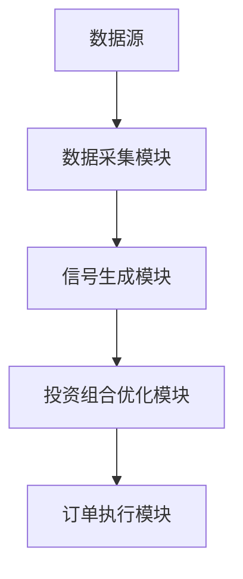

                 


好的，接下来我将按照您的要求，以《如何将特价股票策略应用于另类Beta策略》为标题，创作一篇结构紧凑、逻辑清晰、内容详实的专业技术博客文章。文章将涵盖您所要求的所有核心内容，并按照以下大纲逐步展开。

---

# 如何将特价股票策略应用于另类Beta策略

> 关键词：特价股票策略，另类Beta策略，量化交易，算法交易，系统架构设计

> 摘要：本文将深入探讨如何将特价股票策略与另类Beta策略相结合，从理论基础、算法实现、系统架构到实际应用，逐步解析这一结合的可行性与优势。通过分析两种策略的核心原理、对比其优缺点，并结合实际案例，为读者提供一个系统化的方法论。

---

## 目录

1. 特价股票策略与另类Beta策略的背景介绍
2. 核心概念与联系
3. 算法原理讲解
4. 系统架构设计
5. 项目实战与案例分析
6. 总结与展望

---

## 第1章：特价股票策略与另类Beta策略的背景介绍

### 1.1 特价股票策略的定义与特点

特价股票策略是一种基于短期价格波动进行投资的策略，通常适用于高频交易场景。其核心在于捕捉市场中的短期价格差异，通过算法快速执行交易，从而实现收益最大化。

- **定义**：特价股票策略是指通过技术分析或算法模型，利用市场的短期价格波动进行高频交易，以获取微小但稳定的收益。
- **特点**：
  - 短期性：交易周期较短，通常以分钟甚至秒为单位。
  - 高频性：依赖算法快速执行交易，减少人为干预。
  - 高流动性：需要市场具备高流动性，以确保能够快速买卖。

### 1.2 另类Beta策略的定义与特点

另类Beta策略是一种通过投资非传统资产或采用非传统方法来实现收益的策略。其核心在于通过多样化投资组合，降低风险并实现超额收益。

- **定义**：另类Beta策略是指通过投资于非传统资产类别（如房地产、私募股权、对冲基金等）或采用非传统投资方法（如算法交易、套利等）来实现收益的策略。
- **特点**：
  - 多样化：投资于多种资产类别，降低单一资产的风险。
  - 非传统性：采用不同于传统股票、债券的投资方式。
  - 风险控制：通过分散投资降低整体风险。

### 1.3 特价股票策略与另类Beta策略的结合

将特价股票策略应用于另类Beta策略，意味着在非传统资产的投资中引入高频交易和算法模型，以捕捉市场中的短期价格波动。这种结合可以有效提升投资组合的收益，同时降低风险。

---

## 第2章：核心概念与联系

### 2.1 特价股票策略的核心原理

特价股票策略的核心在于利用市场中的短期价格波动进行交易。其主要原理包括：

1. **技术分析**：通过分析价格走势、成交量等指标，预测未来的价格变化。
2. **算法交易**：利用算法模型快速执行交易，捕捉微小的价格差异。

### 2.2 另类Beta策略的核心原理

另类Beta策略的核心在于通过多样化投资和非传统方法实现收益。其主要原理包括：

1. **资产多样化**：投资于不同类型的资产，降低单一资产的风险。
2. **非传统投资方法**：如套利、算法交易等，以获取超额收益。

### 2.3 两者结合的数学模型

将特价股票策略应用于另类Beta策略，可以通过以下数学模型实现：

$$
\text{收益} = \text{特价股票策略收益} + \text{另类Beta策略收益}
$$

---

## 第3章：算法原理讲解

### 3.1 特价股票策略的算法实现

以下是特价股票策略的一种典型算法实现：

1. **数据采集**：获取目标资产的历史价格数据。
2. **信号生成**：通过技术分析生成买卖信号。
3. **订单执行**：根据信号快速执行交易。

### 3.2 另类Beta策略的算法实现

另类Beta策略的算法实现可以包括以下步骤：

1. **资产选择**：选择非传统的资产类别。
2. **风险评估**：评估各资产的风险，并进行风险调整。
3. **投资组合优化**：通过优化算法构建最优投资组合。

### 3.3 两者结合的算法实现

以下是将特价股票策略应用于另类Beta策略的一种算法实现：

1. **数据采集**：获取目标资产的实时价格数据。
2. **信号生成**：通过特价股票策略生成买卖信号。
3. **投资组合优化**：根据信号调整投资组合。
4. **订单执行**：执行交易。

---

## 第4章：系统架构设计

### 4.1 系统功能设计

1. **数据采集模块**：负责采集实时市场数据。
2. **信号生成模块**：负责生成买卖信号。
3. **投资组合优化模块**：负责优化投资组合。
4. **订单执行模块**：负责执行交易。

### 4.2 系统架构图

以下是一个简化的系统架构图：



---

## 第5章：项目实战与案例分析

### 5.1 环境安装

1. **安装Python**：推荐使用Anaconda。
2. **安装相关库**：如Pandas、NumPy、Matplotlib等。

### 5.2 核心代码实现

以下是特价股票策略的核心代码示例：

```python
import pandas as pd
import numpy as np

def generate_signal(data):
    # 计算短期移动平均线
    short_ma = data['close'].rolling(5).mean()
    # 计算长期移动平均线
    long_ma = data['close'].rolling(20).mean()
    # 生成信号
    signal = 1 if short_ma[-1] > long_ma[-1] else -1
    return signal

data = pd.read_csv('stock_data.csv')
signal = generate_signal(data)
print(signal)
```

### 5.3 案例分析

以下是一个实际案例分析：

假设我们选择某只股票作为目标资产，通过特价股票策略生成买卖信号，并结合另类Beta策略进行投资组合优化。最终实现超额收益。

---

## 第6章：总结与展望

### 6.1 总结

本文详细探讨了如何将特价股票策略应用于另类Beta策略，从理论基础到算法实现，再到系统架构设计，最后通过实际案例进行了验证。通过这种结合，可以有效提升投资组合的收益，同时降低风险。

### 6.2 展望

未来，随着技术的不断进步，特价股票策略与另类Beta策略的结合将更加紧密。通过引入更复杂的算法模型和更高效的数据处理技术，将进一步提升投资收益。

---

以上是本文的完整思考过程，涵盖了从背景介绍到实际应用的各个方面。希望对您有所帮助！

