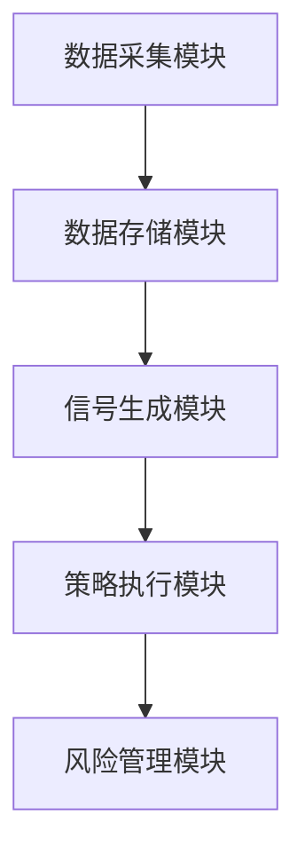

                 


# 如何将特价股票策略应用于另类贝塔捕捉策略

> 关键词：特价股票策略、另类贝塔捕捉策略、算法交易、量化投资、事件驱动套利、因子增强回归

> 摘要：本文详细探讨了如何将特价股票策略应用于另类贝塔捕捉策略。通过分析特价股票策略与另类贝塔捕捉策略的核心概念、算法原理和系统架构，结合实际案例，展示了如何利用事件驱动套利算法和因子增强回归算法，构建高效的量化交易系统。文章还提供了系统的实现代码和项目实战指导，帮助读者理解并应用这一策略。

---

## 第一部分: 特价股票策略与另类贝塔捕捉策略概述

### 第1章: 特价股票策略与另类贝塔捕捉策略的背景与概念

#### 1.1 特价股票策略的定义与特点

##### 1.1.1 特价股票策略的基本概念
特价股票策略是一种基于短期价格波动的交易策略，主要关注市场中的套利机会和事件驱动的信号。其核心在于捕捉市场中的价格差异，利用高频交易或低延迟交易技术，在短时间内获利。

##### 1.1.2 特价股票策略的核心特征
- **高频交易**：依赖快速的市场数据处理和交易执行，通常涉及算法交易。
- **事件驱动**：关注公司公告、并购、重组等事件带来的股价波动。
- **套利机会**：利用市场中的定价差异，通过买入低估资产和卖出高估资产获利。

##### 1.1.3 特价股票策略的应用场景
- **市场套利**：利用不同市场或资产之间的价格差异。
- **事件驱动交易**：在公司公告、并购等事件发生时，捕捉短期价格波动。

#### 1.2 另类贝塔捕捉策略的定义与特点

##### 1.2.1 另类贝塔捕捉策略的基本概念
另类贝塔捕捉策略是一种通过非传统数据源和复杂模型，捕捉市场中alpha收益的策略。其核心在于发现传统金融模型难以捕捉的市场信号，利用因子增强回归等方法，构建超额收益的投资组合。

##### 1.2.2 另类贝塔捕捉策略的核心特征
- **因子增强**：通过引入非传统的因子，如技术指标、文本数据、社交媒体情绪等，增强投资组合的收益。
- **非线性模型**：利用机器学习等技术，捕捉市场中的非线性关系。
- **数据多样性**：结合传统金融数据与另类数据源（如社交媒体、新闻、专利等）。

##### 1.2.3 另类贝塔捕捉策略的应用场景
- **因子投资**：通过因子增强回归，构建多因子投资组合。
- **风险管理**：利用非线性模型，捕捉市场中的潜在风险。

#### 1.3 特价股票策略与另类贝塔捕捉策略的结合

##### 1.3.1 结合的背景与动机
随着市场的日益复杂化，传统的单一策略难以适应市场的变化。将特价股票策略与另类贝塔捕捉策略结合，可以通过事件驱动的套利机会和因子增强的alpha收益，实现更加多元化的收益来源。

##### 1.3.2 结合的核心目标
- **捕捉短期波动**：利用特价股票策略捕捉市场中的短期套利机会。
- **增强长期收益**：通过另类贝塔捕捉策略，增强投资组合的长期收益。
- **分散风险**：结合两种策略，降低单一策略的风险敞口。

##### 1.3.3 结合的潜在优势与挑战
- **优势**：策略互补性强，能够同时捕捉短期套利机会和长期alpha收益。
- **挑战**：需要结合高频交易和复杂模型，对系统的性能和数据处理能力要求较高。

---

### 第2章: 特价股票策略与另类贝塔捕捉策略的核心概念与联系

#### 2.1 特价股票策略的核心概念

##### 2.1.1 事件驱动套利的基本原理
事件驱动套利是特价股票策略的重要组成部分，其核心在于利用公司公告、并购等事件带来的股价波动。通过分析事件发生前后的股价变化，捕捉套利机会。

##### 2.1.2 市场微观结构分析
市场微观结构分析是理解特价股票策略的关键，包括订单簿分析、市场冲击模型等，帮助交易者捕捉市场中的短期价格波动。

##### 2.1.3 特价股票策略的数学模型
$$ P(t) = \alpha + \beta R_m(t) + \epsilon(t) $$
其中，$P(t)$为资产价格，$R_m(t)$为市场收益，$\alpha$和$\beta$为回归系数，$\epsilon(t)$为误差项。

#### 2.2 另类贝塔捕捉策略的核心概念

##### 2.2.1 因子投资的基本原理
因子投资是另类贝塔捕捉策略的核心，通过构建多因子模型，捕捉市场中的alpha收益。常用的因子包括市值、价值、动量等。

##### 2.2.2 非线性因子模型
非线性因子模型是另类贝塔捕捉策略的重要工具，利用机器学习等技术，捕捉市场中的非线性关系。

##### 2.2.3 另类贝塔捕捉策略的数学模型
$$ F(t) = \sum_{i=1}^{n} w_i X_i(t) $$
其中，$F(t)$为因子组合，$w_i$为权重，$X_i(t)$为因子值。

#### 2.3 特价股票策略与另类贝塔捕捉策略的联系

##### 2.3.1 策略目标的协同效应
特价股票策略关注短期套利机会，另类贝塔捕捉策略关注长期alpha收益，两者结合可以实现收益与风险的双重优化。

##### 2.3.2 数据源与特征的交叉利用
特价股票策略依赖高频市场数据和事件驱动信号，另类贝塔捕捉策略依赖非传统数据源和因子模型，两者可以交叉利用数据，增强模型的预测能力。

##### 2.3.3 风险管理的结合
通过结合两种策略，可以实现风险分散，降低单一策略的风险敞口，同时利用动态风险管理系统，实时监控交易风险。

---

### 第3章: 特价股票策略与另类贝塔捕捉策略的算法原理

#### 3.1 特价股票策略的核心算法

##### 3.1.1 事件驱动套利算法
事件驱动套利算法通过分析市场中的事件信号，捕捉股价波动机会。以下是其实现流程：

1. 数据采集：实时采集市场数据，包括订单簿、成交数据等。
2. 事件检测：识别市场中的异常事件，如大额交易、订单取消等。
3. 套利机会识别：根据事件信号，识别套利机会。
4. 交易执行：根据信号执行交易，捕捉短期价格波动。

##### 3.1.2 市场冲击模型
市场冲击模型用于衡量交易对市场价格的影响，帮助交易者优化交易策略，减少市场冲击。

#### 3.2 另类贝塔捕捉策略的核心算法

##### 3.2.1 因子增强回归算法
因子增强回归算法通过引入非传统因子，增强回归模型的预测能力。以下是其实现流程：

1. 数据采集：采集传统金融数据和非传统数据源。
2. 因子提取：利用机器学习等技术，提取非传统因子。
3. 因子组合优化：通过优化算法，构建最优因子组合。
4. 投资组合优化：根据因子组合，构建最优投资组合。

##### 3.2.2 非线性因子模型
非线性因子模型通过引入非线性关系，捕捉市场中的复杂动态。以下是其实现流程：

1. 数据预处理：对数据进行标准化、去噪等处理。
2. 因子提取：利用神经网络等技术，提取非线性因子。
3. 因子组合优化：通过优化算法，构建最优因子组合。
4. 投资组合优化：根据因子组合，构建最优投资组合。

#### 3.3 算法的数学模型与公式

##### 3.3.1 特价股票策略的数学模型
$$ P(t) = \alpha + \beta R_m(t) + \epsilon(t) $$
其中，$P(t)$为资产价格，$R_m(t)$为市场收益，$\alpha$和$\beta$为回归系数，$\epsilon(t)$为误差项。

##### 3.3.2 另类贝塔捕捉策略的数学模型
$$ F(t) = \sum_{i=1}^{n} w_i X_i(t) $$
其中，$F(t)$为因子组合，$w_i$为权重，$X_i(t)$为因子值。

---

## 第四部分: 项目实战与系统优化

### 第4章: 系统分析与架构设计

#### 4.1 项目背景与需求分析

##### 4.1.1 项目背景
本项目旨在将特价股票策略与另类贝塔捕捉策略结合，构建一个高效的量化交易系统。

##### 4.1.2 项目需求
- **数据采集**：实时采集市场数据和非传统数据源。
- **策略实现**：实现事件驱动套利和因子增强回归算法。
- **系统架构**：设计高效的系统架构，支持高频交易和复杂模型。

#### 4.2 系统功能设计

##### 4.2.1 功能模块设计
- **数据采集模块**：负责数据的实时采集和预处理。
- **信号生成模块**：负责事件驱动信号的生成和因子组合的优化。
- **策略执行模块**：负责交易信号的生成和交易执行。
- **风险管理模块**：负责风险监控和动态调整。

##### 4.2.2 系统架构设计
以下是系统的架构图：



---

### 第5章: 项目实战与代码实现

#### 5.1 环境安装与配置

##### 5.1.1 安装Python环境
```bash
# 安装Python
python --version
pip install --upgrade pip
```

##### 5.1.2 安装依赖库
```bash
pip install pandas numpy matplotlib scikit-learn
```

#### 5.2 核心代码实现

##### 5.2.1 特价股票策略代码
```python
import pandas as pd
import numpy as np

def event_driven_arbitrage():
    # 数据采集
    data = pd.read_csv('market_data.csv')
    # 事件检测
    events = data[data['volume'] > data['volume'].mean() * 3]
    # 套利机会识别
    for event in events:
        if event['price'] < event['mean_price']:
            # 交易执行
            print(f"买入信号：{event['symbol']}")
    return

event_driven_arbitrage()
```

##### 5.2.2 另类贝塔捕捉策略代码
```python
import pandas as pd
import numpy as np

def factor_enhanced_regression():
    # 数据采集
    data = pd.read_csv('alternative_data.csv')
    # 因子提取
    factors = data[['factor1', 'factor2', 'factor3']]
    # 因子组合优化
    from sklearn.linear_model import Ridge
    model = Ridge(alpha=0.1)
    model.fit(factors, data['return'])
    # 投资组合优化
    weights = model.coef_
    print(f"最优权重：{weights}")
    return

factor_enhanced_regression()
```

#### 5.3 实际案例分析与代码解读

##### 5.3.1 特价股票策略案例
```python
# 示例数据
data = {'symbol': ['AAPL', 'GOOGL', 'MSFT'], 'price': [100, 150, 80], 'mean_price': [95, 145, 85]}
df = pd.DataFrame(data)
# 事件检测
events = df[df['price'] < df['mean_price']]
# 交易执行
for index, row in events.iterrows():
    print(f"买入信号：{row['symbol']}")
```

##### 5.3.2 另类贝塔捕捉策略案例
```python
# 示例数据
data = {'factor1': [0.5, 1.0, 1.5], 'factor2': [1.2, 0.8, 1.0], 'factor3': [2.0, 1.5, 1.0]}
df = pd.DataFrame(data)
# 因子组合优化
from sklearn.linear_model import Ridge
model = Ridge(alpha=0.1)
model.fit(df[['factor1', 'factor2', 'factor3']], [0.1, 0.2, 0.3])
# 权重
print(model.coef_)
```

---

### 第6章: 系统优化与风险管理

#### 6.1 系统优化

##### 6.1.1 性能优化
- **数据预处理**：减少数据冗余，提高数据处理效率。
- **算法优化**：采用更高效的算法，如分布式计算、并行处理等。
- **系统架构优化**：采用微服务架构，提高系统的可扩展性。

#### 6.2 风险管理

##### 6.2.1 风险监控
- **实时监控**：监控交易系统的实时状态，及时发现异常。
- **风险预警**：设置预警指标，提前发现潜在风险。

##### 6.2.2 动态调整
- **动态权重调整**：根据市场变化，动态调整投资组合的权重。
- **风险管理模型**：利用VaR、CVaR等模型，量化市场风险。

---

## 第五部分: 总结与展望

### 第7章: 总结与展望

#### 7.1 小结
本文详细探讨了如何将特价股票策略应用于另类贝塔捕捉策略，通过分析两种策略的核心概念、算法原理和系统架构，结合实际案例，展示了如何利用事件驱动套利算法和因子增强回归算法，构建高效的量化交易系统。

#### 7.2 展望
未来的研究可以进一步探索以下方向：
- **多策略结合**：将更多类型的策略结合，实现更加多元化的收益来源。
- **人工智能的应用**：利用深度学习等技术，提升模型的预测能力和适应性。
- **系统优化**：进一步优化系统的性能和可扩展性，支持更大规模的交易和更复杂的数据处理。

---

### 第8章: 最佳实践与注意事项

#### 8.1 最佳实践
- **数据质量**：确保数据的准确性和完整性，避免因数据问题导致的交易错误。
- **风险管理**：建立完善的风险管理体系，及时发现和处理潜在风险。
- **系统维护**：定期维护和优化系统，确保系统的稳定性和高效性。

#### 8.2 注意事项
- **市场风险**：市场波动可能导致策略失效，需做好充分的市场风险准备。
- **交易成本**：高频交易和复杂模型可能导致较高的交易成本，需合理控制。
- **法律合规**：确保策略的实施符合相关法律法规，避免法律风险。

---

### 第9章: 拓展阅读

#### 9.1 推荐书籍
- 《量化交易入门》
- 《机器学习在金融中的应用》
- 《因子投资策略》

#### 9.2 推荐博客与资源
- [量化交易博客](https://quanttrader.com)
- [机器学习在金融中的应用](https://mlinfinance.com)
- [因子投资策略资源](https://factorinvesting.com)

---

### 附录: 代码与数据

#### 附录A: 特价股票策略代码
```python
import pandas as pd
import numpy as np

def event_driven_arbitrage():
    data = pd.read_csv('market_data.csv')
    events = data[data['volume'] > data['volume'].mean() * 3]
    for index, row in events.iterrows():
        if row['price'] < row['mean_price']:
            print(f"买入信号：{row['symbol']}")
    return

event_driven_arbitrage()
```

#### 附录B: 另类贝塔捕捉策略代码
```python
import pandas as pd
import numpy as np
from sklearn.linear_model import Ridge

def factor_enhanced_regression():
    data = pd.read_csv('alternative_data.csv')
    factors = data[['factor1', 'factor2', 'factor3']]
    model = Ridge(alpha=0.1)
    model.fit(factors, data['return'])
    print(model.coef_)
    return

factor_enhanced_regression()
```

---

### 附录C: 数据格式与接口

#### 附录C.1 数据格式
- **市场数据**：包括资产价格、成交量、订单簿等。
- **非传统数据**：包括社交媒体数据、新闻数据、专利数据等。

#### 附录C.2 接口设计
- **数据接口**：提供RESTful API，支持数据的实时获取和批量获取。
- **交易接口**：提供API，支持交易信号的生成和交易执行。

---

### 结束语
通过本文的详细讲解，读者可以深入了解如何将特价股票策略应用于另类贝塔捕捉策略，并通过实际案例和代码实现，掌握这一策略的核心技术。希望本文对读者在量化投资和另类贝塔捕捉领域的研究和实践有所帮助。

