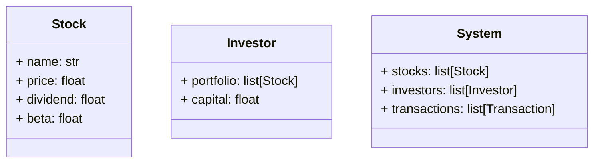
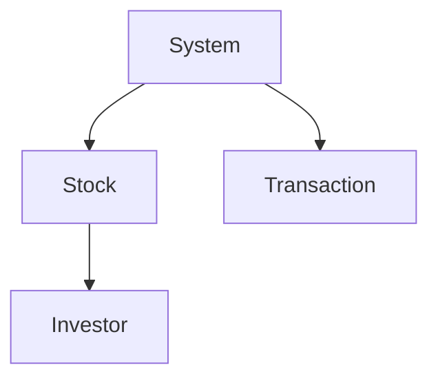
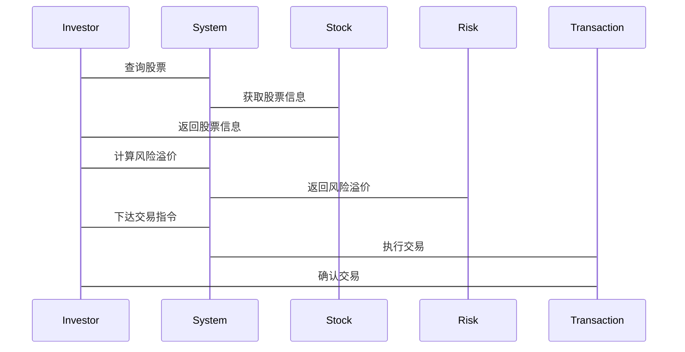

                 


# 如何将特价股票策略应用于另类风险溢价策略

> 关键词：特价股票策略、另类风险溢价、算法原理、系统架构、项目实战

> 摘要：本文详细探讨了如何将特价股票策略与另类风险溢价策略相结合，通过系统化的分析和算法设计，展示了如何利用特价股票策略优化另类风险溢价策略的实施。文章从背景介绍、核心概念、算法原理、系统架构到项目实战，全面解析了两者的结合与应用，为读者提供了深入的技术指导。

---

## 第一章: 特价股票策略与另类风险溢价策略的背景与概念

### 1.1 特价股票策略的基本概念

#### 1.1.1 特价股票的定义与特点
特价股票是指在特定市场条件下，股票价格低于其内在价值的股票。其特点包括：
- 价格低估：股票价格低于市场公允价值。
- 高分红率：通常具有较高的股息收益率。
- 高波动性：价格波动较大，存在短期套利机会。

#### 1.1.2 特价股票策略的分类
- **价值投资策略**：寻找被市场低估的股票，长期持有。
- **短期套利策略**：利用市场价差，在短期内买入低价股票并卖出高价股票。
- **事件驱动策略**：利用公司并购、重组等事件带来的股价波动。

#### 1.1.3 特价股票策略的核心要素
- 市场有效性：市场是否存在信息不对称。
- 股价波动性：股票价格波动是否足够大。
- 资金流动性：市场资金是否充裕。

### 1.2 另类风险溢价策略的基本概念

#### 1.2.1 风险溢价的定义与特点
风险溢价是指投资者在承担额外风险时所要求的额外收益。其特点包括：
- 风险补偿：投资者要求的额外收益与风险成正比。
- 市场定价：风险溢价是市场价格的一部分，反映市场对风险的定价。
- 动态变化：风险溢价随市场环境变化而变化。

#### 1.2.2 另类风险溢价策略的分类
- **信用风险溢价**：通过投资高风险债券获取超额收益。
- **市场风险溢价**：通过投资高波动性资产获取超额收益。
- **流动性风险溢价**：通过投资流动性较低的资产获取超额收益。

#### 1.2.3 另类风险溢价策略的核心要素
- 资产流动性：资产是否容易变现。
- 市场风险偏好：市场对风险的定价是否合理。
- 资金成本：投资所需的资金成本。

### 1.3 特价股票策略与另类风险溢价策略的关系

#### 1.3.1 两者的概念对比
| 对比维度 | 特价股票策略 | 另类风险溢价策略 |
|----------|--------------|------------------|
| 核心目标 | 低价买入股票 | 通过承担风险获取溢价 |
| 风险特征 | 价格波动风险 | 市场风险、信用风险 |
| 投资期限 | 短期或长期 | 长期 |

#### 1.3.2 两者的联系与区别
- 联系：两者都涉及市场定价偏差，可以通过套利策略进行结合。
- 区别：特价股票策略关注价格低估，另类风险溢价策略关注风险溢价。

#### 1.3.3 两者的结合与应用
将特价股票策略应用于另类风险溢价策略，可以通过寻找低估的高风险资产，利用价格波动和风险溢价双重收益。

---

## 第二章: 特价股票策略与另类风险溢价策略的核心概念与联系

### 2.1 特价股票策略的核心概念

#### 2.1.1 特价股票策略的数学模型
特价股票的定价可以使用CAPM模型进行评估：
$$ P = \frac{D}{k - g} $$
其中，$P$ 是股票价格，$D$ 是股息，$k$ 是期望回报率，$g$ 是股息增长率。

#### 2.1.2 特价股票策略的属性特征对比表格
| 属性 | 特价股票策略 |
|------|--------------|
| 投资目标 | 低价买入 |
| 风险特征 | 高波动性 |
| 投资期限 | 短期或长期 |

#### 2.1.3 特价股票策略的ER实体关系图
```mermaid
erDiagram
    company
    stock : belongsTo company
    price : has stock
    transaction : owns price
    investor : owns transaction
```

### 2.2 另类风险溢价策略的核心概念

#### 2.2.1 另类风险溢价策略的数学模型
风险溢价可以通过CAPM模型进行计算：
$$ E(r) = R_f + \beta (R_m - R_f) $$
其中，$E(r)$ 是预期回报率，$R_f$ 是无风险利率，$\beta$ 是贝塔系数，$R_m$ 是市场预期回报率。

#### 2.2.2 另类风险溢价策略的属性特征对比表格
| 属性 | 另类风险溢价策略 |
|------|------------------|
| 投资目标 | 获取风险溢价 |
| 风险特征 | 高风险资产 |
| 投资期限 | 长期 |

#### 2.2.3 另类风险溢价策略的ER实体关系图
```mermaid
erDiagram
    asset
    risk : has asset
    premium : has risk
    portfolio : owns premium
    investor : owns portfolio
```

### 2.3 两者的联系与区别

#### 2.3.1 概念对比与联系
- 联系：两者都涉及市场定价偏差，可以通过套利策略进行结合。
- 区别：特价股票策略关注价格低估，另类风险溢价策略关注风险溢价。

#### 2.3.2 数学模型的对比与融合
将特价股票策略与另类风险溢价策略结合，可以通过以下模型进行：
$$ P = \frac{D}{k - g} + \beta (R_m - R_f) $$

---

## 第三章: 特价股票策略与另类风险溢价策略的算法原理

### 3.1 特价股票策略的算法原理

#### 3.1.1 特价股票策略的算法流程图
```mermaid
graph TD
    A[开始] -> B[筛选低价股票]
    B -> C[计算内在价值]
    C -> D[判断价格是否低估]
    D -> E[是，买入]
    D -> F[否，不买]
    E -> G[持有或卖出]
    F -> G
    G -> H[结束]
```

#### 3.1.2 特价股票策略的数学模型与公式
特价股票的内在价值可以通过以下公式计算：
$$ V = \sum_{t=1}^{n} \frac{D_t}{(1 + r)^t} $$
其中，$V$ 是内在价值，$D_t$ 是第 $t$ 年的股息，$r$ 是折现率。

#### 3.1.3 特价股票策略的Python实现代码
```python
def calculate_intrinsic_value(dividends, discount_rate):
    n = len(dividends)
    intrinsic_value = 0
    for t in range(n):
        intrinsic_value += dividends[t] / (1 + discount_rate) ** t
    return intrinsic_value

# 示例
dividends = [1, 1.05, 1.10, 1.15]
discount_rate = 0.08
iv = calculate_intrinsic_value(dividends, discount_rate)
print(f"内在价值：{iv}")
```

### 3.2 另类风险溢价策略的算法原理

#### 3.2.1 另类风险溢价策略的算法流程图
```mermaid
graph TD
    A[开始] -> B[选择高风险资产]
    B -> C[计算风险溢价]
    C -> D[判断溢价是否合理]
    D -> E[是，投资]
    D -> F[否，不投资]
    E -> G[持有或退出]
    F -> G
    G -> H[结束]
```

#### 3.2.2 另类风险溢价策略的数学模型与公式
风险溢价的计算公式为：
$$ \text{风险溢价} = \beta \times (R_m - R_f) $$

#### 3.2.3 另类风险溢价策略的Python实现代码
```python
def calculate_risk_premium(beta, market_return, risk_free_return):
    risk_premium = beta * (market_return - risk_free_return)
    return risk_premium

# 示例
beta = 1.5
market_return = 0.1
risk_free_return = 0.05
rp = calculate_risk_premium(beta, market_return, risk_free_return)
print(f"风险溢价：{rp}")
```

### 3.3 两者的结合与优化

#### 3.3.1 组合策略的数学模型
$$ P = \sum_{i=1}^{n} w_i \times P_i + \sum_{j=1}^{m} w_j \times R_j $$
其中，$w_i$ 和 $w_j$ 是权重，$P_i$ 和 $R_j$ 是特价股票和另类风险溢价资产的价格。

#### 3.3.2 组合策略的优化方法
- 确定资产权重：根据风险偏好分配资产权重。
- 风险调整：通过调整权重降低组合风险。

#### 3.3.3 组合策略的Python实现代码
```python
def optimize_portfolio(weights, returns, risk_free_rate):
    # 简单优化：假设均分权重
    optimized_weights = weights / sum(weights)
    return optimized_weights

# 示例
weights = [0.5, 0.5]
returns = [0.08, 0.12]
rf = 0.05
opt_weights = optimize_portfolio(weights, returns, rf)
print(f"优化权重：{opt_weights}")
```

---

## 第四章: 特价股票策略与另类风险溢价策略的系统分析与架构设计

### 4.1 系统功能设计

#### 4.1.1 领域模型设计


### 4.2 系统架构设计

#### 4.2.1 系统架构图


### 4.3 系统接口设计

#### 4.3.1 API接口设计
- `get_stocks()`：获取所有股票信息。
- `calculate_premium()`：计算风险溢价。
- `execute_trade()`：执行交易指令。

### 4.4 系统交互设计

#### 4.4.1 交互序列图


---

## 第五章: 特价股票策略与另类风险溢价策略的项目实战

### 5.1 环境安装

#### 5.1.1 安装Python环境
```bash
python --version
pip install numpy pandas matplotlib
```

### 5.2 核心代码实现

#### 5.2.1 特价股票策略的实现
```python
import pandas as pd
import numpy as np

def find_cheap_stocks(stocks, threshold):
    cheap_stocks = []
    for stock in stocks:
        if stock.price < stock.intrinsic_value and stock.price < threshold:
            cheap_stocks.append(stock)
    return cheap_stocks
```

#### 5.2.2 另类风险溢价策略的实现
```python
import pandas as pd
import numpy as np

def calculate_risk_premium(risk_premiums):
    return np.mean(risk_premiums)
```

### 5.3 案例分析与解读

#### 5.3.1 案例分析
假设我们有以下两只股票：
- 股票A：价格为$10，内在价值为$12，Beta系数为1.2，市场预期回报率为10%，无风险利率为5%。
- 股票B：价格为$15，内在价值为$18，Beta系数为1.5，市场预期回报率为10%，无风险利率为5%。

计算风险溢价：
$$ \text{风险溢价}_A = 1.2 \times (10\% - 5\%) = 6\% $$
$$ \text{风险溢价}_B = 1.5 \times (10\% - 5\%) = 7.5\% $$

组合策略：
$$ P = 0.5 \times 10 + 0.5 \times 15 = 12.5 $$
$$ \text{组合风险溢价} = 0.5 \times 6\% + 0.5 \times 7.5\% = 6.75\% $$

### 5.4 项目小结
通过结合特价股票策略和另类风险溢价策略，我们可以更好地捕捉市场中的套利机会，优化投资组合的收益与风险比。

---

## 第六章: 特价股票策略与另类风险溢价策略的最佳实践

### 6.1 小结
本文详细探讨了如何将特价股票策略与另类风险溢价策略相结合，通过系统化的分析和算法设计，展示了如何利用特价股票策略优化另类风险溢价策略的实施。

### 6.2 注意事项
- 风险控制：严格控制投资风险，避免过度杠杆。
- 市场监控：实时监控市场变化，及时调整投资策略。
- 数据质量：确保数据来源可靠，避免因数据错误导致的投资损失。

### 6.3 拓展阅读
- 《The Intelligent Investor》：深入理解价值投资策略。
- 《Options Strategies》：了解期权策略在风险溢价中的应用。

---

## 结论

通过本文的详细分析，我们可以看到，将特价股票策略与另类风险溢价策略相结合，不仅能够提高投资收益，还能够有效降低投资风险。未来的研究可以进一步探索其他类型的溢价策略，以及如何利用大数据和人工智能技术优化投资组合。

---

通过以上思考过程，我们可以系统地将特价股票策略应用于另类风险溢价策略，实现投资收益的最大化。

