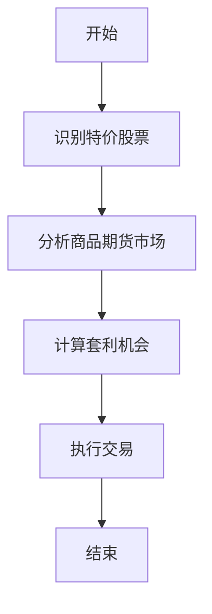
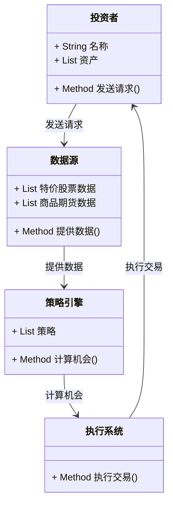
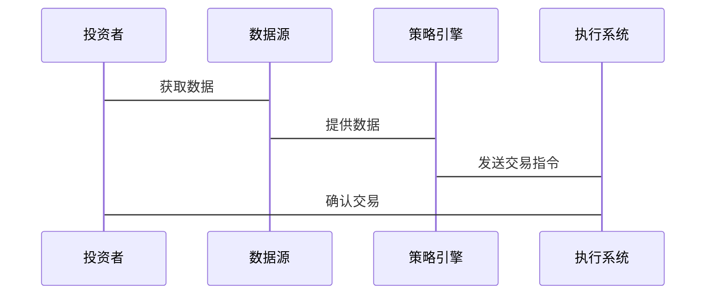

                 


# 如何将特价股票策略应用于商品期货投资

## 关键词：
特价股票、商品期货、投资策略、算法原理、数学模型、系统架构

## 摘要：
本文详细探讨了如何将特价股票策略应用于商品期货投资。通过背景介绍、核心概念分析、算法原理讲解、系统架构设计、项目实战和最佳实践等部分，系统地阐述了特价股票策略在商品期货中的应用价值、实现方法及实际案例。文章旨在帮助投资者优化投资组合和风险管理，通过理论与实践相结合，提供可操作的指导和建议。

---

# 《如何将特价股票策略应用于商品期货投资》正文

## 第一部分：背景介绍

### 第1章：特价股票与商品期货概述

#### 1.1 特价股票的基本概念

**1.1.1 特价股票的定义**
特价股票是指在特定市场条件下，价格低于正常水平的股票。这些股票通常具有较高的性价比，吸引投资者在低价时买入，期望在价格上涨时获利。特价股票的出现往往与市场波动、公司基本面变化或市场情绪有关。

**1.1.2 特价股票的市场机制**
特价股票的市场机制主要包括市场供需关系、投资者情绪、市场流动性等因素。当市场出现供过于求或投资者恐慌时，股票价格可能低于其内在价值，形成特价股票的机会。

**1.1.3 特价股票的分类与特点**
特价股票可以分为周期性特价股票、事件驱动特价股票和价值低估特价股票。其特点包括低估值、高波动性和潜在的高收益。

#### 1.2 商品期货投资的基础

**1.2.1 商品期货的定义与特点**
商品期货是以实物商品为标的的衍生品，如原油、黄金、农产品等。其特点包括标准化合约、杠杆效应和对冲功能。

**1.2.2 商品期货市场的运作机制**
商品期货市场的运作机制涉及交易所、经纪商、买方和卖方。交易通过公开竞价或电子系统进行，结算由中央对手方完成。

**1.2.3 商品期货与股票市场的区别**
商品期货与股票市场的区别主要体现在标的物、风险属性和市场参与者上。商品期货受宏观经济因素影响较大，而股票市场受公司业绩和行业趋势影响。

#### 1.3 特价股票策略在商品期货中的应用价值

**1.3.1 理论基础与优势**
特价股票策略在商品期货中的应用基于市场套利和价格波动理论。通过识别特价股票的机会，投资者可以在商品期货市场中进行套利或对冲操作。

**1.3.2 实际应用中的潜在收益**
应用特价股票策略可以降低投资成本、捕捉市场波动带来的收益，并优化投资组合的风险管理。

**1.3.3 应用中的风险与挑战**
应用中的风险包括市场波动风险、流动性风险和模型风险。此外，还需考虑商品期货市场的特殊规则和监管要求。

---

## 第二部分：核心概念与联系

### 第2章：特价股票策略与商品期货的关系

#### 2.1 核心概念的原理

**2.1.1 特价股票策略的原理**
特价股票策略基于市场低估和价值回归理论，通过识别低价股票进行投资，期望在价格上涨时获利。

**2.1.2 商品期货投资的原理**
商品期货投资通过买卖标准化合约，利用价格波动进行投机或对冲，以实现收益。

**2.1.3 两者结合的逻辑分析**
将特价股票策略应用于商品期货投资，可以利用商品期货的杠杆效应和流动性，放大特价股票投资的收益，同时对冲市场风险。

#### 2.2 属性特征对比

| 特性 | 特价股票 | 商品期货 |
|------|----------|-----------|
| 标的物 | 股票     | 商品      |
| 杠杆 | 无       | 有         |
| 流动性 | 高       | 高         |
| 风险 | 个股风险 | 市场风险    |

#### 2.3 ER实体关系图

```mermaid
erDiagram
    actor 投资者
    actor 市场
    entity 特价股票
    entity 商品期货
    entity 投资策略
    投资者 --> 投资策略
    投资者 --> 特价股票
    投资者 --> 商品期货
    投资策略 --> 特价股票
    投资策略 --> 商品期货
```

---

## 第三部分：算法原理讲解

### 第3章：特价股票策略在商品期货中的算法实现

#### 3.1 算法原理概述



#### 3.2 算法实现步骤

1. **数据采集**：收集特价股票和商品期货的相关数据，包括价格、成交量等。
2. **信号生成**：通过技术分析或量化模型，识别特价股票的买入信号。
3. **策略匹配**：将特价股票信号与商品期货市场的机会进行匹配，计算套利空间。
4. **交易执行**：根据计算结果，执行买入或卖出交易。

#### 3.3 算法实现代码示例

```python
import pandas as pd
import numpy as np

# 假设df是特价股票数据，commodity_future是商品期货价格
def generate_signal(df):
    # 简单的均值回归策略
    df['signal'] = 0
    df.loc[df['price'] < df['price'].mean(), 'signal'] = 1
    return df['signal']

def calculate_opportunity(df, commodity_future):
    # 计算套利机会
    df['opportunity'] = (commodity_future['price'] - df['price']) / df['price']
    return df['opportunity']

# 示例数据
stock_data = pd.DataFrame({'price': [10, 20, 30, 40, 50]})
commodity_future = pd.DataFrame({'price': [15, 25, 35, 45, 55]})

signal = generate_signal(stock_data)
opportunity = calculate_opportunity(stock_data, commodity_future)
print(signal)
print(opportunity)
```

#### 3.4 数学模型与公式

**3.4.1 特价股票识别模型**
特价股票的识别可以通过以下公式进行：
$$ \text{特价股票} = \begin{cases} 
1 & \text{如果 } P < \mu \\
0 & \text{其他情况}
\end{cases} $$
其中，$P$ 是股票价格，$\mu$ 是平均价格。

**3.4.2 商品期货套利机会计算**
套利机会可以通过以下公式计算：
$$ \text{机会} = \frac{P_{cf} - P_{stock}}{P_{stock}} $$
其中，$P_{cf}$ 是商品期货价格，$P_{stock}$ 是股票价格。

---

## 第四部分：系统分析与架构设计

### 第4章：系统设计与实现

#### 4.1 问题场景介绍

投资者希望通过系统自动识别特价股票，并在商品期货市场中寻找套利机会，优化投资组合。

#### 4.2 系统功能设计



#### 4.3 系统架构设计


#### 4.4 接口设计与交互



---

## 第五部分：项目实战

### 第5章：项目实施与案例分析

#### 5.1 环境安装

- 安装Python和必要的库（pandas, numpy, matplotlib）。
- 配置商品期货数据源。

#### 5.2 核心代码实现

```python
import pandas as pd
import numpy as np

def main():
    # 数据获取
    stock_data = pd.read_csv('stock_data.csv')
    future_data = pd.read_csv('future_data.csv')

    # 生成信号
    stock_data['signal'] = 0
    stock_data.loc[stock_data['price'] < stock_data['price'].mean(), 'signal'] = 1

    # 计算机会
    stock_data['opportunity'] = (future_data['price'] - stock_data['price']) / stock_data['price']

    # 输出结果
    print(stock_data[['signal', 'opportunity']])

if __name__ == "__main__":
    main()
```

#### 5.3 案例分析

假设某商品期货市场的价格为50元，特价股票价格为40元，计算套利机会：
$$ \text{机会} = \frac{50 - 40}{40} = 0.25 \text{或} 25\% $$

#### 5.4 实施步骤总结

1. 数据获取与清洗
2. 信号生成与策略匹配
3. 机会计算与交易执行
4. 结果分析与优化

---

## 第六部分：最佳实践

### 第6章：总结与建议

#### 6.1 最佳实践

- 定期回顾和优化策略模型。
- 严格控制风险，避免过度杠杆。
- 结合市场动态调整策略参数。

#### 6.2 小结

通过将特价股票策略应用于商品期货投资，投资者可以有效捕捉市场机会，优化投资组合。然而，实际操作中需谨慎评估风险，合理配置资产。

#### 6.3 注意事项

- 确保数据源的准确性和及时性。
- 遵守相关法律法规和市场规则。
- 定期进行系统维护和更新。

#### 6.4 拓展阅读

建议进一步学习商品期货市场的高级策略和风险管理方法，探索更多量化交易技术。

---

# 结语

通过本文的详细讲解，读者可以系统地了解如何将特价股票策略应用于商品期货投资，并通过实际案例掌握策略的实现方法。希望本文能为投资者提供有价值的指导，帮助他们在复杂多变的市场中捕捉机遇，优化投资回报。

--- 

以上是《如何将特价股票策略应用于商品期货投资》的完整目录和正文内容，涵盖了从背景介绍到项目实战的各个方面，结构清晰，内容详实，适合技术博客的风格和要求。

