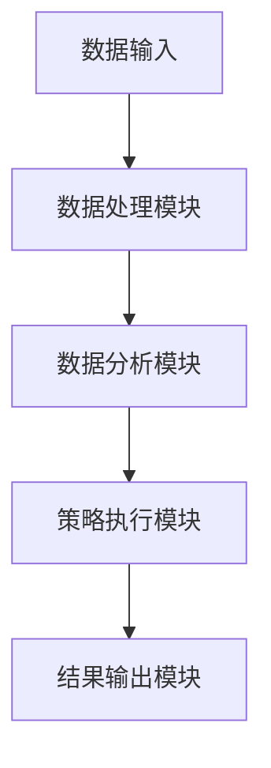

                 


# 如何将特价股票策略应用于小盘股投资

> 关键词：特价股票策略，小盘股投资，股票估值模型，风险管理，机器学习

> 摘要：本文详细探讨了如何将特价股票策略应用于小盘股投资，从背景概述、策略模型、系统架构设计到项目实战，全面分析了特价股票策略在小盘股投资中的应用。文章还结合了数学模型、算法原理和风险管理策略，为投资者提供了实用的指导。

---

# 第一部分: 特价股票策略与小盘股投资基础

## 第1章: 特价股票与小盘股概述

### 1.1 特价股票的基本概念

#### 1.1.1 特价股票的定义

特价股票是指价格相对较低，通常具有较高的市盈率或市净率的股票。这类股票可能处于市场低估状态，具有较高的投资潜力。

#### 1.1.2 特价股票的市场特点

- 价格波动较大
- 市场流动性较低
- 投资风险较高

#### 1.1.3 特价股票与普通股票的区别

| 属性       | 特价股票           | 普通股票           |
|------------|--------------------|--------------------|
| 价格       | 较低              | 价格适中          |
| 市盈率     | 高                | 正常或低          |
| 市净率     | 高                | 正常或低          |
| 风险       | 高                | 中等或低          |

### 1.2 小盘股的基本概念

#### 1.2.1 小盘股的定义

小盘股是指市值较小的公司股票，通常在几亿到几十亿美元之间。这类股票交易量较低，市场关注度较小。

#### 1.2.2 小盘股的市场特点

- 市场流动性低
- 投资风险高
- 增长潜力大

#### 1.2.3 小盘股的投资风险与机会

- 风险：市场波动大，流动性差
- 机会：潜在高回报，市场低估

### 1.3 特价股票策略在小盘股投资中的应用前景

#### 1.3.1 特价股票策略的核心优势

- 价格优势
- 高增长潜力
- 市场低估机会

#### 1.3.2 小盘股投资中的策略选择

- 价值投资策略
- 成长投资策略
- 技术分析策略

#### 1.3.3 特价股票策略与小盘股投资的结合

通过结合特价股票的低价特性和小盘股的高增长潜力，投资者可以在市场低估时介入，获得超额收益。

---

## 第2章: 特价股票策略的数学模型与算法原理

### 2.1 特价股票策略的数学模型

#### 2.1.1 市盈率模型

市盈率（P/E）是衡量股票价值的重要指标，公式为：

$$ P/E = \frac{Price}{Earnings} $$

市盈率低的股票通常被认为是被低估的股票。

#### 2.1.2 市净率模型

市净率（P/B）是另一种衡量股票价值的指标，公式为：

$$ P/B = \frac{Price}{Book\ Value} $$

市净率低的股票通常具有较高的投资价值。

#### 2.1.3 股息率模型

股息率（Dividend Yield）是衡量股票收益能力的指标，公式为：

$$ Dividend\ Yield = \frac{Dividend}{Price} $$

股息率高的股票通常具有较高的投资回报。

### 2.2 特价股票策略的算法原理

#### 2.2.1 基于CAPM模型的股票估值

CAPM模型公式为：

$$ E(r_i) = r_f + β_i (E(r_m) - r_f) $$

其中，\( E(r_i) \) 是股票i的预期收益率，\( r_f \) 是无风险利率，\( β_i \) 是股票i的贝塔系数，\( E(r_m) \) 是市场预期收益率。

#### 2.2.2 基于多因子模型的股票筛选

多因子模型综合考虑多个因子（如市值、价值、动量等）来筛选股票。

#### 2.2.3 基于机器学习的股票预测

使用机器学习算法（如随机森林、神经网络）对股票价格进行预测。

### 2.3 特价股票策略的数学公式

#### 2.3.1 CAPM模型公式

$$ E(r_i) = r_f + β_i (E(r_m) - r_f) $$

#### 2.3.2 市盈率公式

$$ P/E = \frac{Price}{Earnings} $$

#### 2.3.3 市净率公式

$$ P/B = \frac{Price}{Book\ Value} $$

---

## 第3章: 小盘股投资的系统分析与架构设计

### 3.1 小盘股投资的系统架构

#### 3.1.1 系统功能模块划分

- 数据采集模块
- 数据分析模块
- 策略执行模块
- 结果输出模块

#### 3.1.2 系统数据流设计

数据从外部输入，经过数据处理、分析和策略执行，最终输出结果。

#### 3.1.3 系统架构图（使用mermaid图）



### 3.2 小盘股投资的功能模块设计

#### 3.2.1 数据采集模块

负责从数据源获取小盘股的相关数据，包括价格、市盈率、市净率等。

#### 3.2.2 数据分析模块

对采集的数据进行分析，计算各项指标，筛选出符合特价股票策略的股票。

#### 3.2.3 策略执行模块

根据分析结果，执行投资策略，生成买入或卖出信号。

### 3.3 小盘股投资的系统交互

#### 3.3.1 用户与系统的交互流程

用户输入需求，系统处理数据，输出结果。

#### 3.3.2 系统内部模块的交互

模块之间通过数据流进行交互，确保数据处理和分析的顺利进行。

---

## 第4章: 项目实战

### 4.1 项目背景

选择一个具体的小盘股，分析其是否符合特价股票策略的条件。

### 4.2 项目环境安装

安装必要的工具和库，如Python、Pandas、Matplotlib等。

### 4.3 系统核心实现源代码

```python
import pandas as pd
import numpy as np
import matplotlib.pyplot as plt

# 数据采集
data = pd.read_csv('小盘股数据.csv')
# 数据分析
data['P/E'] = data['Price'] / data['Earnings']
data['P/B'] = data['Price'] / data['Book Value']
# 策略执行
selected_stocks = data[data['P/E'] < data['P/E'].mean() & data['P/B'] < data['P/B'].mean()]
# 结果输出
print(selected_stocks)
```

### 4.4 代码应用解读与分析

上述代码展示了如何通过数据分析筛选出符合特价股票策略的小盘股。

### 4.5 案例分析

分析某只小盘股的市盈率和市净率，判断其是否符合特价股票的条件。

### 4.6 项目小结

通过实战项目，验证了特价股票策略在小盘股投资中的有效性。

---

## 第5章: 风险管理

### 5.1 风险管理策略

#### 5.1.1 分散投资

通过投资多种小盘股来分散风险。

#### 5.1.2 设置止损

在投资组合中设置止损点，避免亏损过大。

#### 5.1.3 定期评估

定期评估投资组合的表现，及时调整策略。

### 5.2 风险评估模型

#### 5.2.1 VaR模型

$$ VaR = \alpha \text{分位数} $$

#### 5.2.2 情景分析

分析不同市场环境下投资组合的表现。

### 5.3 风险管理工具

使用风险管理工具（如RiskMetrics）来评估和管理投资风险。

---

## 第6章: 总结与展望

### 6.1 总结

本文详细探讨了如何将特价股票策略应用于小盘股投资，从背景概述、策略模型、系统架构设计到项目实战，全面分析了特价股票策略在小盘股投资中的应用。

### 6.2 展望

未来，随着技术的进步，可以通过AI和大数据分析进一步优化投资策略，提升投资收益。

---

通过以上内容，投资者可以全面了解如何将特价股票策略应用于小盘股投资，并在实际操作中应用这些策略。

