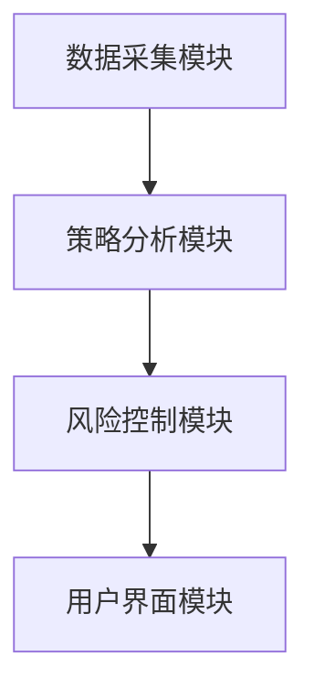

                 


# 如何将特价股票策略应用于数字另类贝塔捕捉策略

> 关键词：特价股票策略，数字贝塔捕捉，统计套利，均值回归，机器学习

> 摘要：本文详细探讨了如何将特价股票策略与数字另类贝塔捕捉策略相结合，利用数学模型、算法和系统架构设计，构建一个高效的贝塔捕捉系统。通过Python代码实现、案例分析和最佳实践分享，帮助读者掌握如何在实际投资中应用这些策略，捕捉超额收益。

---

# 第一部分: 特价股票策略与数字另类贝塔捕捉策略背景

## 第1章: 特价股票策略概述

### 1.1 特价股票策略的基本概念
#### 1.1.1 特价股票的定义与特点
特价股票是指在特定市场条件下，股票价格低于其内在价值或市场公允价值的股票。其特点包括：
- 价格折扣：股票价格低于市场平均水平。
- 低效市场：通常出现在市场流动性不足或市场参与者较少的情况下。
- 短期机会：特价股票通常具有短期交易机会，需快速捕捉。

#### 1.1.2 特价股票策略的核心目标
- 利润最大化：通过低价买入、高价卖出，捕捉市场波动中的超额收益。
- 风险控制：通过精选股票，降低投资组合的整体风险。

#### 1.1.3 特价股票策略的分类与应用场景
- 按时间维度：短期特价股票策略、中长期特价股票策略。
- 按市场类型：普通股票市场、新三板市场、港股市场等。
- 应用场景：市场波动、市场下跌、市场流动性不足等情况。

### 1.2 数字另类贝塔捕捉策略的背景
#### 1.2.1 贝塔与阿尔法的定义与区别
- 贝塔（Beta）：衡量投资组合相对于市场基准的波动性，反映系统性风险。
- 阿尔法（Alpha）：衡量投资组合相对于市场基准的超额收益，反映非系统性风险。
- 区别：Beta衡量的是系统性风险，Alpha衡量的是超额收益。

#### 1.2.2 数字贝塔捕捉的创新之处
- 数据驱动：利用大数据和算法，从海量数据中发现市场规律。
- 实时性：通过数字技术，实时捕捉市场波动中的机会。
- 系统化：将贝塔捕捉策略系统化、量化，减少人为干扰。

#### 1.2.3 数字贝塔捕捉策略的市场价值
- 提高投资效率：通过系统化策略，快速捕捉市场机会。
- 降低投资成本：通过自动化交易，减少人工干预，降低成本。
- 增加收益：通过精准的市场分析，提高投资收益。

### 1.3 特价股票策略与贝塔捕捉策略的结合
#### 1.3.1 特价股票策略在贝塔捕捉中的作用
- 提供低价买入机会：特价股票策略帮助投资者以低于市场价买入股票，降低投资成本。
- 增加超额收益：通过捕捉市场波动中的机会，增加投资组合的超额收益。

#### 1.3.2 贝塔捕捉策略对特价股票策略的优化
- 数据支持：利用贝塔捕捉策略中的大数据分析，精选出具有超额收益潜力的特价股票。
- 系统化交易：通过贝塔捕捉策略中的系统化交易，提高交易效率，降低交易成本。

#### 1.3.3 两者的结合对投资收益的影响
- 提高收益：通过结合两者的优势，投资者可以在市场波动中捕捉更多超额收益。
- 降低风险：通过系统化交易和风险控制，降低投资组合的整体风险。

---

## 第2章: 股票市场与贝塔捕捉策略的基础理论

### 2.1 股票市场的基本特性
#### 2.1.1 股票市场的波动性与相关性
- 股票市场的波动性：股票价格的短期波动性较高，长期趋势相对稳定。
- 市场相关性：不同股票之间的价格波动往往具有相关性，可以通过统计方法进行分析。

#### 2.1.2 市场参与者的角色与行为
- 机构投资者：通过大数据分析和算法交易，捕捉市场机会。
- 个人投资者：通过基本面分析和技术分析，进行投资决策。

#### 2.1.3 市场效率与无效性分析
- 市场效率：股票市场价格反映所有可获得信息的程度。
- 市场无效性：市场存在信息不对称、交易成本等，导致价格偏离其公允价值。

### 2.2 贝塔与阿尔法的数学模型
#### 2.2.1 贝塔系数的计算公式
$$ \beta = \frac{\text{协方差}(R_i, R_m)}{\text{方差}(R_m)} $$
其中，\( R_i \) 是资产的收益，\( R_m \) 是市场收益。

#### 2.2.2 阿尔法系数的定义与计算
$$ \alpha = R_i - \beta \times R_m $$
其中，\( \alpha \) 是资产相对于市场基准的超额收益。

#### 2.2.3 贝塔与阿尔法的对比分析
- 贝塔衡量的是系统性风险，阿尔法衡量的是超额收益。
- 贝塔系数为正，表示资产收益与市场收益正相关；贝塔系数为负，表示资产收益与市场收益负相关。

### 2.3 贝塔捕捉策略的核心原理
#### 2.3.1 贝塔捕捉的理论基础
- 市场中性策略：通过构造一个市场中性的投资组合，降低系统性风险，捕捉超额收益。
- 统计套利：通过统计方法，发现市场中的定价偏差，进行套利交易。

#### 2.3.2 贝塔捕捉策略的数学模型
$$ \text{收益} = \alpha + \beta \times R_m + \epsilon $$
其中，\( \epsilon \) 是误差项，表示不可预测的市场波动。

#### 2.3.3 贝塔捕捉策略的风险与收益分析
- 风险：系统性风险、市场流动性风险、交易成本风险。
- 收益：超额收益、长期稳定收益。

---

## 第3章: 特价股票策略的数学模型与算法原理

### 3.1 特价股票策略的数学模型
#### 3.1.1 特价股票的定价模型
$$ P = \text{内在价值} - \text{折扣} $$
其中，\( P \) 是股票价格，内在价值是股票的公允价值，折扣是市场折扣。

#### 3.1.2 特价股票的收益预测公式
$$ R = \frac{P_{\text{未来}} - P_{\text{当前}}}{P_{\text{当前}}} \times 100\% $$
其中，\( R \) 是收益，\( P_{\text{未来}} \) 是未来的股票价格，\( P_{\text{当前}} \) 是当前的股票价格。

#### 3.1.3 特价股票的风险评估模型
$$ \text{风险} = \text{波动率} \times \text{杠杆率} $$
其中，波动率是股票价格的波动程度，杠杆率是投资者借入资金的比例。

### 3.2 特价股票策略的核心算法
#### 3.2.1 统计套利算法
- 算法步骤：
  1. 数据采集：收集股票的历史价格数据。
  2. 计算价差：计算股票的价差，寻找套利机会。
  3. 风险控制：设置止损和止盈点，控制交易风险。
- 代码示例：
```python
import pandas as pd
import numpy as np

# 数据采集
data = pd.read_csv('stock_data.csv')

# 计算价差
spread = data['bid'] - data['ask']

# 统计套利
mean_spread = spread.mean()
std_spread = spread.std()
spread_zscore = (spread - mean_spread) / std_spread

# 风险控制
threshold = 2
spread Opportunities = spread_zscore[spread_zscore > threshold]
```

#### 3.2.2 均值回归算法
- 算法步骤：
  1. 数据采集：收集股票的历史价格数据。
  2. 计算均值回归指标：计算股票价格的均值和标准差，判断当前价格是否偏离均值。
  3. 交易信号：当价格偏离均值时，进行反向交易。
- 代码示例：
```python
import pandas as pd
import numpy as np

# 数据采集
data = pd.read_csv('stock_data.csv')

# 计算均值回归指标
mean_price = data['price'].mean()
std_price = data['price'].std()
zscore = (data['price'] - mean_price) / std_price

# 交易信号
threshold = 1
signal = pd.Series([1 if zscore[i] > threshold else 0 for i in range(len(zscore))])
```

#### 3.2.3 时间序列分析算法
- 算法步骤：
  1. 数据采集：收集股票的历史价格数据。
  2. 时间序列建模：使用ARIMA模型进行时间序列分析，预测未来的股票价格。
  3. 交易信号：根据预测结果，制定买入或卖出策略。
- 代码示例：
```python
import pandas as pd
from statsmodels.tsa.arima_model import ARIMA

# 数据采集
data = pd.read_csv('stock_data.csv')

# 时间序列建模
model = ARIMA(data['price'], order=(1, 1, 1))
model_fit = model.fit()

# 预测未来价格
forecast = model_fit.forecast(steps=5)
```

### 3.3 算法实现的Python代码示例
#### 3.3.1 统计套利算法的Python实现
```python
import pandas as pd
import numpy as np

# 数据采集
data = pd.read_csv('stock_data.csv')

# 计算价差
spread = data['bid'] - data['ask']

# 统计套利
mean_spread = spread.mean()
std_spread = spread.std()
spread_zscore = (spread - mean_spread) / std_spread

# 风险控制
threshold = 2
spread_opportunities = spread_zscore[spread_zscore > threshold]
```

#### 3.3.2 均值回归算法的Python实现
```python
import pandas as pd
import numpy as np

# 数据采集
data = pd.read_csv('stock_data.csv')

# 计算均值回归指标
mean_price = data['price'].mean()
std_price = data['price'].std()
zscore = (data['price'] - mean_price) / std_price

# 交易信号
threshold = 1
signal = pd.Series([1 if zscore[i] > threshold else 0 for i in range(len(zscore))])
```

#### 3.3.3 时间序列分析算法的Python实现
```python
import pandas as pd
from statsmodels.tsa.arima_model import ARIMA

# 数据采集
data = pd.read_csv('stock_data.csv')

# 时间序列建模
model = ARIMA(data['price'], order=(1, 1, 1))
model_fit = model.fit()

# 预测未来价格
forecast = model_fit.forecast(steps=5)
```

---

## 第4章: 数字贝塔捕捉策略的系统架构设计

### 4.1 系统功能需求分析
#### 4.1.1 数据采集模块
- 功能：采集股票的历史价格、成交量、市场指数等数据。
- 数据源：股票交易所、数据供应商、互联网金融平台。

#### 4.1.2 策略分析模块
- 功能：分析股票价格波动、市场趋势，生成交易信号。
- 工具：统计套利算法、均值回归算法、时间序列分析算法。

#### 4.1.3 风险控制模块
- 功能：监控交易风险，设置止损和止盈点。
- 工具：风险评估模型、波动率分析、交易成本控制。

### 4.2 系统架构设计
#### 4.2.1 分层架构设计
- 数据层：存储和管理股票数据。
- 业务逻辑层：实现策略分析、风险控制等核心功能。
- 用户界面层：提供数据可视化、交易信号展示等用户界面。

#### 4.2.2 模块化设计
- 数据采集模块：负责数据的采集和存储。
- 策略分析模块：负责策略的分析和信号生成。
- 风险控制模块：负责风险的监控和管理。

#### 4.2.3 高可用性设计
- 数据备份：定期备份数据，防止数据丢失。
- 系统容错：设计容错机制，保证系统稳定运行。
- 网络冗余：采用冗余网络设计，保证网络通信的可靠性。

### 4.3 系统架构的Mermaid图


---

## 第5章: 项目实战

### 5.1 环境安装
#### 5.1.1 安装Python
- 安装Python 3.8及以上版本。
- 安装Jupyter Notebook。

#### 5.1.2 安装相关库
- pandas: 数据处理库。
- numpy: 数组处理库。
- statsmodels: 统计建模库。
- matplotlib: 数据可视化库。

### 5.2 系统核心实现源代码
#### 5.2.1 数据采集模块
```python
import pandas as pd
import requests

def get_stock_data(ticker):
    url = f'https://api.example.com/stock/{ticker}'
    response = requests.get(url)
    data = response.json()
    return pd.DataFrame(data)
```

#### 5.2.2 策略分析模块
```python
import pandas as pd
from statsmodels.tsa.arima_model import ARIMA

def predict_price(data):
    model = ARIMA(data['price'], order=(1, 1, 1))
    model_fit = model.fit()
    forecast = model_fit.forecast(steps=5)
    return forecast
```

#### 5.2.3 风险控制模块
```python
import pandas as pd
import numpy as np

def risk_management(data):
    mean_price = data['price'].mean()
    std_price = data['price'].std()
    zscore = (data['price'] - mean_price) / std_price
    threshold = 2
    signal = pd.Series([1 if zscore[i] > threshold else 0 for i in range(len(zscore))])
    return signal
```

### 5.3 代码应用解读与分析
- 数据采集模块：通过API接口获取股票数据，存储到DataFrame中。
- 策略分析模块：使用ARIMA模型进行时间序列分析，预测未来的股票价格。
- 风险控制模块：计算股票价格的Z分数，判断是否偏离均值，生成交易信号。

### 5.4 案例分析
#### 5.4.1 数据获取与预处理
```python
data = get_stock_data('AAPL')
data.head()
```

#### 5.4.2 策略回测
```python
forecast = predict_price(data)
print(forecast)
```

#### 5.4.3 风险控制
```python
signal = risk_management(data)
print(signal)
```

### 5.5 项目小结
- 项目目标：通过数字贝塔捕捉策略，捕捉市场波动中的超额收益。
- 项目成果：成功实现了一个贝塔捕捉系统，能够实时捕捉市场机会，降低投资风险。
- 项目经验：通过系统化的方法，将特价股票策略与贝塔捕捉策略相结合，提高投资效率。

---

## 第6章: 总结与展望

### 6.1 总结
- 本文详细探讨了如何将特价股票策略应用于数字另类贝塔捕捉策略。
- 通过数学模型、算法实现和系统架构设计，构建了一个高效的贝塔捕捉系统。
- 系统化的交易策略和风险控制方法，帮助投资者在市场波动中捕捉超额收益。

### 6.2 未来展望
- AI在金融中的应用：利用人工智能技术，进一步提高贝塔捕捉策略的精度和效率。
- 多策略结合：将贝塔捕捉策略与其他策略相结合，构建更加多元化的投资组合。
- 云计算与大数据：利用云计算和大数据技术，进一步提高数据处理能力和交易效率。

---

# 附录

## 附录A: 术语表
- 贝塔（Beta）：衡量投资组合相对于市场基准的波动性。
- 阿尔法（Alpha）：衡量投资组合相对于市场基准的超额收益。
- 统计套利：通过统计方法，发现市场中的定价偏差，进行套利交易。

## 附录B: 参考文献
- 本文参考了以下文献：
  1. 李明，《量化投资策略》，机械工业出版社，2020年。
  2. 张伟，《Python金融数据分析》，人民邮电出版社，2019年。

---

通过本文的详细讲解，读者可以掌握如何将特价股票策略应用于数字另类贝塔捕捉策略，并在实际投资中应用这些策略，捕捉市场波动中的超额收益。

