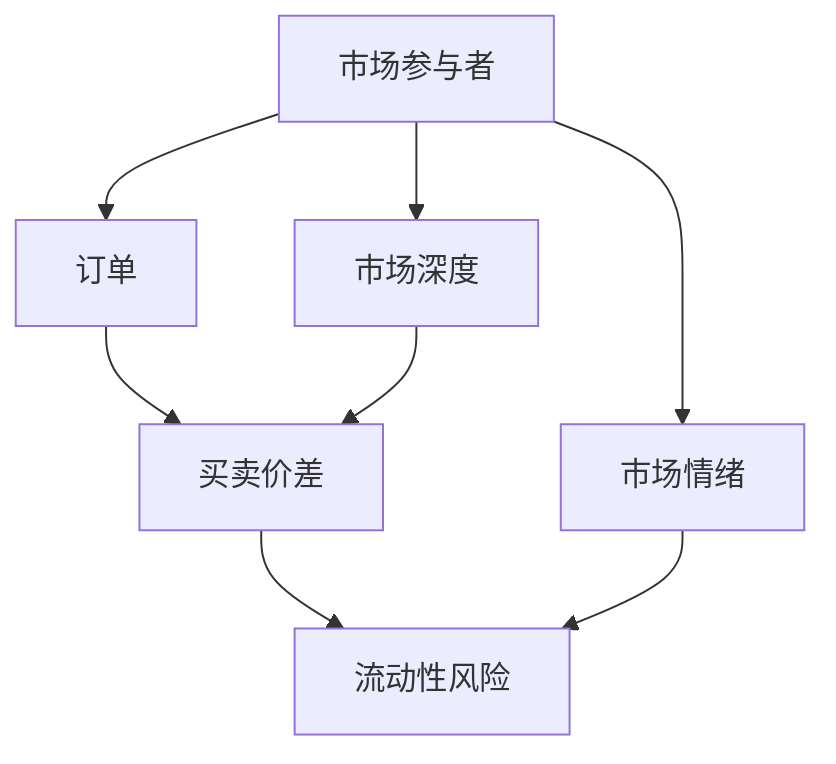
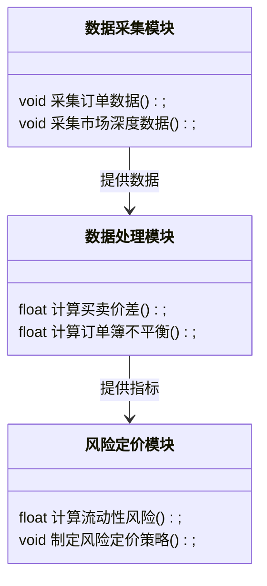
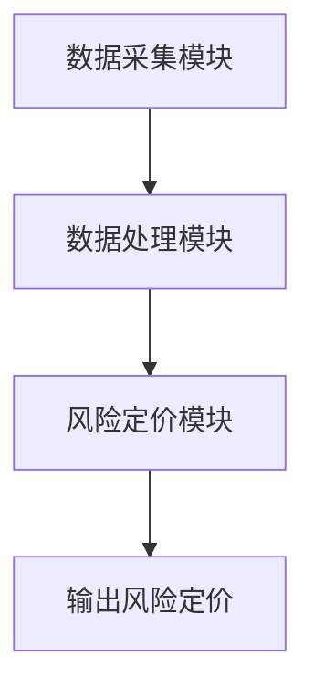

                 


# 如何将特价股票策略应用于数字资产流动性风险定价

> 关键词：特价股票策略，数字资产，流动性风险，定价模型，市场分析，风险管理

> 摘要：本文探讨如何将特价股票策略应用于数字资产流动性风险定价。首先，我们介绍了特价股票策略和数字资产流动性风险的基本概念，分析了它们的联系与区别。接着，我们详细讲解了数字资产流动性风险定价的数学模型，对比分析了特价股票策略与数字资产流动性风险定价的核心概念。然后，我们通过算法原理、系统架构和项目实战，展示了如何将特价股票策略应用于数字资产流动性风险定价的具体步骤。最后，我们总结了最佳实践和注意事项，为读者提供了实用的指导。

---

## 第一章：背景介绍

### 1.1 特价股票策略的基本概念

#### 1.1.1 什么是特价股票策略
特价股票策略是一种在特定市场条件下，以低于市场价购买股票的策略。这种策略通常利用市场短期波动、信息不对称或市场参与者行为来寻找定价错误的机会。

#### 1.1.2 特价股票策略的核心要素
- **市场分析**：识别市场中的短期波动和定价错误。
- **订单簿分析**：分析订单簿中的隐藏订单和市场深度。
- **交易时机**：抓住市场短期价格波动的机会。

#### 1.1.3 特价股票策略的应用场景
- **短期套利**：利用市场价差进行套利。
- **事件驱动**：公司公告、市场消息等事件引发的价格波动。
- **市场冲击**：大额交易引发的价格冲击。

### 1.2 数字资产流动性风险的基本概念

#### 1.2.1 数字资产的定义与特点
数字资产是指以区块链技术为基础的虚拟货币，如比特币、以太坊等。数字资产的特点包括去中心化、匿名性、高波动性和24/7交易。

#### 1.2.2 流动性风险的定义与影响
流动性风险是指资产在短时间内难以以合理价格变现的风险。在数字资产市场，流动性风险尤为突出，因为市场深度有限，价格波动剧烈。

#### 1.2.3 数字资产流动性风险的特殊性
- **市场深度不足**：许多数字资产交易量小，市场深度有限。
- **价格波动大**：数字资产价格波动远高于传统资产。
- **市场参与者行为异化**：市场参与者行为可能受到市场情绪影响较大。

### 1.3 特价股票策略应用于数字资产流动性风险定价的背景

#### 1.3.1 数字资产市场的现状与挑战
数字资产市场发展迅速，但市场深度不足，价格波动剧烈，流动性风险高。

#### 1.3.2 特价股票策略在传统金融中的应用
在传统金融中，特价股票策略常用于短期套利和事件驱动交易，帮助投资者在市场波动中获利。

#### 1.3.3 将特价股票策略应用于数字资产流动性风险定价的可行性
数字资产市场的特点与特价股票策略的应用场景有相似之处，特别是市场波动大、订单簿分析需求高等方面，为策略应用提供了基础。

---

## 第二章：核心概念与联系

### 2.1 特价股票策略的核心原理

#### 2.1.1 市场微观结构分析
市场微观结构分析关注订单簿、市场深度和参与者行为，帮助识别短期价格波动的机会。

#### 2.1.2 价格发现机制
价格发现机制通过分析市场参与者的买卖行为，发现资产的合理价格。

#### 2.1.3 市场参与者行为分析
市场参与者行为分析帮助识别市场情绪和趋势，预测价格波动。

### 2.2 数字资产流动性风险定价的数学模型

#### 2.2.1 流动性风险的量化方法
流动性风险可以通过市场深度、买卖价差、订单簿不平衡等指标量化。

#### 2.2.2 数字资产价格波动模型
数字资产价格波动可以用GARCH模型等统计模型进行建模，分析价格波动的特性。

#### 2.2.3 风险-收益平衡模型
风险-收益平衡模型通过优化风险承受能力，制定合理的资产定价策略。

### 2.3 特价股票策略与数字资产流动性风险定价的联系

#### 2.3.1 理论基础的共通性
两者都基于市场微观结构分析和价格发现机制，具有相似的理论基础。

#### 2.3.2 实践中的可迁移性
特价股票策略的订单簿分析和市场参与者行为分析可以迁移到数字资产流动性风险定价。

#### 2.3.3 数字资产市场的特殊性
数字资产市场的高波动性和市场深度不足，为特价股票策略的应用提供了新的挑战和机会。

### 2.4 对比分析

#### 2.4.1 核心概念对比表

| 对比维度        | 特价股票策略                     | 数字资产流动性风险定价           |
|-----------------|---------------------------------|----------------------------------|
| 核心目标        | 寻找定价错误的机会               | 量化和管理流动性风险             |
| 分析方法        | 市场微观结构分析、订单簿分析      | 市场深度、买卖价差、订单簿分析   |
| 应用场景        | 短期套利、事件驱动交易            | 数字资产市场的风险管理           |
| 数据需求        | 实时订单数据、市场深度数据        | 实时订单数据、市场深度数据        |

#### 2.4.2 实体关系图
使用mermaid绘制实体关系图：



---

## 第三章：算法原理

### 3.1 算法概述

#### 3.1.1 算法目标
通过分析数字资产的订单簿和市场深度，识别定价错误的机会，优化流动性风险定价。

#### 3.1.2 算法输入
- 实时订单数据
- 市场深度数据
- 市场参与者行为数据

#### 3.1.3 算法输出
- 数字资产流动性风险定价
- 交易建议

### 3.2 数学模型与公式

#### 3.2.1 流动性风险量化模型
$$ \text{流动性风险} = \alpha \times \text{买卖价差} + \beta \times \text{订单簿不平衡} + \gamma \times \text{市场深度} $$

其中，$\alpha$, $\beta$, $\gamma$是权重系数，根据具体市场情况确定。

#### 3.2.2 市场参与者行为模型
$$ \text{市场情绪} = \delta \times \text{买量} - \epsilon \times \text{卖量} $$

### 3.3 算法实现步骤

1. 数据收集：获取数字资产的实时订单数据和市场深度数据。
2. 订单簿分析：计算买卖价差和订单簿不平衡。
3. 市场参与者行为分析：计算市场情绪指标。
4. 流动性风险量化：使用上述公式计算流动性风险。
5. 风险定价：结合市场情绪和流动性风险，制定风险定价策略。

### 3.4 代码实现

```python
import pandas as pd
import numpy as np

def calculate_liq_risk(orders, market_depth):
    bid_ask_spread = orders['ask'].values[0] - orders['bid'].values[0]
    imbalance = sum(orders['buy_volume']) - sum(orders['sell_volume'])
    depth = market_depth['total']
    risk = alpha * bid_ask_spread + beta * imbalance + gamma * depth
    return risk

# 示例数据
orders = pd.DataFrame({
    'bid': [0.001, 0.0005],
    'ask': [0.002, 0.0015],
    'buy_volume': [10, 5],
    'sell_volume': [5, 10]
})
market_depth = pd.DataFrame({
    'total': [100, 200]
})

alpha = 0.5
beta = 0.3
gamma = 0.2

risk = calculate_liq_risk(orders, market_depth)
print(f"流动性风险为: {risk}")
```

### 3.5 示例分析

假设某数字资产的订单数据如下：

| 类型 | 价格  | 数量 |
|------|-------|------|
| 买   | 0.001 | 10   |
| 卖   | 0.002 | 5    |

市场深度数据：

| 深度层 | 数量 |
|-------|------|
| 0     | 100  |
| 1     | 200  |

计算流动性风险：

$$ \text{买卖价差} = 0.002 - 0.001 = 0.001 $$
$$ \text{订单簿不平衡} = 10 - 5 = 5 $$
$$ \text{市场深度} = 100 + 200 = 300 $$

$$ \text{流动性风险} = 0.5 \times 0.001 + 0.3 \times 5 + 0.2 \times 300 = 0.0005 + 1.5 + 60 = 61.5005 $$

---

## 第四章：系统分析与架构设计

### 4.1 项目背景

数字资产市场的流动性风险定价是一个复杂的问题，需要结合订单数据和市场深度数据进行实时分析。

### 4.2 系统功能设计

#### 4.2.1 功能模块
- 数据采集模块：采集数字资产的订单数据和市场深度数据。
- 数据处理模块：分析订单簿和市场深度，计算流动性风险。
- 风险定价模块：根据计算结果制定风险定价策略。

#### 4.2.2 领域模型类图



### 4.3 系统架构设计

#### 4.3.1 系统架构图



#### 4.3.2 接口设计

- 数据接口：提供实时订单数据和市场深度数据。
- API接口：提供流动性风险定价服务。

### 4.4 系统交互流程

1. 数据采集模块获取实时订单数据和市场深度数据。
2. 数据处理模块计算买卖价差和订单簿不平衡。
3. 风险定价模块根据计算结果制定风险定价策略。
4. 输出风险定价结果。

---

## 第五章：项目实战

### 5.1 环境安装

- 安装Python和必要的库（如pandas、numpy）。
- 设置数据采集接口（如使用API获取订单数据）。

### 5.2 核心代码实现

```python
import requests

def get_order_data(api_key):
    response = requests.get('https://api.example.com/orders', params={'api_key': api_key})
    return response.json()

def main():
    api_key = 'your_api_key'
    orders = get_order_data(api_key)
    market_depth = get_market_depth(api_key)
    risk = calculate_liq_risk(orders, market_depth)
    print(f"流动性风险为: {risk}")

if __name__ == '__main__':
    main()
```

### 5.3 代码解读

- `get_order_data`函数：通过API获取订单数据。
- `calculate_liq_risk`函数：计算流动性风险。
- `main`函数：调用数据获取和风险计算函数，输出结果。

### 5.4 实际案例分析

假设某数字资产的订单数据如下：

```json
{
    "orders": [
        {"type": "bid", "price": 0.001, "volume": 10},
        {"type": "ask", "price": 0.002, "volume": 5}
    ],
    "market_depth": {
        "total": 300
    }
}
```

计算流动性风险：

$$ \text{买卖价差} = 0.002 - 0.001 = 0.001 $$
$$ \text{订单簿不平衡} = 10 - 5 = 5 $$
$$ \text{市场深度} = 300 $$

$$ \text{流动性风险} = 0.5 \times 0.001 + 0.3 \times 5 + 0.2 \times 300 = 0.0005 + 1.5 + 60 = 61.5005 $$

---

## 第六章：总结与展望

### 6.1 最佳实践

- 定期更新模型参数，适应市场变化。
- 结合市场情绪和市场深度，优化风险定价策略。
- 注意数字资产市场的特殊性，避免过度依赖单一指标。

### 6.2 小结

本文详细探讨了如何将特价股票策略应用于数字资产流动性风险定价，通过理论分析和实践案例，展示了如何利用订单数据和市场深度数据优化风险定价。

### 6.3 注意事项

- 模型参数需要根据市场变化进行调整。
- 注意数字资产市场的高波动性和市场深度不足的问题。
- 风险定价模型需要结合具体市场情况，避免过于简化。

### 6.4 拓展阅读

- 《数字资产市场的微观结构分析》
- 《流动性风险定价的理论与实践》
- 《Python在金融数据分析中的应用》

---

以上就是《如何将特价股票策略应用于数字资产流动性风险定价》的完整目录和内容概述。通过系统的分析和实践，读者可以深入了解如何将特价股票策略应用于数字资产流动性风险定价，掌握相关的核心概念和算法原理。

