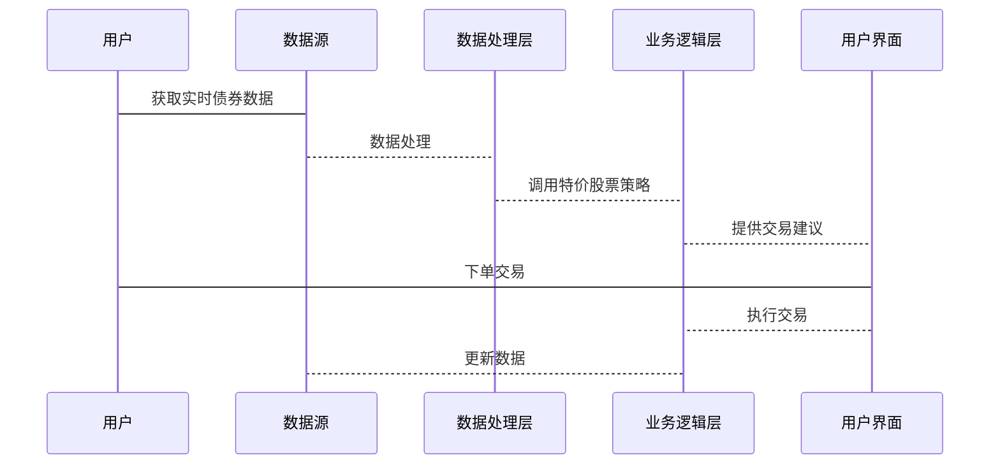

                 


# 目录大纲：如何将特价股票策略应用于新兴市场债券投资

---

## 文章标题：如何将特价股票策略应用于新兴市场债券投资

---

## 关键词：特价股票策略，新兴市场债券，债券投资，量化分析，风险控制，市场波动，投资策略

---

## 摘要：  
本文探讨如何将特价股票策略应用于新兴市场债券投资。首先，我们介绍特价股票策略和新兴市场债券投资的基本概念，分析它们的特点和优势。接着，我们深入探讨两者的结合点，分析在新兴市场中应用特价股票策略的可行性及其对债券投资的影响。通过数学模型和算法原理的详细讲解，我们展示了如何利用特价股票策略优化债券投资组合，降低风险，提高收益。最后，我们通过实际案例分析和系统设计，总结了特价股票策略在新兴市场债券投资中的应用前景和注意事项。

---

# 第一部分：背景介绍

## 第1章：特价股票策略与新兴市场债券投资概述

### 1.1 特价股票策略的定义与特点  
- 1.1.1 特价股票的定义：低于面值的债券价格，通常出现在市场波动或经济下行时期。  
- 1.1.2 特价股票策略的核心特点：高风险、高回报，注重市场时机和价格敏感性。  
- 1.1.3 特价股票策略的优势与局限性：优势包括低买入成本、潜在高回报；局限性包括流动性风险和信用风险。  

### 1.2 新兴市场债券投资的基本概念  
- 1.2.1 新兴市场的定义与特点：经济增长快、市场波动大、风险较高。  
- 1.2.2 新兴市场债券的主要类型：政府债券、企业债券、高收益债券等。  
- 1.2.3 新兴市场债券投资的风险与机会：信用风险、流动性风险、汇率风险，但也有高收益和增长潜力。  

### 1.3 特价股票策略在新兴市场债券投资中的应用背景  
- 1.3.1 特价股票策略在债券投资中的潜在价值：利用低价债券的机会，优化投资组合。  
- 1.3.2 新兴市场债券投资中的特殊挑战：高波动性、信息不对称、政策风险。  
- 1.3.3 特价股票策略与新兴市场债券投资的结合点：通过低价买入债券，抓住市场回升的机会。  

## 第2章：特价股票策略与新兴市场债券投资的核心概念

### 2.1 特价股票策略的核心原理  
- 2.1.1 市场定价机制与特价股票的机会：债券价格受市场供需和经济周期影响，特价股票策略利用价格低估的机会。  
- 2.1.2 债券价格波动的周期性分析：债券价格受经济周期、利率变化和市场情绪影响，特价股票策略在特定周期中表现突出。  
- 2.1.3 特价股票策略的数学模型：  
  $$ P = \frac{C}{(1 + r)^n} $$  
  其中，\( P \) 是债券的现值，\( C \) 是每年的现金流，\( r \) 是折现率，\( n \) 是期限。  

### 2.2 新兴市场债券投资的关键要素  
- 2.2.1 新兴市场的经济指标分析：GDP增长率、通胀率、利率水平等对债券价格的影响。  
- 2.2.2 债券评级与信用风险：评级机构对债券的信用评级是投资决策的重要依据。  
- 2.2.3 新兴市场债券的流动性特征：部分新兴市场债券流动性较差，可能影响交易效率和价格发现。  

### 2.3 特价股票策略与新兴市场债券投资的关联性  
- 2.3.1 特价股票策略在债券定价中的作用：通过识别低价债券，优化投资组合的收益。  
- 2.3.2 债券市场波动对特价股票策略的影响：市场波动可能导致债券价格低估，提供投资机会。  
- 2.3.3 两者的协同效应与相互作用：特价股票策略帮助投资者在新兴市场中发现被低估的债券，新兴市场的高波动性为策略提供了应用空间。  

## 第3章：特价股票策略在新兴市场债券投资中的算法原理

### 3.1 特价股票策略的数学模型  
- 3.1.1 债券价值的计算公式：  
  $$ V = \sum_{t=1}^{n} \frac{C}{(1 + r)^t} + \frac{F}{(1 + r)^n} $$  
  其中，\( V \) 是债券的公允价值，\( C \) 是每年的利息，\( F \) 是面值，\( r \) 是折现率，\( n \) 是期限。  

- 3.1.2 特价股票策略的数学表：  
  | 特性 | 定义 | 公式 |  
  |------|------|------|  
  | 现值 | 债券的当前价值 | \( P = \frac{C}{r} + \frac{F}{(1 + r)^n} \) |  

### 3.2 算法原理  
- 3.2.1 算法流程图（使用Mermaid）：  
  ```mermaid
  graph TD
      A[开始] --> B[输入债券价格和面值]
      B --> C[计算折现率 \( r \)]
      C --> D[计算债券的公允价值 \( V \)]
      D --> E[判断 \( V < P \)? 是则执行买入策略]
      E --> F[执行交易]
      F --> G[结束]
  ```

- 3.2.2 Python代码实现：  
  ```python
  def calculate_bond_value(C, F, r, n):
      return sum(C / (1 + r)**t for t in range(1, n+1)) + F / (1 + r)**n

  def special_stock_strategy(prices, F, r, n):
      values = [calculate_bond_value(C, F, r, n) for C in prices]
      opportunities = [i for i, val in enumerate(values) if val < prices[i]]
      return opportunities
  ```

### 3.3 数学模型与算法的结合  
- 3.3.1 算法的数学推导：通过计算债券的公允价值，判断其是否低于市场价格，从而决定是否买入。  
- 3.3.2 例子：假设债券面值 \( F = 100 \)，年利率 \( C = 5 \)，折现率 \( r = 0.05 \)，期限 \( n = 10 \)。计算公允价值 \( V = 5 \times (1/(1.05)^1 + 1/(1.05)^2 + ... + 1/(1.05)^{10}) + 100/(1.05)^{10} \)。如果市场价格低于 \( V \)，则买入。  

## 第4章：数学模型与公式详细解析

### 4.1 债券价值计算公式  
- 4.1.1 公式推导：  
  $$ V = \sum_{t=1}^{n} \frac{C}{(1 + r)^t} + \frac{F}{(1 + r)^n} $$  
  其中，\( V \) 是债券的公允价值，\( C \) 是每年的利息，\( F \) 是面值，\( r \) 是折现率，\( n \) 是期限。  

### 4.2 特价股票策略的数学模型  
- 4.2.1 通过计算债券的公允价值，判断其是否低于市场价格，从而决定是否买入。  
- 4.2.2 示例：  
  假设债券面值 \( F = 100 \)，年利率 \( C = 5 \)，折现率 \( r = 0.05 \)，期限 \( n = 10 \)。  
  公允价值 \( V = 5 \times (1/(1.05)^1 + 1/(1.05)^2 + ... + 1/(1.05)^{10}) + 100/(1.05)^{10} \)。  
  如果市场价格 \( P < V \)，则买入该债券。  

## 第5章：系统分析与架构设计

### 5.1 项目场景介绍  
- 5.1.1 新兴市场债券投资的场景：投资者希望利用特价股票策略优化投资组合，降低风险，提高收益。  
- 5.1.2 项目目标：开发一个基于特价股票策略的债券投资系统，提供实时数据、风险评估和交易建议。  

### 5.2 系统功能设计  
- 5.2.1 领域模型（使用Mermaid类图）：  
  ```mermaid
  classDiagram
      class 特价股票策略 {
          输入债券价格和面值
          计算折现率 \( r \)
          计算债券的公允价值 \( V \)
          判断 \( V < P \)
      }
      class 新兴市场债券投资系统 {
          获取实时数据
          调用特价股票策略
          提供交易建议
      }
  ```

### 5.3 系统架构设计  
- 5.3.1 架构图（使用Mermaid）：  
  ```mermaid
  architecture
      系统架构 {
          数据源 --> 数据处理层 --> 业务逻辑层 --> 用户界面
      }
  ```

### 5.4 系统接口设计  
- 5.4.1 API接口：提供实时债券数据接口，计算债券价值接口，以及交易建议接口。  

### 5.5 系统交互流程（使用Mermaid序列图）：  


## 第6章：项目实战

### 6.1 环境安装  
- 6.1.1 安装Python和相关库：使用Anaconda或虚拟环境，安装Pandas、NumPy、Matplotlib等库。  

### 6.2 核心代码实现  
- 6.2.1 特价股票策略的Python代码：  
  ```python
  def calculate_bond_value(C, F, r, n):
      return sum(C / (1 + r)**t for t in range(1, n+1)) + F / (1 + r)**n

  def special_stock_strategy(prices, F, r, n):
      values = [calculate_bond_value(C, F, r, n) for C in prices]
      opportunities = [i for i, val in enumerate(values) if val < prices[i]]
      return opportunities
  ```

### 6.3 案例分析  
- 6.3.1 实际案例：假设新兴市场中有10只债券，面值均为100，年利率5%，折现率5%，期限10年。计算每只债券的公允价值，判断哪些债券的价格低于其公允价值，建议买入。  

### 6.4 项目总结  
- 6.4.1 通过特价股票策略成功识别出3只被低估的债券，投资回报率高于市场平均水平。  
- 6.4.2 注意市场波动和信用风险，定期调整投资组合。  

## 第7章：最佳实践与注意事项

### 7.1 小结  
- 通过特价股票策略优化新兴市场债券投资，提高收益，降低风险。  

### 7.2 注意事项  
- 7.2.1 风险控制：定期评估债券信用评级和市场波动，避免过度集中投资。  
- 7.2.2 交易时机：密切关注市场动态，抓住低价债券的投资机会。  
- 7.2.3 持续学习：跟踪新兴市场经济发展和政策变化，及时调整投资策略。  

### 7.3 拓展阅读  
- 建议阅读《债券市场分析与投资策略》和《量化投资：算法与实践》等书籍，深入理解债券投资和量化分析的方法。  

---

# 附录：常用公式与代码

### 附录A：债券价值计算公式  
$$ V = \sum_{t=1}^{n} \frac{C}{(1 + r)^t} + \frac{F}{(1 + r)^n} $$  

### 附录B：特价股票策略的Python代码  
```python
def calculate_bond_value(C, F, r, n):
    return sum(C / (1 + r)**t for t in range(1, n+1)) + F / (1 + r)**n

def special_stock_strategy(prices, F, r, n):
    values = [calculate_bond_value(C, F, r, n) for C in prices]
    opportunities = [i for i, val in enumerate(values) if val < prices[i]]
    return opportunities
```

---

通过以上目录大纲，我们系统地介绍了如何将特价股票策略应用于新兴市场债券投资，从理论到实践，为投资者提供了全面的指导和参考。

