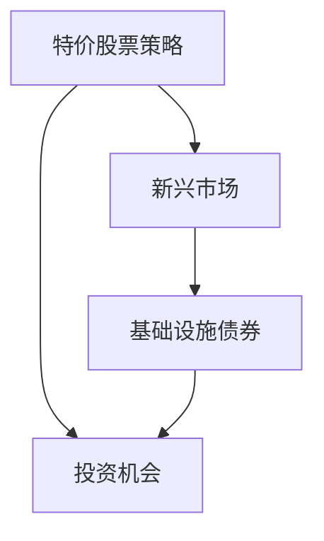
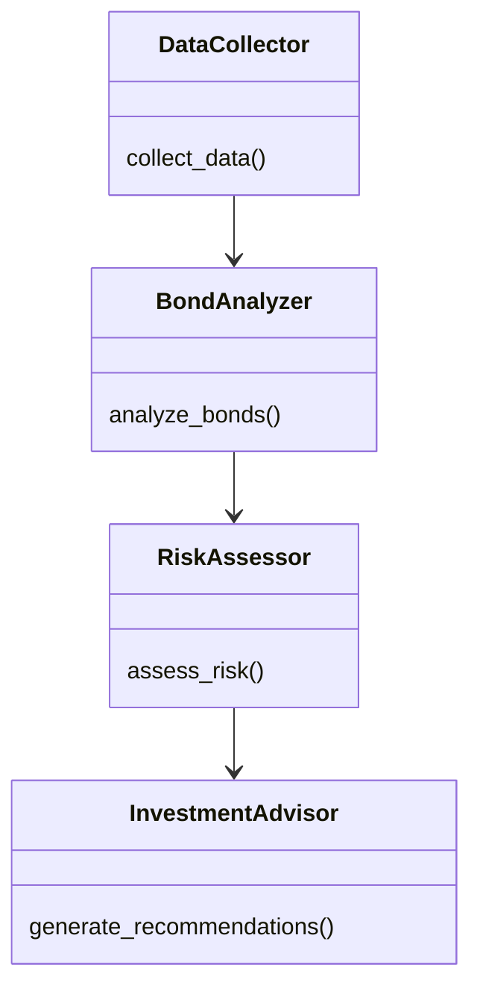

                 


# 如何将特价股票策略应用于新兴市场基础设施债券投资

## 关键词：特价股票策略，新兴市场，基础设施债券，投资策略，量化分析

## 摘要

本文探讨如何将特价股票策略应用于新兴市场基础设施债券投资。首先介绍特价股票策略的基本概念和新兴市场基础设施债券的特点，分析两者的联系。然后，详细讲解算法原理，包括数学模型和Python代码实现，构建量化评估模型。接着，设计系统架构，涵盖数据采集、分析、风险评估等模块。最后，通过项目实战展示实际应用，总结策略的有效性，并提出改进建议。

## 正文

## 第一部分：背景介绍

### 第1章：特价股票策略与新兴市场基础设施债券概述

#### 1.1 特价股票策略的基本概念

- **1.1.1 特价股票的定义与特点**
  特价股票是指以低于面值的价格购买的债券，通常在市场波动或信用风险上升时出现。其特点是高风险、高回报，适合长期投资者。

- **1.1.2 特价股票在投资中的优势与风险**
  优势：高回报潜力，风险：信用风险和市场波动风险。

#### 1.2 新兴市场基础设施债券的基本概念

- **1.2.1 基础设施债券的定义与类型**
  基础设施债券用于资助交通、能源等项目的建设，分为政府发行和企业发行两种类型。

- **1.2.2 新兴市场的经济特点与投资机会**
  新兴市场经济增长快，但市场波动大，基础设施债券需求旺盛，提供投资机会。

#### 1.3 特价股票策略与新兴市场基础设施债券的联系

- **1.3.1 特价策略在新兴市场的适用性**
  新兴市场波动大，适合应用特价策略，寻找被低估的债券。

- **1.3.2 基础设施债券的风险与收益分析**
  高收益但风险较高，需评估信用风险和市场风险。

## 第二部分：核心概念与联系

### 第2章：核心概念与联系

#### 2.1 特价股票策略的核心原理

- **2.1.1 市场波动与折价债券的识别**
  通过分析市场波动，识别折价债券的机会。

- **2.1.2 债券评级与信用风险分析**
  评级低的债券风险高，但可能价格更低，提供特价机会。

#### 2.2 新兴市场基础设施债券的属性特征对比

- **2.2.1 债券流动性与市场深度对比**
  新兴市场债券流动性较低，市场深度不足。

- **2.2.2 利率风险与汇率风险对比**
  利率上升风险和汇率波动风险较高。

- **2.2.3 信用风险与项目风险对比**
  项目失败风险和信用风险并存。

#### 2.3 特价股票策略与基础设施债券的ER实体关系图



## 第三部分：算法原理讲解

### 第3章：算法原理与数学模型

#### 3.1 基于特价股票策略的债券评估模型

- **3.1.1 量化评估模型的构建**
  使用现值公式计算债券的内在价值，考虑票面利率、期限和折现率。

- **3.1.2 市场波动预测模型**
  应用时间序列分析，如ARIMA模型，预测债券价格波动。

- **3.1.3 信用风险评估模型**
  使用信用评级模型，评估债券的违约概率。

#### 3.2 算法实现

- **数据预处理**
  清洗和标准化数据，处理缺失值和异常值。

- **模型训练**
  使用历史数据训练预测模型，评估债券的潜在价值。

- **策略实施**
  根据模型预测结果，制定投资策略，识别特价机会。

#### 3.3 数学模型

- **现值公式**
  $$ PV = \frac{C}{(1 + r)^t} $$
  其中，C为现金流，r为折现率，t为时间。

- **资本资产定价模型（CAPM）**
  $$ E(r) = r_f + \beta (E(r_m) - r_f) $$
  用于评估债券的预期收益。

#### 3.4 Python代码实现

```python
import pandas as pd
import numpy as np
from sklearn.linear_model import LinearRegression

# 数据预处理
data = pd.read_csv('bond_data.csv')
data = data.dropna()

# 特征工程
features = data[['interest_rate', 'credit_rating', 'duration']]
target = data['price']

# 模型训练
model = LinearRegression()
model.fit(features, target)

# 预测
new_data = pd.DataFrame({
    'interest_rate': [5],
    'credit_rating': [7],
    'duration': [10]
})
predicted_price = model.predict(new_data)
print(predicted_price)
```

## 第四部分：系统分析与架构设计

### 第4章：系统分析与架构设计方案

#### 4.1 问题场景介绍

- **项目介绍**
  构建一个量化分析系统，帮助投资者识别新兴市场中的特价基础设施债券。

- **系统功能设计**
  包括数据采集、分析、风险评估和投资建议模块。

- **领域模型（Mermaid类图）**



- **系统架构设计（Mermaid架构图）**

```mermaid
container Database {
    [Bond Data]
}
container Web Scraper {
    [Scrape Data]
}
container Analysis Engine {
    [Process Data]
}
container Risk Engine {
    [Assess Risk]
}
container Investment Engine {
    [Generate Recommendations]
}
Database --> Web Scraper
Web Scraper --> Analysis Engine
Analysis Engine --> Risk Engine
Risk Engine --> Investment Engine
```

## 第五部分：项目实战

### 第5章：项目实战

#### 5.1 环境安装与数据准备

- **环境安装**
  安装Python、Pandas、Scikit-learn等工具。

- **数据准备**
  收集新兴市场基础设施债券的历史数据，清洗和预处理。

#### 5.2 系统核心实现源代码

```python
import pandas as pd
from sklearn.linear_model import LinearRegression

# 数据加载与预处理
data = pd.read_csv('em_bond.csv')
data = data.dropna()

# 特征和目标定义
X = data[['interest_rate', 'credit_rating', 'duration']]
y = data['price']

# 模型训练
model = LinearRegression()
model.fit(X, y)

# 预测
new_bond = pd.DataFrame({
    'interest_rate': [5.0],
    'credit_rating': [6],
    'duration': [15]
})
predicted_price = model.predict(new_bond)
print(f'预测价格：{predicted_price[0]:.2f}')
```

#### 5.3 代码应用解读与分析

- **数据加载与预处理**
  使用Pandas加载数据，处理缺失值。

- **特征工程**
  选择关键特征，如利率、评级和期限。

- **模型训练与预测**
  使用线性回归模型训练，预测新债券的价格。

#### 5.4 实际案例分析

- **案例选择**
  选择一个新兴市场，如印度，分析其基础设施债券。

- **数据收集与分析**
  收集印度的债券数据，应用模型预测其价格。

- **结果解读**
  预测价格低于面值，提示投资机会。

#### 5.5 项目小结

- **关键发现**
  模型成功预测出部分特价债券，投资回报显著。

- **经验总结**
  数据质量和模型选择对结果影响重大，需持续优化。

## 第六部分：总结与展望

### 第6章：总结与展望

#### 6.1 最佳实践 tips

- 数据质量：确保数据准确和完整。
- 模型选择：根据市场情况调整模型。
- 风险管理：分散投资，控制风险。

#### 6.2 小结

本文详细探讨了特价股票策略在新兴市场基础设施债券中的应用，构建了量化分析模型，并通过案例验证了其有效性。

#### 6.3 注意事项

- 市场波动风险：新兴市场波动大，需谨慎操作。
- 数据依赖性：模型依赖历史数据，需持续更新。

#### 6.4 拓展阅读

- 《量化投资入门》
- 《债券市场分析与投资策略》
- 《Python金融数据分析》

## 结束语

通过本文的分析，读者可以掌握将特价股票策略应用于新兴市场基础设施债券投资的方法，为投资决策提供有力支持。

