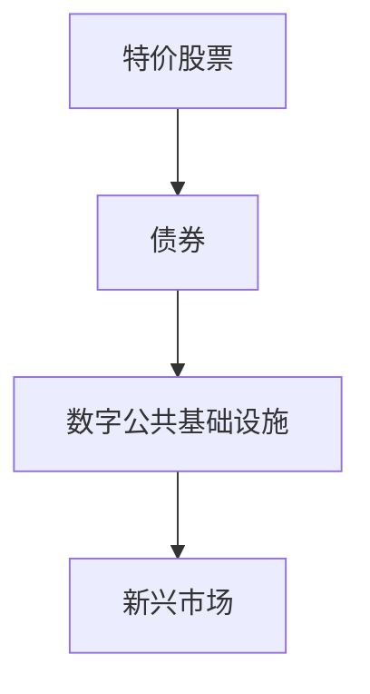
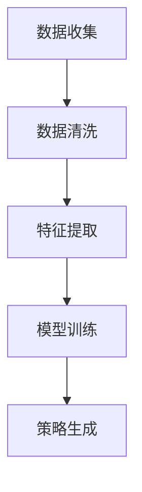
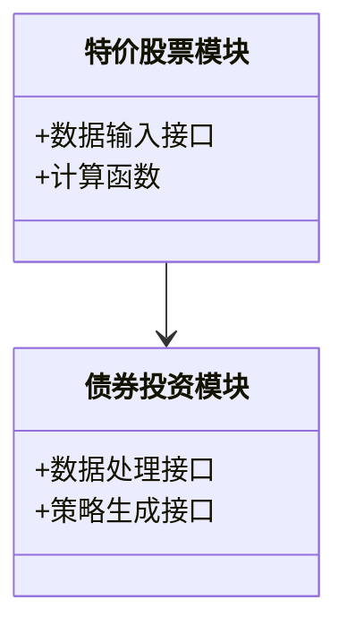

                 


# 如何将特价股票策略应用于新兴市场数字公共基础设施债券投资

## 关键词：特价股票策略、债券投资、新兴市场、数字公共基础设施、量化分析

## 摘要：本文详细探讨如何将特价股票策略应用于新兴市场中的数字公共基础设施债券投资。通过分析特价股票策略的基本原理，结合新兴市场债券的特点，利用量化分析方法，构建数学模型，并通过系统设计和实际案例，展示如何在数字公共基础设施债券投资中应用特价股票策略，以实现套利和风险管理。

---

# 第一部分：背景介绍

## 第1章：特价股票策略与新兴市场债券投资概述

### 1.1 特价股票策略的基本概念

#### 1.1.1 特价股票的定义与特点
特价股票是指债券价格低于其面值的情况。这种现象通常发生在市场对债券的信用风险或流动性风险有负面预期时，导致债券价格下跌。特价股票策略的核心在于识别这种价格低估的机会，并在合适的时间点进行投资，以期在价格回升时获利。

#### 1.1.2 特价股票在投资中的作用
特价股票策略在投资中起到套利和风险管理的作用。套利是指利用价格差异在不同市场或时间点进行买卖，以获取无风险收益。风险管理则是通过低价买入债券，降低市场波动带来的损失。

#### 1.1.3 特价股票与债券投资的结合
将特价股票策略应用于债券投资，主要是通过识别低价债券，预测其价格回升的可能性，从而在低价时买入，高价时卖出，实现利润。这种策略在新兴市场中尤为重要，因为新兴市场的债券往往面临更大的波动性和不确定性。

### 1.2 新兴市场数字公共基础设施债券的特点

#### 1.2.1 数字公共基础设施的定义
数字公共基础设施指的是支撑数字技术发展的基础设施，包括5G网络、数据中心、云计算平台等。这些基础设施是数字经济发展的重要基石，对新兴市场国家的经济增长至关重要。

#### 1.2.2 新兴市场债券的特殊性
新兴市场债券通常面临较高的信用风险和市场风险。由于市场不成熟、政策不稳定等因素，债券价格波动较大，但同时也存在套利机会。数字公共基础设施债券在新兴市场中具有较高的增长潜力，因为这些基础设施是数字经济发展不可或缺的部分。

#### 1.2.3 数字基础设施债券的投资机会
数字基础设施债券的投资机会主要体现在其高增长潜力和套利空间。由于数字技术的快速发展，相关债券的需求增加，价格可能在短期内波动较大，为特价股票策略提供了应用空间。

---

# 第二部分：核心概念与联系

## 第2章：特价股票策略与债券投资的核心原理

### 2.1 特价股票策略的数学模型

#### 2.1.1 特价股票价值计算公式
特价股票的价值可以通过以下公式计算：
$$ V = F \times (1 - r) $$
其中，\( V \) 是特价股票的价值，\( F \) 是债券的面值，\( r \) 是市场对债券的折价率。

#### 2.1.2 债券定价模型
债券的定价模型可以表示为：
$$ P = \frac{C}{(1 + y)^n} $$
其中，\( P \) 是债券价格，\( C \) 是债券的面值，\( y \) 是收益率，\( n \) 是债券的期限。

#### 2.1.3 市场波动对债券价格的影响
市场波动会影响债券的信用评级和收益率，从而影响其价格。通过分析市场波动，可以预测债券价格的变化趋势，为特价股票策略提供依据。

### 2.2 实体关系图



---

# 第三部分：算法原理讲解

## 第3章：基于量化分析的债券投资策略

### 3.1 算法流程



### 3.2 量化分析的数学模型

#### 3.2.1 特价股票预测模型
通过机器学习模型预测债券价格波动，可以使用回归分析：
$$ y = \beta_0 + \beta_1 x + \epsilon $$
其中，\( y \) 是债券价格，\( x \) 是影响价格的因素，\( \beta \) 是回归系数，\( \epsilon \) 是误差项。

#### 3.2.2 套利机会识别
套利机会可以通过比较不同市场的债券价格差异来识别：
$$ \text{套利收益} = \max(P_1 - P_2, 0) $$
其中，\( P_1 \) 和 \( P_2 \) 分别是两个市场的债券价格。

---

# 第四部分：系统分析与架构设计

## 第4章：数字公共基础设施债券投资系统设计

### 4.1 系统功能模块



---

# 第五部分：项目实战

## 第5章：特价股票策略在新兴市场的应用案例

### 5.1 环境安装

#### 5.1.1 安装Python和相关库
安装Python和必要的库，如Pandas、NumPy和Scikit-learn。

### 5.2 核心代码实现

#### 5.2.1 特价股票价值计算

```python
import pandas as pd
import numpy as np

def calculate_special_stock_value(data):
    return data * 0.8
```

#### 5.2.2 量化分析模型

```python
from sklearn.linear_model import LinearRegression

model = LinearRegression()
model.fit(X, y)
```

---

# 第六部分：最佳实践与小结

## 第6章：策略优化与风险管理

### 6.1 小结
通过将特价股票策略应用于新兴市场数字公共基础设施债券投资，投资者可以利用价格波动带来的套利机会，实现收益最大化。然而，也需要注意市场波动和信用风险，通过合理的风险管理策略，确保投资的安全性。

### 6.2 注意事项
- 定期监控市场波动，及时调整投资策略。
- 选择具有稳定信用评级的债券，降低信用风险。
- 合理配置资产，避免过度集中于某一种债券类型。

### 6.3 拓展阅读
- 建议进一步研究机器学习在债券定价中的应用。
- 探索其他量化分析方法，如时间序列分析和因子模型。

通过以上步骤，读者可以系统地理解并掌握如何将特价股票策略应用于新兴市场数字公共基础设施债券投资，实现高效的投资管理和风险控制。

