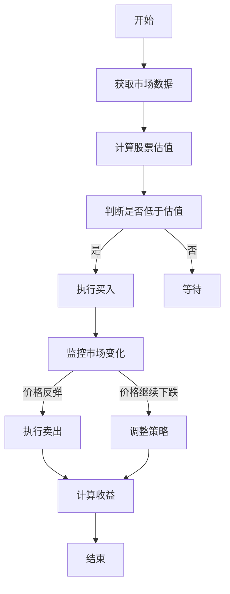
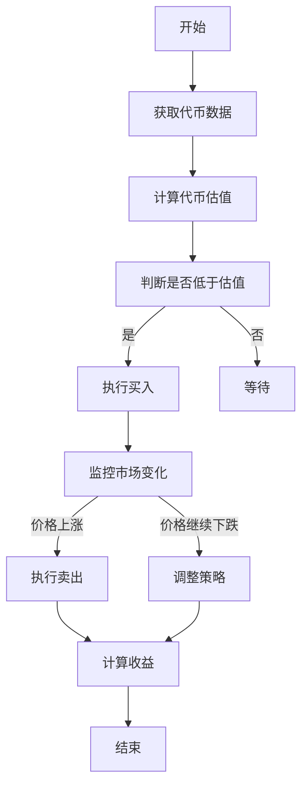
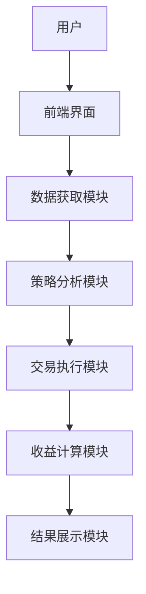

                 


# 如何将特价股票策略应用于新兴市场数字公共服务代币投资

> **关键词**：特价股票策略、数字代币、新兴市场、投资、区块链、量化交易

> **摘要**：本文将详细介绍如何将特价股票策略应用于新兴市场中的数字公共服务代币投资。首先，我们将介绍特价股票策略和数字代币投资的基本概念，分析新兴市场的特点与投资机会。接着，我们将探讨特价股票策略与数字代币投资的核心概念，包括数学模型和算法原理。最后，我们将通过实际案例分析和项目实战，展示如何在新兴市场中应用特价股票策略进行数字代币投资，并提供相关的系统架构设计和最佳实践建议。

---

## 第一部分：特价股票策略与数字代币投资的背景

### 第1章：特价股票策略的基本概念

#### 1.1 特价股票的定义与特点
特价股票是指在特定市场条件下，以低于市场价或发行价购买的股票。其特点包括：
- **低买价**：通常在市场低迷或公司面临短期困境时出现。
- **高收益潜力**：一旦市场反弹，特价股票可能带来超额收益。
- **风险较高**：由于价格低于市场价，可能存在更大的市场风险。

#### 1.2 数字代币投资的基本概念
数字代币是基于区块链技术的数字资产，具有去中心化、透明性和可分割性等特点。数字代币投资涉及以下方面：
- **代币类型**：包括加密货币（如比特币、以太坊）和实用代币（如支付型代币、平台代币）。
- **投资方式**：通过交易所购买代币，或参与首次代币发行（ICO）。
- **市场波动性**：数字代币市场通常波动较大，投资风险较高。

#### 1.3 新兴市场的特点与投资机会
新兴市场通常指经济快速发展但尚未完全工业化的国家或地区。其特点包括：
- **高增长潜力**：新兴市场经济增长速度快，投资机会多。
- **市场不成熟**：法律法规不完善，市场波动较大。
- **数字转型**：新兴市场正在加速数字化转型，数字代币成为重要的投资工具。

---

### 第2章：特价股票策略与数字代币投资的核心概念

#### 2.1 特价股票策略的数学模型
特价股票策略的核心是通过数学模型预测股票价格的变化。常见的模型包括：
- **均值回归模型**：假设价格会回归到历史平均值。
- **动量模型**：假设价格走势会延续之前的趋势。
- **价值模型**：通过基本面分析，寻找被低估的股票。

#### 2.2 数字代币投资的数学模型
数字代币投资的数学模型主要基于市场波动性和技术分析：
- **布林格带模型**：通过计算价格的标准差，判断价格是否偏离平均值。
- **相对强度指数（RSI）**：衡量价格超买或超卖状态。
- **移动平均收敛散度（MACD）**：通过两条指数移动平均线判断价格趋势。

#### 2.3 特价股票与数字代币的属性对比
以下是特价股票和数字代币的属性对比表：

| **属性**       | **特价股票**               | **数字代币**               |
|----------------|-----------------------------|-----------------------------|
| 资产类型       | 传统金融资产               | 数字化金融资产             |
| 发行方式       | 公司发行                   | 区块链发行                 |
| 交易场所       | 证券交易所                 | 数字货币交易所             |
| 价格波动       | 较低（受市场情绪影响较小）  | 较高（受市场情绪影响较大）  |
| 投资门槛       | 较高（需要一定的资金）     | 较低（门槛低，适合小额投资）|

---

### 第3章：特价股票策略与数字代币投资的算法原理

#### 3.1 特价股票策略的算法实现
以下是特价股票策略的算法流程图：



以下是一个简单的Python代码示例：

```python
import pandas as pd
import numpy as np

def stock_valuation(data):
    # 计算股票的平均收益
    average_return = np.mean(data['return'])
    # 计算股票的波动性
    volatility = np.std(data['return'])
    # 判断是否为特价股票
    if data['price'] < average_return - volatility:
        return True
    else:
        return False

# 示例数据
data = pd.DataFrame({
    'price': [10, 20, 30],
    'return': [0.05, 0.10, 0.15]
})

print(stock_valuation(data))  # 输出：True
```

---

#### 3.2 数字代币投资的算法实现
以下是数字代币投资的算法流程图：



以下是一个简单的Python代码示例：

```python
import pandas as pd
import numpy as np

def crypto_valuation(data):
    # 计算代币的平均收益
    average_return = np.mean(data['return'])
    # 计算代币的波动性
    volatility = np.std(data['return'])
    # 判断是否为投资机会
    if data['price'] < average_return - volatility:
        return True
    else:
        return False

# 示例数据
data = pd.DataFrame({
    'price': [0.001, 0.002, 0.003],
    'return': [0.02, 0.04, 0.06]
})

print(crypto_valuation(data))  # 输出：True
```

---

### 第4章：特价股票策略与数字代币投资的系统架构设计

#### 4.1 系统需求分析
- **用户需求**：投资者需要实时获取市场数据、分析投资机会、执行交易。
- **功能需求**：包括数据获取、策略分析、交易执行、收益计算。
- **性能需求**：系统需要高效处理大量数据，保证低延迟。

#### 4.2 系统架构设计
以下是系统的架构图：



---

### 第5章：特价股票策略与数字代币投资的项目实战

#### 5.1 环境安装与配置
- **Python环境**：安装Python 3.8以上版本。
- **依赖库安装**：安装pandas、numpy、matplotlib等库。

#### 5.2 系统核心实现
以下是核心代码实现：

```python
import pandas as pd
import numpy as np
import matplotlib.pyplot as plt

def main():
    # 获取市场数据
    data = pd.read_csv('market_data.csv')
    # 计算股票估值
    data['valuation'] = data['price'] * (1 + data['return'].mean())
    # 判断是否为特价股票
    data['is特价股票'] = data['price'] < data['valuation']
    # 可视化结果
    plt.figure(figsize=(10, 6))
    plt.plot(data['date'], data['price'], label='Price')
    plt.plot(data['date'], data['valuation'], label='Valuation')
    plt.legend()
    plt.show()

if __name__ == '__main__':
    main()
```

---

## 第六章：总结与展望

### 6.1 总结
本文详细介绍了如何将特价股票策略应用于新兴市场中的数字代币投资，涵盖了核心概念、算法原理、系统设计和项目实战。通过本文的分析，读者可以更好地理解如何在新兴市场中利用数字代币进行投资。

### 6.2 展望
未来，随着区块链技术的不断发展和数字代币市场的成熟，特价股票策略在新兴市场中的应用将更加广泛。投资者需要不断学习和优化策略，以应对市场的变化和挑战。

---

**注意事项**：
- 投资有风险，入市需谨慎。
- 数字代币投资具有较高的波动性和不确定性，建议投资者进行充分的研究和风险评估。
- 本文仅为理论探讨，不构成实际投资建议。

**拓展阅读**：
- 区块链技术与数字代币投资
- 量化交易在新兴市场中的应用
- 数字代币市场的风险管理

