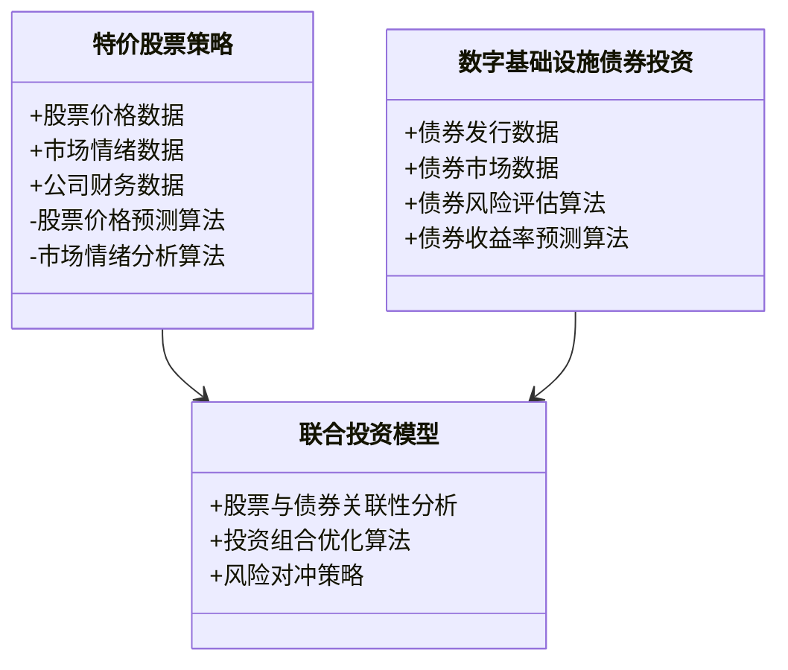
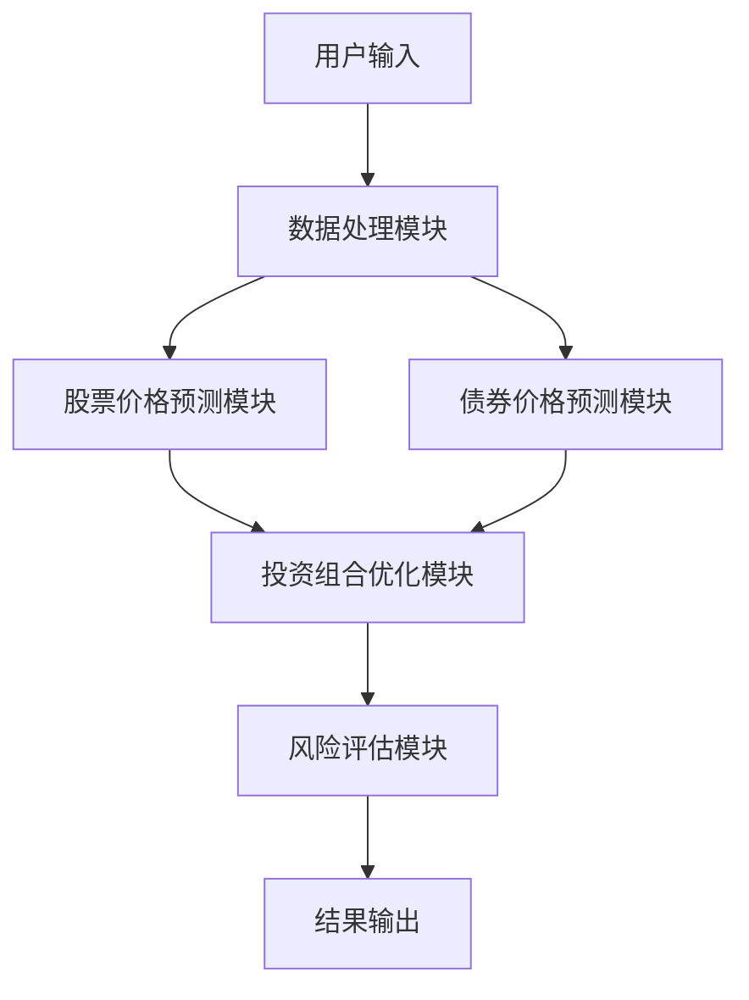
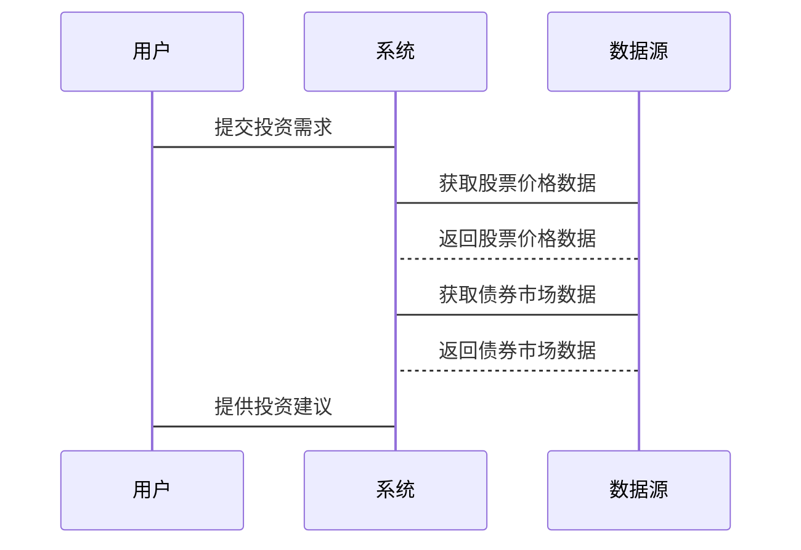

                 


# 如何将特价股票策略应用于新兴市场数字基础设施债券投资

> 关键词：特价股票策略，新兴市场，数字基础设施债券，投资策略，风险管理

> 摘要：本文详细探讨了如何将特价股票策略应用于新兴市场数字基础设施债券投资。首先介绍了特价股票策略和数字基础设施债券的基本概念，接着分析了两者的关联性与适用性。然后，从算法原理、系统架构设计、项目实战等角度，深入探讨了如何在新兴市场中应用特价股票策略进行债券投资。最后，通过实际案例分析，总结了最佳实践和注意事项，为投资者提供了可操作的参考。

---

## 第1章: 特价股票策略与新兴市场数字基础设施债券投资的背景

### 1.1 特价股票策略的基本概念

#### 1.1.1 特价股票的定义与特点
特价股票是指在特定市场条件下，以低于其内在价值的价格出售的股票。其特点是价格被低估、市场流动性较低、潜在收益较高。

#### 1.1.2 特价股票策略的核心要素
- 价格低估：股票价格低于其真实价值。
- 市场情绪：投资者情绪低落或市场恐慌时更容易出现特价股票。
- 投资周期：通常需要中长期持有，等待价值回归。

#### 1.1.3 特价股票策略的市场应用背景
- 经济周期波动：在经济衰退或市场低迷时期，特价股票策略更具吸引力。
- 市场流动性：流动性不足的市场更容易出现特价股票。

### 1.2 新兴市场数字基础设施债券投资的基本概念

#### 1.2.1 新兴市场的定义与特点
新兴市场是指那些经济增长迅速、但市场机制尚不完善的国家或地区。其特点是市场波动大、风险较高、收益潜力大。

#### 1.2.2 数字基础设施债券的定义与属性
数字基础设施债券是指用于建设数字通信网络、数据中心等数字基础设施的债券。其特点包括高收益、高风险、较长的投资周期。

#### 1.2.3 新兴市场数字基础设施债券的市场现状
- 高需求：随着数字化转型的推进，数字基础设施建设需求激增。
- 高风险：新兴市场的政治、经济不确定性较高，债券违约风险较大。

### 1.3 特价股票策略与新兴市场债券投资的关联性

#### 1.3.1 特价股票策略在债券投资中的潜在应用
- 风险评估：通过分析债券发行公司的股票价格，评估其信用风险。
- 投资时机：利用股票市场的波动性，寻找债券投资的最佳时机。

#### 1.3.2 数字基础设施债券与股票市场的互动关系
- 数字基础设施债券的发行公司股票价格波动会影响债券的市场价值。
- 股票市场的整体走势会影响债券市场的投资环境。

#### 1.3.3 新兴市场中的投资机会与风险
- 投资机会：新兴市场数字基础设施建设需求旺盛，债券收益率较高。
- 投资风险：新兴市场的政治、经济不确定性较高，债券违约风险较大。

---

## 第2章: 特价股票策略的核心概念与原理

### 2.1 特价股票策略的核心概念

#### 2.1.1 市场情绪与股票价格波动
- 市场情绪：投资者的心理预期会影响股票价格的波动。
- 股票价格波动：短期内股票价格可能偏离其真实价值，为特价股票策略提供机会。

#### 2.1.2 特价股票的识别与筛选标准
- 价格低估：股票价格低于其内在价值。
- 公司基本面：公司财务状况良好，具有长期发展潜力。
- 市场流动性：流动性不足的股票更容易出现低估。

#### 2.1.3 特价股票策略的实施步骤
1. 确定投资目标：明确投资目标和风险偏好。
2. 选股策略：通过基本面分析和市场情绪分析，筛选出低估股票。
3. 投资组合管理：分散投资，定期调整投资组合。

### 2.2 新兴市场数字基础设施债券的核心属性

#### 2.2.1 债券的信用评级与风险评估
- 信用评级：债券发行公司的信用评级影响债券的违约风险。
- 风险评估：通过分析债券发行公司的财务状况、行业地位等因素，评估债券的投资风险。

#### 2.2.2 数字基础设施债券的收益特征
- 高收益：新兴市场数字基础设施债券的收益率通常较高。
- 收益来源：债券的利息收入和资本增值。

#### 2.2.3 新兴市场债券的流动性与交易成本
- 流动性：新兴市场债券的流动性通常较低，影响其市场价格和交易成本。
- 交易成本：包括佣金、买卖价差等，影响投资收益。

### 2.3 特价股票策略与债券投资的结合点

#### 2.3.1 股票市场与债券市场的联动效应
- 市场联动：股票市场和债券市场的价格走势存在一定的相关性。
- 投资机会：通过分析股票市场的波动，寻找债券市场的投资机会。

#### 2.3.2 特价股票策略在债券投资中的应用潜力
- 风险评估：通过分析债券发行公司的股票价格，评估其信用风险。
- 投资时机：利用股票市场的波动性，寻找债券投资的最佳时机。

#### 2.3.3 数字基础设施债券的风险与收益平衡
- 风险管理：通过分散投资、风险对冲等方法，平衡债券投资的风险与收益。
- 收益优化：通过精选债券、优化投资组合，提高债券投资的收益。

---

## 第3章: 特价股票策略与数字基础设施债券投资的核心概念联系

### 3.1 特价股票策略与债券投资的对比分析

#### 3.1.1 投资目标与风险偏好
- 投资目标：股票投资注重资本增值，债券投资注重稳定的利息收入。
- 风险偏好：股票投资风险较高，债券投资风险较低。

#### 3.1.2 投资周期与流动性要求
- 投资周期：股票投资通常需要较短的投资周期，债券投资需要较长的投资周期。
- 流动性要求：股票投资流动性较高，债券投资流动性较低。

#### 3.1.3 收益来源与分配机制
- 收益来源：股票投资的收益来自资本增值和股息收入，债券投资的收益来自利息收入和资本增值。
- 收益分配机制：股票投资收益分配不固定，债券投资收益分配固定。

### 3.2 数字基础设施债券的市场定位与投资策略

#### 3.2.1 数字基础设施在新兴市场中的重要性
- 数字基础设施是新兴市场经济发展的重要支撑。
- 数字基础设施债券是新兴市场吸引投资的重要工具。

#### 3.2.2 数字基础设施债券的发行机制
- 发行主体：通常由政府或大型企业发行。
- 发行规模：根据项目需求确定债券发行规模。
- 发行利率：根据市场供需和发行主体的信用评级确定债券利率。

#### 3.2.3 数字基础设施债券的市场风险与收益分析
- 市场风险：债券价格受市场波动影响较大。
- 收益分析：债券收益率较高，但需承担较高的违约风险。

### 3.3 特价股票策略与数字基础设施债券投资的结合模型

#### 3.3.1 模型的基本假设与框架
- 基本假设：债券发行公司的股票价格波动与债券价格波动存在相关性。
- 模型框架：通过分析股票价格波动，评估债券的信用风险和市场风险。

#### 3.3.2 模型的输入变量与输出结果
- 输入变量：债券发行公司的股票价格、财务数据、市场环境等。
- 输出结果：债券的信用评级、违约概率、债券收益率等。

#### 3.3.3 模型的验证与优化方法
- 验证方法：通过历史数据验证模型的准确性。
- 优化方法：根据市场变化和数据反馈，优化模型的参数和假设。

---

## 第4章: 特价股票策略与数字基础设施债券投资的算法原理

### 4.1 特价股票策略的算法模型

#### 4.1.1 基于市场情绪的股票筛选算法
- 算法步骤：
  1. 收集市场情绪数据，包括投资者情绪指数、市场波动率等。
  2. 根据市场情绪数据，筛选出低估股票。
  3. 根据股票的市场情绪评分，确定投资组合。

#### 4.1.2 基于技术分析的股票价格预测算法
- 算法步骤：
  1. 收集股票的历史价格数据。
  2. 使用技术分析方法，预测股票的未来价格走势。
  3. 根据价格预测结果，制定股票买卖策略。

#### 4.1.3 基于价值评估的股票投资组合优化算法
- 算法步骤：
  1. 收集股票的财务数据，评估股票的内在价值。
  2. 根据股票的内在价值和市场价格，筛选出低估股票。
  3. 根据风险偏好和投资目标，优化股票投资组合。

### 4.2 数字基础设施债券投资的算法模型

#### 4.2.1 基于信用评级的债券筛选算法
- 算法步骤：
  1. 收集债券发行公司的信用评级数据。
  2. 根据信用评级数据，筛选出高信用评级的债券。
  3. 根据债券的信用评级，评估债券的违约风险。

#### 4.2.2 基于风险收益分析的债券组合优化算法
- 算法步骤：
  1. 收集债券的收益率和违约概率数据。
  2. 根据风险收益分析方法，优化债券投资组合。
  3. 根据优化结果，制定债券投资策略。

#### 4.2.3 基于市场波动的债券交易时机选择算法
- 算法步骤：
  1. 收集市场波动数据，包括市场指数波动率、债券收益率波动率等。
  2. 根据市场波动数据，预测债券价格的未来走势。
  3. 根据价格预测结果，选择债券交易的最佳时机。

### 4.3 特价股票策略与数字基础设施债券投资的联合算法

#### 4.3.1 联合算法的基本框架
- 算法步骤：
  1. 收集债券发行公司的股票价格和财务数据。
  2. 根据股票价格和财务数据，评估债券的信用风险和市场风险。
  3. 根据风险评估结果，优化债券投资组合。

#### 4.3.2 联合算法的实现步骤
- 实现步骤：
  1. 数据收集：收集债券发行公司的股票价格和财务数据。
  2. 数据分析：分析股票价格波动和债券价格波动的关联性。
  3. 风险评估：评估债券的信用风险和市场风险。
  4. 投资组合优化：根据风险评估结果，优化债券投资组合。

#### 4.3.3 联合算法的优化与改进方法
- 优化方法：
  1. 根据市场变化和数据反馈，优化算法的参数和假设。
  2. 引入新的数据源和分析方法，提高算法的准确性。

---

## 第5章: 特价股票策略与数字基础设施债券投资的系统架构设计

### 5.1 系统功能设计

#### 5.1.1 领域模型


#### 5.1.2 系统架构设计


### 5.2 系统接口设计

#### 5.2.1 数据接口
- 数据接口类型：API接口
- 数据接口功能：
  - 获取股票价格数据
  - 获取市场情绪数据
  - 获取债券市场数据

#### 5.2.2 交易接口
- 交易接口类型：REST API
- 交易接口功能：
  - 下单交易
  - 查询订单状态
  - 获取交易历史

### 5.3 系统交互设计

#### 5.3.1 交互流程


#### 5.3.2 交互细节
- 用户提交投资需求
- 系统获取股票价格数据和债券市场数据
- 系统根据数据提供投资建议

---

## 第6章: 特价股票策略与数字基础设施债券投资的项目实战

### 6.1 环境安装

#### 6.1.1 系统环境
- 操作系统：Linux/Windows/MacOS
- 开发工具：Python、Jupyter Notebook、IDE

#### 6.1.2 依赖安装
```bash
pip install numpy pandas matplotlib
```

### 6.2 核心实现

#### 6.2.1 特价股票策略实现
```python
import numpy as np
import pandas as pd

def calculate_price_ratio(stock_prices):
    return stock_prices.mean() / stock_prices.median()

# 示例数据
stock_prices = pd.Series([10, 20, 30, 40, 50])
print(calculate_price_ratio(stock_prices))
```

#### 6.2.2 债券投资组合优化实现
```python
import numpy as np
import pandas as pd

def optimize_bond_portfolio(bond_returns, risk_tolerance):
    return np.dot(bond_returns, risk_tolerance)

# 示例数据
bond_returns = pd.Series([0.05, 0.06, 0.07])
risk_tolerance = 0.1
print(optimize_bond_portfolio(bond_returns, risk_tolerance))
```

### 6.3 案例分析

#### 6.3.1 特价股票策略案例
- 数据来源：某新兴市场股票价格数据
- 实施步骤：
  1. 数据清洗与预处理
  2. 特价股票筛选
  3. 投资组合优化
  4. 风险评估与管理

#### 6.3.2 债券投资组合优化案例
- 数据来源：某新兴市场数字基础设施债券数据
- 实施步骤：
  1. 数据清洗与预处理
  2. 债券信用评级评估
  3. 投资组合优化
  4. 风险评估与管理

---

## 第7章: 特价股票策略与数字基础设施债券投资的总结与展望

### 7.1 总结
- 特价股票策略与数字基础设施债券投资在新兴市场中具有较高的应用潜力。
- 通过算法模型和系统架构设计，可以有效降低投资风险，提高投资收益。

### 7.2 注意事项
- 投资者需注意市场风险和流动性风险。
- 投资者需密切关注市场变化，及时调整投资策略。

### 7.3 拓展阅读
- 推荐阅读相关书籍和文献，深入了解特价股票策略和数字基础设施债券投资的理论与实践。

---

通过本文的详细分析与实战案例，读者可以更好地理解如何将特价股票策略应用于新兴市场数字基础设施债券投资，并在实际操作中灵活运用这些策略，提高投资收益，降低投资风险。

