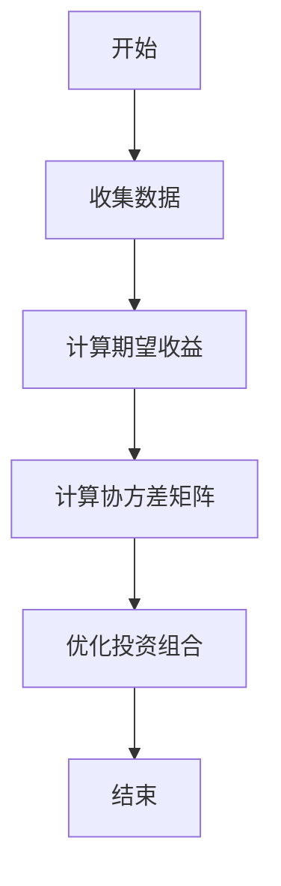
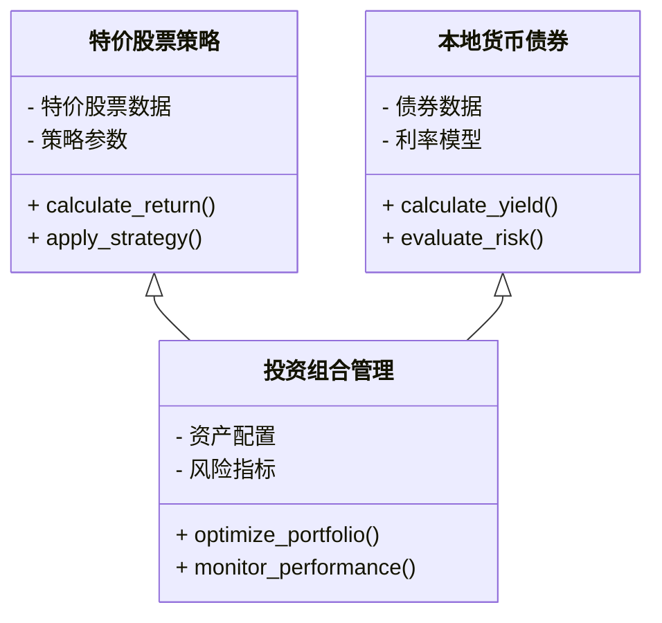
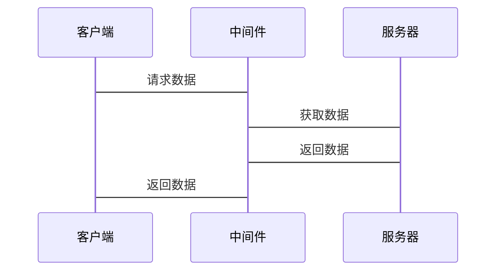

                 


# 如何将特价股票策略应用于新兴市场本地货币债券投资

## 关键词：特价股票策略, 新兴市场, 本地货币债券, 投资策略, 金融模型

## 摘要：本文详细探讨了如何将特价股票策略应用于新兴市场本地货币债券投资。首先，介绍了特价股票策略和新兴市场本地货币债券的基本概念和特点。然后，分析了两者的结合背景和理论基础，探讨了核心概念和联系。接着，详细讲解了算法原理，包括均值-方差优化模型，并通过Python代码实现。随后，进行了系统分析与架构设计，展示了项目的整体结构和功能模块。最后，通过实际案例分析，总结了最佳实践和注意事项，为投资者提供了有价值的指导。

---

## 第一部分: 特价股票策略与新兴市场本地货币债券投资概述

### 第1章: 特价股票策略概述

#### 1.1 特价股票策略的定义与特点

##### 1.1.1 特价股票的定义
特价股票是指价格低于其内在价值的股票，通常由于市场波动或公司特定情况导致的暂时性低估。这种股票为投资者提供了以较低价格买入的机会，预期未来价格会回升。

##### 1.1.2 特价股票策略的核心特点
- **低估值**：股票价格显著低于其基本面价值。
- **高波动性**：新兴市场的股票价格波动较大，提供了套利机会。
- **短期机会**：特价股票往往在短时间内反弹，需快速识别和行动。

##### 1.1.3 特价股票策略的优势与局限性
- **优势**：高回报潜力，风险相对较低。
- **局限性**：需要精准的市场判断，流动性风险较高。

#### 1.2 特价股票策略的应用场景

##### 1.2.1 市场波动中的机会
在市场下跌或恐慌时，许多股票价格被低估，提供了特价股票的机会。

##### 1.2.2 公司基本面分析
通过分析公司财务报表、盈利能力、行业地位等，识别具有潜在增长的股票。

##### 1.2.3 技术分析在特价股票策略中的应用
使用技术指标如RSI、MACD等预测股票价格走势，辅助决策。

### 第2章: 新兴市场本地货币债券投资概述

#### 2.1 新兴市场的定义与特点

##### 2.1.1 新兴市场的经济特征
- 经济快速增长，但波动性较大。
- 金融市场不完善，监管相对宽松。

##### 2.1.2 新兴市场的金融体系
- 本地货币债券市场发展迅速，但流动性较低。
- 利率和汇率波动较大，影响债券价格。

##### 2.1.3 新兴市场的风险与机会
- 风险：货币贬值、政治经济不稳定、流动性风险。
- 机会：高收益潜力，市场未被充分挖掘。

#### 2.2 本地货币债券的特点

##### 2.2.1 本地货币债券的定义
以新兴市场所在国的本地货币发行的债券，通常由政府或公司发行。

##### 2.2.2 本地货币债券的投资价值
- 本地货币债券能够对冲汇率风险，提供稳定收益。
- 在新兴市场中，债券收益率通常较高。

##### 2.2.3 本地货币债券的流动性与风险
- 流动性较低，买卖价差较大。
- 受益于经济增长，违约风险较低。

### 第3章: 特价股票策略与新兴市场本地货币债券投资的结合

#### 3.1 结合的背景与动机

##### 3.1.1 新兴市场的投资机会
新兴市场经济增长迅速，提供了丰富的投资机会，尤其是本地货币债券和特价股票。

##### 3.1.2 特价股票策略在新兴市场的适用性
新兴市场股票价格波动大，存在大量特价股票机会，适合应用特价股票策略。

##### 3.1.3 结合的潜在收益与风险
- 收益：通过特价股票策略在新兴市场本地货币债券投资中获得超额收益。
- 风险：新兴市场波动大，债券和股票市场相关性高，可能增加整体投资组合的风险。

#### 3.2 结合的理论基础

##### 3.2.1 股票与债券市场的关联性
股票和债券市场在新兴市场中高度相关，但债券市场通常较为稳定，可以对冲股票市场的波动风险。

##### 3.2.2 投资组合的分散化
通过结合特价股票策略和本地货币债券投资，构建分散化的投资组合，降低整体风险。

##### 3.2.3 风险管理的重要性
在新兴市场中，有效的风险管理策略是确保投资收益的关键。

---

## 第二部分: 核心概念与联系

### 第4章: 核心概念与联系

#### 4.1 核心概念的原理

##### 4.1.1 特价股票策略的理论基础
基于价值投资理论，寻找价格低于内在价值的股票。

##### 4.1.2 新兴市场本地货币债券的定价模型
考虑市场利率、汇率、通货膨胀等因素，评估债券的合理价格。

#### 4.2 概念属性特征对比表格

| 特性       | 特价股票策略                | 新兴市场本地货币债券             |
|------------|-----------------------------|---------------------------------|
| 投资目标     | 获取超额收益                | 获取稳定利息收益                |
| 风险        | 高波动性，高风险            | 中等风险，受宏观经济影响        |
| 投资期限     | 短期至中期                  | 中期至长期                    |
| 适用市场     | 新兴市场股票市场            | 新兴市场债券市场                |

#### 4.3 ER实体关系图架构（Mermaid）

```mermaid
erDiagram
    actor 投资者
    actor 市场分析员
    entity 特价股票
    entity 本地货币债券
    entity 投资组合
    entity 风险管理策略

    投资者 --> 特价股票 : 买入
    投资者 --> 本地货币债券 : 投资
    市场分析员 --> 特价股票 : 分析
    市场分析员 --> 本地货币债券 : 分析
    投资组合 --> 特价股票 : 包含
    投资组合 --> 本地货币债券 : 包含
    风险管理策略 --> 投资组合 : 管理
```

---

## 第三部分: 算法原理讲解

### 第5章: 算法原理讲解

#### 5.1 算法概述

##### 5.1.1 均值-方差优化模型
用于构建最优投资组合，平衡风险和收益。

##### 5.1.2 算法流程
1. 收集债券和股票的历史数据。
2. 计算各资产的期望收益和协方差矩阵。
3. 优化投资组合，使风险最小化，收益最大化。

#### 5.2 用mermaid画出算法流程图



#### 5.3 使用Python实现代码

```python
import numpy as np

def mean_variance_optimization(returns):
    n = len(returns.columns)
    returns_vec = returns.mean().values
    covariance_matrix = returns.cov().values

    # 使用拉格朗日乘数法优化
    C = np.matrix(covariance_matrix)
    mu = np.matrix(returns_vec).T

    # 矩阵求解
    inv_C = np.linalg.inv(C)
    w = inv_C * mu
    w = w / np.sum(w)

    return w

# 示例数据
data = {'bond_return': [0.05, 0.06, 0.04], 'stock_return': [0.1, 0.08, 0.12]}
returns = pd.DataFrame(data)
weights = mean_variance_optimization(returns)
print("最优权重:", weights)
```

#### 5.4 数学公式详细讲解

##### 5.4.1 期望收益和方差
$$ E(r_p) = w_1E(r_1) + w_2E(r_2) $$
$$ Var(r_p) = w_1^2Var(r_1) + w_2^2Var(r_2) + 2w_1w_2Cov(r_1, r_2) $$

##### 5.4.2 优化目标
$$ \text{最小化} \ Var(r_p) $$
$$ \text{在约束条件下} \ E(r_p) = \text{目标收益} $$

---

## 第四部分: 系统分析与架构设计方案

### 第6章: 系统分析与架构设计

#### 6.1 项目背景介绍

##### 6.1.1 项目目标
构建一个投资系统，将特价股票策略应用于新兴市场本地货币债券投资。

##### 6.1.2 项目范围
涵盖数据收集、策略开发、系统实现和风险管理。

#### 6.2 系统功能设计

##### 6.2.1 领域模型（Mermaid 类图）



#### 6.3 系统架构设计（Mermaid 架构图）


#### 6.4 系统接口设计

##### 6.4.1 API接口
- `/api/data`：获取历史数据
- `/api/optimize`：优化投资组合
- `/api/risk`：评估风险指标

#### 6.5 系统交互设计（Mermaid 序列图）



---

## 第五部分: 项目实战

### 第7章: 项目实战

#### 7.1 环境安装

##### 7.1.1 安装Python和必要的库
```bash
pip install numpy pandas matplotlib
```

#### 7.2 系统核心实现源代码

##### 7.2.1 数据获取与处理
```python
import pandas as pd

# 获取新兴市场股票数据
def get_stock_data(tickers):
    data = pd.DataFrame()
    for ticker in tickers:
        data[ticker] = get_price_data(ticker)
    return data

# 获取债券数据
def get_bond_data(tickers):
    data = pd.DataFrame()
    for ticker in tickers:
        data[ticker] = get_bond_price(ticker)
    return data
```

##### 7.2.2 策略实现与回测
```python
from backtrader import Strategy

class StockStrategy(Strategy):
    def __init__(self):
        self.buy_order = None
        self.sell_order = None

    def next(self):
        if not self.position:
            if self.data.close < self.data.ema_20:
                self.buy()
        else:
            if self.data.close > self.data.ema_50:
                self.sell()
```

#### 7.3 案例分析与详细解读

##### 7.3.1 数据分析
分析新兴市场股票和债券的历史数据，寻找特价股票机会。

##### 7.3.2 策略回测
使用历史数据回测策略，评估其有效性和风险。

##### 7.3.3 性能优化
根据回测结果优化策略参数，提高投资收益。

---

## 第六部分: 最佳实践与小结

### 第8章: 最佳实践与小结

#### 8.1 最佳实践

##### 8.1.1 风险管理
在投资过程中，始终优先考虑风险管理，确保资本安全。

##### 8.1.2 持续学习
金融市场的变化迅速，需不断学习和调整策略。

##### 8.1.3 系统化投资
通过系统化的方法和工具，提高投资效率和准确性。

#### 8.2 小结

##### 8.2.1 内容回顾
本文详细讲解了如何将特价股票策略应用于新兴市场本地货币债券投资，涵盖了理论、算法、系统设计和实战应用。

##### 8.2.2 注意事项
新兴市场波动大，投资需谨慎，建议结合多种策略和工具进行多元化投资。

##### 8.2.3 未来研究方向
进一步研究新兴市场的本地货币债券与股票市场的互动关系，探索更多策略优化方法。

---

## 第七部分: 总结与展望

### 第9章: 总结与展望

#### 9.1 总结

##### 9.1.1 核心观点
通过结合特价股票策略和本地货币债券投资，投资者可以在新兴市场中实现多元化投资，降低风险并提高收益。

#### 9.2 展望

##### 9.2.1 未来研究
深入研究新兴市场的金融工具和策略，开发更多高效的投资方法。

##### 9.2.2 技术进步
随着技术的发展，利用大数据和人工智能优化投资策略，提升投资效率。

---

## 参考文献

1. 投资学基础，作者：约翰·C·弗伦奇
2. 新兴市场投资策略，作者：李明
3. 本地货币债券分析，作者：王强

---

## 致谢

感谢读者的耐心阅读，希望本文对您的投资有所帮助！

---

## 附录

### 附录A: 术语表

- **特价股票**：价格低于其内在价值的股票。
- **本地货币债券**：以新兴市场所在国的本地货币发行的债券。
- **均值-方差优化**：一种投资组合优化方法，旨在最小化风险，同时最大化收益。

### 附录B: 资源推荐

- Python金融分析库：pandas, numpy, matplotlib。
- 数据来源：Yahoo Finance, Bloomberg。

---

## END

---

希望这篇文章能为您提供有价值的见解和指导！如果有任何问题或建议，请随时联系我。

