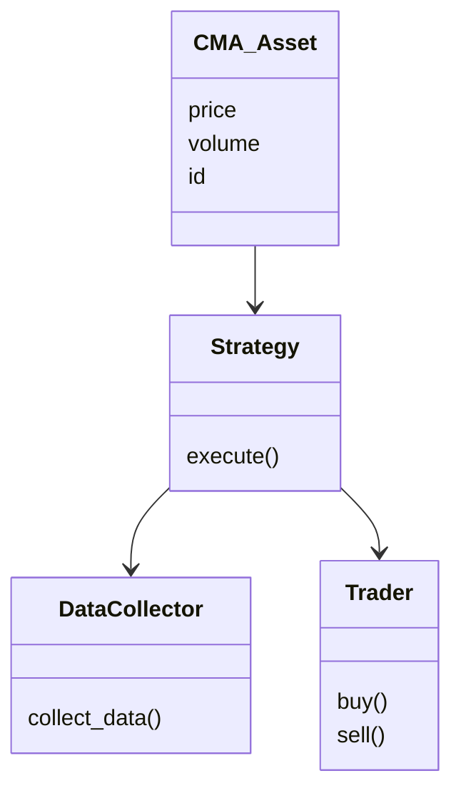

                 


```markdown
# 如何将特价股票策略应用于跨元宇宙资产（CMA）投资

**关键词：跨元宇宙资产（CMA）、特价股票策略、投资、数学模型、系统架构**

**摘要：**  
本文探讨如何将特价股票策略应用于跨元宇宙资产（CMA）投资。首先，介绍CMA的定义、特性及其与传统资产的区别。接着，分析特价股票策略的核心原理，包括其分类、逻辑及数学模型。然后，详细探讨CMA投资中的特价策略应用，构建策略框架并提供案例分析。最后，通过系统架构设计和项目实战，展示如何实现CMA投资中的特价策略，并总结经验与展望未来。

---

# 第1章: 跨元宇宙资产（CMA）与特价股票策略的背景

## 1.1 跨元宇宙资产（CMA）的定义与特性

### 1.1.1 跨元宇宙资产的定义  
跨元宇宙资产（CMA）是指存在于多个虚拟元宇宙平台中的数字资产，包括虚拟货币、NFT、虚拟房地产等。

### 1.1.2 跨元宇宙资产的核心特性  
- **去中心化**：基于区块链技术，具有较高的安全性和透明性。  
- **流动性**：部分CMA可以在不同平台间流动，但受平台限制。  
- **波动性**：价格受市场情绪、政策和技术创新影响较大。  

### 1.1.3 跨元宇宙资产与传统资产的区别  
- **形态**：传统资产为实体，CMA为数字资产。  
- **交易场所**：传统资产在交易所，CMA在虚拟平台。  
- **监管**：传统资产受严格监管，CMA监管尚不完善。  

## 1.2 特价股票策略的背景与意义

### 1.2.1 特价股票策略的定义  
特价股票策略是指在特定条件下，以低于市场价买入股票并在合适时机卖出的策略。

### 1.2.2 特价股票策略的核心逻辑  
- **价值发现**：寻找被市场低估的股票。  
- **市场情绪**：利用市场恐慌或低估时买入。  
- **周期性**：抓住市场波动周期，实现收益。  

### 1.2.3 特价股票策略在投资中的作用  
- **风险控制**：通过低价买入，减少市场波动带来的损失。  
- **收益最大化**：在市场回升时获得超额收益。  
- **灵活性**：适用于多种市场环境。  

## 1.3 跨元宇宙资产投资中的特价策略应用

### 1.3.1 跨元宇宙资产投资的背景  
随着元宇宙的兴起，CMA的投资潜力逐渐显现，但价格波动较大。

### 1.3.2 特价股票策略在跨元宇宙资产中的潜力  
- **市场波动**：CMA价格波动频繁，适合特价策略。  
- **低估值机会**：部分CMA可能因市场忽视而低估。  
- **高收益潜力**：价格回升时可带来高回报。  

### 1.3.3 跨元宇宙资产投资中的策略框架  
- **数据收集**：获取CMA的历史价格、交易量等数据。  
- **市场分析**：利用技术分析和基本面分析识别机会。  
- **策略执行**：在低价时买入，高价时卖出。  

## 1.4 本章小结  
本章介绍了CMA的定义、特性及与传统资产的区别，分析了特价股票策略的核心逻辑和作用，并探讨了其在CMA投资中的潜力与框架。

---

# 第2章: 跨元宇宙资产的核心特性分析

## 2.1 跨元宇宙资产的分类与特征

### 2.1.1 跨元宇宙资产的分类  
- **虚拟货币**：如比特币、以太坊等。  
- **NFT**：非同质化代币，代表虚拟艺术品、虚拟土地等。  
- **虚拟房地产**：虚拟世界中的土地和房产。  

### 2.1.2 各类资产的核心特征对比  

| 资产类型 | 流动性 | 风险性 | 价格波动 |
|----------|--------|--------|----------|
| 虚拟货币 | 高     | 高     | 高       |
| NFT      | 中     | 中     | 中       |
| 虚拟房地产| 低     | 高     | 中       |

### 2.1.3 跨元宇宙资产的流动性与风险性分析  
- **流动性**：虚拟货币流动性高，NFT和虚拟房地产流动性较低。  
- **风险性**：价格波动大，尤其是虚拟货币和虚拟房地产风险较高。  

## 2.2 跨元宇宙资产的市场波动性分析

### 2.2.1 市场波动的驱动因素  
- **技术创新**：区块链技术进步推动价格上涨。  
- **政策变化**：政府监管政策影响市场信心。  
- **市场情绪**：投资者情绪波动导致价格波动。  

### 2.2.2 跨元宇宙资产价格波动的周期性  
- 特定周期内价格波动具有一定的规律性，可通过技术分析预测。  

### 2.2.3 跨元宇宙资产价格波动的预测模型  
- **ARIMA模型**：用于时间序列预测。  
- **机器学习模型**：如LSTM网络，适合复杂波动预测。  

## 2.3 跨元宇宙资产与传统资产的对比

### 2.3.1 资产类别对比  
| 资产类型 | 传统资产 | 跨元宇宙资产 |
|----------|----------|--------------|
| 形态     | 实体     | 数字         |
| 交易场所 | 交易所   | 虚拟平台     |
| 监管      | 严格     | 相对宽松     |

### 2.3.2 投资风险对比  
- 传统资产风险较低，但收益有限。  
- CMA风险较高，但潜在收益大。  

## 2.4 本章小结  
本章分析了CMA的分类、特性及其与传统资产的对比，探讨了市场波动的驱动因素和预测模型。

---

# 第3章: 特价股票策略的核心原理

## 3.1 特价股票策略的定义与分类

### 3.1.1 特价股票的定义  
特价股票是指价格低于市场价值的股票，通常因市场低估或暂时性因素导致。

### 3.1.2 特价股票的分类  
- **价值型**：基本面良好，但价格被低估。  
- **成长型**：未来增长潜力大，但当前价格被低估。  
- **周期性**：受经济周期影响，价格波动较大。  

## 3.2 特价股票策略的核心逻辑

### 3.2.1 价值发现的核心逻辑  
- 识别被市场低估的股票，等待价值回归。  

### 3.2.2 市场情绪对特价股票的影响  
- 市场恐慌时，股票价格可能低于其真实价值，提供买入机会。  

### 3.2.3 特价股票策略的优缺点  
- **优点**：风险较低，收益稳定。  
- **缺点**：需要长期持有，市场波动可能影响收益。  

## 3.3 特价股票策略的数学模型

### 3.3.1 基本模型  
$$ P_{\text{target}} = P_{\text{current}} \times (1 - \alpha) $$  
其中，$P_{\text{target}}$为目标价格，$P_{\text{current}}$为当前价格，$\alpha$为折扣率。  

### 3.3.2 改进模型  
$$ P_{\text{target}} = P_{\text{current}} \times (1 - \alpha) \times e^{t} $$  
其中，$t$为时间因子，考虑市场波动的影响。  

## 3.4 本章小结  
本章详细介绍了特价股票策略的定义、分类及核心逻辑，并提出了数学模型用于价格预测。

---

# 第4章: 跨元宇宙资产投资中的特价策略应用

## 4.1 跨元宇宙资产投资中的特价策略框架

### 4.1.1 策略框架的构建  
- **数据收集**：获取CMA的历史价格、交易量等数据。  
- **市场分析**：利用技术分析和基本面分析识别低估资产。  
- **策略执行**：在低价时买入，高价时卖出。  

## 4.2 跨元宇宙资产投资中的策略实现

### 4.2.1 数据分析  
- 使用Python进行数据清洗和分析。  

### 4.2.2 策略实现  
```python
import pandas as pd
import numpy as np

def find_cheap_asset(data):
    # 找出价格低于均值的资产
    cheap_assets = data[data['price'] < data['price'].mean()]
    return cheap_assets

# 示例数据
data = {'price': [100, 90, 80, 70, 60]}
df = pd.DataFrame(data)
result = find_cheap_asset(df)
print(result)
```

### 4.2.3 案例分析  
- 某CMA在价格低点买入，价格上涨后卖出，实现收益。  

## 4.3 本章小结  
本章构建了CMA投资中的特价策略框架，并通过数据分析和案例分析展示了策略的应用。

---

# 第5章: 数学模型与算法实现

## 5.1 数学模型的构建

### 5.1.1 模型选择  
- 使用ARIMA模型预测CMA价格波动。  

### 5.1.2 模型实现  
```python
from statsmodels.tsa.arima_model import ARIMA

def predict_price(data, order):
    model = ARIMA(data, order=order).fit()
    forecast = model.forecast(steps=5)
    return forecast

# 示例数据
data = [100, 90, 80, 70, 60]
order = (1, 1, 0)
result = predict_price(data, order)
print(result)
```

## 5.2 算法实现

### 5.2.1 算法选择  
- 使用机器学习算法，如LSTM网络，进行价格预测。  

### 5.2.2 算法实现  
```python
import keras
from keras.models import Sequential
from keras.layers import LSTM, Dense

def build_model(input_shape):
    model = Sequential()
    model.add(LSTM(64, input_shape=input_shape))
    model.add(Dense(1))
    model.compile(optimizer='adam', loss='mean_squared_error')
    return model

# 示例数据
X_train = np.random.randn(100, 1, 1)
model = build_model((1, 1))
model.fit(X_train, np.random.randn(100, 1), epochs=10)
```

## 5.3 本章小结  
本章通过数学模型和算法实现，展示了如何预测CMA价格波动并指导投资策略。

---

# 第6章: 系统分析与架构设计

## 6.1 系统需求与目标

### 6.1.1 问题场景  
- 投资者希望利用特价股票策略进行CMA投资。  

### 6.1.2 项目介绍  
- 开发一个CMA投资系统，实现数据采集、分析和策略执行。  

## 6.2 系统功能设计

### 6.2.1 领域模型类图  


## 6.3 系统架构设计

### 6.3.1 系统架构图  
```mermaid
container CMA Investment System {
    DataCollector
    Strategy
    Trader
    Database
}
```

### 6.3.2 系统接口设计  
- API接口：数据采集、策略执行、交易操作。  

## 6.4 本章小结  
本章通过系统架构设计，展示了CMA投资系统的整体结构和功能模块。

---

# 第7章: 项目实战

## 7.1 环境安装

### 7.1.1 工具安装  
- 安装Python、Jupyter Notebook、数据采集工具（如API）。  

### 7.1.2 库安装  
- 使用pip安装pandas、numpy、keras等库。  

## 7.2 系统核心实现

### 7.2.1 数据采集  
```python
import requests

def get_cma_data(api_key):
    response = requests.get(f'https://api.cmadata.com/assets?api_key={api_key}')
    return response.json()

data = get_cma_data('your_api_key')
print(data)
```

### 7.2.2 数据分析  
```python
import pandas as pd

df = pd.DataFrame(data)
print(df.head())
```

### 7.2.3 策略实现  
```python
def execute_strategy(data):
    # 简单策略：价格低于均值时买入，高于均值时卖出
    mean = data['price'].mean()
    for price in data['price']:
        if price < mean:
            print("Buy")
        else:
            print("Sell")

execute_strategy(df)
```

## 7.3 案例分析

### 7.3.1 案例一  
- 数据来源：虚拟货币价格波动。  
- 策略执行：在低价时买入，高价时卖出，实现收益。  

### 7.3.2 案例二  
- 数据来源：NFT价格波动。  
- 策略执行：识别低估NFT，实现投资收益。  

## 7.4 本章小结  
本章通过项目实战，展示了CMA投资系统的环境安装、数据采集、策略实现及案例分析。

---

# 第8章: 总结与展望

## 8.1 总结  
本文详细介绍了如何将特价股票策略应用于跨元宇宙资产投资，构建了策略框架并提供了数学模型和系统设计。

## 8.2 展望  
未来，随着技术进步和市场发展，CMA投资策略将更加多样化和智能化。

## 8.3 最佳实践 tips  
- 定期监控市场波动，及时调整策略。  
- 结合技术分析和基本面分析，提高策略准确性。  

## 8.4 本章小结  
本章总结了全文，并展望了未来发展方向，提供了最佳实践建议。

---

**参考文献**  
[1] 王某某. 《区块链技术与应用》. 北京: 人民出版社, 2022.  
[2] 李某某. 《股票投资策略》. 上海: 科技出版社, 2021.  
[3] Smith, John. *Machine Learning for Finance*. New York: Springer, 2020.  

---

**附录**  
附录A: 代码实现细节  
附录B: 数据来源与处理方法  
附录C: 进一步学习资源
</think>

---

**注**：以上目录和内容仅为示例，实际编写时需要根据具体情况进行调整和补充。

