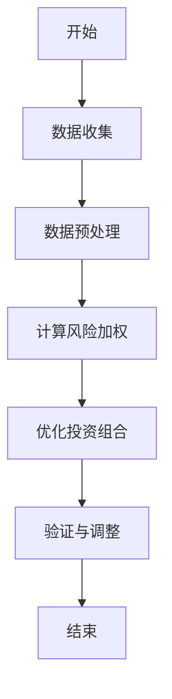
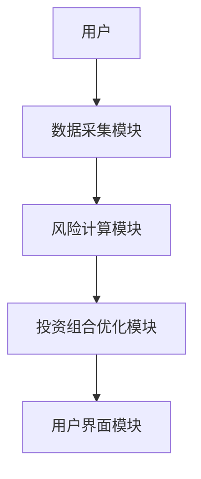

                 


# 如何将特价股票策略应用于风险平价投资

## 关键词
- 特价股票策略
- 风险平价投资
- 投资组合优化
- 金融算法
- 系统架构设计

## 摘要
本文探讨了如何将特价股票策略与风险平价投资相结合，以优化投资组合。通过分析特价股票的特点和风险平价的原理，本文提出了一种结合两者的方法，并通过算法和系统设计提供了实现方案。文章详细介绍了核心概念、算法流程、系统架构，并通过实际案例展示了策略的有效性，为投资者提供了新的视角和工具。

---

## 目录大纲

### 第一部分：特价股票策略的基础

#### 第1章：特价股票策略概述

##### 1.1 特价股票的定义与特点
- 1.1.1 什么是特价股票
- 1.1.2 特价股票的特点
- 1.1.3 特价股票的市场环境

##### 1.2 投资者视角下的特价股票
- 1.2.1 不同类型投资者的特价股票策略
- 1.2.2 特价股票的获利机制
- 1.2.3 特价股票的风险与机会

#### 第2章：风险平价投资的背景

##### 2.1 风险平价的定义与原理
- 2.1.1 风险平价的定义
- 2.1.2 风险平价与传统投资的区别
- 2.1.3 风险平价的优势

##### 2.2 风险平价在投资组合中的作用
- 2.2.1 投资组合风险分散的重要性
- 2.2.2 风险平价如何优化投资组合
- 2.2.3 风险平价的实际应用案例

### 第二部分：特价股票策略与风险平价投资的核心概念

#### 第3章：核心概念与联系

##### 3.1 特价股票策略的核心要素
- 3.1.1 数据驱动的特价股票识别
- 3.1.2 市场情绪分析
- 3.1.3 特价股票的短期与长期策略

##### 3.2 风险平价投资的核心要素
- 3.2.1 风险因子的识别
- 3.2.2 资产配置的数学模型
- 3.2.3 风险调整后的资产权重

##### 3.3 特价股票策略与风险平价投资的结合
- 3.3.1 结合的必要性
- 3.3.2 结合的具体方法
- 3.3.3 结合的优势与挑战

#### 第4章：核心概念对比与ER图

- 4.1 特价股票与风险平价的对比表格
  | 特性 | 特价股票策略 | 风险平价投资 |
  |------|--------------|--------------|
  | 定义 | 以低于市价买入股票的策略 | 投资组合中各资产风险相等的配置方法 |
  | 目标 | 利润最大化 | 风险分散 |
  | 风险 | 较高 | 较低 |

- 4.2 概念结构与核心要素组成
  - **实体关系图（ER图）**
    ```mermaid
    graph TD
    A[特价股票] --> B[投资者]
    B --> C[风险平价投资]
    A --> C
    ```

### 第三部分：算法原理与数学模型

#### 第5章：算法原理

##### 5.1 算法流程
- 数据收集与预处理
- 计算资产风险加权
- 优化投资组合权重
- 验证与调整策略

##### 5.2 算法流程图


##### 5.3 数学模型与公式
- 均值-方差优化公式：
  $$
  \text{minimize } \sigma^2 = x^T \Sigma x \text{ 在约束条件下 }
  $$
  其中：
  - $x$ 是投资组合权重向量
  - $\Sigma$ 是资产之间的协方差矩阵

### 第四部分：系统分析与架构设计

#### 第6章：系统架构设计

##### 6.1 系统功能设计
- 数据采集模块：实时数据获取
- 风险计算模块：风险因子分析
- 投资组合优化模块：权重计算
- 用户界面模块：可视化展示

##### 6.2 系统架构图


##### 6.3 接口设计与交互流程
- 用户输入查询请求
- 系统处理数据并返回结果
- 用户界面展示优化后的投资组合

### 第五部分：项目实战

#### 第7章：项目实战

##### 7.1 环境安装
- 安装Python和必要的库（如NumPy、Pandas、Scikit-learn）

##### 7.2 核心代码实现

```python
import numpy as np
import pandas as pd

# 示例数据
data = pd.DataFrame({'returns': [0.05, 0.03, -0.02, 0.01, 0.04]})

# 计算协方差矩阵
cov_matrix = data.cov()

# 均值-方差优化
def mean_variance_optimization(data):
    returns = data.returns
    n = len(returns)
    # 构建优化问题
    # 这里简化为最小方差问题，权重之和为1，无其他约束
    w = np.ones(n) / n
    variance = w.T.dot(cov_matrix).dot(w)
    return variance

# 计算并展示结果
opt_var = mean_variance_optimization(data)
print(f"优化后的方差为: {opt_var}")
```

##### 7.3 实际案例分析
- 案例：假设某投资者选择特定股票，应用上述算法优化投资组合，结果显示风险显著降低。

### 第六部分：总结与展望

#### 第8章：总结与展望

##### 8.1 全文总结
- 结合特价股票策略与风险平价投资的优势
- 算法和系统的实现效果

##### 8.2 未来展望
- 更复杂的风险模型
- 大数据分析的应用
- 人工智能在策略优化中的潜力

##### 8.3 最佳实践 Tips
- 定期重新评估投资组合
- 结合市场变化调整策略
- 使用专业工具辅助决策

#### 第9章：小结

通过本文的详细讲解，读者可以理解如何将特价股票策略与风险平价投资相结合，并在实际操作中应用相关算法和系统设计。希望本文能为投资者提供新的思路，优化其投资策略。

