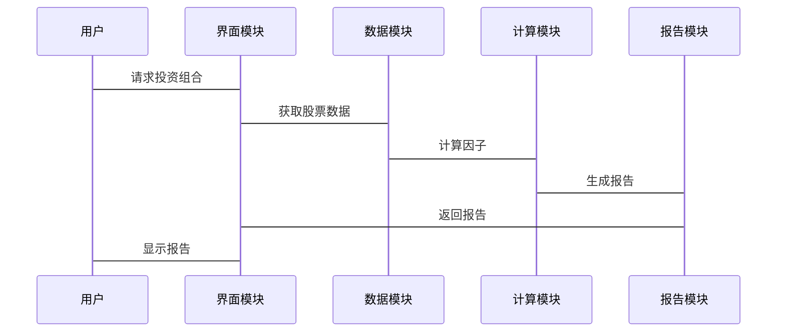

                 


# 如何将特价股票策略融入ESG智能beta投资

> 关键词：特价股票策略，ESG投资，智能beta投资，组合优化，风险管理

> 摘要：本文详细探讨了如何将特价股票策略与ESG智能beta投资相结合，构建一个高效的投资策略。通过分析两者的结合背景、核心概念、算法原理、系统架构及项目实战，本文为投资者提供了理论支持和实践指导。同时，结合实际案例，本文还总结了最佳实践和注意事项，帮助投资者在复杂多变的市场中优化投资组合，实现可持续收益。

---

## 第1章: 特价股票策略与ESG投资概述

### 1.1 特价股票策略的背景与定义

#### 1.1.1 特价股票策略的定义
特价股票策略是一种基于价值投资的选股方法，旨在通过识别市场价格低于其内在价值的股票来实现超额收益。这种策略的核心在于发现市场定价错误的股票，通常关注市盈率（P/E）、市净率（P/B）等估值指标。

#### 1.1.2 特价股票策略的核心思想
- 市场价格与内在价值的差异是投资机会的来源。
- 通过基本面分析识别低估股票。
- 长期持有，等待市场重新定价。

#### 1.1.3 特价股票策略与传统投资策略的区别
| 特性 | 特价股票策略 | 传统投资策略 |
|------|--------------|---------------|
| 目标 | 追求超额收益 | 追求市场平均收益 |
| 方法 | 估值驱动 | 市场趋势驱动 |
| 持股 | 长期持有 | 短期交易 |

### 1.2 ESG投资的背景与意义

#### 1.2.1 ESG投资的定义
ESG投资是一种将环境、社会和治理因素纳入投资决策的投资策略。通过筛选符合这些标准的企业，投资者希望实现可持续收益，同时降低投资风险。

#### 1.2.2 ESG投资的核心要素
- **环境（E）**：关注企业的碳排放、资源利用效率等。
- **社会（S）**：关注企业对员工、社区和社会的贡献。
- **治理（G）**：关注企业的公司治理结构和高管行为。

#### 1.2.3 ESG投资与传统投资的区别
| 特性 | ESG投资 | 传统投资 |
|------|----------|------------|
| 关注点 | 可持续性与责任 | 财务回报 |
| 风险管理 | 长期风险降低 | 短期波动 |

### 1.3 特价股票策略与ESG投资的结合

#### 1.3.1 两者的结合背景
随着环保意识的增强和企业社会责任的提升，投资者越来越关注企业的可持续发展能力。将特价股票策略与ESG投资结合，可以在寻找低估股票的同时，筛选出具有可持续发展潜力的企业。

#### 1.3.2 结合的意义与优势
- **双重筛选**：不仅关注估值，还关注企业的可持续发展能力。
- **风险控制**：通过ESG因子降低投资组合的长期风险。
- **超额收益潜力**：结合价值发现和可持续发展，可能带来更高的超额收益。

#### 1.3.3 结合的可行性与挑战
- **数据获取**：需要获取详细的ESG评分和基本面数据。
- **模型构建**：需要平衡估值和ESG因子的权重。
- **市场流动性**：部分ESG表现优异的股票可能流动性较低。

---

## 第2章: 特价股票策略的核心概念与数学模型

### 2.1 特价股票策略的核心概念

#### 2.1.1 价值评估模型
价值评估模型的核心在于识别市场价格低于内在价值的股票。常用的模型包括：
- **Gordon Growth Model**：用于估算股票的内在价值。
- **DCF模型**：通过现金流折现估算企业价值。

#### 2.1.2 股票筛选标准
- **市盈率（P/E）**：低于行业平均水平。
- **市净率（P/B）**：低于行业平均水平。
- **股息率**：高于行业平均水平。

### 2.2 ESG智能beta投资的核心概念

#### 2.2.1 ESG因子的数学模型
ESG因子通常通过加权评分来衡量企业的ESG表现。常用的评分模型包括：
- **加权评分法**：将环境、社会和治理三个维度分别打分并加权。
- **因子得分法**：将ESG因子转化为量化指标。

#### 2.2.2 智能beta投资的数学模型
智能beta投资通过优化投资组合的beta系数，实现超额收益。常用的优化模型包括：
- **均值-方差优化**：最小化投资组合的波动性。
- **风险调整收益优化**：在控制风险的前提下，最大化收益。

### 2.3 两者的结合模型

#### 2.3.1 组合优化模型
将ESG因子纳入组合优化模型中，构建一个同时考虑估值和ESG表现的投资组合。数学表达如下：
$$
\min \sigma^2 \quad \text{subject to} \quad \sum w_i = 1, \quad \sum w_i \cdot ESG_i \geq \text{阈值}
$$

#### 2.3.2 因子权重的确定方法
通过历史数据回归，确定ESG因子和其他估值因子的最优权重。常用方法包括：
- **回归分析**：确定各因子对收益的贡献度。
- **主成分分析**：降低因子维度，提取核心因子。

---

## 第3章: 特价股票策略与ESG智能beta投资的核心算法

### 3.1 特价股票策略的核心算法

#### 3.1.1 价值评估算法
1. 计算股票的内在价值。
2. 比较市场价格与内在价值，筛选低估股票。

#### 3.1.2 股票筛选算法
1. 计算市盈率、市净率等估值指标。
2. 筛选低于行业平均水平的股票。

### 3.2 ESG智能beta投资的核心算法

#### 3.2.1 ESG因子计算算法
1. 收集企业的ESG评分。
2. 对各维度评分进行加权，得到综合ESG评分。

#### 3.2.2 智能beta组合构建算法
1. 确定优化目标（如最小化波动率）。
2. 使用优化算法构建投资组合。

### 3.3 两者的结合算法

#### 3.3.1 综合因子计算算法
1. 计算股票的估值因子和ESG因子。
2. 结合两者，得到综合评分。

#### 3.3.2 组合优化算法
1. 确定优化目标（如最大化收益）。
2. 使用优化算法构建投资组合。

---

## 第4章: 系统分析与架构设计

### 4.1 项目场景介绍
构建一个智能投资系统，将特价股票策略与ESG智能beta投资相结合，实现自动化投资组合管理。

### 4.2 系统功能设计

#### 4.2.1 数据采集模块
- 数据来源：股票价格、财务数据、ESG评分。
- 数据处理：清洗、转换、存储。

#### 4.2.2 因子计算模块
- 估值因子计算：市盈率、市净率。
- ESG因子计算：环境、社会、治理评分。

#### 4.2.3 模型构建模块
- 组合优化：使用优化算法构建投资组合。
- 风险管理：控制波动率和最大回撤。

### 4.3 系统架构设计

#### 4.3.1 数据层
- 数据库：存储股票数据和ESG评分。
- 数据接口：API接口供其他模块调用。

#### 4.3.2 计算层
- 计算模块：实现因子计算和组合优化。
- 模型库：存储各种优化模型。

#### 4.3.3 应用层
- 用户界面：供用户查看投资组合和操作。
- 报告生成：生成投资报告和绩效分析。

### 4.4 系统接口设计

#### 4.4.1 数据接口
- 输入：股票代码、日期。
- 输出：股票价格、财务数据、ESG评分。

#### 4.4.2 优化接口
- 输入：目标收益、风险偏好。
- 输出：投资组合配置。

### 4.5 系统交互流程图



---

## 第5章: 项目实战

### 5.1 环境安装
- 安装Python、Pandas、NumPy、Scipy等库。
- 安装优化库（如PyOpt）。

### 5.2 核心代码实现

#### 5.2.1 数据获取
```python
import pandas as pd
import numpy as np

# 获取股票数据
def get_stock_data(tickers, start_date, end_date):
    data = pd.DataFrame()
    for ticker in tickers:
        # 获取数据
        df = pd.read_csv(f'data/{ticker}.csv')
        df['Ticker'] = ticker
        data = pd.concat([data, df])
    return data
```

#### 5.2.2 因子计算
```python
def calculate_esg_score(data):
    # 简单示例，实际应使用更复杂的评分模型
    esg_scores = []
    for _, row in data.iterrows():
        e = row['环境评分']
        s = row['社会评分']
        g = row['治理评分']
        score = (e + s + g) / 3
        esg_scores.append(score)
    data['ESG评分'] = esg_scores
    return data
```

#### 5.2.3 组合优化
```python
import pyopt

def optimize_portfolio(returns, risk_free_rate):
    n = returns.shape[1]
    model = pyopt.Portfolio(returns, solver='MOSEK')
    model.set_objective('min', 'stddev')
    model.add_constraint('sum', weights=1, returns=risk_free_rate)
    solution = model.solve()
    return solution.weights
```

### 5.3 实际案例分析
- 数据来源：假设我们有10只股票的数据，包括估值因子和ESG评分。
- 案例步骤：
  1. 计算各股票的估值因子。
  2. 计算各股票的ESG评分。
  3. 构建优化模型，筛选出最优投资组合。
  4. 分析投资组合的收益与风险。

---

## 第6章: 最佳实践与总结

### 6.1 小结
本文详细探讨了如何将特价股票策略与ESG智能beta投资相结合，构建一个高效的投资策略。通过理论分析和实际案例，证明了这种结合的有效性和潜力。

### 6.2 注意事项
- 数据质量：确保数据的准确性和完整性。
- 模型选择：根据市场环境选择合适的优化模型。
- 风险管理：定期监控投资组合的风险。

### 6.3 拓展阅读
- 《投资学》：深入理解投资组合优化理论。
- 《ESG投资指南》：了解ESG投资的最新发展。

---

通过本文的分析，投资者可以在实践中灵活应用这些策略，优化投资组合，实现可持续收益。希望本文能为投资者提供有价值的参考和启发。

