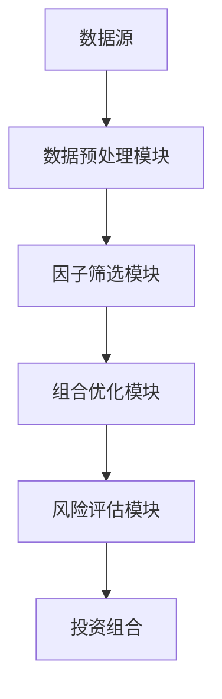
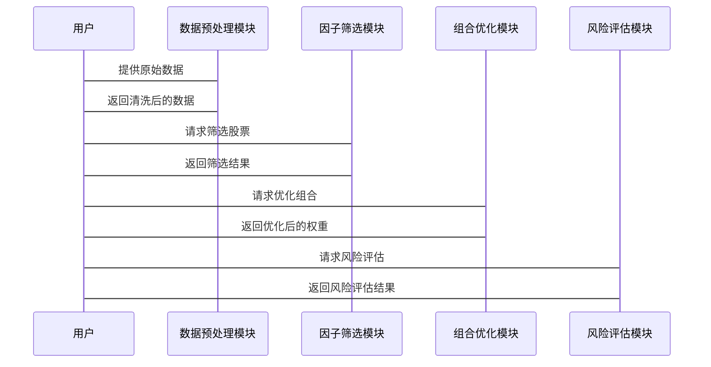

                 


# 如何将特价股票策略融入因子投资

> 关键词：特价股票策略、因子投资、投资组合优化、数学模型、系统架构设计

> 摘要：本文详细探讨了如何将特价股票策略融入因子投资的理论与实践。通过分析特价股票策略的核心原理、因子投资的基本概念以及两者结合的方法，结合数学模型、算法实现和系统架构设计，为读者提供一个全面的解决方案。文章内容涵盖背景介绍、核心概念、算法实现、系统设计和项目实战，帮助读者理解并应用这一策略。

---

## 第1章 特价股票策略概述

### 1.1 特价股票策略的基本概念

#### 1.1.1 特价股票的定义与特征

特价股票是指市场价格显著低于其内在价值的股票。其主要特征包括：

- **低估值**：通常通过市净率（P/B）和市盈率（P/E）等指标衡量，P/B < 1 或 P/E < 行业平均值。
- **股价偏离内在价值**：市场价格与内在价值存在较大差距，为投资者提供安全边际。
- **周期性行业特性**：多出现在周期性行业，如制造业和能源行业，在行业低谷时更容易出现特价股票。

#### 1.1.2 特价股票策略的核心目标

- **寻找被市场低估的股票**：通过分析财务指标和市场数据，识别出价格低于内在价值的股票。
- **长期价值投资**：基于公司基本面分析，选择具有持续增长潜力的公司，长期持有以获得超额收益。
- **风险控制**：通过多因子分析和风险调整，降低投资组合的波动性和风险。

#### 1.1.3 特价股票策略的适用场景与边界

- **市场低估阶段**：在市场低迷或行业低谷时，更容易找到被低估的股票。
- **成熟市场**：在成熟市场中，公司基本面分析更为可靠，便于识别特价股票。
- **行业选择**：主要适用于周期性行业和防御性行业，如能源、制造业和公用事业。

### 1.2 特价股票策略的关键指标

#### 1.2.1 市净率（P/B）与市盈率（P/E）的对比

- **市净率（P/B）**：股价与每股净资产的比率，适用于评估银行、制造业等重资产行业的公司。
  $$ P/B = \frac{\text{股价}}{\text{每股净资产}} $$
- **市盈率（P/E）**：股价与每股净利润的比率，适用于评估成长型企业。
  $$ P/E = \frac{\text{股价}}{\text{每股净利润}} $$

| 指标 | 适用场景 | 优势 | 局限性 |
|------|----------|------|--------|
| P/B  | 重资产行业 | 反映资产价值 | 忽略盈利能力 |
| P/E  | 成长型企业 | 反映盈利能力 | 高增长行业波动大 |

#### 1.2.2 股价与内在价值的偏离分析

- **内在价值计算**：使用DCF模型或其他估值方法计算公司内在价值。
- **偏离度分析**：通过比较市场价格与内在价值的偏离程度，判断是否为特价股票。

#### 1.2.3 特价股票筛选的多维度指标体系

- **流动性指标**：如换手率和成交量，确保股票具有足够的流动性。
- **财务健康度**：包括资产负债率、净利润率等指标，评估公司财务状况。
- **成长潜力**：如收入增长率和净利润增长率，判断公司未来发展潜力。

### 1.3 特价股票策略的优缺点分析

| 优点 | 缺点 |
|------|------|
| 高收益潜力 | 市场波动风险大 |
| 低估值安全边际 | 选股难度高 |
| 长期投资理念 | 短期收益不稳定 |

---

## 第2章 因子投资的基本原理

### 2.1 因子投资的定义与特点

#### 2.1.1 因子投资的核心概念

因子投资是基于统计学和金融学理论，通过筛选具有特定特征的股票组合，以获得超额收益的投资方法。其核心在于识别能够解释股票超额收益的因子。

#### 2.1.2 因子投资与传统投资方法的区别

| 因子投资 | 传统投资 |
|----------|----------|
| 基于因子筛选 | 基于个股分析 |
| 系统化、量化 | 主观判断为主 |
| 适合大规模投资 | 适合个体投资者 |

#### 2.1.3 因子投资的优势与局限性

- **优势**：
  - 系统化：通过量化模型筛选股票，减少人为情绪影响。
  - 可复制性：便于构建标准化投资组合。
  - 风险分散：通过多因子分散投资风险。

- **局限性**：
  - 模型风险：因子选择不当可能导致投资失败。
  - 过度拟合：基于历史数据构建的因子可能在未来失效。

### 2.2 主流因子模型的介绍

#### 2.2.1 Fama-French三因子模型

Fama-French三因子模型是因子投资的经典模型，包括市场风险、小盘股溢价和价值股溢价三个因子。

$$ R_i = R_f + \beta_i (R_m - R_f) + 0.3 \times SMB + 0.3 \times HML + \epsilon_i $$

- **市场风险（Beta）**：衡量股票相对于市场的波动性。
- **小盘股溢价（SMB）**：小盘股相对于大盘股的超额收益。
- **价值股溢价（HML）**：低P/B股票相对于高P/B股票的超额收益。

#### 2.2.2 CAPM模型

CAPM模型用于计算股票的期望收益率，公式为：

$$ R_i = R_f + \beta_i (R_m - R_f) $$

其中，$\beta_i$ 表示股票的系统性风险，$R_f$ 是无风险利率，$R_m$ 是市场期望收益率。

#### 2.2.3 其他常见因子模型的对比

- **多因子模型**：包括更多的因子，如动量因子（MOM）和质量因子（QMJ）。
- **风格因子**：如成长因子、价值因子等，用于捕捉特定投资风格的超额收益。

### 2.3 因子投资的数学模型与公式

#### 2.3.1 Fama-French三因子模型的公式推导

$$ R_i = R_f + \beta_i (R_m - R_f) + 0.3 \times SMB + 0.3 \times HML + \epsilon_i $$

其中，SMB（Small Minus Big）和HML（High Minus Low）是两个重要因子。

#### 2.3.2 因子权重的计算方法

因子权重通常基于因子的解释力和投资组合的风险调整。常用的方法包括：

- **等权分配**：每个因子赋予相同的权重。
- **基于因子载荷的加权**：根据因子对收益的贡献程度调整权重。

#### 2.3.3 因子投资组合的风险调整收益计算

通过优化算法（如均值-方差优化）构建投资组合，以最大化夏普比率（Sharpe Ratio）。

$$ \text{夏普比率} = \frac{E[R_p - R_f]}{\sigma_p} $$

其中，$E[R_p - R_f]$ 是投资组合的超额收益期望值，$\sigma_p$ 是投资组合的收益波动率。

---

## 第3章 特价股票策略与因子投资的结合

### 3.1 特价股票策略的因子化分析

#### 3.1.1 特价股票策略的因子分解

将特价股票策略分解为多个因子，如低P/B、低P/E、高股息率等。

- **低P/B因子**：筛选P/B < 1的股票。
- **低P/E因子**：筛选P/E < 行业平均值的股票。
- **高股息率因子**：筛选股息率高于行业平均水平的股票。

#### 3.1.2 特价股票因子的构建方法

- **多因子组合**：将多个因子进行加权组合，形成综合因子。
- **因子筛选与排序**：根据因子得分对股票进行排序，选择排名靠前的股票。

#### 3.1.3 特价股票因子在因子投资中的应用

在因子投资模型中，将特价股票因子与其他因子（如小盘股因子、价值因子）结合，构建多元化的投资组合。

### 3.2 特价股票策略与因子投资的结合

#### 3.2.1 特价股票策略如何融入因子投资框架

- **因子筛选**：将特价股票策略中的因子（如低P/B）作为因子投资中的筛选条件。
- **组合优化**：在因子投资框架下，优化包含特价股票因子的投资组合。

#### 3.2.2 因子投资框架下特价股票策略的优化

- **动态调整因子权重**：根据市场变化和因子表现，动态调整因子权重。
- **多因子模型中的权重分配**：在多因子模型中，合理分配特价股票因子的权重。

#### 3.2.3 特价股票策略在因子投资中的权重分配

根据因子的重要性进行权重分配，如将低P/B因子赋予更高的权重。

---

## 第4章 特价股票策略融入因子投资的算法实现

### 4.1 特价股票筛选算法

#### 4.1.1 基于P/B和P/E的双因子筛选算法

步骤：
1. 计算股票的P/B和P/E。
2. 筛选P/B < 1 且 P/E < 行业平均值的股票。
3. 根据筛选结果生成投资组合。

代码示例：

```python
import pandas as pd

# 假设df包含股票数据，包括P/B和P/E
df['P_B'] = df['股价'] / df['每股净资产']
df['P_E'] = df['股价'] / df['每股净利润']
df['行业平均P_E'] = df.groupby('行业')['P_E'].transform('mean')

# 筛选P/B < 1 且 P/E < 行业平均P_E的股票
selected_stocks = df[(df['P_B'] < 1) & (df['P_E'] < df['行业平均P_E'])]
```

#### 4.1.2 基于股价与内在价值偏离的多因子筛选算法

步骤：
1. 计算股票的内在价值。
2. 计算股价与内在价值的偏离程度。
3. 结合其他因子（如流动性、财务指标）进行综合筛选。

代码示例：

```python
import numpy as np

# 假设df包含股票数据，包括股价和内在价值
df['内在价值'] = df['现金流'] / df['资本成本']
df['偏离度'] = df['股价'] - df['内在价值']

# 根据偏离度和流动性筛选股票
selected_stocks = df[(df['偏离度'] < 0) & (df['流动性'] > df['流动性'].quantile(0.7))]
```

#### 4.1.3 算法的优缺点分析

- **优点**：
  - 系统化：避免人为情绪干扰。
  - 可重复性：便于多次应用和优化。
- **缺点**：
  - 依赖数据质量：筛选结果受历史数据影响。
  - 交易成本：频繁交易可能增加交易成本。

### 4.2 因子投资组合优化算法

#### 4.2.1 基于均值-方差优化的组合构建

步骤：
1. 计算各股票的预期收益和协方差矩阵。
2. 优化投资组合，以最小化风险（波动率）并最大化收益。

代码示例：

```python
import numpy as np

# 假设returns是各股票的预期收益，cov_matrix是协方差矩阵
n = len(returns)
cov = cov_matrix.values

# 均值-方差优化
def min_variance(weights, returns, cov):
    return np.dot(weights.T @ returns, weights.T @ returns) - np.trace(weights.T @ cov @ weights)

from scipy.optimize import minimize

# 初始权重
initial_weights = np.array([1/n]*n)

# 优化
result = minimize(min_variance, initial_weights, args=(returns, cov))
optimal_weights = result.x
```

#### 4.2.2 基于因子权重的组合优化

步骤：
1. 计算各因子的权重。
2. 根据因子权重构建投资组合。

代码示例：

```python
# 假设factor_loadings是各因子的载荷
factor_weights = factor_loadings.sum(axis=0) / factor_loadings.sum().sum()

# 根据因子权重构建投资组合
portfolio_weights = factor_weights
```

#### 4.2.3 算法实现的Python代码示例

结合上述两种方法，实现一个综合的组合优化算法。

---

## 第5章 系统分析与架构设计

### 5.1 系统功能设计

#### 5.1.1 系统模块划分

- 数据采集模块：从数据源获取股票数据。
- 因子筛选模块：基于因子模型筛选股票。
- 组合优化模块：构建投资组合。
- 风险评估模块：评估投资组合风险。

#### 5.1.2 系统功能流程

1. 数据采集：获取股票的基本面数据和市场数据。
2. 因子筛选：根据因子模型筛选出符合条件的股票。
3. 组合优化：优化投资组合，计算权重。
4. 风险评估：评估投资组合的风险，调整权重。

### 5.2 系统架构设计

#### 5.2.1 系统架构图



#### 5.2.2 系统接口设计

- 数据预处理模块接口：接收原始数据，返回清洗后的数据。
- 因子筛选模块接口：接收清洗后的数据，返回筛选出的股票列表。
- 组合优化模块接口：接收股票列表，返回优化后的权重。
- 风险评估模块接口：接收权重，返回风险评估结果。

#### 5.2.3 系统交互图



### 5.3 系统实现细节

#### 5.3.1 数据预处理模块

- 数据清洗：处理缺失值和异常值。
- 数据转换：将数据转换为适合因子筛选的格式。

#### 5.3.2 因子筛选模块

- 实现因子筛选算法，如基于P/B和P/E的双因子筛选。
- 提供用户友好的界面，方便用户选择不同的筛选策略。

#### 5.3.3 组合优化模块

- 实现均值-方差优化算法，优化投资组合。
- 提供多种优化方法，如基于因子权重的优化。

#### 5.3.4 风险评估模块

- 计算投资组合的波动率和夏普比率。
- 提供风险调整后的投资组合建议。

---

## 第6章 项目实战：将特价股票策略融入因子投资的系统实现

### 6.1 环境安装

- **Python环境**：安装Anaconda或Miniconda。
- **依赖库**：安装pandas、numpy、scipy、matplotlib等库。

代码示例：

```bash
pip install pandas numpy scipy matplotlib
```

### 6.2 系统核心实现源代码

#### 6.2.1 数据预处理代码

```python
import pandas as pd

# 读取数据
df = pd.read_csv('stock_data.csv')

# 数据清洗
df.dropna(inplace=True)
df = df[df['流动性'] > 0]
```

#### 6.2.2 因子筛选代码

```python
import pandas as pd

# 计算P/B和P/E
df['P_B'] = df['股价'] / df['每股净资产']
df['P_E'] = df['股价'] / df['每股净利润']

# 筛选P/B < 1 且 P/E < 行业平均P_E的股票
selected_stocks = df[(df['P_B'] < 1) & (df['P_E'] < df.groupby('行业')['P_E'].transform('mean'))]
```

#### 6.2.3 组合优化代码

```python
import numpy as np
from scipy.optimize import minimize

# 定义目标函数
def min_variance(weights, returns, cov_matrix):
    return np.dot(weights.T @ returns, weights.T @ returns) - np.trace(weights.T @ cov_matrix @ weights)

# 初始权重
n = len(selected_stocks)
initial_weights = np.array([1/n]*n)

# 优化
result = minimize(min_variance, initial_weights, args=(returns, cov_matrix))
optimal_weights = result.x
```

#### 6.2.4 风险评估代码

```python
import numpy as np

# 计算投资组合的波动率
portfolio_variance = np.dot(optimal_weights.T @ returns, optimal_weights.T @ returns)
portfolio_volatility = np.sqrt(portfolio_variance)

# 计算夏普比率
portfolio_sharpe_ratio = (np.mean(returns @ optimal_weights) - 0.01) / portfolio_volatility
```

### 6.3 项目实战：环境安装与代码实现

#### 6.3.1 环境安装

按照上述代码示例，安装必要的Python库。

#### 6.3.2 代码实现

结合上述代码示例，实现完整的系统。

#### 6.3.3 代码解读与分析

详细解读代码的每一部分，说明其功能和实现原理。

### 6.4 实际案例分析与详细讲解

#### 6.4.1 数据来源与案例选择

选择一个具体的时间段和行业，进行案例分析。

#### 6.4.2 案例分析与结果解读

通过具体案例，分析特价股票策略融入因子投资的效果。

#### 6.4.3 投资组合表现分析

计算投资组合的收益和风险，与市场指数进行对比。

### 6.5 项目总结

总结项目实施过程中的经验和教训，提出改进建议。

---

## 第7章 总结与展望

### 7.1 总结

本文详细探讨了如何将特价股票策略融入因子投资的方法，包括背景介绍、算法实现和系统设计。通过结合因子投资的理论和特价股票策略的实践，提出了一种系统化的方法，为投资者提供了新的思路。

### 7.2 展望

未来的研究可以进一步优化算法，探索更多因子的结合方式，以及在不同市场环境下的应用。同时，可以结合机器学习技术，提升因子筛选和组合优化的效率。

---

## 附录

### 附录A: 特价股票策略相关术语表

- 特价股票：市场价格低于内在价值的股票。
- 市净率（P/B）：股价与每股净资产的比率。
- 市盈率（P/E）：股价与每股净利润的比率。

### 附录B: 参考文献

- Fama, E. F., & French, K. R. (1993). Common risk factors in returns on stocks and bonds.
- Sharpe, W. F. (1994). The Sharpe ratio.
- Jensen, M. C. (1968). The performance of mutual funds.

---

通过以上内容，您可以系统地了解如何将特价股票策略融入因子投资，并通过实际案例和代码实现，掌握这一策略的具体应用方法。

