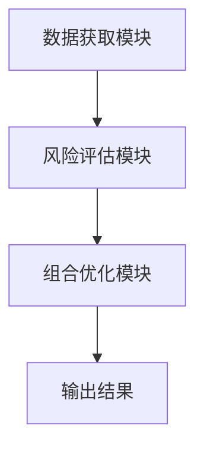
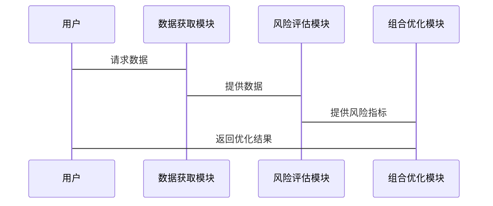

                 


# 如何将特价股票策略融入多元化数字资产风险均衡组合

> **关键词**: 特价股票策略, 数字资产, 风险均衡, 组合优化, 数学模型, AI算法

> **摘要**:  
> 本文详细探讨了如何将特价股票策略与多元化数字资产投资相结合，构建一个风险均衡的投资组合。通过分析特价股票的特性、数字资产的风险特征以及组合优化的数学模型，本文提出了基于AI算法的优化策略，并通过实际案例展示了如何在数字资产组合中融入特价股票策略，以实现风险与收益的最佳平衡。文章还提供了系统架构设计和代码实现，为读者提供了从理论到实践的完整指导。

---

## 第一部分: 特价股票策略与数字资产风险均衡组合基础

### 第1章: 特价股票策略概述

#### 1.1 特价股票的定义与特点

##### 1.1.1 什么是特价股票
特价股票是指在特定市场条件下，股票价格低于其内在价值或行业平均水平的股票。这些股票通常被市场低估，具有较大的增值潜力。

##### 1.1.2 特价股票的市场特征
- **低估特性**: 股票价格低于其真实价值。
- **周期性**: 特价股票往往出现在市场低迷或行业低谷时期。
- **高波动性**: 价格波动较大，但波动中蕴含收益机会。

##### 1.1.3 特价股票的投资价值
- **高收益潜力**: 低估的股票一旦被市场重新评估，其价格可能迅速回升。
- **分散风险**: 特价股票通常分布在不同行业，能够有效分散投资风险。

#### 1.2 特价股票的分类与识别

##### 1.2.1 特价股票的分类
- **周期性股票**: 受经济周期影响较大的行业股票（如制造业、建筑业）。
- **成长型股票**: 具有较高增长潜力但当前估值较低的股票。
- **价值型股票**: 价格低于行业平均水平的股票。

##### 1.2.2 特价股票的识别方法
- **市盈率（P/E）分析**: 选择P/E低于行业平均水平的股票。
- **市净率（P/B）分析**: 选择P/B低于1的股票。
- **股息率分析**: 选择股息率较高且稳定的股票。

##### 1.2.3 特价股票的市场周期分析
- **熊市周期**: 市场低迷时，更多股票可能被低估。
- **牛市周期**: 市场繁荣时，低价股票可能被快速拉升。

#### 1.3 特价股票策略的应用场景

##### 1.3.1 特价股票在个人投资中的应用
- 适合风险承受能力较高的投资者。
- 适合长期投资策略。

##### 1.3.2 特价股票在机构投资中的应用
- 机构投资者可以通过大量配置特价股票降低组合成本。
- 机构投资者可以利用市场波动进行短期套利。

##### 1.3.3 特价股票在不同市场环境下的表现
- **牛市**: 特价股票可能跑赢市场。
- **熊市**: 特价股票可能进一步被低估，提供长期投资机会。

### 第2章: 数字资产风险均衡组合的构建基础

#### 2.1 数字资产的分类与特点

##### 2.1.1 数字资产的分类
- **加密货币**: 如比特币、以太坊。
- **数字债券**: 以数字形式发行的债券。
- **数字股票**: 以数字形式存在的股票。

##### 2.1.2 数字资产的核心特点
- **去中心化**: 大部分数字资产基于区块链技术，具有去中心化特性。
- **高波动性**: 数字资产价格波动较大。
- **高风险**: 市场风险、技术风险、政策风险并存。

##### 2.1.3 数字资产的风险来源
- **市场风险**: 价格波动带来的损失。
- **技术风险**: 区块链技术漏洞可能导致损失。
- **政策风险**: 政府政策变化可能影响数字资产价格。

#### 2.2 数字资产风险的量化与评估

##### 2.2.1 数字资产风险的量化方法
- **波动率分析**: 通过历史数据计算资产价格波动率。
- **VaR（在险价值）分析**: 估计在一定置信水平下的潜在损失。
- **协方差矩阵**: 计算不同资产之间的相关性。

##### 2.2.2 数字资产风险的评估指标
- **波动率**: 衡量资产价格波动程度。
- **相关性**: 衡量不同资产之间的价格联动性。
- **夏普比率**: 衡量资产的超额收益与风险比。

##### 2.2.3 数字资产风险的动态调整
- **实时监控**: 根据市场变化动态调整资产配置。
- **再平衡策略**: 定期调整组合以保持风险目标。

#### 2.3 数字资产组合管理的原理

##### 2.3.1 数字资产组合管理的基本原理
- **分散投资**: 通过投资不同类型的数字资产降低风险。
- **风险调整后收益**: 在考虑风险的基础上评估收益。

##### 2.3.2 数字资产组合的风险分散策略
- **资产类别分散**: 投资不同类型的数字资产（如加密货币、数字债券）。
- **地域分散**: 投资不同国家或地区的数字资产。
- **时间分散**: 分阶段投资，避免集中风险。

##### 2.3.3 数字资产组合的优化方法
- **均值-方差优化**: 在给定风险下最大化收益。
- **最大收益优化**: 在给定收益下最小化风险。

### 第3章: 特价股票策略与数字资产组合的结合

#### 3.1 特价股票策略在数字资产组合中的作用

##### 3.1.1 特价股票策略对组合风险的影响
- **降低整体波动性**: 通过引入低波动性的特价股票降低组合风险。
- **分散市场风险**: 特价股票与其他数字资产的相关性较低，能够分散组合风险。

##### 3.1.2 特价股票策略对组合收益的贡献
- **提供超额收益**: 特价股票可能具有较高的增值潜力。
- **增强组合稳定性**: 在市场波动时，特价股票可能表现优于其他资产。

##### 3.1.3 特价股票策略与数字资产组合的协同效应
- **互补性**: 特价股票的低波动性和数字资产的高波动性形成互补。
- **协同优化**: 结合两种资产的特性，优化整体收益与风险比。

#### 3.2 数字资产组合中特价股票的配置比例

##### 3.2.1 特价股票在数字资产组合中的配置比例
- **建议配置比例**: 通常在10%-30%之间，具体取决于市场环境和风险目标。
- **动态调整**: 根据市场变化和风险评估结果调整配置比例。

#### 3.3 数字资产组合中特价股票的优化策略

##### 3.3.1 基于数学模型的优化策略
- **均值-方差优化**: 使用数学模型确定最优配置比例。
- **风险预算法**: 根据风险承受能力分配资产。

##### 3.3.2 基于历史数据分析的优化策略
- **历史回测**: 通过历史数据验证策略的有效性。
- **因子分析**: 识别影响特价股票收益的关键因子。

##### 3.3.3 基于市场预测的优化策略
- **市场预测模型**: 使用技术分析或基本面分析预测市场走势。
- **动态再平衡**: 根据市场预测结果动态调整组合。

---

## 第二部分: 数学模型与算法实现

### 第4章: 数字资产风险量化与组合优化的数学模型

#### 4.1 数学模型概述

##### 4.1.1 数学模型的基本概念
- **目标函数**: 衡量组合收益与风险的函数。
- **约束条件**: 包括风险限制、收益目标、流动性要求等。

#### 4.2 数字资产风险量化模型

##### 4.2.1 方差-协方差矩阵的构建
$$ \text{方差-协方差矩阵} = \begin{bmatrix} \sigma_1^2 & \sigma_{1,2} & \dots & \sigma_{1,n} \\ \sigma_{2,1} & \sigma_2^2 & \dots & \sigma_{2,n} \\ \vdots & \vdots & \ddots & \vdots \\ \sigma_{n,1} & \sigma_{n,2} & \dots & \sigma_n^2 \end{bmatrix} $$

##### 4.2.2 风险度量公式
$$ \text{组合风险} = \sqrt{w^T \Sigma w} $$
其中，\( w \) 是权重向量，\( \Sigma \) 是方差-协方差矩阵。

#### 4.3 组合优化的数学模型

##### 4.3.1 均值-方差优化模型
$$ \text{最小化} \quad \sum_{i=1}^n \sum_{j=1}^n w_i w_j \Sigma_{i,j} $$
$$ \text{在约束条件下} \quad \sum_{i=1}^n w_i = 1, \quad \mathbb{E}[R] = \text{目标收益} $$

##### 4.3.2 基于AI的优化策略
- **机器学习模型**: 使用神经网络预测资产价格。
- **强化学习策略**: 通过模拟交易环境优化投资决策。

---

### 第5章: 基于AI的数字资产组合优化算法实现

#### 5.1 算法原理

##### 5.1.1 基于神经网络的预测模型
- **输入**: 历史价格、市场指标。
- **输出**: 预测的资产价格。

##### 5.1.2 基于强化学习的交易策略
- **状态空间**: 市场状态、资产价格。
- **动作空间**: 买入、卖出、持有。
- **奖励函数**: 基于收益和风险的综合奖励。

#### 5.2 算法实现

##### 5.2.1 环境配置
```python
import gym
import numpy as np

class AssetEnv(gym.Env):
    def __init__(self):
        self.observation_space = gym.spaces.Box(-np.inf, np.inf, shape=(n_states,))
        self.action_space = gym.spaces.Discrete(n_actions)
```

##### 5.2.2 模型训练
```python
import tensorflow as tf
from tensorflow.keras import layers

model = tf.keras.Sequential([
    layers.Dense(64, activation='relu'),
    layers.Dense(32, activation='relu'),
    layers.Dense(n_actions, activation='linear')
])

def custom_loss(y_true, y_pred):
    return tf.keras.losses.mean_squared_error(y_true, y_pred)

model.compile(optimizer=tf.keras.optimizers.Adam(), loss=custom_loss)
```

##### 5.2.3 策略优化
```python
import numpy as np

def optimize_portfolio(weights, returns, covariance):
    # 定义目标函数
    def objective(weights):
        return np.dot(weights.T, np.dot(covariance, weights))

    # 约束条件
    constraints = [
        {'type': 'eq', 'fun': lambda w: np.sum(w) - 1},
        {'type': 'ineq', 'fun': lambda w: w >= 0}
    ]

    result = optimize.minimize(objective, weights, constraints)
    return result.x
```

---

## 第三部分: 系统架构设计与项目实战

### 第6章: 系统架构设计

#### 6.1 功能模块设计

##### 6.1.1 数据获取模块
- **功能**: 从数据源获取数字资产价格和市场指标。
- **输入**: 数据源地址、时间范围。
- **输出**: 结构化数据。

##### 6.1.2 风险评估模块
- **功能**: 计算数字资产的风险指标。
- **输入**: 资产价格数据。
- **输出**: 方差-协方差矩阵、风险值。

##### 6.1.3 组合优化模块
- **功能**: 基于数学模型优化资产配置。
- **输入**: 风险数据、收益目标。
- **输出**: 优化后的权重。

#### 6.2 系统架构设计

##### 6.2.1 系统架构图


##### 6.2.2 系统交互图


---

## 第四部分: 总结与展望

### 第7章: 总结与展望

#### 7.1 核心内容回顾
- 特价股票策略的定义、分类与识别。
- 数字资产风险量化与组合优化的数学模型。
- 基于AI的优化策略及其算法实现。

#### 7.2 未来研究方向
- 更复杂的市场预测模型。
- 更高效的优化算法。
- 更多资产类别的纳入。

#### 7.3 注意事项
- 特价股票投资需谨慎，需具备相应的市场分析能力。
- 数字资产投资具有高风险，需做好风险控制。

#### 7.4 最佳实践 tips
- 定期评估投资组合，动态调整配置比例。
- 结合市场环境和个人风险承受能力制定投资策略。

---

## 附录

### 附录A: 工具与资源

#### 1. 数据源
- **CoinMarketCap**: 提供数字资产价格数据。
- **Yahoo Finance**: 提供股票价格数据。

#### 2. 开发工具
- **Python**: 数据分析与算法实现。
- **TensorFlow/PyTorch**: 机器学习框架。

#### 3. 代码库
- **Pandas**: 数据处理。
- **NumPy**: 数学计算。
- **Matplotlib**: 数据可视化。

---

通过本文的详细分析与实践，读者可以掌握如何将特价股票策略融入数字资产组合中，构建一个风险均衡的投资组合。从理论到实践，文章提供了完整的解决方案和代码实现，为投资者提供了有力的指导。

