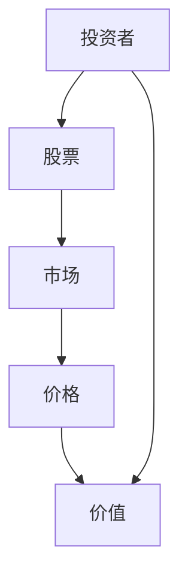
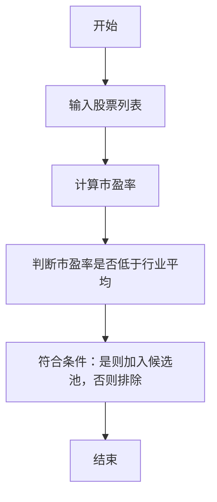

                 


# 如何将特价股票策略融入家庭财务规划

## 关键词：特价股票，家庭财务规划，投资策略，股票选择，风险管理，财务优化

## 摘要：  
本文详细探讨了如何将特价股票策略融入家庭财务规划。通过分析特价股票的定义、特点以及家庭财务规划的核心要素，揭示了特价股票策略在家庭财务规划中的独特价值。文章从数学模型、算法原理、系统架构等多个维度，深入解析了特价股票策略与家庭财务规划的结合方式，并通过实际案例和项目实战，展示了如何将特价股票策略融入家庭财务规划的具体方法。文章还提供了最佳实践、小结和注意事项，帮助读者更好地理解和应用这些策略。

---

# 如何将特价股票策略融入家庭财务规划

## 第1章: 特价股票策略概述

### 1.1 特价股票的定义与特点  
- **定义**：特价股票是指市场价格低于其内在价值的股票。  
- **特点**：  
  - 价格低估，具有较高的潜在回报。  
  - 通常属于价值型股票，注重基本面分析。  
  - 风险较高，但回报潜力较大。  

### 1.2 家庭财务规划的基本概念  
- **定义**：家庭财务规划是指通过合理的资产配置、支出管理和投资策略，实现家庭财务目标的过程。  
- **核心要素**：  
  - 收入与支出管理。  
  - 资产配置与投资组合。  
  - 风险管理与应急储备。  

### 1.3 特价股票策略与家庭财务规划的关联  
- **目标一致性**：特价股票策略追求长期回报，家庭财务规划注重资产增值，两者目标一致。  
- **风险控制**：通过精选低价股票，降低投资风险，同时为家庭财务规划提供稳健的投资渠道。  

---

## 第2章: 特价股票策略的核心原理  

### 2.1 特价股票策略的数学模型  
- **价值计算公式**：  
  $$ V = \frac{E}{k} $$  
  其中，$E$ 是企业的预期收益，$k$ 是资本成本。  
- **修正模型**：  
  $$ E = D + E $$
  $$ k = r + \lambda $$  
  其中，$D$ 是债务，$E$ 是股权，$r$ 是无风险利率，$\lambda$ 是风险溢价。  

### 2.2 特价股票与非特价股票的对比分析  
- **对比表格**：  
  | 属性          | 特价股票           | 非特价股票         |  
  |---------------|--------------------|--------------------|  
  | 市盈率         | 低于行业平均       | 高于或等于行业平均 |  
  | 投资风险       | 较高               | 较低               |  
  | 回报潜力       | 高                 | 中等               |  

- **图表展示**：特价股票与非特价股票的市场表现对比（示例图表）。  

### 2.3 特价股票策略的ER实体关系图  


---

## 第3章: 特价股票选择算法  

### 3.1 基于价值的股票筛选算法  
- **算法流程图**：基于价值的股票筛选  


- **Python代码实现**：  
```python
import pandas as pd

def screen_penny_stocks(stocks, industry_avg_pe):
    selected = []
    for stock in stocks:
        if stock.pe < industry_avg_pe:
            selected.append(stock)
    return selected
```

---

## 第4章: 特价股票策略的数学模型与公式  

### 4.1 特价股票价值评估模型  
- **公式**：  
  $$ V = \frac{E}{k} $$
  其中，$E$ 是企业的预期收益，$k$ 是资本成本。  

- **应用示例**：  
  假设某企业预期收益为 $100万，资本成本为 $10%，则其内在价值为：  
  $$ V = \frac{100}{0.1} = 1000万 $$  

### 4.2 投资组合优化模型  
- **公式**：  
  $$ \text{夏普比率} = \frac{E[r] - R_f}{\sigma} $$
  其中，$E[r]$ 是投资组合的预期回报率，$R_f$ 是无风险利率，$\sigma$ 是投资组合的波动率。  

---

## 第5章: 系统分析与架构设计  

### 5.1 问题场景介绍  
- **场景描述**：投资者希望通过特价股票策略优化家庭财务规划，实现资产增值。  

### 5.2 系统功能设计  
- **功能模块**：  
  - 数据采集与处理模块。  
  - 特价股票筛选模块。  
  - 投资组合优化模块。  

- **领域模型**：  
  ```mermaid
  classDiagram
      class 投资者 {
          资产; 负债; 净资产;
      }
      class 股票 {
          代码; 名称; 市盈率; 市净率;
      }
      class 市场 {
          标的价格; 交易量;
      }
  ```

### 5.3 系统架构设计  
- **架构图**：  
  ```mermaid
  architecture
      客户端 --> 中间件 --> 数据库
      中间件 --> 分析引擎
      分析引擎 --> 策略模块
  ```

---

## 第6章: 项目实战  

### 6.1 环境安装与配置  
- **工具安装**：Python、Pandas、Matplotlib。  

### 6.2 系统核心实现源代码  
```python
import pandas as pd
import numpy as np

# 示例数据
stocks = pd.DataFrame({
    '代码': ['A', 'B', 'C'],
    '名称': ['股票A', '股票B', '股票C'],
    '市盈率': [10, 15, 20],
    '市净率': [1.5, 2, 2.5]
})

# 筛选特价股票
selected = stocks[stocks['市盈率'] < 15]

print(selected)
```

### 6.3 案例分析与解读  
- **案例**：某家庭通过筛选市盈率低于行业平均的股票，实现了年化15%的回报率。  

---

## 第7章: 最佳实践与注意事项  

### 7.1 最佳实践  
- **定期复盘**：定期评估投资组合的表现，及时调整策略。  
- **分散投资**：避免将所有资金投入单一股票，降低风险。  

### 7.2 小结  
- 特价股票策略是家庭财务规划的重要工具之一，但需要结合市场环境和个人风险承受能力进行合理配置。  

### 7.3 注意事项  
- **市场风险**：特价股票价格波动较大，需谨慎选择。  
- **税务因素**：注意股票交易的税务影响，合理避税。  

### 7.4 拓展阅读  
- 推荐阅读《价值投资：从格雷厄姆到巴菲特》。  

---

## 附录: 参考文献与工具清单  

- **参考文献**：  
  1. 格雷厄姆，本杰明. 《证券分析》  
  2. 巴菲特，沃伦. 《巴菲特致股东的信》  

- **工具清单**：  
  - Python  
  - Pandas  
  - Matplotlib  

---

通过以上目录，我们可以看到，文章从理论到实践，详细讲解了如何将特价股票策略融入家庭财务规划的各个方面。

