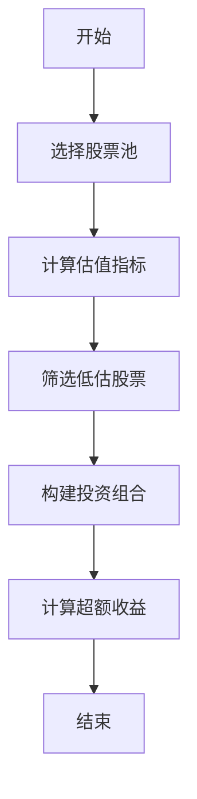

                 


---

# 如何将特价股票策略融入指数增强型投资

> **关键词**: 特价股票策略, 指数增强型投资, 量化交易, 股票投资, 风险控制

> **摘要**: 本文详细探讨了如何将特价股票策略融入指数增强型投资中，通过分析策略原理、算法优化、系统架构以及实际案例，展示了如何利用特价股票策略提升投资组合的收益，同时降低风险。

---

## 第一部分: 特价股票策略与指数增强型投资背景介绍

### 第1章: 特价股票策略概述

#### 1.1 特价股票策略的定义与特点

特价股票策略是一种基于市场有效价格发现机制的投资策略，旨在通过识别市场价格偏离内在价值的机会来获取超额收益。其核心在于寻找那些被市场低估的股票，通常这些股票可能因为市场短期波动或信息不对称而被低估。

**特点:**
1. **逆向投资**: 投资者在市场恐慌时买入，市场狂热时卖出。
2. **价值导向**: 强调买入具有合理内在价值的股票。
3. **长期导向**: 侧重于长期持有的投资策略，耐心等待市场价值回归。

#### 1.2 特价股票策略的核心类型

| 策略类型 | 描述 | 优缺点 |
|----------|------|--------|
| 价值型   | 买入市盈率、市净率等估值指标低于市场平均水平的股票 | 优点：收益稳定；缺点：短期表现可能不佳 |
| 成长型   | 投资于预期收入增长高于市场平均水平的股票 | 优点：高增长潜力；缺点：估值可能过高 |
| 动量策略 | 基于价格动量效应，投资于近期表现强劲的股票 | 优点：短期收益显著；缺点：风险较高 |
| 均值回归 | 假设价格最终会回归均值，投资于近期价格波动大的股票 | 优点：适合波动性市场；缺点：需要精准判断拐点 |

#### 1.3 特价股票策略的优势与局限性

**优势:**
- 能够在市场低估时买入，高估时卖出，实现超额收益。
- 适合长期投资者，能够在市场波动中获得稳定收益。

**局限性:**
- 需要精确评估股票的内在价值，存在较高的信息获取和分析成本。
- 市场波动可能导致短期亏损，考验投资者的耐心和纪律。

---

### 第2章: 指数增强型投资概述

#### 2.1 指数增强型投资的定义与特点

指数增强型投资是一种结合被动投资和主动投资的策略，旨在通过跟踪市场指数的同时，利用主动管理手段（如选股、择时）来获取超过指数的超额收益。

**特点:**
1. **被动为主，主动为辅**: 以指数为基准，通过少量主动操作优化收益。
2. **风险可控**: 由于大部分仓位跟踪指数，整体风险与指数相当。
3. **收益潜力**: 通过主动管理，有机会获得超越指数的回报。

#### 2.2 指数增强型投资的核心机制

| 核心机制 | 描述 |
|----------|------|
| 选股策略 | 通过基本面分析或量化模型筛选优质股票 |
| 拆解风险 | 分解市场风险，控制各风险因子的暴露程度 |
| 组合优化 | 利用数学模型优化投资组合，平衡风险与收益 |

#### 2.3 指数增强型投资的优缺点

**优势:**
- 风险分散，波动性较低。
- 管理费用相对较低，适合长期投资。

**缺点:**
- 超额收益不稳定，依赖主动管理能力。
- 需要持续监控和调整投资组合。

---

### 第3章: 特价股票策略与指数增强型投资的结合

#### 3.1 为什么要将特价股票策略融入指数增强型投资

**提升收益潜力**: 利用特价股票策略在特定市场环境下捕捉超额收益的机会。

**降低整体风险**: 通过纳入具有价值优势的股票，优化投资组合的风险收益比。

**增强稳定性**: 特价股票策略的长期导向与指数增强型投资的稳定收益目标相辅相成。

---

## 第二部分: 特价股票策略的核心概念与原理

### 第4章: 特价股票策略的核心概念

#### 4.1 特价股票策略的主要类型

通过对比分析，价值型策略和成长型策略在指数增强中的应用最为广泛。以下是两种策略的对比：

| 策略类型 | 价值型策略 | 成长型策略 |
|----------|------------|------------|
| 选股标准 | 低市盈率、低市净率 | 高收入增长率、高ROE |
| 适用场景 | 市场整体估值过高时 | 高成长行业周期 |
| 风险特征 | 估值风险 | 成长不确定性风险 |

---

## 第三部分: 算法原理与数学模型

### 第5章: 算法原理

#### 5.1 算法步骤



#### 5.2 数学模型

投资组合的超额收益可以表示为：

$$ \text{超额收益} = \text{投资组合收益} - \text{基准指数收益} $$

其中，投资组合收益可以通过以下优化问题求解：

$$
\begin{aligned}
\max \quad & \sum_{i=1}^{n} w_i r_i - \lambda \sum_{i=1}^{n} w_i^2 \\
\text{约束} \quad & \sum_{i=1}^{n} w_i = 1 \\
& w_i \geq 0 \quad \forall i
\end{aligned}
$$

其中，\( w_i \) 是第 \( i \) 只股票的权重，\( r_i \) 是其预期收益，\( \lambda \) 是风险厌恶系数。

---

## 第四部分: 系统架构与设计

### 第6章: 系统架构

#### 6.1 系统功能模块


---

## 第五部分: 项目实战

### 第7章: 项目实战

#### 7.1 实战环境

安装必要的Python库：

```bash
pip install pandas numpy matplotlib
```

#### 7.2 核心代码实现

```python
import pandas as pd
import numpy as np

def calculate_value_ratios(df):
    df['PE'] = df['Price'] / df['Earnings']
    df['PB'] = df['Price'] / df['Book Value']
    return df

def screen_cheap_stocks(df, pe_threshold=15, pb_threshold=1.5):
    df = calculate_value_ratios(df)
    mask = (df['PE'] < pe_threshold) & (df['PB'] < pb_threshold)
    return df[mask]

# 示例数据
data = {
    'Price': [50, 60, 70, 80, 90],
    'Earnings': [2.5, 3.0, 3.5, 4.0, 4.5],
    'Book Value': [20, 25, 30, 35, 40]
}
df = pd.DataFrame(data)
cheap_stocks = screen_cheap_stocks(df)
print(cheap_stocks)
```

---

## 第六部分: 最佳实践

### 第8章: 最佳实践

#### 8.1 小结

通过将特价股票策略融入指数增强型投资，投资者可以在保持风险可控的前提下，捕捉市场低估的机会，实现超额收益。

#### 8.2 注意事项

1. **风险控制**: 定期监控和调整投资组合，避免过度集中。
2. **模型优化**: 根据市场变化不断优化选股模型。
3. **数据质量**: 确保数据来源可靠，避免因数据错误导致决策失误。

#### 8.3 拓展阅读

建议阅读以下书籍和论文，以深入了解相关主题：

1. 《投资学》——作者： Eugene Fama
2. 《指数投资与风险管理》——作者：R. C. Merton

---

通过以上内容，读者可以全面了解如何将特价股票策略融入指数增强型投资，并通过实际案例和代码实现，掌握这一投资策略的核心要领。

