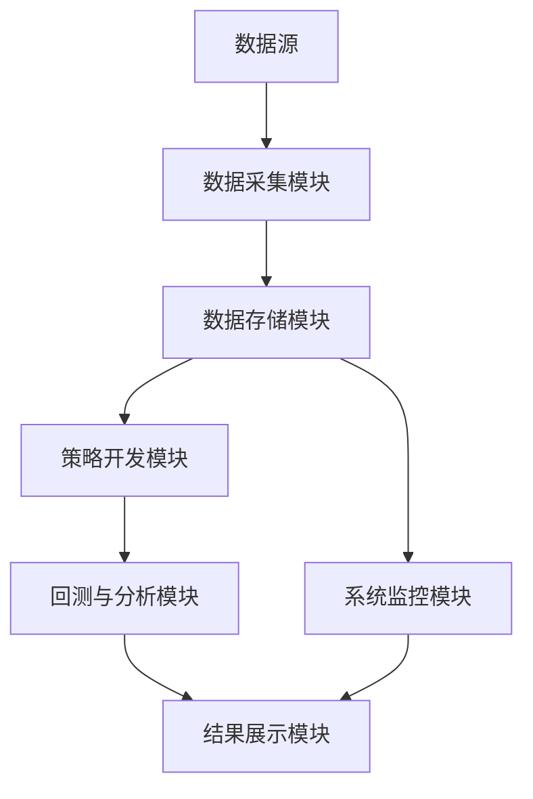
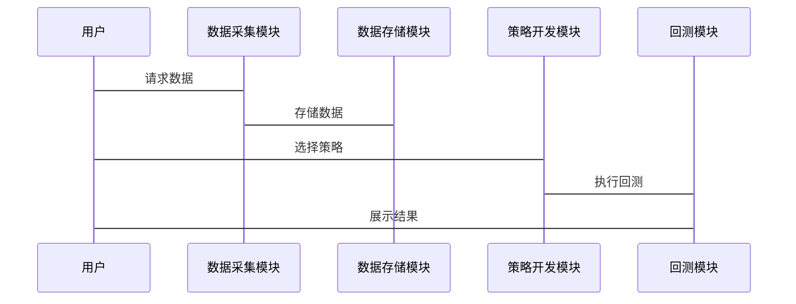

                 


# 如何将特价股票策略融入整体投资组合

> 关键词：特价股票，投资组合，风险管理，技术分析，量化交易，系统设计

> 摘要：本文将详细介绍如何将特价股票策略融入整体投资组合。从策略背景与基础、策略原理与数学模型、系统架构设计、项目实战到总结，我们将逐步分析如何通过技术分析、基本面分析和量化交易等手段，优化投资组合的收益与风险比。通过具体的代码实现和案例分析，帮助读者掌握如何在实际操作中应用这些策略。

---

# 第一部分: 特价股票策略的背景与基础

## 第1章: 特价股票策略概述

### 1.1 特价股票的定义与特点

#### 1.1.1 特价股票的定义
特价股票是指价格相对较低，具有较大上涨潜力的股票。这些股票通常被市场低估，或者处于周期性底部，适合长期投资者或价值投资者。

#### 1.1.2 特价股票的核心特点
- **低估值**：市盈率（P/E）和市净率（P/B）低于行业平均水平。
- **高股息率**：部分特价股票提供较高的股息回报。
- **行业周期性**：通常在经济周期的底部阶段出现。
- **市场流动性**：交易量可能较低，但买卖价差较小。

#### 1.1.3 特价股票与普通股票的区别
| 特性 | 特价股票 | 普通股票 |
|------|----------|----------|
| 价格 | 通常低于行业平均 | 价格波动较大 |
| 估值 | 低估值 | 可高可低 |
| 风险 | 较低（长期视角） | 较高（短期波动） |

### 1.2 特价股票策略的背景与现状

#### 1.2.1 特价股票策略的起源与发展
- **起源**：20世纪初，价值投资理念的兴起，如本杰明·格雷厄姆的“捡烟蒂”策略。
- **发展**：随着技术的进步，量化分析和大数据技术被广泛应用于特价股票的筛选。

#### 1.2.2 当前市场中的特价股票策略
- **技术驱动**：算法交易和大数据分析使得特价股票筛选更加精准。
- **市场环境**：全球经济波动和行业周期变化为特价股票策略提供了机会。

#### 1.2.3 特价股票策略的优劣势分析
- **优势**：
  - 高收益潜力。
  - 低估值股票具有较高的安全边际。
- **劣势**：
  - 需要较长的持有时间。
  - 市场波动可能导致短期亏损。

### 1.3 投资者如何选择适合的特价股票策略

#### 1.3.1 确定投资目标与风险偏好
- **短期投资者**：适合高流动性的特价股票。
- **长期投资者**：适合低估值、高股息的股票。

#### 1.3.2 分析市场环境与经济周期
- **经济衰退期**：寻找低估值的防御性行业股票。
- **经济复苏期**：关注周期性行业中的特价股票。

#### 1.3.3 选择适合的策略类型
- **价值型策略**：寻找低估值股票。
- **成长型策略**：关注高成长潜力的特价股票。

### 1.4 本章小结
本章介绍了特价股票的定义、特点及其在投资组合中的应用背景，为后续策略分析奠定了基础。

---

## 第2章: 特价股票策略的核心概念与工具

### 2.1 技术分析与基本面分析的结合

#### 2.1.1 技术分析在特价股票策略中的应用
- **K线图分析**：识别股价趋势和支撑位。
- **移动平均线（MA）**：判断股价的短期和长期趋势。
- **相对强弱指数（RSI）**：衡量股价的超买或超卖状态。

#### 2.1.2 基本面分析在特价股票策略中的应用
- **财务指标分析**：ROE（净资产收益率）、ROA（资产收益率）等。
- **行业分析**：分析行业周期和竞争格局。
- **公司基本面**：关注公司的盈利能力、负债情况和管理层稳定性。

#### 2.1.3 技术分析与基本面分析的结合
- **技术验证基本面**：通过技术指标确认基本面分析的结论。
- **基本面指导技术**：根据公司基本面选择股票，再通过技术分析确定买卖时机。

### 2.2 特价股票策略的关键指标

#### 2.2.1 市盈率（P/E）
- **定义**：市盈率 = 股价 / 每股净利润。
- **应用**：P/E低于行业平均水平的股票可能具有投资价值。

#### 2.2.2 市净率（P/B）
- **定义**：市净率 = 股价 / 每股净资产。
- **应用**：P/B低于1的股票通常被视为低估。

#### 2.2.3 股息率
- **定义**：股息率 = 每股股息 / 股价。
- **应用**：高股息率股票适合追求稳定收益的投资者。

#### 2.2.4 其他相关指标
- **市销率（P/S）**：用于评估销售驱动型公司的估值。
- **股息支付率**：股息支付率 = 股息 / 净利润。

### 2.3 特价股票策略的工具与平台

#### 2.3.1 股票交易软件的选择
- **常见工具**：TradingView、MetaTrader、通达信等。
- **功能对比**：技术分析、数据回测、实时监控。

#### 2.3.2 数据分析工具的使用
- **Python**：使用Pandas、NumPy等库进行数据处理。
- **Excel**：简单的数据筛选和图表分析。

#### 2.3.3 在线教育资源与社区
- **在线课程**：Coursera、 Udemy等平台上的量化分析课程。
- **投资社区**：雪球、东方财富网等。

### 2.4 本章小结
本章详细介绍了技术分析和基本面分析的核心指标及其在特价股票策略中的应用，为后续策略优化提供了理论基础。

---

## 第3章: 特价股票策略的数学模型与算法原理

### 3.1 特价股票策略的数学模型

#### 3.1.1 市场情绪模型
- **定义**：通过分析市场情绪指标（如VIX指数）预测市场波动。
- **公式**：市场情绪指数 = 情感指标 × 市场波动指标。

#### 3.1.2 股票价格预测模型
- **线性回归模型**：用于预测股价趋势。
- **公式**：y = a + bx + ε，其中y为预测股价，x为自变量（如P/E），a为截距，b为回归系数。

#### 3.1.3 风险评估模型
- **夏普比率**：评估投资组合的风险调整后收益。
- **公式**：夏普比率 = (预期收益 - 无风险利率) / 标准差。

### 3.2 基于技术分析的算法实现

#### 3.2.1 移动平均线（MA）策略
- **定义**：通过计算短期和长期移动平均线判断股价趋势。
- **实现步骤**：
  1. 计算短期MA和长期MA。
  2. 当短期MA上穿长期MA时，买入信号。
  3. 当短期MA下穿长期MA时，卖出信号。

#### 3.2.2 相对强弱指数（RSI）策略
- **定义**：RSI用于判断超买或超卖状态。
- **实现步骤**：
  1. 计算RSI值。
  2. 当RSI < 30时，买入信号。
  3. 当RSI > 70时，卖出信号。

### 3.3 基于基本面分析的算法实现

#### 3.3.1 低估值股票筛选算法
- **公式**：筛选P/E < 行业平均P/E 且 P/B < 1 的股票。
- **实现步骤**：
  1. 收集目标行业的股票数据。
  2. 计算每只股票的P/E和P/B。
  3. 筛选出符合条件的股票。

#### 3.3.2 高成长潜力股票筛选算法
- **公式**：筛选ROE > 10% 且营收增长率 > 15% 的股票。
- **实现步骤**：
  1. 收集目标行业的股票数据。
  2. 计算每只股票的ROE和营收增长率。
  3. 筛选出符合条件的股票。

### 3.4 本章小结
本章通过数学模型和算法原理，详细讲解了如何从技术分析和基本面分析的角度筛选特价股票，为后续策略优化奠定了基础。

---

## 第4章: 特价股票策略的风险管理与优化

### 4.1 风险管理的核心原则

#### 4.1.1 分散投资
- **定义**：通过投资不同行业和地区的股票降低风险。
- **应用**：将投资组合分散到多个特价股票，避免单一股票的风险。

#### 4.1.2 设置止损和止盈
- **止损**：当股价下跌至一定幅度时卖出，避免更大的亏损。
- **止盈**：当股价上涨至一定幅度时卖出，锁定收益。

### 4.2 风险管理的数学模型

#### 4.2.1 风险价值（VaR）
- **定义**：在一定置信水平下，投资组合可能遭受的最大损失。
- **公式**：VaR = z * σ，其中z为标准正态分布的分位数，σ为收益的标准差。

#### 4.2.2 最大回撤（Max Drawdown）
- **定义**：投资组合在某段时间内的最大亏损幅度。
- **公式**：最大回撤 = (峰值 - 低点) / 峰值。

### 4.3 特价股票策略的优化

#### 4.3.1 动态调整策略
- **定义**：根据市场变化和公司基本面动态调整投资组合。
- **步骤**：
  1. 定期回顾投资组合的表现。
  2. 根据市场变化重新筛选特价股票。

#### 4.3.2 组合优化算法
- **均值-方差优化**：通过优化算法找到风险最低、收益最高的投资组合。
- **公式**：Minimize方差，Subject to收益 >= 预期收益。

### 4.4 本章小结
本章重点讲解了风险管理的核心原则和数学模型，并通过动态调整和优化算法，帮助读者构建更加稳健的投资组合。

---

## 第5章: 特价股票策略的系统架构设计

### 5.1 系统设计背景

#### 5.1.1 投资者需求分析
- **自动化交易**：减少人为干预，提高交易效率。
- **实时监控**：实时跟踪股价和市场变化。
- **数据处理**：高效处理大量历史数据。

### 5.2 系统功能设计

#### 5.2.1 数据采集模块
- **功能**：从多种数据源获取股票数据，包括历史价格、成交量等。
- **技术**：使用API（如Yahoo Finance API）或数据库（如MySQL）存储数据。

#### 5.2.2 策略开发模块
- **功能**：实现多种特价股票筛选策略，如技术指标和基本面分析。
- **技术**：使用Python的量化库（如Pandas、NumPy）进行数据处理。

#### 5.2.3 回测与分析模块
- **功能**：对策略进行历史数据回测，评估策略的有效性。
- **技术**：使用Backtrader或Zipline进行回测。

#### 5.2.4 系统监控与报警模块
- **功能**：实时监控股价和市场变化，触发报警。
- **技术**：使用Kafka或WebSocket进行实时数据传输。

### 5.3 系统架构设计

#### 5.3.1 系统架构图


#### 5.3.2 系统接口设计
- **数据接口**：与数据源（如API）交互。
- **用户接口**：提供可视化界面供用户操作。

#### 5.3.3 系统交互流程图


### 5.4 本章小结
本章详细讲解了系统架构设计，从功能模块到系统交互，为读者提供了构建自动化特价股票策略系统的参考。

---

## 第6章: 特价股票策略的项目实战

### 6.1 项目背景与目标

#### 6.1.1 项目背景
- **目标**：开发一个基于Python的特价股票筛选系统。
- **需求**：实现数据采集、策略开发、回测和可视化展示。

### 6.2 项目核心实现

#### 6.2.1 环境安装
- **安装Python**：Python 3.8以上版本。
- **安装依赖库**：
  ```bash
  pip install pandas numpy matplotlib requests
  ```

#### 6.2.2 核心代码实现

##### 1. 数据采集模块
```python
import requests

def get_stock_data(ticker):
    url = f"https://api.example.com/stock/{ticker}"
    response = requests.get(url)
    return response.json()
```

##### 2. 策略开发模块
```python
import pandas as pd

def screen_cheap Stocks(dataframe):
    # 筛选P/E < 15且P/B < 1的股票
    mask = (dataframe['P/E'] < 15) & (dataframe['P/B'] < 1)
    return dataframe[mask]
```

##### 3. 回测与分析模块
```python
from backtrader import Strategy

class SimpleStrategy(Strategy):
    def __init__(self):
        self.data = None

    def next(self):
        # 实现简单的买入策略
        if self.data.close[-1] > self.data.close[-2]:
            self.buy()
```

##### 4. 可视化模块
```python
import matplotlib.pyplot as plt

def plot_results(dataframe):
    plt.plot(dataframe['Date'], dataframe['Price'])
    plt.xlabel('Date')
    plt.ylabel('Price')
    plt.title('Stock Price Trend')
    plt.show()
```

### 6.3 项目小结
本章通过具体的代码实现，展示了如何将特价股票策略融入整体投资组合。从数据采集到策略开发，再到回测和可视化，帮助读者掌握实际操作中的关键步骤。

---

## 第7章: 总结与展望

### 7.1 本章总结
本文详细介绍了如何将特价股票策略融入整体投资组合，从策略背景、核心概念、数学模型到系统设计和项目实战，为读者提供了全面的指导。

### 7.2 未来展望
随着人工智能和大数据技术的不断发展，特价股票策略将更加智能化和自动化。未来的研究方向包括：
- **智能筛选算法**：利用机器学习技术优化股票筛选。
- **实时交易系统**：开发更加高效的实时交易系统。
- **风险管理模型**：进一步完善风险评估和控制方法。

### 7.3 最佳实践 Tips
- **持续学习**：市场变化迅速，需要不断学习新知识。
- **风险管理**：始终将风险管理放在首位。
- **长期视角**：特价股票策略需要耐心和长期持有。

---

# 结语
通过本文的学习，读者将能够系统地掌握如何将特价股票策略融入整体投资组合，从理论到实践，逐步优化自己的投资策略。希望本文能为读者的投资之旅提供有价值的指导和启发。

