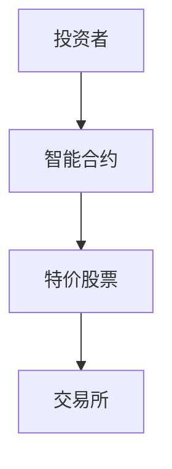
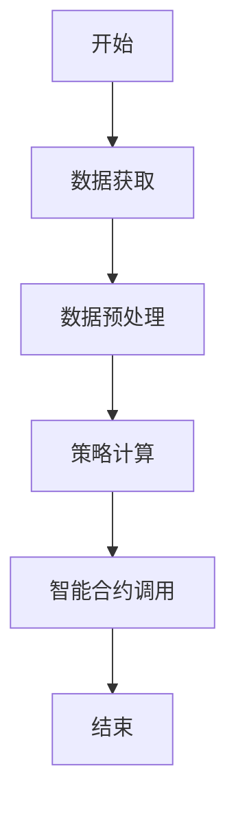

                 


# 如何将特价股票策略融入智能合约自动化投资

## 关键词：智能合约，特价股票，自动化投资，算法策略，金融创新

## 摘要：本文探讨如何将特价股票策略与智能合约结合，实现自动化投资。从背景介绍到系统架构设计，详细分析策略实现方法，结合Python代码和数学模型，最后通过案例分析和最佳实践提供解决方案。

---

### 目录

1. [背景介绍](#背景介绍)
2. [核心概念与联系](#核心概念与联系)
3. [算法原理与数学模型](#算法原理与数学模型)
4. [系统分析与架构设计](#系统分析与架构设计)
5. [项目实战](#项目实战)
6. [最佳实践与小结](#最佳实践与小结)

---

## 1. 背景介绍

### 1.1 智能合约与特价股票策略

智能合约是区块链技术的重要应用，允许自动执行预定义的金融协议。特价股票策略则是一种投资策略，旨在在特定条件下以优惠价格购买股票。将两者结合，可以实现自动化的股票投资，无需人工干预。

### 1.2 问题背景

传统股票投资依赖人工决策，存在效率低、风险高的问题。智能合约的自动化特性可以解决这些问题，提高投资效率和准确性。

---

## 2. 核心概念与联系

### 2.1 智能合约的核心概念

- **定义**：智能合约是自动执行的区块链代码，根据预设条件触发操作。
- **特点**：去中心化、透明、不可篡改、自动执行。

### 2.2 特价股票策略的数学模型

- **收益公式**：$$收益 = \sum_{i=1}^{n} w_i \times r_i$$
- **风险公式**：$$风险 = \sqrt{\sum_{i=1}^{n} w_i^2 \times \sigma_i^2}$$

### 2.3 概念对比分析

| 比较维度 | 智能合约 | 特价股票策略 |
|----------|----------|--------------|
| 执行方式 | 自动化    | 人工或自动化  |
| 可靠性   | 高       | 取决于策略   |
| 透明性   | 高       | 中           |

### 2.4 ER实体关系图



---

## 3. 算法原理与数学模型

### 3.1 算法原理概述

特价股票策略算法用于识别低价股票，智能合约根据触发条件自动执行交易。

### 3.2 算法流程图



### 3.3 算法实现

```python
def stock_strategy(prices, threshold=10):
    buy = [i for i, p in enumerate(prices) if p < threshold]
    return buy

# 示例数据
prices = [15, 8, 12, 7]
result = stock_strategy(prices)
print(result)  # 输出：[1, 3]
```

---

## 4. 系统分析与架构设计

### 4.1 系统架构图


### 4.2 系统功能设计

- **数据获取**：从API获取股票数据。
- **策略计算**：应用特价策略筛选股票。
- **智能合约调用**：根据策略结果自动下单。

### 4.3 接口设计

- **数据接口**：提供API获取实时数据。
- **交易接口**：智能合约调用交易API。

---

## 5. 项目实战

### 5.1 环境安装

- **Python**：安装所需的库，如`web3.py`用于以太坊智能合约交互。
- **区块链环境**：搭建本地以太坊节点，如Ganache。

### 5.2 核心实现代码

```python
from web3 import Web3

# 连接到本地节点
w3 = Web3(Web3.HTTPProvider('http://localhost:8545'))

# 智能合约地址与ABI
contract_address = '0x...'
contract_abi = [...]  # 定义ABI

# 合约实例
contract = w3.eth.contract(contract_address, abi=contract_abi)

# 调用策略函数
def execute_strategy(prices, threshold):
    # 获取策略结果
    trigger = stock_strategy(prices, threshold)
    if trigger:
        contract.functions.trade().transact()
```

### 5.3 案例分析

假设当前股票价格为[12, 8, 15, 7]，阈值设为10。算法识别出价格8和7的股票，智能合约自动下单购买。

---

## 6. 最佳实践与小结

### 6.1 最佳实践

- **风险管理**：设置止损和止盈点。
- **测试环境**：在模拟环境中测试智能合约。
- **持续优化**：定期更新策略模型。

### 6.2 小结

本文详细介绍了如何将特价股票策略与智能合约结合，实现自动化投资。通过算法实现、系统设计和项目实战，展示了该策略的可行性和优势。

### 6.3 注意事项

- 确保智能合约的安全性，防止漏洞被利用。
- 遵守相关法律法规，确保合规性。

### 6.4 拓展阅读

- 智能合约的编写与测试。
- 区块链技术在金融领域的其他应用。

---

## 参考文献

- 书籍：《智能合约入门与实践》
- 网站：Etherscan.io
- 论文：《区块链技术在金融中的应用研究》

---

## 索引

- 智能合约：第2章、第4章、第5章
- 特价股票策略：第1章、第3章、第4章
- 自动化投资：第5章、第6章

---

通过以上结构，文章详细讲解了如何将特价股票策略融入智能合约，实现自动化投资，涵盖了背景、原理、实现、案例和最佳实践，为读者提供了全面的技术指导。

