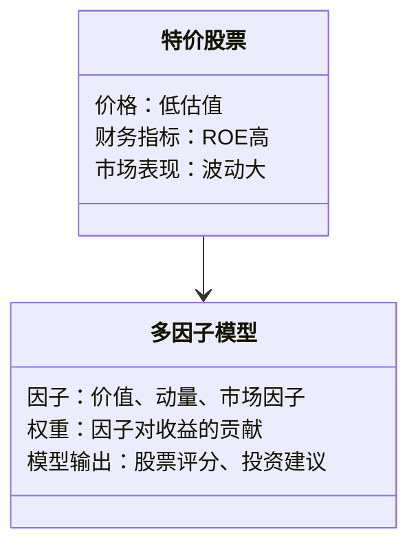
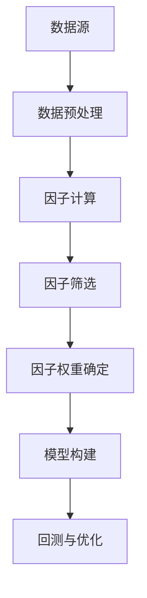

                 


# 如何构建基于特价股票的多因子投资模型

> **关键词**：多因子投资模型、特价股票、因子筛选、数学模型、系统架构

> **摘要**：本文详细介绍了如何构建基于特价股票的多因子投资模型。从背景介绍到核心概念，从算法原理到系统架构，再到项目实战和最佳实践，全面解析了多因子投资模型的构建过程。文章内容丰富，结构清晰，适合投资者、数据科学家和金融工程师阅读。

---

# 第一部分: 特价股票与多因子投资模型背景

## 第1章: 特价股票与多因子投资模型概述

### 1.1 特价股票的定义与特点

#### 1.1.1 特价股票的定义
特价股票通常指价格低于市场平均水平的股票，具有低估值的特点，可能隐藏着投资机会。

#### 1.1.2 特价股票的市场特征
- 价格波动较大
- 市盈率、市净率等指标较低
- 可能存在被市场低估的情况

#### 1.1.3 特价股票的投资机会与风险
- 机会：可能被市场重新评估，股价上涨
- 风险：公司基本面可能较差，股价波动大

### 1.2 多因子投资模型的背景与意义

#### 1.2.1 传统投资模型的局限性
- 单一因子模型无法解释全部收益
- 忽略了其他重要因素的影响

#### 1.2.2 多因子模型的优势
- 考虑多个因素，提高模型的解释力
- 降低模型的过拟合风险

#### 1.2.3 多因子模型在股票投资中的应用前景
- 提供更全面的投资策略
- 适合大数据环境下的投资分析

---

## 第2章: 多因子投资模型的核心概念

### 2.1 多因子模型的原理

#### 2.1.1 多因子模型的基本假设
- 股票收益可以分解为多个因子的线性组合
- 每个因子对收益的贡献程度不同

#### 2.1.2 多因子模型的数学表达
$$ R_i = \beta_1 F_1 + \beta_2 F_2 + \cdots + \beta_n F_n + \epsilon $$

其中：
- \( R_i \) 为股票 \( i \) 的收益
- \( F_j \) 为因子 \( j \)
- \( \beta_j \) 为因子 \( j \) 的权重
- \( \epsilon \) 为误差项

#### 2.1.3 多因子模型的因子选择标准
- 相关性低：因子之间应尽量独立
- 解释力强：因子应能显著解释股票收益
- 数据可得性：因子数据容易获取

### 2.2 多因子模型的因子分析

#### 2.2.1 常见的因子类型
| 因子类型 | 描述 | 示例 |
|----------|------|------|
| 价值因子 | 股票的低估值特征 | 市盈率（PE）、市净率（PB） |
| 动量因子 | 过去收益的动量效应 | 近期收益率 |
| 大盘因子 | 市场整体表现 | 市场指数收益率 |
| 财务因子 | 公司财务指标 | 净利润增长率、ROE |

#### 2.2.2 特价股票的因子特征
- 价值因子：市盈率、市净率较低
- 大盘因子：可能受市场整体波动影响较大

#### 2.2.3 因子的有效性评估
- 因子的解释力：通过回归分析检验因子是否显著解释收益
- 因子的稳定性：因子在不同时间段的表现是否一致

### 2.3 多因子模型的构建步骤

#### 2.3.1 数据收集与预处理
- 数据来源：股票历史价格、财务数据、市场指数
- 数据清洗：处理缺失值、异常值

#### 2.3.2 因子计算与筛选
- 计算因子值：例如计算市盈率、动量因子
- 因子筛选：使用统计方法（如相关性分析）筛选有效因子

#### 2.3.3 因子权重的确定
- 使用回归模型确定因子权重
- 考虑因子的解释力和风险

---

## 第3章: 多因子模型的数学模型与公式

### 3.1 多因子模型的数学表达

#### 3.1.1 因子回归模型
$$ R_i = \beta_1 F_1 + \beta_2 F_2 + \cdots + \beta_n F_n + \epsilon $$

#### 3.1.2 因子组合优化模型
$$ w_1 R_1 + w_2 R_2 + \cdots + w_n R_n \rightarrow \text{最大化收益，最小化风险} $$

#### 3.1.3 因子权重分配模型
$$ \text{权重分配} = \frac{\text{因子解释力}}{\sum \text{所有因子解释力}} $$

### 3.2 多因子模型的公式推导

#### 3.2.1 因子回归的公式推导
通过最小二乘法估计因子权重：
$$ \hat{\beta} = (X^T X)^{-1} X^T y $$

其中：
- \( X \) 为因子矩阵
- \( y \) 为股票收益向量

---

# 第二部分: 多因子投资模型的核心概念与联系

## 第4章: 多因子模型的系统分析与架构设计

### 4.1 系统功能设计

#### 4.1.1 领域模型


#### 4.1.2 系统架构


### 4.2 系统接口与交互

#### 4.2.1 系统接口设计
- 数据接口：获取股票数据
- 计算接口：计算因子值
- 模型接口：生成投资建议

#### 4.2.2 系统交互
```mermaid
sequenceDiagram
    participant 用户
    participant 数据源
    participant 计算模块
    participant 模型模块
    用户 -> 数据源：获取股票数据
    数据源 -> 用户：返回数据
    用户 -> 计算模块：计算因子
    计算模块 -> 用户：返回因子值
    用户 -> 模型模块：生成投资建议
    模型模块 -> 用户：返回投资建议
```

---

## 第5章: 多因子投资模型的项目实战

### 5.1 环境安装与配置

#### 5.1.1 安装Python环境
- 安装Python 3.x
- 安装Jupyter Notebook

#### 5.1.2 安装必要库
```bash
pip install numpy pandas matplotlib seaborn yfinance
```

### 5.2 系统核心实现源代码

#### 5.2.1 数据预处理代码
```python
import pandas as pd
import numpy as np
import yfinance as yf

# 下载数据
tickers = ['AAPL', 'MSFT', 'GOOGL']
data = yf.download(tickers, start='2020-01-01', end='2023-12-31')

# 数据清洗
data = data['Adj Close'].dropna()
```

#### 5.2.2 因子计算代码
```python
# 计算市盈率因子
data['PE'] = data.rolling(30).mean() / data.rolling(30).mean().pct_change()

# 计算动量因子
data['Momentum'] = data.rolling(20).mean().pct_change(10)
```

#### 5.2.3 模型构建代码
```python
from sklearn.linear_model import LinearRegression

# 训练模型
model = LinearRegression()
model.fit(X, y)

# 预测收益
y_pred = model.predict(X)
```

### 5.3 实际案例分析

#### 5.3.1 案例分析
选择几只特价股票，计算其因子值，构建模型，进行回测。

#### 5.3.2 回测与优化
- 计算模型的收益和风险
- 调整因子权重，优化模型表现

### 5.4 项目小结

---

## 第6章: 最佳实践与小结

### 6.1 最佳实践

#### 6.1.1 小结
- 多因子模型能有效解释股票收益
- 特价股票具有特定的因子特征

#### 6.1.2 注意事项
- 数据质量影响模型效果
- 需定期更新因子和模型

#### 6.1.3 风险提示
- 模型无法预测所有市场变化
- 需结合市场环境调整策略

#### 6.1.4 拓展阅读
- 推荐阅读相关书籍和论文
- 关注行业动态和技术进展

---

# 结语

通过本文的详细讲解，读者可以系统地了解如何构建基于特价股票的多因子投资模型。从理论到实践，从概念到代码，全面解析了多因子投资模型的构建过程。希望本文能为投资者和数据科学家提供有价值的参考。

--- 

**END**

