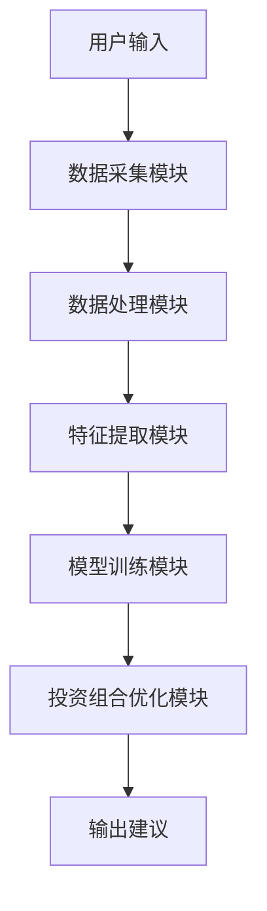
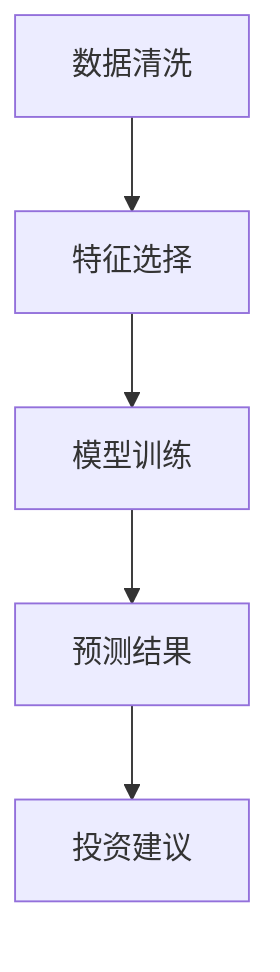
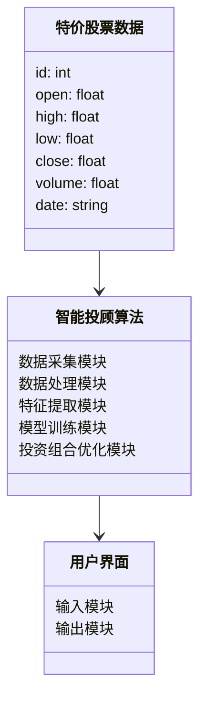
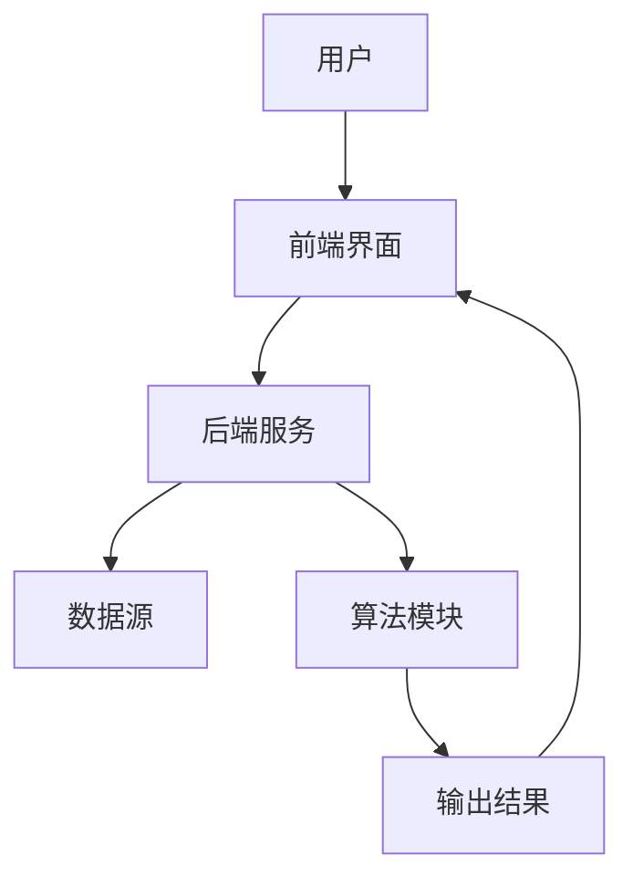
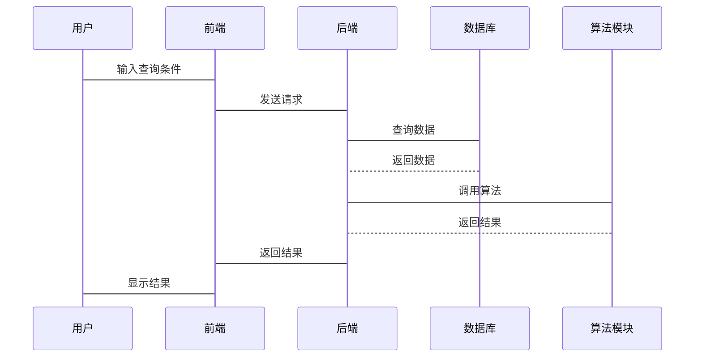

                 


# 如何构建基于特价股票的智能投顾系统

> 关键词：智能投顾系统，特价股票，机器学习，大数据分析，金融投资

> 摘要：本文将详细介绍如何构建一个基于特价股票的智能投顾系统。通过分析特价股票的特性、智能投顾的核心技术以及两者的结合，我们将分步骤讲解系统的设计与实现。从背景介绍到项目实战，本文将全面覆盖系统构建的各个方面，帮助读者掌握构建智能投顾系统的关键技术与方法。

---

# 第一部分: 特价股票与智能投顾系统概述

## 第1章: 特价股票与智能投顾的背景介绍

### 1.1 特价股票的基本概念

#### 1.1.1 什么是特价股票

特价股票是指价格低于市场平均价格的股票。通常，这类股票可能因为市场波动、公司业绩不佳或其他特殊原因导致价格被低估。特价股票的投资价值在于其潜在的上涨空间，但同时也伴随着较高的风险。

#### 1.1.2 特价股票的分类与特点

特价股票可以分为以下几类：
- **周期性特价股票**：受经济周期影响较大的股票，如制造业或资源类股票。
- **成长性特价股票**：公司基本面良好，但暂时估值被低估的股票。
- **价值型特价股票**：公司市盈率、市净率等指标远低于行业平均水平的股票。

#### 1.1.3 特价股票的投资价值分析

特价股票的投资价值主要体现在以下几个方面：
1. **潜在收益**：相比高价股票，特价股票的价格弹性更大，上涨空间可能更高。
2. **风险分散**：通过投资多个特价股票，可以分散投资风险。
3. **市场机会**：特价股票往往存在于市场低估的区域，可能是投资的好时机。

---

### 1.2 智能投顾的基本概念

#### 1.2.1 智能投顾的定义与特点

智能投顾（Robo-Advisor）是一种基于人工智能技术的投资顾问服务。它通过算法分析市场数据和用户需求，提供自动化、个性化的投资建议。

智能投顾的特点包括：
1. **自动化**：无需人工干预，系统自动完成投资建议。
2. **个性化**：根据用户的风险偏好和财务状况提供定制化建议。
3. **实时性**：能够实时跟踪市场变化并调整投资策略。

#### 1.2.2 智能投顾与传统投顾的区别

| 特性             | 智能投顾             | 传统投顾             |
|------------------|--------------------|--------------------|
| 服务方式         | 自动化、在线         | 人工、面对面         |
| 成本             | 低                  | 高                  |
| 反应速度         | 快                  | 慢                  |
| 可用性           | 24/7               | 有限                |

#### 1.2.3 智能投顾的核心技术与优势

智能投顾的核心技术包括：
1. **大数据分析**：利用海量数据进行市场预测。
2. **机器学习**：通过算法优化投资组合。
3. **自然语言处理**：分析新闻、财报等文本数据。

---

### 1.3 特价股票智能投顾的背景与意义

#### 1.3.1 特价股票市场的现状与趋势

随着市场的波动，特价股票经常出现在投资者的视野中。近年来，科技股的波动导致许多股票价格被低估，为智能投顾提供了大量机会。

#### 1.3.2 智能投顾在特价股票中的应用前景

智能投顾可以通过算法快速分析大量特价股票数据，帮助投资者发现潜在的投资机会。

#### 1.3.3 特价股票智能投顾的市场需求与痛点分析

当前市场中，投资者面临以下痛点：
1. **信息过载**：大量股票数据难以筛选。
2. **时间成本**：人工分析股票耗时耗力。
3. **情绪化决策**：投资者容易受市场情绪影响。

智能投顾通过自动化分析和优化，能够有效解决这些问题。

---

## 第2章: 特价股票智能投顾的核心概念与联系

### 2.1 核心概念原理

#### 2.1.1 特价股票数据的特征分析

特价股票数据的特征包括：
1. **低估值**：市盈率、市净率低于行业平均水平。
2. **高波动性**：价格波动较大，风险较高。
3. **行业分布**：集中在周期性行业或科技行业。

#### 2.1.2 智能投顾算法的基本原理

智能投顾算法通过以下步骤优化投资组合：
1. **数据采集**：收集历史价格、财务数据等。
2. **特征提取**：提取影响股票价格的关键特征。
3. **模型训练**：使用机器学习模型预测股票价格。
4. **组合优化**：根据预测结果构建最优投资组合。

#### 2.1.3 特价股票智能投顾系统的整体架构



---

### 2.2 核心概念属性对比表

| 概念         | 属性               | 描述                                   |
|--------------|--------------------|---------------------------------------|
| 特价股票     | 定义               | 价格低于市场价的股票                   |
|              | 投资风险           | 较高                                   |
|              | 市场流动性         | 一般较低                               |
| 智能投顾     | 定义               | 利用AI技术提供自动化投资建议           |
|              | 核心技术           | 机器学习、大数据分析                   |
|              | 用户交互方式       | 自动化

---

### 2.3 实体关系图

```mermaid
erd
    系统模块
    数据源 --> 特价股票
    特价股票 --> 智能投顾算法
    智能投顾算法 --> 投资组合优化
```

---

## 第3章: 特价股票智能投顾的算法原理

### 3.1 算法原理

#### 3.1.1 算法选择

常用的算法包括：
- **线性回归**：预测股票价格。
- **随机森林**：分类和回归。
- **支持向量机（SVM）**：分类和回归。

#### 3.1.2 算法流程



#### 3.1.3 算法实现

以下是基于随机森林的股票价格预测代码：

```python
import pandas as pd
from sklearn.ensemble import RandomForestRegressor
from sklearn.model_selection import train_test_split

# 数据加载与预处理
data = pd.read_csv('stock_data.csv')
X = data[['open', 'high', 'low', 'volume']]
y = data['close']

# 数据分割
X_train, X_test, y_train, y_test = train_test_split(X, y, test_size=0.2, random_state=42)

# 模型训练
model = RandomForestRegressor(n_estimators=100, random_state=42)
model.fit(X_train, y_train)

# 预测
y_pred = model.predict(X_test)

# 评估
score = model.score(X_test, y_test)
print(f"模型得分：{score}")
```

---

## 第4章: 特价股票智能投顾的系统分析与架构设计

### 4.1 系统应用场景

特价股票智能投顾系统适用于以下场景：
1. **个人投资者**：帮助用户筛选投资标的。
2. **机构投资者**：优化投资组合。
3. **量化交易**：提供实时交易信号。

### 4.2 系统功能设计

#### 4.2.1 领域模型



### 4.3 系统架构设计

#### 4.3.1 系统架构图



#### 4.3.2 接口设计

系统主要接口包括：
1. **数据接口**：从数据库获取股票数据。
2. **算法接口**：调用机器学习模型进行预测。
3. **用户接口**：接收用户输入并显示结果。

#### 4.3.3 交互流程图



---

## 第5章: 特价股票智能投顾的项目实战

### 5.1 环境安装

#### 5.1.1 安装Python环境

```bash
python -m pip install --upgrade pip
pip install pandas numpy scikit-learn
```

### 5.2 系统核心实现

#### 5.2.1 数据采集模块

```python
import pandas as pd
import requests

def get_stock_data(ticker):
    url = f"https://api.example.com/stock/{ticker}"
    response = requests.get(url)
    data = response.json()
    return pd.DataFrame(data)
```

#### 5.2.2 数据处理模块

```python
from sklearn.preprocessing import StandardScaler

def preprocess_data(df):
    scaler = StandardScaler()
    X = df[['open', 'high', 'low', 'volume']]
    X_scaled = scaler.fit_transform(X)
    return X_scaled
```

#### 5.2.3 算法模块

```python
from sklearn.ensemble import RandomForestRegressor

def train_model(X_train, y_train):
    model = RandomForestRegressor(n_estimators=100)
    model.fit(X_train, y_train)
    return model
```

---

## 第6章: 特价股票智能投顾的最佳实践

### 6.1 小结

通过本文的介绍，读者可以系统地了解如何构建基于特价股票的智能投顾系统。从背景介绍到项目实战，我们详细讲解了系统的设计与实现过程。

### 6.2 注意事项

1. **数据质量**：确保数据来源可靠。
2. **模型优化**：根据实际情况调整模型参数。
3. **风险管理**：制定合理的风险管理策略。

### 6.3 拓展阅读

- 《机器学习实战》
- 《Python金融数据分析》
- 《智能投顾系统设计与实现》

---

# 结语

构建基于特价股票的智能投顾系统是一个复杂但极具挑战性的任务。通过本文的指导，读者可以掌握系统设计的核心方法和关键技术，为实际应用打下坚实基础。

