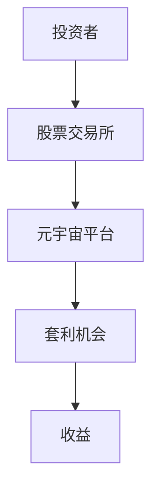
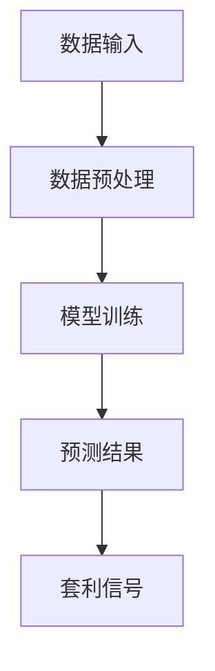
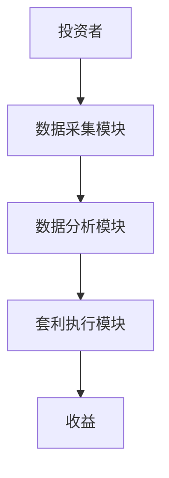

                 


# 如何构建基于特价股票的跨元宇宙套利系统

> 关键词：特价股票、跨元宇宙、套利系统、时间序列分析、区块链技术

> 摘要：本文将详细介绍如何构建一个基于特价股票的跨元宇宙套利系统，涵盖系统背景、核心概念、算法原理、系统架构设计以及项目实战等内容。通过分析特价股票的特性，结合跨元宇宙环境下的金融套利机会，构建一套高效、可靠的套利系统。

---

## 第1章: 特价股票与跨元宇宙套利系统背景介绍

### 1.1 特价股票的定义与特点

#### 1.1.1 特价股票的定义
特价股票是指在特定时间点，股票价格出现显著波动，从而产生短期交易机会的股票。这种价格波动可能是由于市场供需失衡、突发事件或内部消息泄露等原因引起的。

#### 1.1.2 特价股票的核心特点
- **价格波动大**：特价股票的价格通常在短时间内出现大幅波动，为套利者提供快速获利的机会。
- **交易机会短暂**：由于价格波动的不可预测性，套利机会往往转瞬即逝，需要快速反应。
- **高风险高收益**：由于价格波动的不确定性，特价股票交易风险较高，但潜在收益也较大。

#### 1.1.3 特价股票与普通股票的区别
| 特性 | 特价股票 | 普通股票 |
|------|----------|-----------|
| 价格波动 | 高 | 低 |
| 交易机会 | 短暂 | 稳定 |
| 风险 | 高 | 中等 |
| 收益 | 高 | 稳定 |

### 1.2 跨元宇宙环境下的金融套利机会

#### 1.2.1 元宇宙经济体系的概述
元宇宙是一个虚拟的三维空间，用户可以通过虚拟现实技术进入其中，并进行虚拟资产的交易。元宇宙经济体系类似于现实世界中的金融体系，包括股票、货币、房地产等多种金融工具。

#### 1.2.2 跨元宇宙金融交易的特点
- **跨平台性**：交易可以在不同的元宇宙平台之间进行。
- **实时性**：金融市场的实时数据可以在元宇宙中无缝对接。
- **异构性**：不同元宇宙平台的金融规则和交易机制可能不同。

#### 1.2.3 套利在跨元宇宙金融中的重要性
套利是利用不同市场之间的价格差异进行交易，以获得无风险或低风险的收益。在跨元宇宙环境下，由于不同平台之间的价格差异，套利机会变得更加丰富和频繁。

### 1.3 套利系统的背景与意义

#### 1.3.1 套利的定义与原理
套利是指在两个或多个市场之间，利用价格差异进行买入和卖出操作，以获取无风险或低风险的收益。套利的核心在于发现价格差异，并利用这种差异进行交易。

#### 1.3.2 跨元宇宙套利的背景
随着元宇宙技术的发展，虚拟经济体系逐渐成熟，不同元宇宙平台之间的金融工具价格差异为套利提供了新的机会。

#### 1.3.3 构建套利系统的必要性
通过构建套利系统，可以自动化地捕捉和利用价格差异，实现快速交易，从而提高收益并降低风险。

---

## 第2章: 跨元宇宙套利系统的核心概念

### 2.1 套利系统的核心原理

#### 2.1.1 套利的基本原理
套利的基本原理是利用两个或多个市场之间的价格差异。当同一资产在不同市场上的价格不一致时，套利者可以买入价格低的市场，同时卖出价格高的市场，从而获利。

#### 2.1.2 跨元宇宙环境下的套利机制
在跨元宇宙环境下，套利者需要同时监控多个元宇宙平台上的金融工具价格，并利用价格差异进行交易。由于不同平台之间的交易规则和费用可能不同，套利系统需要考虑这些因素。

#### 2.1.3 套利系统的数学模型
套利系统的数学模型可以通过以下公式表示：

$$ \text{收益} = \text{卖出价格} - \text{买入价格} $$

### 2.2 跨元宇宙环境下的金融数据特征

#### 2.2.1 数据的多维性
在跨元宇宙环境下，金融数据可能涉及多个维度，包括时间、空间和平台等。

#### 2.2.2 数据的实时性
套利机会往往存在于价格波动的瞬间，因此需要实时监控和快速反应。

#### 2.2.3 数据的异构性
不同元宇宙平台的金融数据格式和交易规则可能不同，导致数据异构性。

### 2.3 套利系统的核心要素

#### 2.3.1 数据采集模块
数据采集模块负责从不同元宇宙平台采集实时金融数据。

#### 2.3.2 数据分析模块
数据分析模块负责对采集到的数据进行分析，发现价格差异并生成套利信号。

#### 2.3.3 套利执行模块
套利执行模块负责根据分析结果，执行买入和卖出操作，实现套利。

### 2.4 核心概念对比表

| 概念 | 特价股票 | 跨元宇宙套利 |
|------|----------|--------------|
| 定义 | 特定价格下的股票交易机会 | 利用价格差异在多个元宇宙间进行套利 |
| 特点 | 价格波动大，交易机会短暂 | 跨平台、实时性、高风险 |
| 目标 | 获取短期收益 | 利用价格差异最大化收益 |

### 2.5 ER实体关系图（Mermaid）



---

## 第3章: 套利系统的核心算法

### 3.1 时间序列分析算法

#### 3.1.1 ARIMA模型
ARIMA（自回归积分滑动平均模型）是一种常用的时间序列分析模型，适用于预测未来的金融价格。

#### 3.1.2 LSTM网络
LSTM（长短期记忆网络）是一种深度学习模型，适用于处理时间序列数据中的长期依赖关系。

#### 3.1.3 算法流程图（Mermaid）



### 3.2 区块链技术在套利系统中的应用

#### 3.2.1 区块链的基本原理
区块链是一种分布式账本技术，具有去中心化、不可篡改和透明性等特点。

#### 3.2.2 区块链在跨平台交易中的作用
区块链可以用于记录跨元宇宙平台的交易数据，确保数据的透明性和不可篡改性。

#### 3.2.3 区块链在套利系统中的应用场景
区块链可以用于记录套利交易的详细信息，确保交易的可追溯性和透明性。

### 3.3 数学模型与公式

#### 3.3.1 ARIMA模型公式
$$ ARIMA(p, d, q) $$

#### 3.3.2 LSTM网络结构
$$ LSTM(t) = \sigma(g(x_t + h_{t-1})) $$

---

## 第4章: 跨元宇宙套利系统架构设计

### 4.1 系统功能设计

#### 4.1.1 数据采集模块
数据采集模块负责从多个元宇宙平台采集实时金融数据。

#### 4.1.2 数据分析模块
数据分析模块负责对采集到的数据进行分析，发现价格差异并生成套利信号。

#### 4.1.3 套利执行模块
套利执行模块负责根据分析结果，执行买入和卖出操作，实现套利。

### 4.2 系统架构设计

#### 4.2.1 系统架构图（Mermaid）



#### 4.2.2 系统接口设计
套利系统需要与多个元宇宙平台的API进行对接，确保数据的实时性和准确性。

### 4.3 系统交互流程图（Mermaid）


---

## 第5章: 项目实战

### 5.1 环境配置

#### 5.1.1 安装必要的软件
- 安装Python解释器
- 安装数据处理库（如Pandas、NumPy）
- 安装机器学习库（如Scikit-learn、TensorFlow）

#### 5.1.2 安装元宇宙平台的API
- 使用特定元宇宙平台的API接口进行数据采集

### 5.2 系统核心实现源代码

#### 5.2.1 数据采集模块

```python
import requests

def get_stock_price(api_key, platform):
    endpoint = f"https://{platform}/api/v1/stock/{api_key}"
    response = requests.get(endpoint)
    return response.json()['price']
```

#### 5.2.2 数据分析模块

```python
from sklearn.linear_model import ARIMA

def predict_price(data, order):
    model = ARIMA(data, order=order)
    model_fit = model.fit()
    forecast = model_fit.forecast(steps=1)
    return forecast[0]
```

#### 5.2.3 套利执行模块

```python
import time

def execute_arbitrage(price_a, price_b):
    if price_a < price_b:
        buy(price_a)
        sell(price_b)
        return price_b - price_a
    else:
        return 0
```

### 5.3 实际案例分析

#### 5.3.1 案例背景
假设在两个不同的元宇宙平台，同一股票的价格分别为$100和$105。

#### 5.3.2 数据分析与预测
使用ARIMA模型预测价格，发现价格差异为$5。

#### 5.3.3 套利操作
执行买入操作在价格低的平台，同时执行卖出操作在价格高的平台，获利$5。

### 5.4 项目小结
通过实际案例分析，可以验证套利系统的有效性和可行性。

---

## 第6章: 最佳实践与注意事项

### 6.1 最佳实践

#### 6.1.1 数据采集的稳定性
确保数据采集模块的稳定性，避免因数据缺失导致套利机会的错失。

#### 6.1.2 模型的实时性
套利系统需要实时更新模型，以适应市场的快速变化。

#### 6.1.3 风险控制
套利者需要合理控制风险，避免因价格波动过大导致的损失。

### 6.2 注意事项

#### 6.2.1 市场风险
套利者需要关注市场的整体风险，避免因市场崩盘导致的系统性风险。

#### 6.2.2 平台风险
不同元宇宙平台的交易规则和费用可能不同，套利者需要了解并选择合适的平台。

#### 6.2.3 操作风险
套利系统需要确保操作的准确性和及时性，避免因操作失误导致的损失。

### 6.3 小结
通过合理规划和操作，套利系统可以在跨元宇宙环境下实现稳定的收益。

---

## 第7章: 拓展阅读

### 7.1 相关技术与工具

#### 7.1.1 时间序列分析
进一步学习时间序列分析的相关技术，如GARCH模型、Prophet等。

#### 7.1.2 区块链技术
深入学习区块链技术，了解其在金融领域的更多应用场景。

### 7.2 实际案例分析
通过分析更多的实际案例，总结套利系统在不同市场环境下的表现。

### 7.3 持续优化
根据市场变化和系统表现，不断优化套利系统的算法和架构设计。

---

## 总结

本文详细介绍了如何构建一个基于特价股票的跨元宇宙套利系统，涵盖了背景介绍、核心概念、算法原理、系统架构设计以及项目实战等内容。通过本文的指导，读者可以深入了解套利系统的构建过程，并在实际操作中应用相关技术。未来，随着技术的不断发展，套利系统将更加智能化和高效化，为投资者带来更多的机会和收益。

--- 

希望这篇技术博客能够为读者提供有价值的参考和指导！

