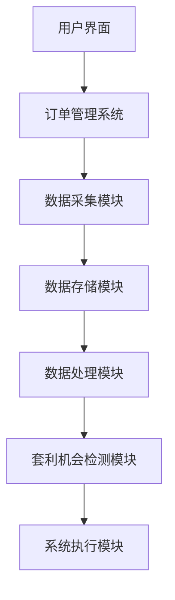
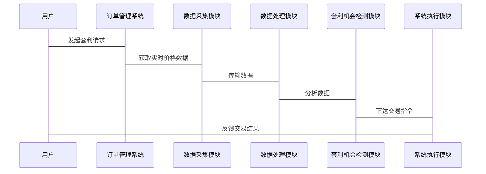

                 


# 《如何构建基于特价股票的跨市场套利系统》

> 关键词：跨市场套利、特价股票、算法交易、金融系统、套利机会

> 摘要：本文详细探讨了如何构建基于特价股票的跨市场套利系统，从理论背景、核心概念、数学模型、系统架构到项目实战，逐步分析了套利机会的识别、算法实现、系统设计和实际应用。通过案例分析和代码实现，帮助读者掌握跨市场套利的核心技术与实践方法。

---

# 第1章: 特价股票与跨市场套利的背景与概念

## 1.1 特价股票的定义与特点
### 1.1.1 特价股票的定义
特价股票是指在特定市场或时间段内价格显著低于市场平均水平的股票。这种股票通常具有较高的投资吸引力，但也伴随着较高的风险。

### 1.1.2 特价股票的特点
- **价格优势**：特价股票的价格通常低于市场平均水平。
- **高波动性**：特价股票的价格波动较大，容易受到市场情绪的影响。
- **低流动性**：部分特价股票的流动性较低，买卖价差可能较大。

### 1.1.3 特价股票的分类
- **周期性股票**：受经济周期影响较大的股票。
- **成长型股票**：具有较高增长潜力的股票。
- **价值型股票**：市场价格低于其内在价值的股票。

## 1.2 跨市場套利的定义与原理
### 1.2.1 跨市場套利的定义
跨市场套利是指在同一资产在不同市场或不同交易时间点上存在价格差异时，通过同时在两个市场进行买卖操作，从中获利的交易策略。

### 1.2.2 跨市場套利的基本原理
- **价格差异**：同一资产在不同市场上的价格差异是套利的基础。
- **无风险套利**：通过同时买入低价市场和卖出高价市场的操作，实现无风险或低风险的利润。

### 1.2.3 跨市場套利的可行性分析
- **市场差异**：不同市场的价格差异是套利的机会。
- **交易成本**：包括佣金、税费和时间差等，影响套利的可行性。
- **监管风险**：不同市场的监管政策可能影响套利操作。

## 1.3 特价股票与跨市场套利的背景与意义
### 1.3.1 背景介绍
随着全球化的发展，不同市场的价格差异为套利提供了机会。特价股票作为价格较低的股票，成为跨市场套利的重要标的。

### 1.3.2 特价股票跨市场套利的意义
- **提高投资收益**：通过套利机会获得超额收益。
- **分散风险**：利用不同市场的价格差异降低投资风险。
- **套利市场的活跃**：跨市场套利的活跃促进了市场的流动性和价格的收敛。

### 1.3.3 跨市場套利的风险与机会
- **风险**：包括市场风险、流动性风险和监管风险。
- **机会**：通过价格差异捕捉套利机会，实现稳定收益。

## 1.4 本章小结
本章介绍了特价股票的定义、特点和分类，以及跨市场套利的基本原理和可行性分析。通过背景与意义的探讨，为后续的套利策略和系统构建奠定了基础。

---

# 第2章: 特价股票与跨市场套利的核心概念

## 2.1 特价股票的市场分析
### 2.1.1 特价股票的市场结构
- **一级市场**：新股发行市场。
- **二级市场**：股票交易市场，包括场内交易和场外交易。

### 2.1.2 特价股票的价格波动特性
- **波动性**：价格波动较大，容易受到市场情绪的影响。
- **周期性**：价格波动可能与经济周期相关。

### 2.1.3 特价股票的交易策略
- **短期交易**：利用价格波动快速买卖。
- **长期投资**：等待股票价值回归。

## 2.2 跨市場套利的机制与流程
### 2.2.1 跨市場套利的基本流程
1. **识别价格差异**：通过数据分析发现同一资产在不同市场上的价格差异。
2. **建立头寸**：在低价市场买入，高价市场卖出。
3. **平仓获利**：当价格差异消失时，平仓获利。

### 2.2.2 跨市場套利的实现方式
- **电子交易平台**：通过自动化交易系统快速执行套利策略。
- **手动操作**：通过人工分析和操作进行套利。

### 2.2.3 跨市場套利的风险控制
- **仓位管理**：合理分配资金，避免过度集中。
- **止损机制**：设定止损点，避免重大损失。

## 2.3 特价股票与跨市場套利的结合
### 2.3.1 特价股票在跨市場套利中的作用
- **低价优势**：特价股票的低价格为套利提供了机会。
- **市场差异**：利用不同市场对特价股票的定价差异进行套利。

### 2.3.2 跨市場套利对特价股票的影响
- **价格收敛**：套利活动可能导致特价股票的价格向市场平均水平趋近。
- **流动性提升**：套利活动增加了特价股票的交易量，提升了流动性。

### 2.3.3 特价股票与跨市場套利的关系
- **相互促进**：特价股票的价格差异为套利提供了机会，而套利活动又影响了特价股票的市场表现。

## 2.4 本章小结
本章深入探讨了特价股票的市场分析和跨市场套利的机制与流程，揭示了特价股票在跨市场套利中的重要作用，以及套利活动对市场的影响。

---

# 第3章: 特价股票跨市场套利的数学模型与算法原理

## 3.1 套利机会的数学模型
### 3.1.1 套利机会的定义
套利机会是指在不同市场中，同一资产的买入价低于卖出价，从而可以通过同时买卖操作获利的机会。

### 3.1.2 套利机会的数学表达式
假设在市场A中某资产的价格为$P_A$，在市场B中同一资产的价格为$P_B$，则套利机会存在当且仅当：
$$ P_A < P_B $$

### 3.1.3 套利机会的检测
通过比较不同市场的价格，可以检测是否存在套利机会。常用的检测方法包括：
1. **价差计算**：计算$P_B - P_A$，如果差值为正，则存在套利机会。
2. **均值回归分析**：分析价格差异是否偏离长期均值，判断是否存在套利空间。

## 3.2 套利可行性分析的算法原理
### 3.2.1 数据采集与预处理
- **数据源**：从不同市场获取同一资产的实时价格数据。
- **数据清洗**：去除异常值和缺失值。

### 3.2.2 套利机会检测算法
- **滑动窗口法**：在一定时间窗口内比较不同市场的价格，检测是否存在套利机会。
- **统计套利算法**：基于统计学方法，分析价格差异是否显著，判断套利可行性。

### 3.2.3 套利策略优化算法
- **均值-方差优化**：通过优化投资组合的风险和收益，提高套利效率。
- **机器学习算法**：利用机器学习模型预测价格差异，优化套利策略。

## 3.3 套利机会的实现
### 3.3.1 数据流处理
- **实时数据获取**：通过API接口实时获取不同市场的价格数据。
- **数据流处理**：对实时数据进行清洗和转换，便于后续分析。

### 3.3.2 套利策略实现
- **条件判断**：当满足套利条件时，自动执行买卖操作。
- **风险管理**：设置止损点和止盈点，控制风险。

## 3.4 本章小结
本章通过数学模型和算法原理，详细探讨了套利机会的检测和可行性分析，为后续的系统设计和实现奠定了理论基础。

---

# 第4章: 特价股票跨市场套利的系统分析与架构设计

## 4.1 系统功能设计
### 4.1.1 数据采集模块
- **功能**：实时获取不同市场的价格数据。
- **实现**：通过API接口连接多个市场，获取实时价格数据。

### 4.1.2 数据处理模块
- **功能**：对获取的数据进行清洗、转换和存储。
- **实现**：使用数据处理工具（如Python的Pandas库）进行数据清洗和转换。

### 4.1.3 套利机会检测模块
- **功能**：分析数据，检测套利机会。
- **实现**：基于算法原理，实现套利机会的检测和预警。

### 4.1.4 系统执行模块
- **功能**：当检测到套利机会时，执行相应的买卖操作。
- **实现**：通过自动化交易系统执行交易指令。

## 4.2 系统架构设计
### 4.2.1 系统架构图


### 4.2.2 系统接口设计
- **API接口**：用于不同模块之间的数据传输和交互。
- **交易接口**：连接不同市场的交易系统，执行买卖操作。

### 4.2.3 系统交互流程


## 4.3 本章小结
本章通过系统分析与架构设计，详细探讨了特价股票跨市场套利系统的功能模块、架构图和交互流程，为后续的系统实现提供了清晰的设计蓝图。

---

# 第5章: 特价股票跨市场套利的项目实战

## 5.1 项目环境安装
### 5.1.1 系统环境要求
- **操作系统**：Windows/Mac/Linux
- **编程语言**：Python 3.8+
- **依赖库**：Pandas, NumPy, Matplotlib, requests, threading

### 5.1.2 安装步骤
```bash
pip install pandas numpy matplotlib requests threading
```

## 5.2 系统核心实现
### 5.2.1 数据获取与处理
```python
import pandas as pd
import requests
import threading

def get_price_data(market, asset):
    url = f"https://api.{market}.com/quote/{asset}"
    response = requests.get(url)
    data = response.json()
    return data['price']

# 多线程获取不同市场的价格数据
markets = ['us', 'hk', 'jp']
assets = ['apple', 'xiaomi', 'samsung']
prices = {}

for market in markets:
    for asset in assets:
        price = get_price_data(market, asset)
        prices[f"{market}_{asset}"] = price

df = pd.DataFrame(prices.items(), columns=['Asset', 'Price'])
print(df)
```

### 5.2.2 套利机会检测
```python
def detect_arbitrage(prices):
    arbitrage Opportunities = []
    for asset in prices:
        for market in markets:
            if asset contains market:
                price1 = prices[asset][market1]
                price2 = prices[asset][market2]
                if price1 < price2:
                    arbitrage Opportunities.append(asset)
    return arbitrage Opportunities

arbitrage_assets = detect_arbitrage(prices)
print(arbitrage_assets)
```

### 5.2.3 系统执行
```python
def execute_trade(asset, market1, market2):
    # 在市场1买入
    buy_order = create_buy_order(asset, market1, quantity)
    # 在市场2卖出
    sell_order = create_sell_order(asset, market2, quantity)
    return buy_order, sell_order

# 执行套利操作
for asset in arbitrage_assets:
    buy_order, sell_order = execute_trade(asset, market1, market2)
    print(f"成功执行{asset}的套利操作")
```

## 5.3 项目小结
本章通过项目实战，详细展示了如何从环境安装到代码实现，完成特价股票跨市场套利系统的构建。通过实际案例的分析和代码实现，帮助读者掌握套利策略的实现过程。

---

# 第6章: 最佳实践与总结

## 6.1 项目总结
### 6.1.1 核心成果
- 成功构建了基于特价股票的跨市场套利系统。
- 实现了套利机会的自动检测和执行。

### 6.1.2 经验总结
- 数据的实时性和准确性是套利系统的关键。
- 系统的稳定性和安全性需要高度重视。
- 交易成本和监管风险是需要考虑的重要因素。

## 6.2 最佳实践 tips
### 6.2.1 数据源选择
- 选择可靠的数据源，确保数据的准确性和实时性。
- 多市场数据源的结合，提高套利机会的检测能力。

### 6.2.2 系统优化
- 优化算法效率，提高套利机会的检测速度。
- 引入机器学习算法，提升套利策略的智能化水平。

### 6.2.3 风险管理
- 设定合理的止损点和止盈点，控制风险。
- 定期评估和调整套利策略，适应市场变化。

## 6.3 未来展望
随着技术的进步和市场的变化，跨市场套利将更加智能化和自动化。未来的研究方向包括：
- 基于人工智能的套利策略优化。
- 多市场、多资产的套利机会检测。
- 更高效的交易执行系统。

## 6.4 本章小结
本章通过总结和最佳实践，为读者提供了构建和优化跨市场套利系统的宝贵经验，并展望了未来的发展方向。

---

# 第7章: 结语

跨市场套利是一种高效的交易策略，通过利用不同市场之间的价格差异，实现无风险或低风险的利润。基于特价股票的跨市场套利系统，结合了金融市场的价格差异和算法交易的优势，为投资者提供了新的投资机会。

通过本文的详细讲解，读者可以掌握从理论到实践的全过程，包括背景分析、核心概念、算法实现、系统设计和项目实战。希望本文能为读者在构建跨市场套利系统的过程中提供有价值的指导和启发。

--- 

**结语：** 特价股票的跨市场套利不仅是一种交易策略，更是一种金融智慧的体现。通过技术与金融的结合，投资者可以更好地捕捉市场机会，实现财富增值。

